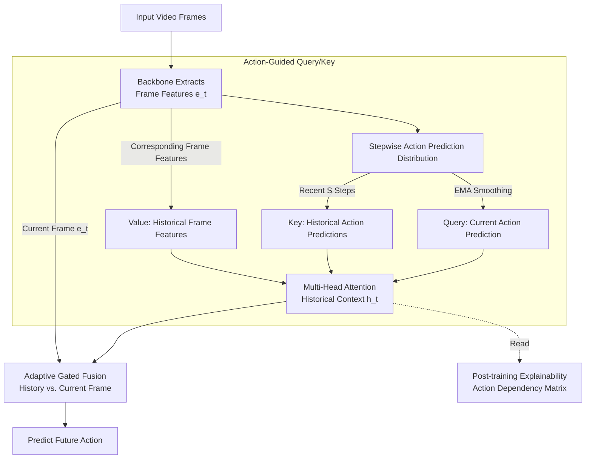

# Action-Guided Attention for Video Action Anticipation

**Conference**: ICLR 2026  
**arXiv**: [2603.01743](https://arxiv.org/abs/2603.01743)  
**Code**: None  
**Area**: Causal Inference  
**Keywords**: Action Anticipation, Attention Mechanism, Video Transformer, Explainability, EPIC-Kitchens  

## TL;DR
The authors propose the Action-Guided Attention (AGA) mechanism, which employs the model's own action prediction sequences as attention Query and Key (rather than pixel features). Combined with adaptive gated fusion of historical context and current frame features, it achieves robust generalization from validation to test sets on EPIC-Kitchens-100 while supporting post-training interpretability analysis.

## Background & Motivation

**Background**: Video action anticipation (predicting future actions from current frames) is a critical task in computer vision. Transformer architectures have become the dominant paradigm.

**Limitations of Prior Work**: Standard self-attention relies on dot products of pixel-level features, which lack the high-level semantics required to model future actions. This leads models to overfit to explicit visual cues in past frames rather than capturing underlying intentions. There is a significant performance drop from validation to test sets.

**Key Challenge**: Action anticipation is inherently non-deterministic—the same observed past can lead to multiple future outcomes. Pixel-level attention is easily misled by visual noise and fails to model semantic dependencies between actions.

**Goal**: Design an attention mechanism capable of utilizing high-level action semantics rather than low-level pixel features to guide sequence modeling.

**Key Insight**: Treat action prediction probabilities (rather than feature vectors) as Q/K, leveraging semantic correlations between actions to select relevant historical moments, and then fuse them with the current frame via gating.

**Core Idea**: Use the model's own action prediction sequences for attention guidance, focusing attention on "semantically relevant past moments" instead of "visually similar past frames."

## Method

### Overall Architecture
This paper addresses the issue in video action anticipation where standard self-attention calculates similarity based on pixel features, leading to overfitting of visual cues and performance drops from validation to test sets. The overall process is as follows: Input video frames first pass through a backbone to extract frame features $e_t$, and the model outputs an action prediction distribution at each step. The AGA module no longer uses visual features for attention; instead, it treats action predictions as query signals. It uses the EMA of the current action prediction as the Query, the action predictions from the most recent $S$ steps as the Key, and the frame features of the corresponding moments as the Value for multi-head attention to obtain the "semantically relevant historical context" $\tilde{h}_t$. An adaptive gate then allows the model to allocate trust dimension-wise between historical context and current frame features $e_t$, predicting the future action after fusion. Since Q/K are action probabilities themselves, the attention matrix can directly reveal action dependencies after training, providing interpretability as a byproduct.

### Key Designs

**1. Action-Guided Query/Key: Selecting History via "Semantic Relevance" instead of "Visual Similarity"**

Standard self-attention performs dot products on pixel features, where weights reflect "which past frames look like the current frame," which is the root of overfitting to visual cues. AGA shifts the source of Q/K from visual features to action prediction probabilities: the Key consists of action predictions from the recent S steps $K_t = E_K(\hat{y}_{t-S:t-1})$, and the Query consists of the current action prediction EMA $Q_t = E_Q(\bar{y}_t)$, where the EMA is updated via $\bar{y}_t = \alpha \hat{y}_{t-1} + (1-\alpha)\bar{y}_{t-1}$. Exponential smoothing is applied to historical predictions to obtain a more stable query signal. The Value remains the frame-level visual features $V_t = E_V(e_{t-S:t-1})$. Thus, the dot-product attention weights measure "which past actions are most semantically relevant to the current anticipated action," which are then used to weight the corresponding visual features. The "selection criteria" of attention are elevated to the action semantic level, while the "selected content" remains the specific frames.

**2. Adaptive Gated Fusion: Letting the Model Decide whether to Trust History or Current Frames**

The reliability of historical context versus current visual evidence changes over time—current frame information is more critical at the start of an action, while historical dependencies become more important as the action progresses. AGA does not fix the weights of the two but uses an element-wise gate to fuse the historical attention output $\tilde{h}_t$ and current frame features $e_t$:

$$o_t = g_t \odot \tilde{h}_t + (1-g_t) \odot e_t, \quad g_t = \sigma(\text{MLP}(\tilde{h}_t \| e_t))$$

The gate $g_t$ is obtained by passing the concatenated features through an MLP followed by a sigmoid function, outputting dimension-wise weights between 0 and 1. This allows the model to adaptively allocate trust between history and the current state for each feature dimension.

**3. Post-training Explainability Analysis: Q/K as Action Probabilities, Direct Readout of Action Dependencies**

Because Q/K are action probability distributions, attention weights naturally reflect the semantic relationships between actions without requiring additional probes. The paper analyzes this in two directions: forward analysis examines the distribution of attention weights given a past action, revealing learned dependencies (e.g., "pick up → place" receives high weight); backward analysis modifies past actions to observe how predictions change, corresponding to counterfactual reasoning. This is difficult to achieve with pixel-level attention, where weights only correspond to "frame similarity" and cannot be directly mapped to action semantics.

### Loss & Training
Standard cross-entropy loss is used to predict future actions. A modular design is employed with a frozen backbone and trainable encoders. A FIFO queue maintains the temporal window S.

## Key Experimental Results

### Main Results

**EPIC-Kitchens-100 (Action Anticipation):**

| Method | Val Verb | Val Noun | Val Action | Test-Val Gap |
|------|---------|---------|-----------|-------------|
| AVT | High | High | Mid | Large |
| MemViT | High | High | Mid | Large |
| **AGA** | **Competitive** | **Competitive** | **Competitive** | **Smallest** |

### Ablation Study

| Configuration | Performance | Description |
|------|------|------|
| AGA (Full) | Best Gen. | Action-guided Q/K + Gating |
| Standard Self-Attention | Overfitting | Good Val but large Test drop |
| No Gating (History only) | Decrease | Lacks current frame information |
| No EMA (Direct last step) | Slight drop | EMA provides more stable long-term signals |

### Key Findings
- The performance gap between validation and test sets for AGA is consistently smaller than baselines, indicating stronger generalization and less overfitting.
- Performance remains robust across EPIC-Kitchens-55 and EGTEA Gaze+.
- Post-training analysis reveals meaningful action dependencies (e.g., high attention weights for "pick up → place"), validating the semantic soundness of action guidance.
- An EMA coefficient $\alpha=0.8$ is optimal in most settings, showing low sensitivity to hyperparameters.

## Highlights & Insights
- **Semantic-level Attention**: Elevating attention from the pixel level to the action probability level is the key innovation. This abstraction focuses the model on "what was done" rather than "what it looked like," which is more suitable for anticipation.
- **Recycling Self-Predictions**: Using the model's own predictions as input (EMA action distributions) combines the benefits of auto-regressive and non-auto-regressive approaches—capturing sequence dependencies without introducing inference latency.
- **Explainability as a Byproduct**: Since Q/K are action probabilities, the attention matrix directly quantifies "how much action A influences the prediction of action B," representing a natural explainability first achieved by Transformers in video anticipation.

## Limitations & Future Work
- Only RGB video frames are used, without integrating multi-modal information (text, audio, optical flow).
- The EMA of action predictions may be unstable at the start of a sequence (cold start problem).
- The FIFO queue size S is a fixed hyperparameter; an adaptive window might be better.
- Experiments are validated only on kitchen scenarios (EPIC-Kitchens).

## Related Work & Insights
- **vs AVT**: AVT uses standard causal attention on visual tokens; AGA uses action predictions for Q/K, avoiding pixel-level overfitting.
- **vs MemViT**: MemViT stores longer history via token compression; AGA implicitly encodes long-range dependencies via EMA, making it more lightweight.
- **vs AFFT**: AFFT fuses multiple modalities but still uses standard attention; AGA achieves generalization gains by changing the attention design within a single modality.

## Rating
- Novelty: ⭐⭐⭐⭐ The design of using action probabilities for attention Q/K is novel and intuitive.
- Experimental Thoroughness: ⭐⭐⭐⭐ Three datasets + ablation + explainability analysis.
- Writing Quality: ⭐⭐⭐⭐ Method descriptions are clear, and the explainability analysis is insightful.
- Value: ⭐⭐⭐⭐ Provides a new perspective for attention design in video action anticipation.

<!-- RELATED:START -->

## Related Papers

- [\[ACL 2025\] FitCF: A Framework for Automatic Feature Importance-guided Counterfactual Example Generation](../../ACL2025/causal_inference/fitcf_a_framework_for_automatic_feature_importance-guided_counterfactual_example.md)
- [\[CVPR 2026\] CGU-Bayes: Causal Graph Uncertainty-Guided Bayesian Inference for Domain Generalization](../../CVPR2026/causal_inference/cgu-bayes_causal_graph_uncertainty-guided_bayesian_inference_for_domain_generali.md)
- [\[ICML 2026\] Density-Guided Robust Counterfactual Explanations on Tabular Data under Model Multiplicity](../../ICML2026/causal_inference/density-guided_robust_counterfactual_explanations_on_tabular_data_under_model_mu.md)
- [\[ACL 2025\] Reasoning is All You Need for Video Generalization: A Counterfactual Benchmark with Sub-question Evaluation](../../ACL2025/causal_inference/reasoning_is_all_you_need_for_video_generalization_a_counterfactual_benchmark_wi.md)
- [\[ICLR 2026\] Counterfactual Explanations on Robust Perceptual Geodesics](counterfactual_explanations_on_robust_perceptual_geodesics.md)

<!-- RELATED:END -->
