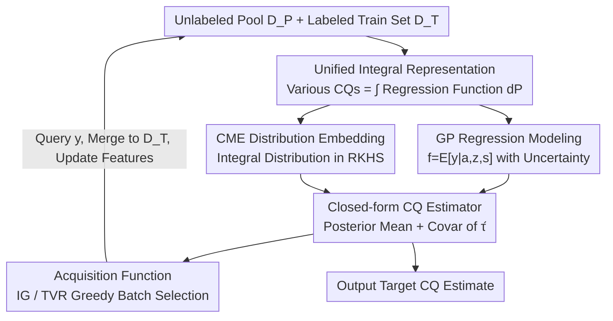

# ActiveCQ: Active Estimation of Causal Quantities

**Conference**: ICLR 2026  
**OpenReview**: [https://openreview.net/forum?id=CWpQsAubxy](https://openreview.net/forum?id=CWpQsAubxy)  
**Code**: TBD  
**Area**: Causal Inference / Active Learning  
**Keywords**: Causal Quantity Estimation, Active Learning, Gaussian Processes, Conditional Mean Embeddings, Bayesian Experimental Design

## TL;DR
ActiveCQ unifies the task of "estimating a specific causal quantity (CATE/ATE/ATT/ATE under distribution shift) with minimal labeled samples" into a single active learning problem. It observes that most causal quantities can be expressed as the integral of a regression function over a specific distribution. By modeling the regression function with Gaussian Processes (GP) and representing the integral distribution via Conditional Mean Embeddings (CME) in an RKHS, the framework analytically derives acquisition functions (Information Gain / Total Variance Reduction) from the posterior uncertainty of the causal quantity. It significantly outperforms benchmarks like Random, BALD, and Coreset with fewer labels across multiple simulated and semi-synthetic datasets.

## Background & Motivation

**Background**: The core objects of estimation in causal inference are various "causal quantities" (CQ)—Average Treatment Effect (ATE), Conditional Average Treatment Effect (CATE), Average Treatment Effect on the Treated (ATT), and ATE under distribution shift (DS/ATEDS), where the distribution of covariates in the target population differs from the observed one. These quantities essentially ask: "What is the expected outcome $E[y\mid do(a)]$ for a target subpopulation after a $do(a=a)$ intervention?" Accurately estimating them usually requires a large number of labeled samples (i.e., where the outcome $y$ is observed).

**Limitations of Prior Work**: In many scenarios, measuring individual outcomes is prohibitively expensive—personalized medicine may require invasive or costly tests, economics involves labor-intensive long-term follow-ups, and social services require manual labeling of unstructured case records. Thus, the problem becomes: "Given a pool of samples with only covariates and no outcomes, and a budget to label only a small fraction, which ones should be selected?" This is a natural Active Learning (AL) problem. However, existing active causal inference work focuses almost exclusively on CATE, often attempting to learn a generalized CATE estimator conditioned on all covariates, while lacking a unified treatment for other causal quantities like ATE, ATT, or DS.

**Key Challenge**: Traditional information-theoretic active learning (e.g., BALD, Total Variance Reduction (TVR)) aims to "reduce the overall uncertainty of the regression function $f$ over the unlabeled pool." However, when estimating causal quantities, the focus is on the **intervention distribution** of a specific subpopulation—samples are drawn from one distribution, but the regression function must be integrated over another. This "distribution mismatch" causes the acquisition objectives of traditional AL to unalign with the true goal of accurately estimating the target CQ. One might spend the budget reducing the overall variance of the pool while still failing to accurately estimate the CQ for the target subpopulation.

**Goal**: (1) Formalize the "active estimation of causal quantities" as a unified task, ActiveCQ; (2) Provide a unified estimation and acquisition framework covering CATE, ATE, ATT, and DS; (3) Make acquisition functions "CQ-aware," selecting samples specifically for the target intervention distribution rather than just reducing overall pool variance.

**Key Insight**: The authors leverage a critical observation—Lemma 1 shows that these seemingly distinct causal quantities can all be written in the same integral form: $\tau_{\mathrm{CQ}}=\int_{\mathcal S} E[y\mid a=a,s=s]\,P^*_{\mathrm{CQ}}(ds)$, where the only difference is the distribution $P^*_{\mathrm{CQ}}$ being integrated. CATE integrates over the conditional distribution $P_{s\mid z}$, ATE over the marginal distribution, ATT over the treated subpopulation, and DS over the target population distribution. As long as the "regression function" and the "integral distribution" are modeled correctly, all causal quantities can be produced by the same machinery.

**Core Idea**: Use GP to model the regression function $f=E[y\mid a,z,s]$ and use Conditional Mean Embeddings (CME) in an RKHS to represent the integral distribution. This makes the causal quantity itself a linear functional of the GP, resulting in closed-form posterior mean and variance. Acquisition functions can then be analytically derived from the posterior uncertainty of the causal quantity, automatically aligning sample selection with the target CQ.

## Method

### Overall Architecture

ActiveCQ handles a typical cycle: starting with a small labeled training set $D_T=\{(x^{(i)},y^{(i)})\}$ and a large unlabeled pool $D_P=\{x^{(i)}\}$, where $x=(a,z,s)$ includes treatment $a$, effect modifiers $z$, and adjustment/confounding variables $s$. In each round, a small batch of $n_b$ samples is selected from the pool based on budget constraints to query their true outcomes $y$. These are added to $D_T$, and the model is retrained. The objective is to achieve the highest accuracy for a target causal quantity $\hat\tau(a_I,Z_I)$ with the fewest labels.

The pipeline comprises four steps: first, GP models the regression function $f$ along with its uncertainty; second, the "distribution to be integrated" is represented via CME in the same RKHS; third, combining these two makes the causal quantity estimator $\hat\tau$ a Gaussian variable with closed-form mean and covariance; finally, acquisition functions are analytically derived from the posterior uncertainty of $\hat\tau$ to greedily pick the next batch of samples. This process iterates, and RKHS features are updated after each acquisition to keep the CME consistent with the GP kernel.

### Key Designs

**1. Unified Integral Representation: Mapping Four CQs to the Same Template**

This is the foundation of the framework, addressing the pain point that prior work only handles CATE or treats each CQ separately. Under identifiability assumptions (unconfoundedness, SUTVA, positivity), the authors prove (Lemma 1) that ATE, CATE, ATT, and DS can all be written as:

$$\tau_{\mathrm{CQ}}=\int_{\mathcal S} E[y\mid a=a,s=s]\,P^*_{\mathrm{CQ}}(ds).$$

The four quantities differ only in the integration distribution $P^*_{\mathrm{CQ}}$—CATE integrates over the conditional distribution $P_{s\mid z}$ (fixing effect modifiers $z=z$), while "global quantities" like ATE, ATT, and DS combine $z$ and $s$ to integrate over the respective joint, treated, or target distributions. This step decouples "what causal quantity to estimate" into two parts: a shared regression function $E[y\mid a,s]$ and a CQ-specific integral distribution.

**2. GP Regression: Causal Quantities as Gaussian Functionals**

To perform Bayesian active learning, the uncertainty of the causal quantity must be quantifiable. The authors assume $y=E[y\mid a,z,s]+\varepsilon$ with $\varepsilon\sim\mathcal N(0,\sigma^2)$ and place a zero-mean GP prior on $f \sim \mathcal{GP}(0,k)$, using a product kernel $k_{xx'}=k_{aa'}k_{zz'}k_{ss'}$. Given a training set, the closed-form posterior is:

$$m(x)=k_{xX_T}(K_{X_TX_T}+\sigma^2 I)^{-1}y_T,\quad k_{\mathrm{post}}(x,x')=k_{xx'}-k_{xX_T}(K_{X_TX_T}+\sigma^2 I)^{-1}k_{X_Tx'}.$$

Crucially, the causal quantity $\hat\tau$ is a **linear functional** of the regression function $f$ (integration is a linear operation). Since linear functionals of a GP are still Gaussian, $\hat\tau$ has an analytic posterior mean $\nu(a,z)=E_{s\sim P_{s\mid z}}[m(a,z,s)]$ and covariance $q$. This makes CQ uncertainty computable.

**3. CME for Distribution Representation: Closed-form Integration in RKHS**

Calculating $\nu$ and $q$ requires integrating over the conditional distribution $P_{s\mid z}$. While one could use a Conditional Density Estimator (CDE) like a Mixture Density Network (MDN) followed by Monte Carlo sampling, the authors advocate for Conditional Mean Embeddings (CME). A CME is defined as:

$$\mu_{s\mid z=z}:=E_{s\mid z=z}[\phi(s)]=\int_{\mathcal S}\phi(s)\,P_{s\mid z}(ds\mid z),$$

which corresponds to an operator estimated as $\hat C_{s\mid z}=\Phi_S(K_{ZZ}+\lambda I)^{-1}\Phi_Z^{\top}$ using all pairs of $(Z,S)$. This approach offers three benefits: it **bypasses explicit density estimation** (a difficult task); it places the CME in the same tensor-product RKHS $\mathcal H_{AZS}$ as the GP, turning integration into **closed-form kernel operations** (Proposition 1); and it is **adaptive**, as estimating $P_{s\mid z}$ only requires $(s,z)$ pairs, allowing the distribution model to be refined using the unlabeled pool.

**4. Analytic Acquisition Functions: IG and TVR with Greedy Diversity**

With the closed-form posterior of $\hat\tau$, selecting samples can be directly framed as "maximizing the reduction in posterior uncertainty of $\hat\tau(a_I,Z_I)$." This differs fundamentally from traditional AL: while BALD/TVR reduce uncertainty of $f$ on a reference distribution (usually the pool), ActiveCQ directly reduces the uncertainty of the **target causal quantity**. Two criteria are provided:

- **Information Gain (IG)**: Measures uncertainty via the differential entropy of $\hat\tau$, selecting the batch $X_B$ that maximizes mutual information $I(\hat\tau(a_I,Z_I);y_{X_B}\mid D_T)$. For Gaussian variables, this simplifies to $X_B^*=\arg\min_{X_B}\det(\mathrm{Var}[\hat\tau\mid D_T,y_{X_B}])$.
- **Total Variance Reduction (TVR)**: Uses the sum of marginal variances on the target set $\sum_{(a,z)}\mathrm{Var}[\hat\tau(a,z)]$ as the uncertainty measure, selecting $X_B^*=\arg\min \mathrm{Tr}(\mathrm{Var}[\hat\tau\mid D_T,y_{X_B}])$.

To ensure batch diversity, rather than simply taking the top-$n_b$ points, the authors use a **greedy approximation**, adding the point that maximizes marginal utility $x_i^*=\arg\max_{x}U(X_{i-1}^*\cup\{x\})$. Convergence analysis (Theorem 2) bounds the estimator's marginal posterior variance under submodularity assumptions.

## Key Experimental Results

Experiments were conducted on simulated data plus semi-synthetic IHDP and Lalonde datasets. Metrics used Average Mean Squared Error (AMSE) of the estimated CQ. Regressors used GP, and distributions used MDN or CME. The suffix "G" denotes greedy selection.

### Main Results

| Task | Scenario Characteristics | Summary of Performance |
|------|--------------------------|-------------------------|
| CATE | Mismatch between target subpopulation and pool | Ours is optimal throughout; TVR-CME consistently outperforms MC-based (MDN) methods. |
| ATE  | All methods sample from the whole population | Uncertainty-aware methods perform similarly and better than random; IG is occasionally unstable. |
| ATT  | Integration over treated subpopulation | Ours leads over baselines. |
| DS   | Target and sampling distributions differ significantly | Ours significantly outperforms baselines with the largest margin. |

Baselines included: Random, $\mu$-BALD, Coreset (QHTE), and traditional TVR. The core conclusion: CQ-aware acquisition (IG/TVR + CME) provides the greatest gain in scenarios with "distribution mismatch" (CATE, DS), as it focuses the budget on samples aligned with the target intervention distribution.

### Ablation Study

| Configuration | Key Finding |
|---------------|-------------|
| CME vs MDN (CDE) | CME is consistently superior, bypassing explicit density estimation and aligning with the GP. |
| Greedy (G) vs top-b | Greedy improves batch diversity; top-b tends to cluster samples. |
| IG vs TVR | TVR is more stable; IG can suffer from numerical instability in determinant calculations. |

### Key Findings
- **Greater Mismatch, Greater Gain**: CME excels in CATE and DS where the target and pool distributions diverge. The gain disappears in ATE (no mismatch), confirming that benefits stem from aligning with the target intervention distribution.
- **CME > Explicit Density Estimation**: CME is more "prediction-oriented," shares the RKHS with the GP, and offers closed-form integration.
- **Run-time Costs**: Primary overheads come from greedy acquisition (frequent posterior updates), pool size, and IG determinant calculations.

## Highlights & Insights
- **Integral Representation is the Key**: Decoupling the problem into "regression + integral distribution" allows the framework to generalize to any causal quantity that fits the template.
- **CME Synergy**: By bypassing density estimation and sharing the RKHS with the GP, CME turns expensive numerical integration into efficient kernel operations. It also leverages unlabeled data to refine the distribution model.
- **Goal-Aligned Acquisition**: Pointing out that reducing pool-wide variance is not the same as accurately estimating a target subpopulation's CQ is a critical insight for causal active learning.
- **Observational Positioning**: The method works in a purely observational setting (querying existing facts), distinguishing it from active experimental design.

## Limitations & Future Work
- **GP Scalability**: Standard GP is $O(n_T^3)$. Large pools require sparse GP or other approximations which were mentioned but not extensively tested.
- **Numerical Stability**: IG calculations can be unstable; TVR is often the more robust choice in practice.
- **Strong Assumptions**: The method relies on unconfoundedness, SUTVA, and positivity, which are often violated in reality.
- **Synthetic Evaluation**: Due to the lack of ground truth counterfactuals, evaluation is limited to simulated and semi-synthetic data.
- **CME Uncertainty**: Propagating the uncertainty of the CME itself (rather than treating it as fixed) is left for future work.

## Related Work & Insights
- **Active CATE Estimation**: Differs by generalizing from CATE to a unified family of CQs (ATE/ATT/DS) via integral representation.
- **Traditional AL (BALD, TVR)**: Reduces overall regression uncertainty; ActiveCQ addresses the "distribution mismatch" by reducing target-specific uncertainty.
- **Active Experimental Design**: Those methods require performing interventions; ActiveCQ is strictly for observational data labeling.

## Rating
- Novelty: ⭐⭐⭐⭐⭐ 
- Experimental Thoroughness: ⭐⭐⭐⭐ 
- Writing Quality: ⭐⭐⭐⭐ 
- Value: ⭐⭐⭐⭐

<!-- RELATED:START -->

## Related Papers

- [\[ACL 2025\] Leveraging Variation Theory in Counterfactual Data Augmentation for Optimized Active Learning](../../ACL2025/causal_inference/leveraging_variation_theory_in_counterfactual_data_augmentation_for_optimized_ac.md)
- [\[ICLR 2026\] Direct Doubly Robust Estimation of Conditional Quantile Contrasts](direct_doubly_robust_estimation_of_conditional_quantile_contrasts.md)
- [\[ICLR 2026\] Overlap-Adaptive Regularization for Conditional Average Treatment Effect Estimation](overlap-adaptive_regularization_for_conditional_average_treatment_effect_estimat.md)
- [\[ICLR 2026\] Matching without Group Barrier for Heterogeneous Treatment Effect Estimation](matching_without_group_barrier_for_heterogeneous_treatment_effect_estimation.md)
- [\[ICLR 2026\] Modeling Interference for Treatment Effect Estimation in Network Dynamic Environment](modeling_interference_for_treatment_effect_estimation_in_network_dynamic_environ.md)

<!-- RELATED:END -->

## Related Papers

- [\[ICLR 2026\] Direct Doubly Robust Estimation of Conditional Quantile Contrasts](direct_doubly_robust_estimation_of_conditional_quantile_contrasts.md)
- [\[ICLR 2026\] Overlap-Adaptive Regularization for Conditional Average Treatment Effect Estimation](overlap-adaptive_regularization_for_conditional_average_treatment_effect_estimat.md)
- [\[ICLR 2026\] Matching without Group Barrier for Heterogeneous Treatment Effect Estimation](matching_without_group_barrier_for_heterogeneous_treatment_effect_estimation.md)
- [\[ICLR 2026\] Modeling Interference for Treatment Effect Estimation in Network Dynamic Environment](modeling_interference_for_treatment_effect_estimation_in_network_dynamic_environ.md)
- [\[ICLR 2026\] IGC-Net for Conditional Average Potential Outcome Estimation Over Time](igc-net_for_conditional_average_potential_outcome_estimation_over_time.md)

<!-- RELATED:END -->
