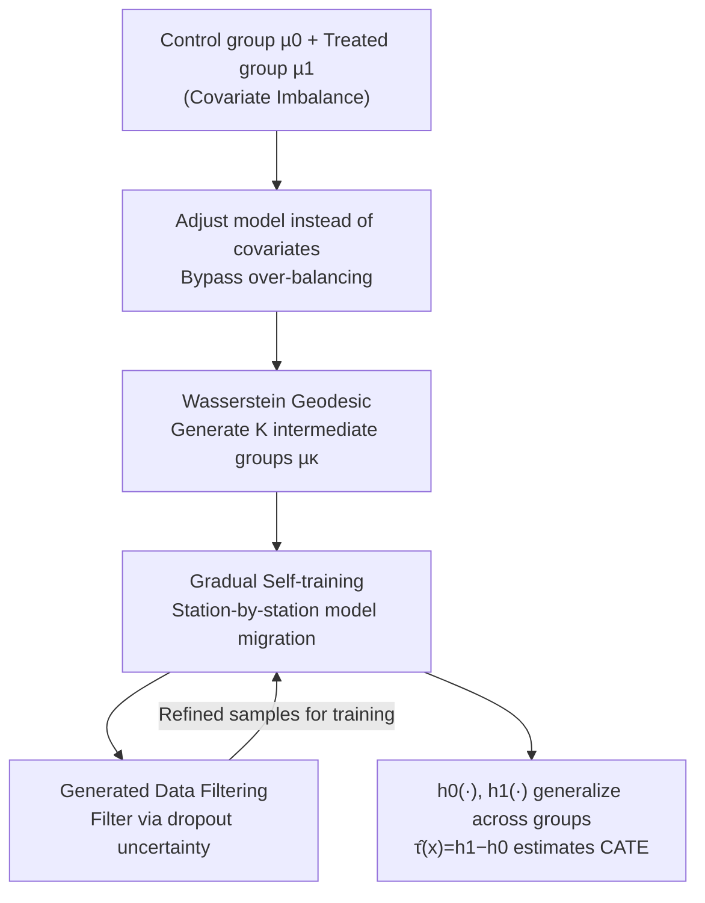

# Adjusting Prediction Model Through Wasserstein Geodesic for Causal Inference

**Conference**: ICLR 2026  
**OpenReview**: [https://openreview.net/forum?id=pYLoHuLV45](https://openreview.net/forum?id=pYLoHuLV45)  
**Code**: To be confirmed  
**Area**: Causal Inference / Counterfactual Prediction  
**Keywords**: Causal Inference, Optimal Transport, Wasserstein Geodesic, Gradual Self-training, Counterfactual Prediction

## TL;DR
To address the issue where distributional imbalance between treated and control groups prevents prediction models from generalizing across groups, this paper proposes G-learner. Instead of aligning covariates (which leads to information loss and over-balancing), G-learner generates a sequence of intermediate populations along the Wasserstein geodesic between the two distributions. It then uses gradual self-training to step-by-step migrate the prediction model from one group to the other. On News/Twins/Jobs and synthetic datasets, it reduces PEHE/ATE errors to State-of-the-Art (SOTA) or competitive levels.

## Background & Motivation
**Background**: Causal inference aims to estimate treatment effects. Under the Rubin–Neyman potential outcomes framework, the standard approach is to train outcome prediction models $h(x,0)$ and $h(x,1)$ on control ($t=0$) and treated ($t=1$) groups respectively, then estimate the Conditional Average Treatment Effect (CATE) as $\hat\tau(x)=h(x,1)-h(x,0)$.

**Limitations of Prior Work**: Because confounders affect both treatment assignment and potential outcomes, the covariate distributions of the control and treated groups differ significantly (e.g., patients undergoing surgery are often more severely ill). Consequently, a model trained on one group fails when predicting for the other—yet CATE calculation requires accurate counterfactual predictions for both groups. Mainstream "balanced representation learning" (e.g., TARNet, CFR, BNN) mitigates this by learning representations that align the two distributions. However, they are prone to **over-balancing**: while aligning distributions, they may discard discriminative information useful for outcome prediction. In extreme cases, distributions align perfectly as a single point, but all predictive information is lost.

**Key Challenge**: A trade-off exists between distribution balance and outcome prediction. Existing methods (Shalit et al. 2017) rely on heuristic compromises. The core contradiction is that the approach of "modifying covariates" inherently risks damaging predictive information.

**Goal / Key Insight**: The authors pivot the strategy—**instead of modifying covariates, they adjust the outcome prediction model itself** to ensure it generalizes well across both groups, fundamentally bypassing over-balancing. The difficulty lies in the massive distributional shift. The authors observe that if a "smooth transition" path can be paved between the two distributions such that the gap between adjacent points is small, the model can be migrated step-by-step.

**Core Idea**: Use the Wasserstein geodesic induced by Optimal Transport (OT) to generate a sequence of smooth intermediate populations between the control and treated groups. Then, employ gradual self-training to migrate the prediction model along this geodesic, using uncertainty-based filtering to ensure migration quality.

## Method

### Overall Architecture
Given a control distribution $\mu_0$ and a treated distribution $\mu_1$ with covariate shift, G-learner performs three tasks: ① Solves the OT problem between the two groups to generate intermediate populations indexed by $\kappa\in(0,1)$ along the Wasserstein geodesic; ② Uses self-training to migrate the prediction model station-by-station between adjacent intermediate populations until it covers the target group; ③ Filters low-confidence generated samples using dropout-based uncertainty before each migration step. The resulting $h_0(\cdot)$ and $h_1(\cdot)$ generalize well across both groups, and their difference yields the CATE. The authors provide a theoretical upper bound for the estimation error $\epsilon_{PEHE}$ (Theorem 1).

### Key Designs

**1. Adjusting Model instead of Covariates: Bypassing Over-balancing**

This is the methodological cornerstone, directly addressing the pain point of balanced representation learning. While existing methods force covariates together in a representation space—sacrificing predictive info—this strategy preserves all covariates and adapts the "prediction model" to both groups. Since information is not discarded, over-balancing is eliminated. The cost is the challenge of crossing the distribution gap, which the subsequent designs address.

**2. Wasserstein Geodesic for Intermediate Groups: Paving a Bridge**

To bridge the gap between $\mu_0$ and $\mu_1$, the authors use OT to create a smooth path. They solve a discrete OT problem to find the transport plan $\gamma^*$:

$$\gamma^*=\arg\min_{\gamma}\sum_{i=1}^{n_0}\sum_{j=1}^{n_1}\gamma_{ij}\lVert x_{0,i}-x_{1,j}\rVert_2^2,\quad \gamma\in\Gamma(\mu_0,\mu_1).$$

Using $\gamma^*$, intermediate distributions (Wasserstein barycenters) for $\kappa\in[0,1]$ are obtained via push-forward interpolation:

$$\mu_\kappa=\sum_{i=1}^{n_0}\sum_{j=1}^{n_1}\gamma^*_{ij}\,\delta\big((1-\kappa)x_{0,i}+\kappa x_{1,j}\big).$$

As $\kappa$ moves from 0 to 1, samples move smoothly along the "transport lines." Unlike GAN-based generative methods, this interpolation follows the geometric structure of the shortest transport path.

**3. Gradual Self-training: Step-by-step Model Handover**

Using the "stairs" created by the geodesic, the model is migrated. For $h_0(\cdot)$: the initial $h_{0,0}(\cdot)$ is trained on $\mu_0$ using factual outcomes. While it may fail on $\mu_1$, it performs better on the nearest intermediate group $\mu_{1/(K+1)}$. It provides pseudo-labels for $\mu_{1/(K+1)}$ to train $h_{0,1/(K+1)}$, which in turn labels the next station. Formally, migrating from $\kappa_-$ to $\kappa$ is:

$$h_{0,\kappa}=\arg\min_h\sum_{x_\kappa\in\mu_\kappa}\ell\big(h(x_\kappa),\,h_{0,\kappa_-}(x_\kappa)\big),$$

where the loss is weighted by $\gamma^*_{ij}$. $h_1(\cdot)$ migrates in the opposite direction from $\mu_1$ back to $\mu_0$.

**4. Generated Data Filtering: Suppressing Pseudo-label Noise**

To prevent error accumulation during self-training, the authors use $M$ forward passes with dropout to estimate uncertainty $\sigma(x_\kappa)$ for each sample $x_\kappa$. Only the $r$ proportion of samples with the lowest standard deviation are kept in the filtered population $\tilde\mu_\kappa$ for training. This ensures only high-confidence samples drive the migration chain.

### Loss & Training
The core objective is the weighted square loss (Eq. 11/12). Theoretically, the authors prove an upper bound for the PEHE error (Theorem 1):

$$\epsilon_{PEHE}\le 2E(h_{0,0})+2E(h_{1,1})+2O\big(\tilde K\Delta+B(n,\tilde K,L,r)\big),$$

showing that the error is bounded by the factual prediction errors plus a remainder term depending on sample size $n$, the number of intermediate groups $\tilde K$, and filtering ratio $r$. The remainder term approaches zero as $n\to\infty$.

## Key Experimental Results

### Main Results
Comparison on News, Twins, and Jobs datasets (out-sample):

| Dataset / Metric | G-learner | Prev. SOTA | Note |
|--------|------|------|------|
| Twins $\sqrt{\epsilon_{PEHE}}$ | **0.3200** | 0.3202 (GANITE/BNN) | Highly competitive |
| Twins $\epsilon_{ATE}$ | **0.0084** | 0.0086 (DKLite) | Best |
| Jobs $R_{POL}$ | **0.1691** | 0.1730 (DKLite) | Best |
| Jobs $\hat\epsilon_{ATT}$ | **0.0596** | 0.0782 (BNN) | Significant gain |
| News $\epsilon_{ATE}$ | **0.2451** | 0.4255 (ESCFR) | Major lead |
| News $\sqrt{\epsilon_{PEHE}}$ | 2.8681 | 2.1524 (TARNet) | Runner-up |

G-learner achieves the best or highly competitive results across most metrics. It avoids covariate shift issues without the information loss typical of balancing methods.

### Simulation (Varying Confounding Strength)
$\sqrt{\epsilon_{PEHE}}$ under different confounding levels $m_c$:

| Configuration | G-learner | Runner-up | Note |
|------|---------|------|------|
| $m_c=0.5$ | **0.20** | 0.27 (DragonNet) | Best |
| $m_c=0.8$ | **0.23** | 0.48 (CFR-Pro) | Best |
| $m_c=1.1$ | **0.29** | 0.38 (DragonNet) | Best |
| $m_c=1.4$ | **0.36** | 0.44 (CFR-Pro) | Best |

G-learner maintains the best performance as confounding increases, demonstrating robustness.

### Key Findings
- **Number of intermediate groups $K$**: Performance improves as $K$ increases from 0 to 4, confirming that the "bridge" assists migration.
- **Filtering ratio $r$**: $r=0.6$ is optimal on News. Extremely low $r$ limits data, while high $r$ introduces noise.

## Highlights & Insights
- **Root Cause Solution**: Instead of patching the balance-prediction trade-off, it replaces covariate adjustment with model adjustment to eliminate info loss.
- **Domain Adaptation Cross-over**: Adapting "gradual self-training" from domain adaptation to causal inference by treating control/treated groups as domains.
- **OT Geometrics**: Using OT-based interpolation provides a more principled geometric structure than pure generative models (GANs).
- **Theoretical Grounding**: Theorem 1 ensures that the migration error is controllable and vanishes with large sample sizes.

## Limitations & Future Work
- **Overhead**: Requires solving OT and $M$ forward passes per group; scalability to massive datasets remains a concern.
- **Discrete Covariates**: Euclidean distance in OT may require extra complexity for categorical data.
- **Continuous Treatment**: The current framework is designed for binary treatment $t\in\{0,1\}$.
- **Missing Ablations**: Lack of breakdown on the individual contribution of filtering vs. gradual migration.
- **PEHE on News**: Performance on individual-level heterogeneous effects in the News dataset is slightly behind TARNet.

## Related Work & Insights
- **vs Balanced Representation (TARNet/CFR)**: Avoids over-balancing by not forcing representation alignment.
- **vs Reweighting (IPW/Semi-relaxed OT)**: Does not use weights for alignment but uses OT to build a path for model migration.
- **vs Generative (GANITE)**: Uses structured OT geodesics rather than GANs for more stable intermediate data.

## Rating
- Novelty: ⭐⭐⭐⭐⭐ 
- Experimental Thoroughness: ⭐⭐⭐⭐ 
- Writing Quality: ⭐⭐⭐⭐ 
- Value: ⭐⭐⭐⭐

<!-- RELATED:START -->

## Related Papers

- [\[ICLR 2026\] Conformalized Survival Counterfactuals Prediction for General Right-Censored Data](conformalized_survival_counterfactuals_prediction_for_general_right-censored_dat.md)
- [\[ICML 2025\] Classifier Reconstruction Through Counterfactual-Aware Wasserstein Prototypes](../../ICML2025/causal_inference/classifier_reconstruction_through_counterfactual-aware_wasserstein_prototypes.md)
- [\[ICLR 2026\] Foundation Models for Causal Inference via Prior-Data Fitted Networks](foundation_models_for_causal_inference_via_prior-data_fitted_networks.md)
- [\[ICLR 2026\] Exploratory Causal Inference in SAEnce](exploratory_causal_inference_in_saence.md)
- [\[ICLR 2026\] Ice Cream Doesn't Cause Drowning: Benchmarking LLMs Against Statistical Pitfalls in Causal Inference](ice_cream_doesnt_cause_drowning_benchmarking_llms_against_statistical_pitfalls_i.md)

<!-- RELATED:END -->
