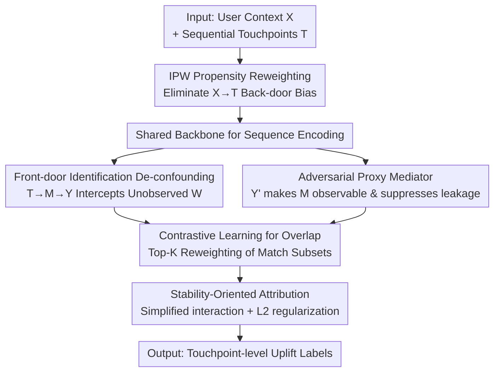

# ALM-MTA: Front-Door Causal Multi-Touch Attribution Method for Creator-Ecosystem Optimization

**Conference**: ICLR2026  
**OpenReview**: [https://openreview.net/forum?id=3r68a6GOpg](https://openreview.net/forum?id=3r68a6GOpg)  
**Code**: TBD  
**Area**: Causal Inference / Multi-Touch Attribution  
**Keywords**: Multi-touch attribution, front-door criterion, adversarial mediation, contrastive learning, recommendation system de-confounding

## TL;DR
Addressing the challenge of missing ground truth labels and systemic latent confounding in "consumption-driven production" (CDP) scenarios on short-video platforms, this paper identifies the causal uplift of each consumption touchpoint on "whether the user uploads" using the **front-door criterion + an adversarially learned proxy mediator**. Contrastive learning is employed to ensure overlap in large action spaces. Evaluated on Kuaishou's production system with 400M DAU, the method improves upload AUC to 0.907 (a relative +40% gain over SOTA) and increases per-exposure efficiency by 670%.

## Background & Motivation

**Background**: Content platforms exhibit a stable "Consumption Drives Production" (CDP) pattern, where users are more likely to transition from consumers to creators (uploading new content) after consuming sufficient "inspiring" content. Quantifying which consumption touchpoints truly incentivize creation is formalized as **Multi-Touch Attribution** (MTA): multiple historical touchpoints in a user's consumption sequence collectively lead to a final conversion (upload), requiring the credit to be reasonably distributed across touchpoints. Attribution results directly determine incentive design, cold-start handling, and re-ranking optimization, making accuracy critical.

**Limitations of Prior Work**: Industrial attribution practices generally fall into two categories: **strict rules-based methods**, which have high precision but extremely narrow coverage; and **semantic/path similarity methods**, which offer broad coverage but lack causal identifiability, often confusing correlation with causation. Neither can answer counterfactual questions like "how much would the upload probability decrease if a specific video were removed from the sequence while keeping others?" Furthermore, they rely on group averages and similarity scores, ignoring heterogeneous treatment effects (HTE), sequential effects, and touchpoint interactions, thus failing to provide personalized user-level effects.

**Key Challenge**: In large-scale complex recommendation systems, attribution is hindered by three factors: (i) the absence of explicit ground truth labels; (ii) pervasive multi-source confounding—especially **unobserved confounders** $W$ such as the recommendation strategy itself, user intent, and social influence; (iii) a high-cardinality candidate touchpoint space in the billions. While back-door adjustments (IPW/DR) suffice for observed confounders, the "strong ignorability" assumption fails when $W$ is unobserved, meaning back-door approaches alone cannot guarantee causal identifiability.

**Goal**: Estimate **personalized and reproducible** touchpoint-level uplift under observational logs without RCTs, which can be unified for various business tasks.

**Key Insight**: Since back-door adjustment is unfeasible, a different identification path—the **front-door criterion**—is utilized. This requires finding a mediator $M$ that fully intercepts the causal path from $T \to Y$. However, in reality, the true mediator (the "motivational path" triggered after a user watches a video) is unobservable, which is why the front-door criterion has struggled with practical implementation.

**Core Idea**: An **adversarially trained, label-independent proxy $Y'$** is used to make the unobservable mediator $M$ "observable." This proxy distills outcome information to strengthen the $T\to M\to Y$ causal path, while an adversarial objective suppresses shortcut leakage from $Y'\to Y$. Combined with contrastive learning and propensity reweighting, this maintains positivity and overlap in high-cardinality action spaces. In short: **Front-door de-confounding + adversarial proxy mediation** enables front-door criterion application for industrial-scale MTA.

## Method

### Overall Architecture

ALM-MTA generalizes causal multi-touch attribution as a "front-door identification" problem for large-scale recommendations. Given user context $X$ and a sequential treatment sequence $T=\langle\tau_1,\dots,\tau_L\rangle$, it outputs personalized uplift labels for each touchpoint $\tau_j$. The uplift of touchpoint $\tau_j$ is defined as the counterfactual drop in upload probability when it is removed from the sequence:

$$\Delta(\tau_j\mid X,T)=P(Y=1\mid do(T),X)-P(Y=1\mid do(T\setminus\tau_j),X).$$

The pipeline operates as follows: propensity scores (IPW) reweight observational logs to mitigate back-door bias from $X\to T$. A shared neural backbone encodes the sequence and feeds two collaborative heads: a lightweight **ITE head**, which uses learned weights to aggregate touchpoint embeddings and parameterize the logit of $P(Y\mid X,T)$ (re-estimating the logit after removing a touchpoint yields the uplift); and a **mediation observation head**, supervised by proxy $Y'$ and optimized via adversarial learning to capture the $T\to M\to Y$ path while suppressing shortcut leakage from $Y'\to Y$. The estimation rests on three de-confounding strategies (front-door identification + adversarial proxy mediator + propensity reweighting), augmented by a contrastive learning module to maintain overlap in high-cardinality action spaces.

### Key Designs

**1. Front-door Identification De-confounding: Bypassing Unobserved System-level Confounder $W$ via Mediator $M$**

In large-scale recommendations, $W$ (e.g., the recommendation strategy) affects both treatment $T$ and outcome $Y$ and is hard to enumerate, causing back-door adjustments to fail. This work constructs a causal graph $(X,W,T,M,Y)$ and demonstrates it satisfies the three conditions of the front-door criterion: (i) Path interception—all directed paths from $T\to Y$ pass through $M$; (ii) No back-door for $M\to Y$—unobserved confounders do not affect $M$ (or are blocked by $X$); (iii) Blocking the back-door from $T\to M$ given $T$. The standard front-door formula gives:

$$E[Y\mid do(T=t)]=\sum_m E[Y\mid do(M=m)]\,P(M=m\mid do(T=t)),$$

where $E[Y\mid do(M=m)]$ undergoes another back-door blocking (given $T,X$, the back-door of $M\to Y$ is closed), eventually expressing the causal effect of $T$ on $Y$ entirely in terms of estimable quantities. This ensures causal identifiability even when $W$ is unobserved.

**2. Adversarial Proxy Mediator: Making the Mediator Observable without Outcome Leakage via Label-independent $Y'$**

The primary challenge of the front-door criterion is that $M$ is unobservable. This paper introduces proxy variable $Y'$ related to $M$ (in the CDP scenario, $Y'$ measures the similarity between a user's new work and candidate touchpoints). This proxy supervises a mediation branch producing embedding $\hat M$. However, directly using $Y'$ causes **shortcut leakage**—the model learns $Y$ directly from $Y'$, leading to inflated discriminative power (AUC 0.97) but severe instability and non-convergence. To prevent this, an adversarial objective is added: a discriminator tries to predict $Y$ from $\hat M$, while the mediation branch is optimized to **suppress this predictability**. Thus, $\hat M$ retains only the information necessary for the $T\to M\to Y$ path without exposing the outcome. A side benefit comes from conditional variance monotonicity—expanding the conditioning set from $\{X,T\}$ to $\{X,T,Y'\}$ satisfies:

$$\mathrm{Var}(Y\mid X,T)\ge \mathrm{Var}(Y\mid X,T,Y'),$$

meaning $Y'$ reduces uplift estimation variance, particularly valuable in high-cardinality scenarios with sparse data.

**3. Propensity Reweighting to "Randomize" Observational Logs**

Modeling relies on historical exposure logs determined by user preferences and platform strategies. The intervention path $do(T)$ differs significantly from the empirical log distribution $P_{obs}$, meaning direct training learns correlation. Each sample is weighted by $w(x,t)=1/P_{obs}(T=t\mid X=x)$. Given positivity and correct propensity specification, the reweighted distribution mimics randomization given $X$. Combined with the front-door structure, the upload probability decomposes into estimable touchpoint-level counterfactual gains:

$$\text{upload}=\sum_t \text{uplift}_t=\sum_{\text{instance}} f(M,T,X)\,w(X,T),\quad f(M,T,X)=E[Y\mid M,T,X].$$

The synergy between "front-door de-confounding + IPW" allows causal attribution identification directly from raw logs while ensuring unconfoundedness against latent factors.

**4. Contrastive Learning for Overlap + Stability-Oriented Training**

Causal identification requires each unit to have a non-zero probability for every treatment (positivity). In high-cardinality spaces, many touchpoints are rare; marginalizing over all $T$ violates positivity and causes high variance. A contrastive learning module (InfoNCE) treats "actual proxy-touchpoint interactions before upload" as positive pairs, learning a matching score $\omega(\tau,Y')$ to measure causal alignment. Front-door estimation only marginalizes over the high-match subset $\tau_{high}=\{\tau\mid \omega(\tau,Y')\in \text{top-}K\}$, ensuring the conditional probability denominator is positive to satisfy overlap. Simultaneously, stability-oriented training simplifies feature interactions to retain robust signals and uses L2 regularization to suppress overfitting to fluctuations, ensuring causal conclusions are reproducible.

### Loss & Training
The architecture comprises a "counterfactual attribution backbone + adversarial branch + contrastive branch," with 1.31B FLOPs per forward pass (0.92B backbone, 0.39B branches). Path-level attribution signals are converted to point-wise targets for scalable distributed training. Direct Routing Gradient is used to mitigate multi-objective trade-offs. The system employs streaming training with hour-level list-wise Hive tables, maintaining a positive-to-negative ratio of approximately 2:3 with stratified negative sampling.

## Key Experimental Results

### Main Results
Comparison on the Criteo conversion prediction task across three categories: statistical learning (LR), deep learning (deepMTA), and causal learning (DML/DESCN/causalMTA). Performance measured by AUC/gAUC, log-loss, and avg AUUC (uplift ranking quality):

| Method | AUC | log-loss | gAUC | avg AUUC |
|------|------|----------|------|----------|
| LR | 0.5102 | 0.7833 | 0.5011 | 0.4725 |
| deepMTA | 0.7598 | 0.4108 | 0.6364 | 0.6277 |
| DML | 0.6498 | 0.5433 | 0.5031 | 0.8421 |
| DESCN | 0.5492 | 0.6920 | 0.5003 | 0.8429 |
| causalMTA | 0.8167 | 0.2835 | 0.6752 | 0.8493 |
| **ALM-MTA** | **0.9070** | **0.1384** | **0.8210** | **0.8686** |

ALM-MTA performs best across all metrics: compared to the strongest baseline (causalMTA), it improves AUC by +0.09 (approx. +40% relative gain), reduces log-loss to 0.1384, and leads in gAUC and AUUC.

### Ablation Study

| Configuration | AUC | UAUC | Description |
|------|------|------|------|
| DML Counterfactual Baseline (Back-door + Privileged Input) | 0.6498 | 0.50 | Back-door alone cannot solve systemic hidden confounding |
| Direct Mediation Observation with $Y'$ | 0.97 | 0.90 | High discriminative power but **shortcut leakage**; unstable |
| + Adversarial Learning (Indirect Observation) | 0.86 | 0.71 | Eliminates leakage; stable convergence |
| + MoCo-style Contrastive Learning (Full ALM-MTA) | **0.907** | **0.825** | Resolves sparse overlap; further improves performance |

### Key Findings
- **Adversarial learning is crucial for stability**: While direct observation yielded an AUC of 0.97, it suffered from leakage and non-convergence. Adversarial targets reduced AUC to 0.86 but ensured stability—a classic case where "inflated discriminative power $\neq$ causal validity."
- **Contrastive learning addresses overlap**: In high-cardinality spaces, the contrastive module maintains positivity for sparse touchpoints, raising AUC/UAUC from 0.86/0.71 to 0.907/0.825.
- **Real-world online gains**: On a system with 400M DAU and 30B samples, DAU increased by 0.04%, daily active creators by 0.6%, and per-exposure efficiency by 670%. Attribution precision reached 21.88% (vs. 4.32% for the baseline).

## Highlights & Insights
- **Engineering unobservable mediators into adversarial observable proxies**: This is the paper’s most clever move. The front-door criterion is theoretically elegant but often impractical due to unmeasurable mediators. By using a label-independent proxy $Y'$ and suppressing leakage via adversarial training, the authors bypass the requirement for perfect mediation measurement.
- **Defining uplift via counterfactual removal**: Defining uplift as "how much the upload probability drops if a video is removed" is intuitively aligned with business logic and provides touchpoint-level interpretable labels.
- **Decoupling discriminative power from causal validity**: The contrast between 0.97 AUC (leakage) and 0.86 AUC (stable) serves as a reminder that in causal attribution, stability and AUUC are more reliable signals than raw AUC.

## Limitations & Future Work
- **Validity of front-door conditions**: The method relies heavily on assumptions like "all $T\to Y$ paths pass through $M$" and "no unobserved back-door for $M\to Y$." While the paper justifies this via causal graphs, empirical robustness checks for assumption violations are lacking.
- **Proxy $Y'$ design**: $Y'$ is constructed via fixed rules or similarity. The quality of $Y'$ determines mediation observation; rule-based design may introduce bias and might not transfer easily across platforms.
- **Incremental absolute gains**: While the 670% efficiency gain is massive, the absolute DAU gain (+0.04%) is small, requiring context regarding the scale of the system.

## Related Work & Insights
- **vs. Data-driven MTA (Shapley / Markov / RNN)**: These are mostly correlation-based methods that assume touchpoints are exogenous; they cannot handle confounding bias in production systems.
- **vs. Back-door Causal MTA (IPW / DR / causalMTA)**: These depend on "strong ignorability," which is rarely satisfied in ecosystems with latent confounding like recommendation strategies. ALM-MTA bypasses this via the front-door criterion.
- **vs. Front-door / Proxy methods**: Prior works either assumed mediators were fully observable or used proxies to approximate hidden confounders. This work focuses on "making the mediator observable" while preventing leakage and handling high-cardinality positivity via contrastive learning.

## Rating
- Novelty: ⭐⭐⭐⭐⭐ (First systematic application of front-door criterion + adversarial proxies to industrial MTA).
- Experimental Thoroughness: ⭐⭐⭐⭐ (Solid offline/online validation, though lacks sensitivity analysis for front-door assumptions).
- Writing Quality: ⭐⭐⭐⭐ (Clear causal derivation and motivation).
- Value: ⭐⭐⭐⭐⭐ (High industrial value with significant supply-side gains).

<!-- RELATED:START -->

## Related Papers

- [\[ICLR 2026\] Debiased Front-Door Learners for Heterogeneous Effects](debiased_front-door_learners_for_heterogeneous_effects.md)
- [\[ICLR 2026\] Causal Score Conditioning for Multi-Resolution Latent Systems](causal_score_conditioning_for_multi-resolution_latent_systems.md)
- [\[ICLR 2026\] Counterfactual Structural Causal Bandits](counterfactual_structural_causal_bandits.md)
- [\[ICLR 2026\] Causal Discovery via Quantile Partial Effect](causal_discovery_via_quantile_partial_effect.md)
- [\[ICLR 2026\] On the Identifiability of Causal Graphs with the Invariance Principle](on_the_identifiability_of_causal_graphs_with_the_invariance_principle.md)

<!-- RELATED:END -->
