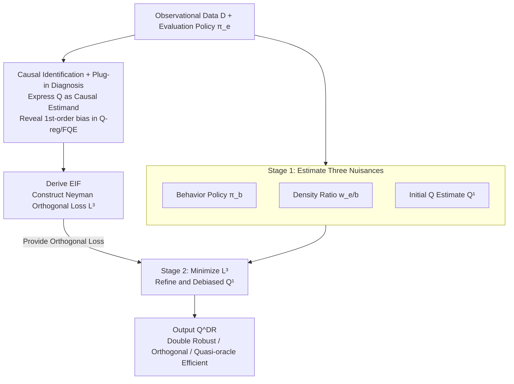

# An Orthogonal Learner for Individualized Outcomes in Markov Decision Processes

**Conference**: ICLR 2026  
**arXiv**: [2509.26429](https://arxiv.org/abs/2509.26429)  
**Code**: [EmilJavurek/Orthogonal-Q-in-MDPs](https://github.com/EmilJavurek/Orthogonal-Q-in-MDPs)  
**Area**: Causal Inference  
**Keywords**: Q-function estimation, Double Robustness, Neyman Orthogonality, Causal Inference, Offline Policy Evaluation

## TL;DR

This paper systematically introduces semiparametric efficiency theory from causal inference into Q-function estimation in MDPs. It proves that classical Q-regression and FQE are essentially naive learners with plug-in bias and proposes the DRQQ-learner—a meta-learner characterized by double robustness, Neyman orthogonality, and quasi-oracle efficiency. By deriving the Efficient Influence Function (EIF), it constructs a debiased two-stage loss, significantly outperforming baseline methods in Taxi and Frozen Lake environments.

## Background & Motivation

**Background**: In scenarios such as personalized medicine, a core task is estimating individualized potential outcomes (i.e., estimating the Q-function) under a specific policy from observational data. Existing methods like Q-regression (Liu et al., 2018) and FQE (Le et al., 2019) primarily focus on breaking the "curse of horizon" (the exponential explosion of cumulative density ratios over time), but lack theoretical guarantees for the statistical properties of the estimators themselves.

**Limitations of Prior Work**: Q-regression adjusts via Inverse Probability Weighting (IPTW) and directly uses the cumulative density ratio $\rho_{1:t}$, leading to variance explosion under long horizons. FQE avoids cumulative ratios by recursively fitting the Bellman equation but suffers from the "deadly triad" (the unstable combination of function approximation, bootstrapping, and off-policy learning), potentially causing divergence. More critically, neither method provides theoretical guarantees regarding orthogonality or efficiency.

**Key Challenge**: From a causal inference perspective, both Q-regression and FQE are plug-in learners—directly "plugging" estimated nuisance parameters into the identification formula. The fundamental flaw of plug-in estimation is that first-order estimation errors of nuisance parameters propagate linearly into the final estimator, making the convergence rate bounded by the slowest nuisance component. While double robustness (DR) and Neyman orthogonal methods have successfully addressed this in static causal inference, extending these tools to the sequential decision-making framework of MDPs is non-trivial due to the recursive structure of the Bellman equation and error propagation across time steps.

**Goal**: (1) How to derive the Efficient Influence Function (EIF) for Q-function estimation in MDPs from semiparametric efficiency theory? (2) How to construct a Neyman orthogonal loss function based on the EIF such that nuisance estimation errors affect the final estimate only through second-order terms? (3) Can the resulting estimator simultaneously possess double robustness and quasi-oracle efficiency?

**Key Insight**: The authors observe that the Q-function is essentially a causal estimand (potential outcome under evaluation policy $\pi_e$), which can be formalized through the potential outcomes framework. Once this causal interpretation is established, mature debiasing tools from semiparametric statistics (EIF, orthogonal learning, cross-fitting) can be utilized to systematically improve estimation.

**Core Idea**: Deriving the EIF for the MSE loss of the Q-function and constructing a two-stage meta-learner that "estimates nuisances first, then debiases using EIF." This grants the Q-function estimator double robustness, Neyman orthogonality, and quasi-oracle efficiency simultaneously.

## Method

### Overall Architecture

The DRQQ-learner transforms a theoretical problem into a clear pipeline through a three-step logic. First, it translates the Q-function into a causal quantity to diagnose the plug-in bias of existing methods (Q-regression / FQE). Second, it derives the Efficient Influence Function (EIF) to construct a Neyman orthogonal loss $\hat{L}^3_{\pi_e}$. Finally, it uses a two-stage meta-learner that "estimates nuisance parameters crudely, then refines via orthogonal loss" to estimate the Q-function with provable statistical guarantees.

Specifically, the input consists of an observational dataset $\mathcal{D}_{\pi_b}$ generated by a behavior policy $\pi_b$ (decomposed into a set of i.i.d. one-step transitions $(S, A, R, \tilde{S})$) and a target evaluation policy $\pi_e$. The first stage estimates three nuisance functions: the behavior policy $\hat{\pi}_b$, the density ratio $\hat{w}_{e/b}$, and an initial Q-function estimate $\hat{Q}^1_{\pi_e}$. In the second stage, given these nuisances, Empirical Risk Minimization is performed on the orthogonal loss $\hat{L}^3_{\pi_e}$ to refine the Q-estimate, outputting the final $\hat{Q}^{DR}_{\pi_e}$. The framework is agnostic to the model choice in the first stage—neural networks, linear models, or tabular methods can be used—and the model class $\mathcal{G}$ for the second stage can also be flexibly specified (e.g., using linear models for interpretability).

### Key Designs

**1. Causal Identification and Plug-in Diagnosis: Translating Q-functions to Causal Estimands to Expose Bias**

This step establishes a unified diagnostic platform rather than proposing a new method. The authors use the potential outcomes framework to write the Q-function as a causal parameter $\xi_{\pi_e}(s,a) = \mathbb{E}[R_0 + \sum_{t=1}^{\infty} \gamma^t R_t[\pi_e(\cdot|S_t)] \mid S_0=s, A_0=a]$. Under standard assumptions of Markov property, no unobserved confounding, and positivity, it follows two identification paths: one via IPTW based on full trajectories using cumulative density ratios $\rho_{1:t}$ (corresponding to Q-regression), and another via Bellman equations based on one-step transitions (corresponding to FQE).

The critical diagnostic action is calculating the Gâteaux derivatives of these two losses with respect to nuisance parameters. The non-zero derivatives imply that first-order estimation errors of nuisances propagate linearly into the final estimate—the exact definition of plug-in bias. Thus, Q-regression and FQE are categorized as plug-in learners whose convergence is bottlenecked by the slowest nuisance component, pinpointing the target for debiasing.

**2. EIF Derivation and Neyman Orthogonal Loss: Reducing First-Order Bias to Second-Order**

Following the diagnosis, the authors derive the EIF for the standard MSE population risk $L^1_{\pi_e}(\eta, g) = \mathbb{E}_{pb}[\sum_a \pi_e(a|S)(Q_{\pi_e}(S,a) - g(S,a))^2]$ and use it to construct the debiased loss $L^3_{\pi_e}$. The core of the EIF is a correction term: the Bellman residual $R' + \gamma v_{\pi_e}(\tilde{S}') - Q_{\pi_e}(S', A')$ multiplied by the density ratios $\pi_e/\pi_b$ and $w_{e/b}$. The former handles "local" debiasing (correcting action distribution shift), while the latter handles "global" debiasing (correcting state visitation distribution shift). These corrections are bundled into pseudo-outcomes $\phi_1, \phi_2$, replacing the original MSE objective with a debiased version.

The resulting loss satisfies Neyman orthogonality:

$$D_\eta D_g L^3(g^*, \eta)[\hat{g}-g, \hat{\eta}-\eta] = 0$$

Meaning the loss gradient is zero regarding first-order perturbations of nuisances near their true values. Consequently, nuisance estimation errors enter the final estimate only in second-order (product) form. This allows the overall Q-estimator to achieve fast rates even if nuisance models converge slowly—a feat impossible for plug-in learners.

**3. Double Robustness and Quasi-oracle Efficiency: Error Insurance for Medical Contexts**

The third design point translates the previous steps into two provable statistical guarantees. Quasi-oracle efficiency is reflected in the excess risk bound:

$$\|g^* - \hat{g}\|^2 \lesssim \|\Delta^2 \hat{\pi}_b\|^2 \|\Delta^2 \hat{Q}_{\pi_e}\|^2 + \|\Delta^2 \hat{w}_{e/b}\|^2 \|\Delta^2 \hat{Q}_{\pi_e}\|^2$$

The error depends only on the product of nuisance errors, not any single term. Double robustness is a direct corollary: as long as either $\hat{Q}^1_{\pi_e}$ is consistent, or both $(\hat{\pi}_b, \hat{w}_{e/b})$ are consistent, the final estimator is consistent. This is particularly valuable in precision medicine, where model misspecification of behavior policies and transition dynamics is nearly inevitable; DR properties allow for a consistent estimate even if only one set of nuisance models is correct.

### Loss & Training

The three nuisance models in the first stage are trained via standard supervised learning: $\hat{\pi}_b$ as a classification model for the behavior policy; $\hat{w}_{e/b}$ as a density ratio estimate by estimating the ratio of transition probabilities and stationary distributions; $\hat{Q}^1_{\pi_e}$ using any existing Q-estimation method (like FQE) for an initial estimate. In the second stage, Empirical Risk Minimization is performed on the orthogonal loss $\hat{L}^3_{\pi_e}$ given the nuisance estimates, supporting the use of cross-fitting (sample splitting) to avoid overfitting bias. The process is model-agnostic, allowing any ML models (neural networks, linear models, etc.) for both nuisance and target models.

## Key Experimental Results

### Main Results

Experiments were conducted on OpenAI Gym's Taxi and Frozen Lake environments. Both behavior policy $\pi_b$ and evaluation policy $\pi_e$ were epsilon-greedy. The evaluation metric is relative MSE: $\text{rMSE} = \|\hat{Q} - Q_{\pi_e}\|_2^2 / \|Q_{\pi_e}\|_2^2$.

| Condition | Q-regression | FQE | MQL | DRQQ (Ours) |
|---------|-------------|-----|-----|------------|
| Taxi, n=4000, unrestricted $\mathcal{G}$ | Higher rMSE, affected by horizon curse | Medium rMSE | Medium rMSE | **Lowest rMSE** |
| Taxi, long horizon ($h=20$) | rMSE rises significantly | Relatively stable | Medium | **Stable Optimal** |
| Taxi, low overlap ($\epsilon_e=0.1$) | rMSE explodes | Medium rise | Medium | **Significantly outperforms all baselines** |
| Frozen Lake, unrestricted $\mathcal{G}$ | Higher rMSE | Medium | Medium | **Lowest rMSE** |
| Taxi, linear $\mathcal{G}$ | Medium | Medium | Medium | **Optimal in most settings** |

### Ablation Study

The paper validates theoretical properties through systematic variable experiments across three dimensions:

| Dimension | Range | Theory Validated | DRQQ Performance |
|---------|---------|-------------|---------|
| Dataset size $n$ | 2000→6000 | Convergence rate | Decreases steadily as $n$ increases; consistently outperforms baselines |
| Effective horizon $h=1/(1-\gamma)$ | 3→20 | Breaking horizon curse | rMSE insensitive to $h$, while Q-regression rises sharply |
| Overlap level ($\epsilon_e$) | 0.1→0.9 | Neyman Orthogonal advantage in low overlap | Largest advantage at low overlap; gap narrows at high overlap |
| Model class restriction | Unrestricted vs Linear | Applicability to restricted $\mathcal{G}$ | Remains optimal under linear $\mathcal{G}$ |

### Key Findings

- **Low overlap is the primary advantage for DRQQ-learner**: When the evaluation and behavior policies differ significantly, plug-in bias is amplified. DRQQ's Neyman orthogonality makes it insensitive to this distribution shift. The improvement relative to FQE is much larger in low-overlap settings than in high-overlap ones.
- **Q-regression is severely impacted by the curse of horizon**: As the effective horizon increases from 3 to 20, Q-regression's rMSE rises sharply because the variance of $\rho_{1:t}$ grows exponentially. DRQQ and FQE are unaffected as they utilize one-step transitions.
- **Restrictive model classes do not hinder effectiveness**: DRQQ still performs best under linear $\mathcal{G}$, verifying the theory's generality and its utility in medical scenarios requiring interpretable models.
- **Advantages diminish but do not reverse under high overlap**: When $\pi_e$ is close to a random policy, density ratios approach 1, simplifying nuisance estimation for all methods. DRQQ's debiasing advantage naturally weakens but does not drop below baselines.

## Highlights & Insights

- **Theoretical bridge between Causal Inference and RL**: This work is the first to fully introduce semiparametric efficiency theory into Q-function estimation in MDPs. It categorizes Q-regression and FQE as plug-in learners and diagnoses their bias sources, providing a unified theoretical lens for comparing Q-estimation methods.
- **"Estimate-then-Refine" meta-learning paradigm**: The architecture of DRQQ-learner is elegant—Stage 1 uses any existing method (even biased FQE) for crude nuisance estimation, and Stage 2 automatically corrects bias via the EIF-derived orthogonal loss. This "model-agnostic debiasing wrapper" approach is transferable to other sequential decision estimation problems involving nuisance parameters.
- **Practical value of Double Robustness**: In fields like precision medicine, behavior policies and transition dynamics are hard to estimate accurately. DR properties provide "error insurance"—consistency is maintained as long as either the initial Q-estimate or the density models are correct.

## Limitations & Future Work

- **Environmental limitations**: Validation was limited to small discrete environments (Taxi and Frozen Lake). Despite theoretical support for continuous spaces, there is a lack of experimental verification for high-dimensional or continuous scenarios, leaving a gap for real-world medical applications.
- **Difficulty in density ratio $w_{e/b}$ estimation**: This nuisance involves the ratio of stationary distributions, which is extremely difficult to estimate in continuous or large-scale discrete state spaces, potentially becoming a bottleneck.
- **Computational overhead**: Training three nuisance models followed by a second-stage optimization significantly increases computation compared to single-stage FQE, especially with the addition of cross-fitting.
- **Extension to non-stationary MDPs**: Current theory strictly requires time-invariant MDPs and stationary policies. Real-world medical scenarios often involve patient state transitions and treatments that vary over time, requiring re-derivation of the EIF for non-stationary settings.

## Related Work & Insights

- **vs Q-regression (Liu et al., 2018)**: Q-regression uses IPTW with cumulative density ratios. Ours proves it is a trajectory-based plug-in learner suffering from both the horizon curse and first-order plug-in bias. DRQQ uses one-step transitions to avoid horizon issues and orthogonal loss to eliminate plug-in bias.
- **vs FQE (Le et al., 2019)**: FQE uses one-step transitions via recursive Bellman fitting to break the horizon curse. Ours proves it remains a Bellman-based plug-in learner with first-order bias. DRQQ adds EIF correction to FQE to achieve Neyman orthogonality.
- **vs Shi et al. (2021) Debiased OPE**: Shi et al. derived pointwise iterative debiasing for OPE, which coincides with a special case of DRQQ in discrete settings. DRQQ's advantages include applicability to continuous states (where Shi's Dirac delta approach fails), support for restricted model classes $\mathcal{G}$, and full theoretical proofs of orthogonality and quasi-oracle efficiency.
- **vs Static Causal Inference DR methods**: DoubleML (Chernozhukov et al., 2018) and DR-learner (Kennedy, 2020) serve as the foundation. DRQQ extends these concepts from static/short-term settings to infinite-horizon MDPs.

## Rating

- Novelty: ⭐⭐⭐⭐ Systematically introducing semiparametric efficiency to MDP Q-estimation is a major theoretical innovation, though the tools (EIF, orthogonal loss, cross-fitting) are from established causal inference frameworks.
- Experimental Thoroughness: ⭐⭐⭐ While the design validates theoretical predictions (varying $n$, $h$, $\epsilon_e$), it is limited to small discrete environments and lacks high-dimensional/continuous verification.
- Writing Quality: ⭐⭐⭐⭐⭐ Extremely rigorous theoretical derivation with a clear narrative from plug-in diagnosis to EIF derivation and loss construction.
- Value: ⭐⭐⭐⭐ Provides a fresh theoretical perspective and guaranteed methods for offline Q-function estimation, significant for precision medicine and reliable RL.

<!-- RELATED:START -->

## Related Papers

- [\[ICLR 2026\] GDR-learners: Orthogonal Learning of Generative Models for Potential Outcomes](gdr-learners_orthogonal_learning_of_generative_models_for_potential_outcomes.md)
- [\[ICLR 2026\] Overlap-Weighted Orthogonal Meta-Learner for Treatment Effect Estimation over Time](overlap-weighted_orthogonal_meta-learner_for_treatment_effect_estimation_over_ti.md)
- [\[ICML 2026\] Rank-Learner: Orthogonal Ranking of Treatment Effects](../../ICML2026/causal_inference/rank-learner_orthogonal_ranking_of_treatment_effects.md)
- [\[ICML 2025\] Transformer-Based Spatial-Temporal Counterfactual Outcomes Estimation](../../ICML2025/causal_inference/transformer-based_spatial-temporal_counterfactual_outcomes_estimation.md)
- [\[ICLR 2026\] Topological Causal Effects](topological_causal_effects.md)

<!-- RELATED:END -->
