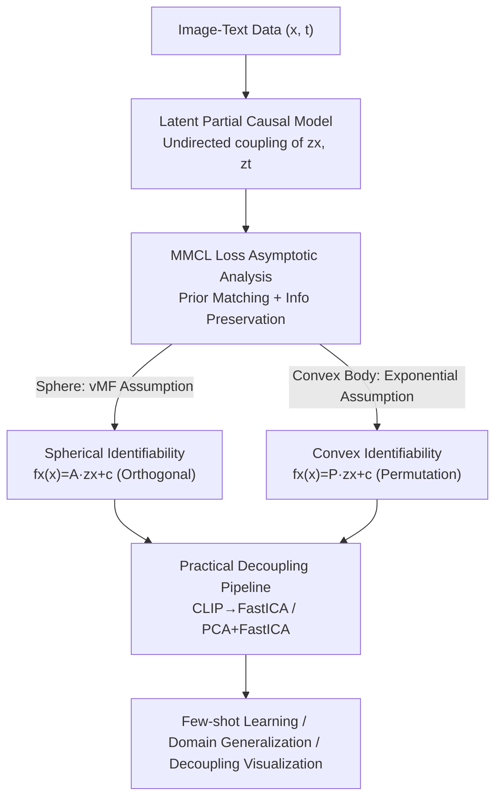

# Beyond DAGs: A Latent Partial Causal Model for Multimodal Learning

**Conference**: ICLR2026  
**OpenReview**: [https://openreview.net/forum?id=bZqCBgm2N0](https://openreview.net/forum?id=bZqCBgm2N0)  
**Paper**: [Project Page](https://sites.google.com/view/yuhangliu/projects/bedags)  
**Code**: To be confirmed (authors state it will be public after publication)  
**Area**: Causal Representation Learning / Multimodal VLM  
**Keywords**: Latent Partial Causal Models, Multimodal Contrastive Learning, Identifiability, Decoupled Representations, CLIP

## TL;DR
This paper points out that large-scale multimodal data do not follow the generation assumption of a single Directed Acyclic Graph (DAG). It proposes a Latent Partial Causal Model utilizing "undirected edges to connect two sets of latent coupled variables." On both spherical and convex latent spaces, it is proven that representations learned by Multimodal Contrastive Learning (MMCL), such as CLIP, differ from ground-truth latent variables by a linear orthogonal transformation and a permutation transformation, respectively. This provides the first theoretical guarantee for "component-wise decoupling" in MMCL and implements it via a plug-and-play decoupling pipeline (FastICA / PCA+FastICA), achieving improvements in few-shot learning and domain generalization.

## Background & Motivation
**Background**: The success of large-scale multimodal models like CLIP, which align images and text through MMCL, is widely attributed to "learning high-quality cross-modal representations on massive data." A recent research line uses **Latent Causal Models + Identifiability Analysis** to explain this: formalizing whether "learned representations can recover high-level latent causal variables" and theoretically proving that contrastive learning indeed performs latent variable recovery.

**Limitations of Prior Work**: This line of research almost exclusively assumes that latent causal variables follow a **DAG (Directed Acyclic Graph)** structure. However, the authors observe that real-world large-scale image-text data originate from **heterogeneous or even opposing** generation mechanisms: some pairs follow "Text → Image" (text instructions generating images, e.g., text-to-image), while others follow "Image → Text" (images collected from the web and then described by humans, e.g., image captioning). These two mechanisms correspond to DAGs with **exactly opposite causal directions**.

**Key Challenge**: To fit all data into a **single** DAG, one must choose between two conflicting causal directions, which contradicts the true mixed generation process of the data. Consequently, previous DAG-based identifiability results only hold on "small-scale, single-mechanism" synthetic data and remain in simulation, offering little operational guidance for real large models like CLIP.

**Goal**: (1) Find a generative model that characterizes cross-modal "transferable knowledge" without presetting a single causal direction; (2) Prove what MMCL actually recovers under this model; (3) Transform the theory into a decoupling tool directly applicable to pre-trained CLIP.

**Key Insight**: Since there is no unified answer to "which modality is the cause or effect," the authors **avoid forcing a direction**—they connect semantic latent variables on both sides with an **undirected edge**, representing bidirectional shared transferable knowledge, thus removing the controversial "direction" from the model.

**Core Idea**: Replace the DAG with a "Latent Partial Causal Model coupled by undirected edges," then prove that MMCL is equivalent to recovering this set of coupled latent variables (up to an orthogonal transformation on the sphere and a permutation on the convex body). This both explains why MMCL is effective and provides a decoupling recipe for CLIP.

## Method

### Overall Architecture
The entire paper is a link "from generation assumptions → theory → practice," rather than a specific network architecture. First, a **Latent Partial Causal Model** describes how image-text data is generated. Second, the **asymptotic form** of the MMCL contrastive loss is analyzed as the sample size approaches infinity, revealing that it consists of "prior matching" and "information preservation." Third, **identifiability theorems** are provided for **spherical** and **convex** latent spaces, showing that learned representations differ from ground-truth latents by simple transformations. Finally, the "linear/permutation transformation difference" is turned into an operational **linear unmixing pipeline** (FastICA, preceded by PCA if necessary), applied directly to pre-trained CLIP representations for downstream tasks.

### Key Designs

**1. Latent Partial Causal Model: Replacing Controversial Causal Directions with Undirected Edges**

To address the issue where a single DAG cannot accommodate opposing generation directions, the authors split the latent space: one side has **semantic latent variables** $z_x$ (e.g., object categories) and **modality-exclusive latent variables** $m_x$ (e.g., background noise), and the other side symmetrically has $z_t$ (textual topic) and $m_t$ (syntactic structure). Observations are generated by $x=g_x(z_x,m_x)$ and $t=g_t(z_t,m_t)$, where $g_x,g_t$ are assumed to be invertible and differentiable. The key is that between $z_x$ and $z_t$, there is an **undirected edge** representing shared knowledge. This avoids taking sides between "Text→Image" or "Image→Text," unifying conflicting DAGs into a "partial causal" model.

**2. Asymptotic Analysis of MMCL Loss: Prior Matching + Information Preserving**

To prove that MMCL recovers $z_x,z_t$, its optimization objective must be clear. The authors take the limit $N\to\infty$ for the standard multimodal contrastive loss $L$, obtaining a three-term asymptotic expression (Theorem 3.1): the first term is the cross-modal alignment of positive pairs $\mathbb{E}_{(x,t)}[d(f_x(x),f_t(t))/\tau]$, corresponding to **prior matching** (one modality acts as a prior for the other, constraining the solution space). The latter two terms are log-expectations for each modality over the other, approximating negative cross-entropy $-H(p(f_x(x)),p(f_t(t)))-H(p(f_t(t)),p(f_x(x)))$, corresponding to **information preservation** (forcing distributions to align and cover the latent structure). This design merges "alignment-uniformity" and "information preservation" into two components of the same objective for the first time in a multimodal context.

**3. Dual-Space Identifiability: Linear for Spheres, Permutation for Convex Bodies**

The authors parameterize the latent space in two ways. On the **sphere** (Theorem 4.1): if $p(z_x)$ is uniform and $p(z_t\mid z_x)$ follows a von Mises–Fisher distribution, the optimal solution satisfies $f_x(x)=A z_x+c$, where $A$ is an **orthogonal matrix**. On the **convex body** (Theorem 4.2): if $p(z_x)$ is uniform and $p(z_t\mid z_x)$ belongs to the exponential family, then $f_x(x)=P z_x+c$, where $P$ is a **scaled permutation matrix**, indicating **component-wise decoupling**. These theorems bridge multimodal and single-modal theory, providing the first component-wise decoupling guarantee for MMCL.

**4. Mechanism: Decoupling CLIP with FastICA / PCA+FastICA**

If the difference is an orthogonal/permutation transformation, that transformation can be solved. Assuming latent components are independent, for spherical cases (like CLIP's L2-normalized representations), **linear unmixing (FastICA)** can recover the decoupled representations. For the convex body case, where L2 normalization violates the "convex body" condition, the authors use a **local isometry** approximation: apply **PCA** first, then **FastICA** to cancel out the orthogonal transformation introduced by PCA. These pipelines are **plug-and-play** and require no retraining of CLIP.

### Loss & Training
This work does not introduce a new loss; it analyzes the standard multimodal contrastive loss (CLIP/InfoNCE form):

$$L = -\frac{1}{N}\sum_{i=1}^{N}\log\frac{e^{-d(f_x(x_i),f_t(t_i))/\tau}}{\sum_{j=1}^{N} e^{-d(f_x(x_i),f_t(t_j))/\tau}} -\frac{1}{N}\sum_{i=1}^{N}\log\frac{e^{-d(f_x(x_i),f_t(t_i))/\tau}}{\sum_{j=1}^{N} e^{-d(f_x(x_j),f_t(t_i))/\tau}}$$

Where $d$ is a distance metric (cosine similarity on the sphere, $L_1$ on the convex body). The "training strategy" involves **inference post-processing**: applying FastICA or PCA+FastICA to frozen CLIP outputs, then training a linear classifier.

## Key Experimental Results

### Main Results
Synthetic experiments utilize the coefficient of determination $R^2$ for linear identifiability and the Mean Correlation Coefficient (MCC) for permutation identifiability. Perfect recovery is achieved when assumptions are met, and the model remains robust under partial violations.

| Setting (Synthetic) | Metric | Assumptions Met | Partial Violation |
|--------|------|------|----------|
| Sphere (U / vMF → Spherical vMF) | $R^2$ | 99.5 ± 0.1 | 88.5 ~ 96.3 |
| Convex (U / Laplace → Convex Laplace) | MCC | 99.1 ± 0.1 | 95.6 ~ 98.6 |

On real-world data (2-shot learning on ImageNet and Domain Generalization on variants like Sketch/R/A):

| Encoder | Method | ImageNet (Source) | DG AVG |
|--------|------|------|----------|
| ViT-B/16 | Linear Probe | 44.97 | 32.51 |
| ViT-B/16 | +FastICA | 45.52 | 34.43 |
| ViT-B/16 | **+PCA+FastICA** | **46.57** | **37.13** |

### Ablation Study
Rather than traditional component removal, the paper uses **Hypothesis Violation Experiments** and **Unmixing Pipeline Comparisons**.

| Config | Key Metric | Description |
|------|---------|------|
| Linear Probe | Baseline | Original CLIP features |
| + FastICA | Source & DG ↑ | Validates spherical decoupling (Corollary 1) |
| + PCA + FastICA | Further ↑ (esp. DG) | Validates local isometry approximation (Corollary 2) |

### Key Findings
- **PCA+FastICA yields the most significant gains in Domain Generalization**: On ViT-B/16, the average DG score increased from 32.51 to 37.13 (+4.6), confirming that decoupled representations are more robust to distribution shifts.
- **Robustness to Hypotheses**: Asymptotic loss depends on expectations, showing tolerance for distribution forms and spatial geometry.
- **Plug-and-play**: Integrating FastICA into Tip-Adapter/Tip-Adapter-F further improves few-shot performance across 11 datasets.

## Highlights & Insights
- **"Undirected Edges" as a masterstroke**: When no unified causal direction exists, removing the direction from the model and using undirected coupling to express shared knowledge is both honest and mathematically tractable.
- **Unifying Contrastive Theories**: By merging prior matching and information preservation in a multimodal context, the paper provides a more unified explanation for why MMCL learns good representations.
- **Component-wise Decoupling**: This is the first result to provide such a guarantee for MMCL and translate it into a practical recipe (FastICA) for frozen CLIP.

## Limitations & Future Work
- **Parametric Assumptions**: The conclusion relies on specific distributions (vMF, exponential) and independent components, which may not strictly hold in reality.
- **Geometry Mismatch**: The convex body theory doesn't perfectly match CLIP's spherical space, requiring the PCA+FastICA "local isometry" heuristic.
- **Independence Assumption**: Real-world semantic attributes are often correlated; the effectiveness of FastICA's independence requirement was not quantitatively mapped for all scenarios.

## Related Work & Insights
- **vs. DAG-based Identifiability**: Previous works assume a single DAG (limited to simulation); this work uses an undirected LPCM to handle conflicting directions and real-world CLIP data.
- **vs. Single-modal Theory**: This is an extension of work by Wang & Isola (2020), specifically handling modality-exclusive variables $m_x, m_t$ and heterogeneous generation $g_x, g_t$.

## Rating
- Novelty: ⭐⭐⭐⭐⭐ 
- Experimental Thoroughness: ⭐⭐⭐⭐ 
- Writing Quality: ⭐⭐⭐⭐⭐ 
- Value: ⭐⭐⭐⭐⭐ 

<!-- RELATED:START -->

## Related Papers

- [\[ICLR 2026\] Causal Discovery via Quantile Partial Effect](causal_discovery_via_quantile_partial_effect.md)
- [\[ICLR 2026\] Causal Structure Learning in Hawkes Processes with Complex Latent Confounder Networks](causal_structure_learning_in_hawkes_processes_with_complex_latent_confounder_net.md)
- [\[ICLR 2026\] Conditional Independent Component Analysis for Estimating Causal Structure with Latent Variables](conditional_independent_component_analysis_for_estimating_causal_structure_with_.md)
- [\[ACL 2026\] Learning Invariant Modality Representation for Robust Multimodal Learning from a Causal Inference Perspective](../../ACL2026/causal_inference/learning_invariant_modality_representation_for_robust_multimodal_learning_from_a.md)
- [\[ICLR 2026\] Characterization and Learning of Causal Graphs with Latent Confounders and Post-treatment Selection from Interventional Data](characterization_and_learning_of_causal_graphs_with_latent_confounders_and_post-.md)

<!-- RELATED:END -->
