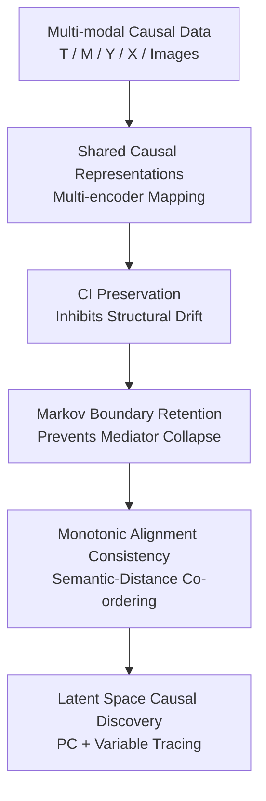

# CARL: Preserving Causal Structure in Representation Learning

**Conference**: ICLR2026  
**OpenReview**: [https://openreview.net/forum?id=I43IOiimO6](https://openreview.net/forum?id=I43IOiimO6)  
**Code**: TBD  
**Area**: Causal Inference  
**Keywords**: Causal Representation Learning, Cross-modal Alignment, Conditional Independence, Markov Boundary, Identifiability

## TL;DR
CARL investigates the issue of causal structural drift in cross-modal representation learning. By employing three types of constraints—conditional independence preservation, Markov boundary retention, and monotonic alignment consistency—it maps multi-modal data into a shared representation space while preserving independence relations, mediator information, and causal effect identifiability conditions from the original causal graph.

## Background & Motivation
**Background**: Cross-modal representation learning typically encodes images, tables, text, or other modalities into a unified vector space. Alignment is achieved using reconstruction loss, contrastive learning, correlation maximization, or large-scale pre-training objectives. Methods like CLIP, ImageBind, ALIGN, and DCCA excel in semantic retrieval and transfer learning, but they primarily optimize statistical correlation and geometric proximity without explicitly ensuring the preservation of the original causal graph between variables.

**Limitations of Prior Work**: If learned representations only pursue prediction or alignment, they may encode non-existent dependencies or compress away vital mediator variables. The paper terms this phenomenon "representation-induced structural drift." While this might only degrade interpretability in standard classification, in causal inference, it directly harms intervention effect estimation, counterfactual reasoning, and out-of-distribution generalization. Causal queries identifiable via backdoor, frontdoor, or instrumental variables in the original space may become unidentifiable in the representation space.

**Key Challenge**: Cross-modal learning aims for a compact shared space to absorb information from different modalities, whereas causal inference seeks to retain structural information like conditional independence, Markov boundaries, and identifiability. Reconstruction demands of high-information-density modalities might overshadow key causal variables in low-density ones; semantically similar samples might not be monotonically arranged by distance in the shared space; and structural conditions (backdoor/frontdoor/IV) satisfied by original variables do not automatically transfer to representation variables.

**Goal**: The authors aim to introduce a set of verifiable causal structure preservation principles to cross-modal representation learning. Specifically, the learned representations should satisfy three criteria: first, conditional independence relations in the original graph must approximately hold in the representation space; second, mediator representations must not lose information useful for the outcome due to compression; third, monotonic consistency between semantic differences and representation distances must be maintained to ensure geometric proximity serves structural consistency.

**Key Insight**: Instead of reinventing a full multi-modal backbone, CARL integrates causal constraints into the cross-modal alignment objective. These objective functions directly correspond to causal preservation principles: conditional mutual information constraints suppress spurious dependencies, InfoNCE-style Markov boundary retention prevents mediator collapse, and Spearman monotonic correlation loss binds semantic ranking to vector distances.

**Core Idea**: Replace pure statistical alignment with "causal structure preservation constraints," ensuring cross-modal shared representations not only align semantics but also approximate the conditional independence, key mediation info, and effect identifiability conditions of the original causal graph.

## Method
The CARL method is an multi-modal representation learning framework oriented toward causal inference. It defines an original variable graph—including treatment $T$, mediator $M$, true outcome $Y^*$, and covariates $X$—and encodes tabular variables and images into a shared space as $Z_T, Z_M, Z_Y, Z_{I_M}, Z_{I_Y}$. During training, CARL optimizes structural preservation losses alongside alignment/regularization terms.

### Overall Architecture
The workflow starts with a multi-modal causal dataset: tables provide treatment, mediator, outcome, or covariates, while images represent mediator images $I_M$ or outcome proxy images $I_Y$. A family of encoders $E=\{E_T,E_M,E_{I_M},E_{I_Y}\}$ maps inputs to the shared space. Three types of structural preservation losses are optimized. Finally, conditional independence tests and the PC algorithm are run in the representation space, using a variable tracing mapping $\pi$ to project the latent graph back to the variable level to verify if the learned structure still supports causal discovery and effect decomposition.

The paper considers three cross-modal configurations: **IM** (images as observations of mediator $M$), **IY** (images as proxies for outcome $Y^*$), and **DUAL** (both). In the DUAL setting, the training and CI tests avoid conditioning on $I_M$ and $I_Y$ simultaneously to prevent opening collider paths.

### Key Designs
**1. Conditional Independence (CI) Preservation: Inhibiting Spurious Edges with CMI**

CARL translates key independencies from the original graph into constraints. If the original structure requires $T \perp Y^* \mid M$, the representations should satisfy low $MI(Z_T;Z_Y\mid Z_M)$. Estimating conditional mutual information is difficult, so the paper uses two independent prediction heads: $q_\theta(y\mid z_t,z_m)$ (observes treatment and mediator) and $q_\phi(y\mid z_m)$ (observes only mediator). The loss is $L_{CI}=\mathbb{E}[-\log q_\phi(y\mid z_m)]-\mathbb{E}[-\log q_\theta(y\mid z_t,z_m)]$.

**2. Markov Boundary Retention (MBR): Preventing Mediator Information Loss**

Minimizing $L_{CI}$ alone could lead to a "trivial" solution where $Z_M$ is a constant. CARL uses a Markov boundary retention loss via an InfoNCE objective: $L_{MBR}=-InfoNCE(z_m,\psi_Y(y))$, which increases the lower bound of $MI(Z_M;Y)$. This ensures the mediator retains predictive information for the outcome, preventing it from being swallowed by high-density modality reconstruction targets.

**3. Monotonic Alignment Consistency (MAC): Aligning Semantic Differences with Distances**

Typical models assume "similar samples should be close," but this similarity might not preserve the ranking of true semantic variables. CARL requires that for semantic scalars $a_i$, the semantic difference $\Delta a_{ij}=|a_i-a_j|$ and representation distance $\Delta z_{ij}=\lVert z_i-z_j\rVert_2$ maintain monotonic consistency via Spearman's rank correlation: $L_{MAC}=-\rho_S(soft\ rank(\Delta a),soft\ rank(\Delta z))$.

**4. Latent Space Causal Discovery & Variable Tracing: Returning to Interpretable Graphs**

CARL treats the joint representation $\bar{Z}$ as the object for causal discovery. To avoid collider bias, the conditioning set excludes simultaneous inclusion of $Z_{I_M}$ and $Z_{I_Y}$. A CPDAG is constructed using the PC algorithm. To interpret this latent graph, a mapping $\pi$ projects representation nodes back to original variables (e.g., $\pi(Z_T)=T$). Under assumptions of faithfulness and Gaussianity, the projected graph is topologically equivalent to the original.

### Loss & Training
The total objective is a weighted sum: $L(E)=w_{CI}L_{CI}+w_{MBR}L_{MBR}+w_{MAC}L_{MAC}+R(E)$. $R(E)$ includes alignment $L_{align}$, style consistency $L_{style}$, and information bottleneck terms $L_{IB}$. The paper utilizes Lipschitz constraints and spectral normalization for stability.

Theoretical guarantees show that under realizability and Lipschitz conditions, the empirical risk minimizer satisfies $\epsilon$-CSP, with $\epsilon$ bound by sample size $n$, negative samples $K$, and approximation errors. Furthermore, if a causal query $Q=\mathbb{E}[Y^*(t)]$ is identifiable in the original space, the gap between the representation-space query $\tilde{Q}$ and $Q$ is bounded by $|\tilde{Q}-Q|\le \kappa\epsilon+\delta_{cal}$.

## Key Experimental Results

### Main Results
CARL was validated on MNIST synthetic causal data ($T\rightarrow M\rightarrow Y^*$) and Human Phenotype Project (HPP) data. Metrics include Causal Structure Index (CSI), Markov Boundary Retention Index (MBRI), and Monotonic Alignment Consistency (MAC).

| Scenario / Comparison | Metric | CARL | Baselines / Conditions | Conclusion |
|-----------------------|--------|------|------------------------|------------|
| Synthetic Data        | CSI    | 1.00 | CLIP (0.25)            | CARL preserves CI patterns; CLIP drifts. |
| Synthetic Data        | Structural | 0.61 | ImageBind (0.33)       | Higher structure recovery accuracy. |
| Scaling n=500 to 5000 | CSI    | 1.00 | Stable across $n$      | CI preservation is robust to sample size. |
| Noise σ=0.1 to 0.5    | MAC    | 0.89→0.42 | CSI remains 1.00    | Noise affects MAC, but CI remains intact. |

In the HPP data, CARL recovered cardiovascular paths consistent with medical evidence. For BP to CVD events: Total Effect (TE) 0.486, Direct Effect (NDE) 0.271, and Indirect Effect (NIE) 0.215. Mediators like arterial stiffness (19.96%) and retinal microvascular changes (15.23%) were identified.

### Ablation Study
| Configuration | CSI | MBRI | MAC | Structural | Note |
|---------------|-----|------|-----|------------|------|
| CARL (Full)   | 1.00| 0.63 | 0.55| 0.61       | All three structural losses enabled |
| w/o $L_{CI}$  | 0.25| 0.62 | 0.83| 0.40       | Structure collapses without CI constraint |
| w/o $L_{MBR}$ | 0.75| 0.46 | 0.54| 0.52       | Mediator information retention drops |
| w/o $L_{MAC}$ | 1.00| 0.63 | 0.32| 0.56       | CI preserved, but semantic-geometric alignment fails |
| only $L_{align}$| 0.25| 0.66 | 0.89| 0.32       | High MAC, but fails to preserve causal structure |

### Key Findings
- **Most Critical Module**: $L_{CI}$ is essential; removing it drops CSI from 1.00 to 0.25, highlighting that cross-modal models drift significantly without explicit CI constraints.
- **MBR Synergy**: $L_{MBR}$ prevents mediator collapse. Without it, the model can achieve "fake CI" by simply forgetting mediator info.
- **Independent MAC**: $L_{MAC}$ and structural preservation are decoupled. One can have perfect structure (CSI 1.00) with poor semantic-geometric alignment (MAC 0.32).
- **Alignment $\neq$ Structure**: Models using only $L_{align}$ achieve high MAC (0.89) but poor CSI (0.25), proving that semantic alignment does not guarantee causal reliability.

## Highlights & Insights
- Systematically decomposes causal structure preservation into three optimizable conditions: CI, Markov boundaries, and monotonic alignment.
- Identifies a failure mode where models achieve conditional independence by discarding mediator information; thus, $L_{CI}$ and $L_{MBR}$ must be used together.
- Uses Spearman rank correlation for MAC, which is more robust than Euclidean distance for cross-modal data with varying scales.
- Incorporates causal wisdom (avoiding collider bias) directly into training by restricting conditioning sets in DUAL modal settings.
- The HPP experiment acts as a "stress test" for causal representation, proving consistency with medical domain knowledge across diverse modalities (retina, sleep, metabolism).

## Limitations & Future Work
- **Theoretical Assumptions**: Relies on strong assumptions like faithfulness, Gaussianity/partial correlation consistency, and Lipschitz encoders which are hard to verify in the wild.
- **Real-world Validation**: While HPP matches medical evidence, it doesn't prove all discovered latent edges are causal without controlled intervention validation.
- **Label Requirements**: $L_{MAC}$ requires semantic scalar labels, which are not always available in unsupervised cross-modal pre-training.
- **Sensitivity**: CI and InfoNCE estimation are sensitive to hyperparameters like negative sample size and cross-validation settings.
- **Scalability**: The framework is best suited for clear roles (Treatment-Mediator-Outcome); applying it to open-world scenarios with unknown graph structures remains a challenge.

## Related Work & Insights
- **vs CLIP / ImageBind**: These optimize semantic alignment but ignore if the underlying causal graph drifts. CARL ensures alignment serves structural reliability.
- **vs DCCA**: DCCA maximizes correlation, which does not imply structural preservation. CARL adds constraints on CMI and Markov boundaries.
- **vs CausalVAE / DEAR**: While those focus on generative causal representations, CARL addresses cross-modal heterogeneity and the occlusion of low-density causal variables by high-density ones.
- **vs IRM**: IRM seeks invariant prediction relations; CARL specifically constrains CI, Markov boundaries, and identifiability conditions.

## Rating
- **Novelty**: ⭐⭐⭐⭐☆ Systematizing CSP principles for cross-modal objectives is significant, though core components leverage existing tools.
- **Experimental Thoroughness**: ⭐⭐⭐⭐☆ Covers synthetic and real-world data effectively, though real causal ground truth is inherently limited.
- **Writing Quality**: ⭐⭐⭐⭐☆ Clear mapping between theory and losses, though notation is dense.
- **Value**: ⭐⭐⭐⭐⭐ Essential reference for causal inference on multi-modal representations, warning against conflating "alignment" with "structural reliability."

<!-- RELATED:START -->

## Related Papers

- [\[ICLR 2026\] Conditional Independent Component Analysis for Estimating Causal Structure with Latent Variables](conditional_independent_component_analysis_for_estimating_causal_structure_with_.md)
- [\[ACL 2026\] Learning Invariant Modality Representation for Robust Multimodal Learning from a Causal Inference Perspective](../../ACL2026/causal_inference/learning_invariant_modality_representation_for_robust_multimodal_learning_from_a.md)
- [\[AAAI 2026\] Sparse Additive Model Pruning for Order-Based Causal Structure Learning](../../AAAI2026/causal_inference/sparse_additive_model_pruning_for_order-based_causal_structure_learning.md)
- [\[AAAI 2026\] CaDyT: Causal Structure Learning for Dynamical Systems with Theoretical Score Analysis](../../AAAI2026/causal_inference/causal_structure_learning_for_dynamical_systems_with_theoretical_score_analysis.md)
- [\[ICLR 2026\] Beyond DAGs: A Latent Partial Causal Model for Multimodal Learning](beyond_dags_a_latent_partial_causal_model_for_multimodal_learning.md)

<!-- RELATED:END -->
