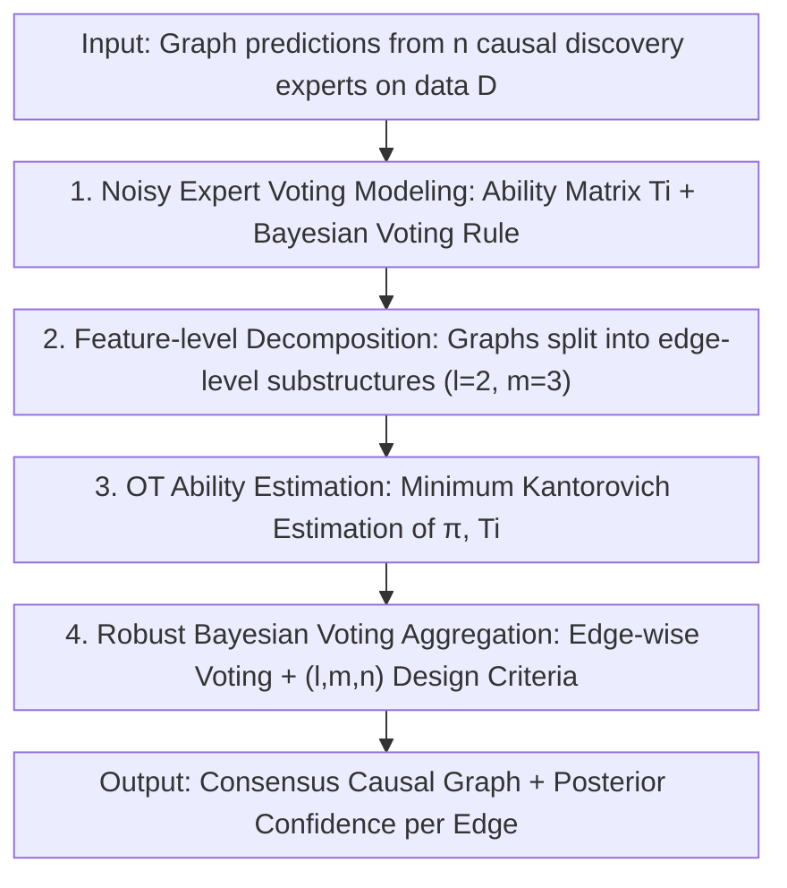

# Causal Discovery in the Wild: A Voting-Theoretic Ensemble Approach

**Conference**: ICLR2026  
**OpenReview**: [https://openreview.net/forum?id=WtbPaWO8lH](https://openreview.net/forum?id=WtbPaWO8lH)  
**Code**: https://github.com/isVy08/Causal-Bayes-Ensemble  
**Area**: Causal Discovery / Ensemble Learning / Voting Theory / Optimal Transport  
**Keywords**: Causal Discovery, Structure Ensemble, Bayesian Voting, Optimal Transport, Uncertainty Quantification

## TL;DR
This work treats multiple causal discovery algorithms as "fallible voting experts" and establishes a theoretically guaranteed weighted Bayesian voting framework for structural ensemble using voting theory. By decomposing graphs into edge-level substructures and estimating each expert's "ability matrix" via optimal transport, the approach is more robust and accurate than existing heuristic ensemble methods on both synthetic and real data, while providing explicit guidance on selecting ensemble size, ability, and diversity.

## Background & Motivation

**Background**: Causal discovery aims to recover the causal graph (DAG) among variables from observational data. Many algorithms have emerged over the years, such as constraint-based PC, score-based GES, continuous optimization-based NOTEARS/DAGMA, and functional-based LiNGAM/SCORE. However, different algorithms often produce drastically different graphs for the same dataset. To mitigate the instability of single algorithms, "ensemble-based causal discovery" has emerged: aggregating outputs from multiple algorithms (or multiple runs of the same algorithm on different data splits) into a consensus graph. This suppresses data perturbations and algorithmic fluctuations while providing an estimate of epistemic uncertainty.

**Limitations of Prior Work**: Existing structural aggregation methods are largely heuristic and lack theoretical support. They generally fall into two categories: **distance-based** (treating aggregation as clustering to find a central graph with "minimum distance" to all candidates) and **voting-based** (treating each algorithm as a voter and designing weighted rules to score candidate structures). In either case, the choice of distance measures or weighting schemes lacks theoretical justification, leaving it unclear how close the aggregated graph is to the true causal structure. Worse, there is no principled understanding of how key factors like ensemble size $n$, expert diversity, and individual performance affect aggregation accuracy; practitioners usually guess these parameters.

**Key Challenge**: Ensemble performance depends on "who is voting, what their weights are, and how many there are," but a bridge is missing between these design choices and the "final graph accuracy." Additionally, an often-ignored source of uncertainty is the origin of the candidate set itself. If the fixed data partition or finite runs change, will the ensemble result remain stable? Heuristic methods provide no insight into this.

**Goal**: (1) Provide a theoretically guaranteed voting framework for structure ensemble that characterizes when the aggregated graph equals the true causal graph; (2) Convert this guarantee into operable design criteria regarding expert quantity, ability, and diversity; (3) Solve the computational challenge of parameter (expert ability) estimation in an exponential graph space.

**Key Insight**: The authors rephrase the problem as a classic **noisy voting / multi-class classification** problem where $n$ "experts" each cast a vote from $|\mathcal{G}|$ candidate graphs. Each expert's prediction is a noisy version of the true graph passed through an "ability transition matrix" $T_i$. The goal is to recover the ground truth labels from these noisy votes. This perspective connects directly to the Condorcet Jury Theorem and Bayesian optimal voting (Nitzan & Paroush, 1982) in social choice theory, providing "optimal aggregation rules" with existing theoretical tools.

**Core Idea**: Use **Bayesian weighted voting rules** for structural aggregation, decompose the graph into **edge-level substructures** to make parameter estimation feasible, and use **optimal transport** to consistently estimate each expert's ability matrix. This replaces "ad-hoc heuristic aggregation" with "guaranteed voting theory."

## Method

### Overall Architecture

The core objective is to aggregate graph predictions from $n$ causal discovery algorithms on data $D$ into a consensus graph close to the truth, with theoretical guarantees and estimable parameters. The paper breaks this down into a clear pipeline: first, model each algorithm as a **fallible noisy expert** and derive the optimal Bayesian voting rule (with Theorem 1 providing probability bounds for recovery). Since the graph space is as large as $2^{\Theta(d^2)}$, direct estimation of ability matrices is infeasible; the work **decomposes graphs into edge-level substructures** (features) to perform voting and estimation independently on small state spaces. The experts' "ability" (transition matrix $T_i(\omega)$) per edge and the prior $\pi(\omega)$ are estimated via **minimum Kantorovich estimation under optimal transport** from repeated voting samples (Theorem 2 guarantees consistency). Finally, a **"noisy" Bayesian voting** is run using these parameters for edge-wise aggregation (Proposition 1 ensures robustness even with noisy parameters), complemented by **ensemble design criteria** for $(l,m,n)$.

### Key Designs

**1. Modeling Experts as Noisy Voters: Bayesian Weighted Voting Rule**

Addressing the lack of theoretical guarantees in heuristic aggregation, the authors first provide a generative characterization. Let the true graph index be 1. The $i$-th expert's estimate $\widetilde{G}_i$ is the result of applying a fixed but unknown **ability transition matrix** $T_i := [P(\widetilde{G}_i = G_j \mid G = G_k, D)]$ to the true graph. The diagonal element $p_{i,G_1} := T_{i,G_1|G_1}$ is the probability of "voting correctly." Under this model, the aggregate rule that minimizes error is the **Bayesian voting rule**: the score for a candidate graph $G$ is $S_{n,w_G}(\widetilde{G}) = \sum_{i=1}^{n} w_{i,G}\,\mathbb{1}[\widetilde{G}_i = G] + b_G$, where weights and biases are derived from the log-probabilities of expert correctness: $w_{i,G} = \log p_{i,G} - \log q_{i,\widetilde{G}_i|G}$, and $b_G = \sum_i \log q_{i,\widetilde{G}_i|G} + \log \pi_G$ (where $\pi_G$ is the ground truth prior). The final decision is $\widehat{G} = \arg\max_G S_{n,w_G}(\widetilde{G})$.

The value of this rule lies in its **probability guarantee for recovering the true graph**. Under assumptions of conditional independence (Assumption 1), bounded ability (Assumption 2), and "informative" experts (Condition 1), Theorem 1 states that the probability of correct collective decision from $n$ experts is at least:

$$1 - \sum_{j\ge 2} \exp\!\Big(-\,n \cdot \tfrac{\overline{\mathrm{KL}}_{1,j}^2}{2\tau^2}\Big),\quad \overline{\mathrm{KL}}_{1,j} = \tfrac{1}{n}\sum_{i=1}^n \mathrm{KL}\big(T_{i,|G_1};\, T_{i,|G_j}\big).$$

Error probability **decays exponentially with the number of experts $n$ and average informativeness** (measured by KL divergence between ground truth and false state rows). This connects design knobs like ensemble size and expert discriminability to aggregation accuracy via a clean exponential bound.

**2. Feature-level Decomposition: Reducing Dimensions via Edge Substructures**

Theorem 1 is elegant but impractical because the graph space is $2^{\Theta(d^2)}$. This design decomposes "recovering a whole graph" into "recovering a set of small substructures." The authors define a **feature level** $l$ as the number of nodes per group. In practice, the work uses **edge-level features**: $l=2$, where each node pair $(v_i, v_j)$ shares a state space $S = \{1: v_i\to v_j,\ 2: v_i\leftarrow v_j,\ 3: \text{no edge}\}$ of size $m=3$. Corollary 1 establishes that the aggregated graph matches the truth if and only if **voting decisions on every substructure are correct**. Proposition 1 further proves that even with noisy parameter estimates $\widetilde\pi, \widetilde T_i$, "noisy" Bayesian voting still yields the correct result with high probability as long as the total error across experts remains bounded.

**3. Estimating Expert Ability via Optimal Transport**

The final hurdle is estimating parameters $\theta(\omega) = (\pi(\omega), T_1(\omega), \dots, T_n(\omega))$ for each edge from data. Since the truth $Y(\omega)$ is a latent variable, the authors use **minimum Kantorovich estimation** (a form of OT-based minimum distance estimation). By drawing $N$ i.i.d. voting samples to form an empirical distribution $P_N$, they find parameters that minimize the OT distance to the model distribution: $\widehat\theta_N(\omega) = \arg\min_{\theta} W_c[P_N; P_\theta]$. Theorem 2 guarantees consistency: with **at least $(2m-1)$ informative experts** (i.e., 5 experts for $m=3$), the prior and ability matrices converge to true values **up to row permutations**. To resolve permutation indeterminacy, a **diagonal dominance** bias is applied (assuming experts are more likely to label a state correctly than incorrectly).

**4. Ensemble Design Criteria: Selecting $(l,m,n)$ and Two-stage Aggregation**

The theory is translated into practical guidelines. Parameter volume is $\binom{d}{l}\times(nm^2 - (n-1)m - 1)$, leading to three trade-offs: (a) **Keep state space small** ($l=2, m=3$) to avoid exponential error growth; (b) **Ensemble size $n$ is a double-edged sword** (theory suggests exponential gain, but practice requires more parameters and experts for identifiability); (c) **Expert heterogeneity $\tau$ matters**—if experts are poorly matched, "ensemble always beats individuals" fails. The authors recommend a **two-stage aggregation strategy**: aggregate across different algorithms first (via Plurality or Rank), then aggregate within each expert's internal multiple predictions via Bayes Est. **Rank + Bayes Est** is found to be the most effective and stable combination.

### Loss & Training
The core optimization objective is the minimum Kantorovich estimation $\widehat\theta_N(\omega) = \arg\min_{\theta(\omega)} W_c[P_N(X(\omega)\mid D);\, P_\theta(X(\omega)\mid D)]$ per feature. Search is restricted to diagonally dominant transition matrices. Using the likelihood-free OT formula and amortized optimization, parameters for all features and experts are solved jointly in a single training pass.

## Key Experimental Results

### Main Results

| Setting | Comparisons | Key Findings |
|------|---------|---------|
| Synthetic ($d=50$, $50n$ profiles, 3 ability tiers) | Bayes True / Best Expert / Plurality | With known parameters, Bayes True is optimal; Ours (Bayes Est) is second-best, approaching Bayes True as $n$ increases and significantly outperforming Plurality. |
| 9 Real Benchmarks (e.g., Sachs, Sangiovese, Child) | Plurality / Rank / Single Experts (DAGMA, PC, etc.) | Bayes Est matches or exceeds other ensemble methods with lower variance, approaching the level of the "best single expert" in heterogeneous cases. |

### Key Findings

- **Key Finding 1 (Robustness)**: Bayesian voting is optimal when parameters are known. Ours ("noisy" Bayes Est) is the robust runner-up. With informative experts, it approaches Bayes True as $n$ grows, significantly surpassing Plurality even with weak experts.
- **Key Finding 2 (vs. Single Experts)**: The advantage over single experts depends on ability variance $\tau$. In heterogeneous real-world cases, Bayesian voting weights experts by ability to match the best expert's performance—a vital insurance when the best expert is unknown.
- **Key Finding 3 (Implementation)**: For downstream causal tasks, **Rank + Bayes Est** is recommended. The posterior probabilities produced for each edge serve as a natural measure of predictive reliability.

## Highlights & Insights
- **Bridging Ensemble and Voting Theory**: The biggest leap is the paradigm shift—treating $n$ algorithms as $n$ noisy jurors allowed the adoption of social choice theory, providing the first exponential probability guarantee for structural recovery.
- **Connecting Design Knobs to Accuracy**: Theorem 1's bound $\exp(-n\overline{\mathrm{KL}}^2/2\tau^2)$ explicitly links ensemble size, discriminability, and heterogeneity to accuracy, offering actionable parameters.
- **Taming the Dimension Explosion**: The combination of feature decomposition and OT estimation reduces the $2^{\Theta(d^2)}$ problem into manageable $3\times3$ edge problems.
- **Built-in Uncertainty**: The posterior probabilities are a byproduct that can be used for uncertainty quantification or post-hoc DAG pruning.

## Limitations & Future Work
- **i.i.d. Voting Assumption**: Relies on bootstrap samples; violates IID in time-series (requires block bootstrap).
- **No Latent Confounders**: Current framework assumes sufficiency. Handling confounders would require $m\ge 4$ and more algorithms (~7).
- **Indeterminacy Bias**: Relies on "diagonal dominance"; may fail if experts are systematically biased towards wrong states.
- **No Explicit DAG Constraint**: Aggregation does not enforce acyclicity during optimization, though it is often maintained naturally; post-processing pruning is required for dense graphs.

## Related Work & Insights
- **vs. Distance-based Ensemble**: Replaces heuristic distances with principled voting rules.
- **vs. Heuristic Voting**: Provides theoretical weights (via KL informativeness) over ad-hoc ones.
- **vs. Bayesian Causal Discovery**: Offers an alternative route to uncertainty quantification without calculating full graph posteriors or making strong parameter assumptions.
- **vs. Single Algorithms**: Acts as a meta-method to stabilize and improve upon existing sate-of-the-art algorithms.

## Rating
- Novelty: ⭐⭐⭐⭐⭐ Systematically bridges voting theory and causal ensemble.
- Experimental Thoroughness: ⭐⭐⭐⭐ Extensive benchmarks and tiers, though numeric tables are mostly in the appendix.
- Writing Quality: ⭐⭐⭐⭐ Rigorous theoretical chain, though high entry barrier for non-theorists.
- Value: ⭐⭐⭐⭐⭐ Provides a guaranteed, deployable paradigm for "in the wild" causal discovery.

<!-- RELATED:START -->

## Related Papers

- [\[ICLR 2026\] Efficient Ensemble Conditional Independence Test Framework for Causal Discovery](efficient_ensemble_conditional_independence_test_framework_for_causal_discovery.md)
- [\[ICLR 2026\] Theoretical Guarantees for Causal Discovery on Large Random Graphs](theoretical_guarantees_for_causal_discovery_on_large_random_graphs.md)
- [\[CVPR 2026\] A Polynomial Chaos Framework for Causal Discovery in Nonlinear Uncertain Systems](../../CVPR2026/causal_inference/a_polynomial_chaos_framework_for_causal_discovery_in_nonlinear_uncertain_systems.md)
- [\[ICLR 2026\] Conditional Independent Component Analysis for Estimating Causal Structure with Latent Variables](conditional_independent_component_analysis_for_estimating_causal_structure_with_.md)
- [\[ICLR 2026\] Influence without Confounding: Causal Discovery from Temporal Data with Long-term Carry-over Effects](influence_without_confounding_causal_discovery_from_temporal_data_with_long-term.md)

<!-- RELATED:END -->
