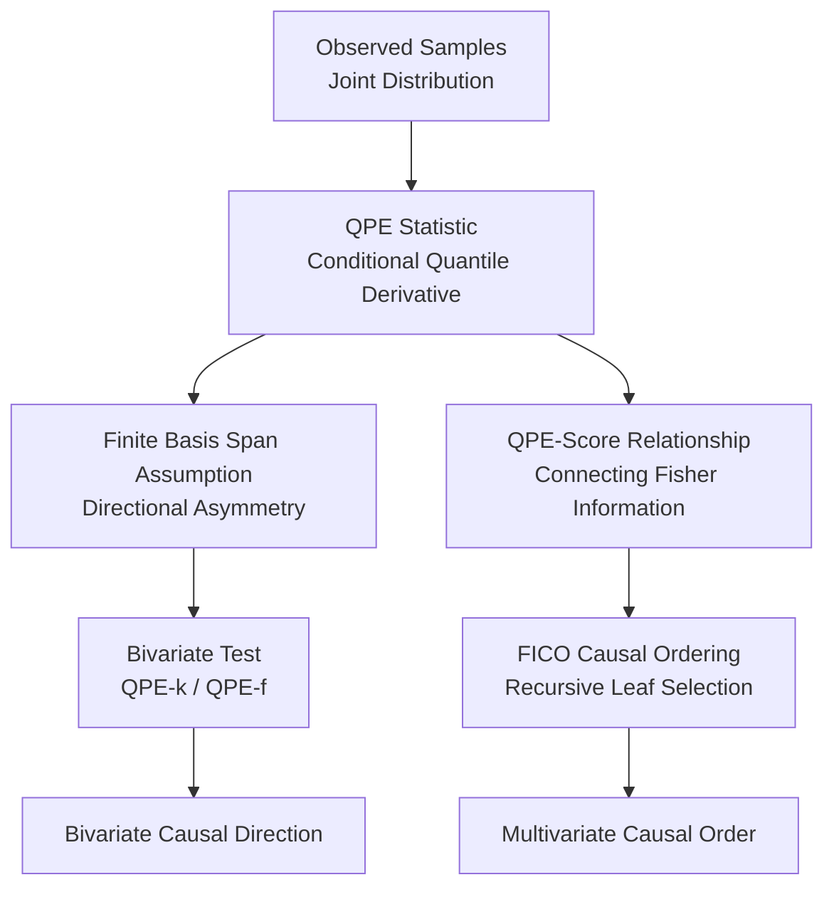

# Causal Discovery via Quantile Partial Effect

**Conference**: ICLR2026  
**OpenReview**: [https://openreview.net/forum?id=80vdaC5DsD](https://openreview.net/forum?id=80vdaC5DsD)  
**Code**: None  
**Area**: Causal Discovery / Causal Inference  
**Keywords**: Quantile Partial Effect, Bivariate Causal Discovery, Fisher Information, Causal Ordering, Observed Distribution  

## TL;DR
This paper utilizes the Quantile Partial Effect (QPE) from conditional quantile regression as a shape statistic of the observed distribution. It establishes identifiability for bivariate causal directions under a finite basis function span assumption and further connects QPE with the score function and Fisher information to derive FICO, an efficient non-parametric algorithm for multivariate causal ordering.

## Background & Motivation
**Background**: In continuous variable causal discovery, classical constraint-based and score-based methods often only recover Markov equivalence classes, requiring additional assumptions to orient edges. To distinguish cause from effect, subsequent works introduced Functional Causal Models (FCMs), such as LiNGAM, Additive Noise Model (ANM), Heteroscedastic Noise Model (HNM), and Post-Nonlinear (PNL) models, which create directional asymmetry by restricting mechanism functions or noise structures.

**Limitations of Prior Work**: While these FCM assumptions are theoretically elegant, their application requires reliance on a full set of latent generative processes: variables satisfying specific structural equations, noise independence from parents, monotonic mechanisms relative to noise, and Markov properties. In real-world data, these mechanism-level assumptions are difficult to verify and easily violated by latent confounding, non-monotonic mechanisms, or complex heteroscedasticity. Moreover, many methods rely on identifiability results built on non-observable counterfactual/noise mechanisms, even though they eventually test only observed samples.

**Key Challenge**: Causal identifiability requires asymmetry, but this asymmetry does not necessarily need to be formulated as "how the true mechanism looks." If the shape of the observed joint distribution is already asymmetric between $X \to Y$ and $Y \to X$, a more natural question arises: can a statistical object be defined directly at the observational level that captures the identifiable structures of models like ANM/HNM without assuming a specific noise mechanism?

**Goal**: The paper has two objectives. First, in bivariate or low-dimensional settings, to define QPE and prove that when the QPE in the true direction falls within the span of a given set of finite basis functions, the causal direction is typically identifiable from the observed distribution. Second, in multivariate settings where direct QPE estimation is difficult, to construct an easily computable causal ordering criterion by leveraging the relationship between QPE and the score function.

**Key Insight**: The authors start from the conditional quantile function. Given $Y|X=x$, the rate at which different quantiles change with $x$ describes how the conditional distribution shape is driven by the covariate: global shifts in location, scale stretching, and tail bending are all reflected in this rate. This "partial derivative of the quantile curve with respect to the covariate" is the QPE. It depends only on $p_{X,Y}$ or $p_{Y|X}$ but can reproduce causal velocity and structures of various FCMs.

**Core Idea**: Replace mechanism-level functional/noise assumptions with QPE at the observed distribution level. Formalize the requirement that "the conditional distribution shape changes simply enough in the true direction" as a finite basis function span assumption, then use basis function testing or Fisher information to infer causal directions and ordering.

## Method

### Overall Architecture
The overall architecture of this paper consists of two interconnected paths: first defining QPE in the bivariate scenario and proving that the finite basis span assumption yields identifiability, resulting in two bivariate algorithms (QPE-k and QPE-f). Second, utilizing the partial differential relationship between QPE and the score function in the multivariate scenario to bypass high-dimensional QPE estimation, instead using Fisher information to recursively identify leaf nodes, resulting in the FICO causal ordering algorithm.

The bivariate component takes paired samples $(x_i, y_i)$ as input and outputs a direction ($X \to Y$ or $Y \to X$). The multivariate component takes joint samples of $d$ variables and outputs a causal order, which can later be pruned into a DAG using conditional independence tests.

### Key Designs
**1. QPE Statistic: Recasting Mechanism Asymmetry as Distribution Shape Asymmetry**

QPE is defined via the conditional quantile function. Let $Q_{Y|X}(\tau|x)$ be the conditional quantile function of $Y|X=x$, and $\tau=F_{Y|X}(y|x)$. The paper defines:

$$
\psi_{Y|X}(y|x)=\nabla_x Q_{Y|X}(\tau|x).
$$

Intuitively, it asks: when the covariate $x$ changes slightly, where does the $Y$ value at the same conditional quantile move? In ANM, all quantile curves shift together, so QPE is constant with respect to $y$. In HNM, the scale also changes with $x$, making QPE an affine function of $y$. Thus, many constraints imposed by FCMs on mechanisms and noise can be translated into simple function forms of QPE relative to the effect variable $y$.

A key advantage is that QPE does not require prior knowledge of the true structural equations. Using the inverse relationship between the conditional CDF and the conditional quantile, the paper provides an equivalent expression:

$$
\psi_{Y|X}=-\frac{\nabla_x F_{Y|X}}{\partial_y F_{Y|X}}=-\frac{\nabla_x F_{Y|X}}{p_{Y|X}}.
$$

This demonstrates that QPE is purely an observational object. Although the authors prove it is equivalent to causal velocity under monotonic Markovian SCMs, QPE itself does not require assuming the existence of latent noise or counterfactual mechanisms. This step is the core repositioning: instead of explaining observed distributions from mechanisms, it extracts testable asymmetry from the shape changes of the observed distribution.

**2. Finite Basis Function Span Assumption: Testing "Simple Shapes" via Wronskian Conditions**

The primary identifiability assumption is that in the true direction, each QPE component, as a function of the effect variable, falls within the finite linear span of a set of known basis functions $\phi=(\phi_1, \dots, \phi_k)$:

$$
\psi_{Y|X,i}(\cdot|x) \in \mathrm{span}(\phi), \quad
\psi_{Y|X,i}(y|x)=\sum_{j=1}^k c_{i,j}(x)\phi_j(y).
$$

While abstract, this assumption covers familiar models: LiNGAM and ANM correspond to constant bases, HNM corresponds to affine bases like $\{1, y\}$, and PNL models can be expressed with finite bases given a transformation. Essentially, the authors generalize a suite of FCMs into the structural requirement that "QPE has low rank relative to the effect variable."

To transform this into a criterion depending only on the observed distribution, the paper utilizes the PDE relationship between QPE and the score function. If $\xi=\psi_{Y|X}$, then:

$$
\nabla_x \log p_{Y|X}+\xi \partial_y \log p_{Y|X}+\partial_y \xi=0.
$$

Substituting the finite basis form leads to a Wronskian determinant condition involving mixed second-order derivatives of the joint density and the Stein operator of the basis functions. Theorem 3.6 states that when the true direction satisfies the finite span assumption, this Wronskian must be zero; under certain linear independence and boundary conditions, the converse also holds. Consequently, identifiability no longer depends on "noise independence" or "mechanism monotonicity," but becomes a shape equation on the observed joint distribution.

**3. Bivariate QPE Tests: QPE-k Non-parametric Estimation and QPE-f Flow Accuracy**

Once it is established that the QPE in the true direction is more easily explained by the basis functions, the algorithm compares residuals in both directions: if $\psi_{Y|X}$ is closer to $\mathrm{span}(\phi)$, $Y$ is judged as the effect. The paper provides two implementations.

QPE-k uses kernel methods to estimate the conditional CDF directly. It approximates sample weights near $x$ with a Gaussian kernel and indicator functions $1(y_i \le y)$ with a sigmoid, yielding a smooth $\hat F_{Y|X}(y|x)$. Closed-form derivatives $\nabla_x \hat F_{Y|X}$ and $\partial_y \hat F_{Y|X}$ then provide $\hat\psi_{Y|X}$. The response matrix $\hat\Psi$ is constructed over test points $(x_t, y_m)$, and residuals are computed via least-squares projection onto the basis matrix $B$:

$$
\varepsilon_{X\to Y}=\frac{1}{d}\sum_i \left\|\hat\Psi_i-\hat\Psi_i B(B^\top B)^+ B^\top\right\|.
$$

QPE-f trains a causal flow $u_\theta(x, y)$ that maps observed variables to a standard normal latent space. Leveraging the equivalence of causal velocity and QPE, it calculates $\hat\psi_{Y|X}=\nabla_x u_\theta / \partial_y u_\theta$ via automatic differentiation, while a neural network models the coefficient functions $c_{i,j,\theta}(x)$ to minimize the gap between QPE and $C_\theta \phi^\top$. Compared to QPE-k, QPE-f is slower due to training but fits QPE shapes more accurately in high-density regions.

**4. Fisher Information Causal Ordering: Recursive Leaf Search without High-D QPE**

Directly estimating $\psi_{Y|X}$ in high dimensions suffers from the curse of dimensionality. The paper shifts to using the relationship between QPE and the score function to transform assumptions about QPE second moments into Fisher information relations. For the partial score $s_{X_i}=\partial_{x_i} \log p_X$, the Fisher information is $E[(s_{X_i})^2]$. The paper proves that under boundary conditions, the second moment of QPE, higher-order derivatives, and Fisher information satisfy an exact equality. Further, under Assumption 5.4, a variable's parents have larger Fisher information, allowing the variable with the smallest Fisher information to be treated as a leaf.

The FICO algorithm is simple: estimate the partial score for each variable in the current set $X^{(j)}$, select the variable with the minimum $E[(\partial_{x_i} \log p_{X^{(j)}})^2]$ as the leaf, place it at the end (or start) of the causal order, remove it, and recurse. While algorithmically equivalent to CaPS, FICO utilizes $E[(\partial_{x_i} \log p_X)^2]$ instead of $-E[\partial^2_{x_i} \log p_X]$, reducing the derivative order and computational cost.

### Main Results
The bivariate experiments cover 24 benchmarks. QPE-f generally achieves the best or tied-best accuracy. QPE-k is extremely fast but limited by kernel estimation precision. Selected results from Table 2:

| Method | AN | LS | SIM | SIM-c | Cha | Net | Per | Sig | Qd-V | NN-V | Tue | D4-s1 | Avg Time (s) |
|------|----|----|-----|-------|-----|-----|-----|-----|------|------|-----|-------|-----------|
| ANM | 0.43 | 0.46 | 0.45 | 0.49 | 0.41 | 0.47 | 0.49 | 0.44 | 0.49 | 0.48 | 0.65 | 0.50 | 0.250 |
| LOCI | 1.00 | 1.00 | 0.78 | 0.81 | 0.73 | 0.87 | 0.96 | 0.70 | 0.71 | 0.78 | 0.61 | 0.58 | 14.981 |
| CVEL | 1.00 | 0.98 | 0.63 | 0.72 | 0.68 | 0.62 | 1.00 | 0.84 | 0.91 | 0.87 | 0.64 | 0.67 | 1.597 |
| QPE-k | 0.99 | 1.00 | 0.83 | 0.79 | 0.60 | 0.89 | 0.77 | 0.89 | 0.42 | 0.53 | 0.54 | 0.58 | 0.009 |
| QPE-f | 1.00 | 1.00 | 0.88 | 0.88 | 0.85 | 0.86 | 1.00 | 0.90 | 0.91 | 0.90 | 0.70 | 0.79 | 7.804 |

For multivariate tasks, FICO is consistently faster than CaPS, with the gap widening at higher dimensions:

| Method | $d=5$ | $d=10$ | $d=20$ | $d=50$ | $d=100$ |
|------|-------|--------|--------|--------|---------|
| CaPS | 0.455 ± 0.037 | 1.074 ± 0.056 | 2.761 ± 0.285 | 10.822 ± 1.037 | 33.794 ± 3.501 |
| FICO | 0.425 ± 0.322 | 0.797 ± 0.364 | 1.727 ± 0.523 | 5.550 ± 0.943 | 13.538 ± 1.248 |

### Ablation Study
Rather than module removal, the ablation focuses on comparing QPE-k/f, hyperparameter sensitivity, and FICO vs. CaPS.

| Configuration | Key Metric | Description |
|------|---------|------|
| QPE-k | Avg Time 0.009s; high accuracy on AN/LS/SIM | Fast for bivariate screening but lacks precision in complex QPE scenarios (e.g., Qd-V) |
| QPE-f | Best accuracy across most datasets | Flow estimation of QPE is more accurate, providing advantages in non-ANM/HNM scenarios |
| FICO vs CaPS | $13.538s$ vs $33.794s$ at $d=100$ | Equivalent ordering logic, but Fisher information using first-order derivatives reduces load |

### Key Findings
- QPE-f's advantage stems from more accurate QPE estimation. It performs exceptionally well on Per, Sig, Qd-V, Rbf-V, and NN-V datasets where standard ANM/HNM assumptions may fail.
- QPE-k is a valuable baseline due to its speed (0.009s per pair), making it suitable for large-scale cause-effect pair filtering.
- FICO provides a theoretical explanation for why score-based causal ordering methods remain robust beyond ANM scenarios by linking them to QPE second moment conditions.

## Highlights & Insights
- "Dimension reducing" causal velocity into QPE is a significant theoretical contribution, showing that counterfactual velocity quantities can be expressed purely via conditional quantiles and CDFs.
- The finite basis span assumption provides a unified view: ANM, HNM, and some PNL models are specific cases where QPE maintains a low-rank structure relative to the effect variable.
- FICO's value lies in efficiency; by using first-order score squares for Fisher information, it avoids second-order derivatives, making high-dimensional ordering more practical.

## Limitations & Future Work
- Bivariate identifiability depends on the pre-defined basis set $\phi$. If the true QPE is not in the span, or if the reverse direction also satisfies it, the method loses discriminative power.
- QPE-f relies on flow training and hyperparameter selection. Performance varies with transformation types and layers, suggesting a need for automated tuning.
- FICO's Assumption 5.4 is most intuitive in heteroscedastic Gaussian cases; its interpretability and verifiability in general distributions require further exploration.
- Multivariate results on real-world datasets like Sachs remain relatively weak for score-based methods, indicating sensitivity to latent confounding or measurement noise.

## Related Work & Insights
- **vs ANM/HNM/PNL**: Instead of mechanism-specific noise forms, this work uses distribution shape (QPE) to unify multiple models.
- **vs Causal Velocity (CVEL)**: While CVEL uses counterfactual flows, this paper proves their equivalence to QPE in certain conditions and emphasizes QPE's purely observational nature.
- **vs CaPS**: FICO is algorithmically similar but theoretically more general (QPE-based) and computationally more efficient (first-order derivatives).

## Rating
- Novelty: ⭐⭐⭐⭐⭐ Unifying FCM, causal velocity, and Fisher information via QPE and observed shape statistics is highly innovative.
- Experimental Thoroughness: ⭐⭐⭐⭐ Broad coverage of bivariate/multivariate benchmarks, though real-world performance remains a challenge.
- Writing Quality: ⭐⭐⭐⭐ Clear theoretical chain, though the Wronskian/PDE sections require a strong mathematical background.
- Value: ⭐⭐⭐⭐⭐ Provides a path from mechanism-based assumptions to testable observational shape assumptions.

<!-- RELATED:START -->

## Related Papers

- [\[ICLR 2026\] Beyond DAGs: A Latent Partial Causal Model for Multimodal Learning](beyond_dags_a_latent_partial_causal_model_for_multimodal_learning.md)
- [\[ICLR 2026\] Direct Doubly Robust Estimation of Conditional Quantile Contrasts](direct_doubly_robust_estimation_of_conditional_quantile_contrasts.md)
- [\[ICLR 2026\] Causal Discovery in the Wild: A Voting-Theoretic Ensemble Approach](causal_discovery_in_the_wild_a_voting-theoretic_ensemble_approach.md)
- [\[ICLR 2026\] Independence Test for Linear Non-Gaussian Data and Applications in Causal Discovery](independence_test_for_linear_non-gaussian_data_and_applications_in_causal_discov.md)
- [\[ICLR 2026\] Theoretical Guarantees for Causal Discovery on Large Random Graphs](theoretical_guarantees_for_causal_discovery_on_large_random_graphs.md)

<!-- RELATED:END -->
