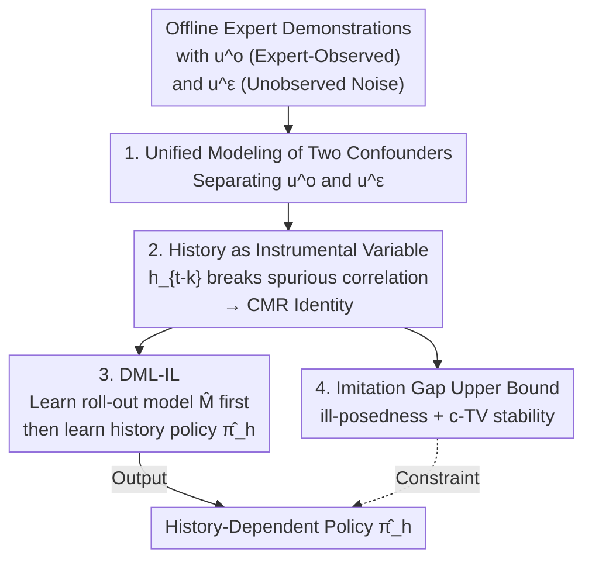

# Causal Imitation Learning under Expert-Observable and Expert-Unobservable Confounding

**Conference**: ICLR 2026  
**OpenReview**: [https://openreview.net/forum?id=WSCN3Jkebv](https://openreview.net/forum?id=WSCN3Jkebv)  
**Code**: To be confirmed  
**Area**: Causal Inference / Imitation Learning  
**Keywords**: Imitation Learning, Hidden Confounding, Instrumental Variables, Conditional Moment Restriction, Double Machine Learning

## TL;DR
This paper proposes a unified causal imitation learning framework that simultaneously models two types of hidden confounding: "observable by the expert but not the imitator" and "unobservable by both." By utilizing $k$-step trajectory history as an instrumental variable (IV), the problem is reformulated as a Conditional Moment Restriction (CMR) problem. The authors introduce the DML-IL algorithm with imitation gap upper bound guarantees, which outperforms existing causal IL baselines on continuous control tasks such as MuJoCo under confounding.

## Background & Motivation
**Background**: Imitation Learning (IL) aims to learn a policy from expert demonstrations that replicates expert behavior. While classical theory suggests that IL error should vanish with infinite data, in practice, Behavioral Cloning (BC) often learns suboptimal or even dangerous policies. Prior work attributes these failures to seemingly disparate causes: spurious correlations, sequential noise, expert-exclusive privileged information, and causal delusion—all of which are essentially **confounding variables** unobserved by the imitator.

**Limitations of Prior Work**: Previous works almost always **address these issues in isolation**. One category (Vuorio et al. 2022; Swamy et al. 2022a) only handles latent contexts that "the expert can see but the imitator cannot," often requiring interactive algorithms like DAgger to query the expert online. Another category (Swamy et al. 2022b, ResiduIL) only addresses confounding noise that "the expert themselves cannot see," which corrupts the demonstrations. In reality, both types of confounding often **co-exist**, and addressing only one leads to failure.

**Key Challenge**: The root cause is that "unobserved things are diverse and possess different properties." Expert-observable confounding $u^o_t$ is private information used by the expert for decision-making and must be recovered for effective imitation. Expert-unobservable confounding $u^\varepsilon_t$ is noise unknown even to the expert that pollutes demonstration actions, creating spurious correlations between states and actions. A method that conflates the two without distinction fails to both complete the expert's private information and break spurious correlations.

**Goal**: Under the offline setting with **only a fixed set of demonstrations and no online expert queries**, construct a framework that accommodates both types of hidden confounding and learns a policy as close to the expert as possible.

**Key Insight**: The authors observe that while the spurious correlation created by $u^\varepsilon_t$ makes it impossible to directly identify "what the expert would do given state $s_t$," **confounding noise separated by a sufficient distance is typically independent** (e.g., wind or fluctuating operating costs decay over time or are eventually observed). This turns "sufficiently old history" into a **clean instrumental variable**—it is uncorrelated with current noise but remains correlated with the current state.

**Core Idea**: Use the $k$-step trajectory history $h_{t-k}$ as an instrumental variable to break the spurious correlation caused by $u^\varepsilon_t$; simultaneously, make the policy **history-dependent** to infer information about $u^o_t$ from the history. This reformulates the causal IL problem into a Conditional Moment Restriction (CMR) problem with established solutions.

## Method

### Overall Architecture
The objective is: given a set of offline expert demonstrations $(s_1,a_1,\dots,s_T,a_T)$ corrupted by two types of hidden confounding, learn a **history-dependent** imitation policy $\pi_h: H \to \Delta(A)$ that approximates the expert in the confounded environment. The process follows three steps: ① Formalize the MDP with hidden confounding, clarifying how $u^o_t$ (expert-observable) and $u^\varepsilon_t$ (expert-unobservable, additive noise) individually affect transitions and actions; ② Under the assumptions of a "confounding noise horizon $k$ + additive noise," use $h_{t-k}$ as an IV to simplify learning $\pi_h$ into a CMR identity $E[a_t - \pi_h(h_t)\mid h_{t-k}]=0$; ③ Use the DML-IL algorithm (a two-stage process: learn the roll-out model, then the history-dependent policy) to solve the CMR and prove an imitation gap upper bound.

The learning objective is not the expert policy $\pi_E$ itself (which is unidentifiable without $u^o_t$), but its conditional expectation over history $\pi_h(h_t):=E[\pi_E(s_t,u^o_t)\mid h_t]$—the best prediction possible given the history in a least-squares sense.

### Key Designs

**1. Unified Modeling of Two Hidden Confounders: Separating "Expert-Observable" and "Expert-Unobservable"**

Previous methods treated all unobserved variables uniformly, leading to sub-optimal results. This paper explicitly splits the hidden confounding $u_t$ at each time step into $u_t=(u^o_t, u^\varepsilon_t)$: $u^o_t$ is private information the expert sees (e.g., seasonal demand in airline pricing), affecting expert actions $a_t$, the next state $s_{t+1}$, and the reward $r_t$; $u^\varepsilon_t$ is confounding noise unknown even to the expert (e.g., fluctuating operating costs) that affects states and actions but **does not enter the reward**—since the expert does not account for it in decision-making, its inclusion in reward would only add noise to expected returns. This distinction is critical: recovering $u^o_t$ requires history inference, while breaking $u^\varepsilon_t$ requires instrumental variables.

**2. History as Instrumental Variable: Reformulating Causal IL as a CMR Problem**

Direct Behavioral Cloning fails because $a_t=\pi_E(s_t,u^o_t)+u^\varepsilon_t$, leading to $E[a_t\mid h_t]=\pi_h(h_t)+E[u^\varepsilon_t\mid h_t]$, where $E[u^\varepsilon_t\mid h_t]\neq 0$. Consequently, the BC policy is **biased**. The breakthrough lies in two structural assumptions: **Confounding Noise Horizon** (Assumption 3.2, $u^\varepsilon_t \perp u^\varepsilon_{t-k}$, independence of noise $k$ steps apart) and **Additive Noise** (Assumption 3.3). Given these, taking $h_{t-k}$ as an IV and applying the conditional expectation to $E[a_t\mid h_t]$ eliminates the noise term $E[u^\varepsilon_t\mid h_{t-k}]=E[u^\varepsilon_t]=0$. Learning $\pi_h$ simplifies to solving:

$$E[a_t - \pi_h(h_t)\mid h_{t-k}]=0,$$

which is a standard CMR problem ($a_t$ and $h_t$ are observable, $h_{t-k}$ is the instrument). Note that as $k$ increases, the correlation between $h_{t-k}$ and $h_t$ weakens, making the instrument "weaker" and identification harder.

**3. DML-IL: Two-Stage Double Machine Learning for CMR**

Directly minimizing the CMR error $\lVert E[a_t-\hat\pi_h(h_t)\mid h_{t-k}]\rVert_2$ involves nested estimation of conditional expectations, which converges slowly. DML-IL draws from DML-IV in regression to ensure fast convergence via a two-stage structure: **Stage 1** learns a roll-out model $\hat M$ (e.g., a Gaussian Mixture Model) that **generates** $k$-step future trajectories $\hat h_t$ and actions $\hat a_t$ given $h_{t-k}$ by fitting maximum log-likelihood; **Stage 2** fixes $\hat M$ and trains a neural network policy $\hat\pi_h$ to minimize the mean squared error on generated actions $\lVert \hat a_t-\hat\pi_h(\hat h_t)\rVert^2$. Using "generated" trajectories is key: the real future history following $h_{t-k}$ is still contaminated by $u^\varepsilon_t$, but rolling out from $h_{t-k}$ strips this dependence.

**4. Imitation Gap Upper Bound: Unifying Prior Results with ill-posedness and c-TV Stability**

The authors prove an upper bound for the imitation gap $J(\pi_E)-J(\hat\pi_h)$ for the learned policy $\hat\pi_h$. Control is required over three factors: (i) the amount of information about $u^o_t$ recoverable from history (total variation distance $\delta$ between $u^o_t$ and $E[u^o_t\mid h_t]$); (ii) the **ill-posedness** of the CMR $\nu(\Pi,k)=\sup_{\pi}\frac{\lVert\pi_E-\pi\rVert_2}{\lVert E[a_t-\pi(h_t)\mid h_{t-k}]\rVert_2}$, measuring instrument strength; and (iii) noise perturbations on states/actions, characterized by **c-TV stability**. Theorem 4.5 gives:

$$J(\pi_E)-J(\hat\pi_h)\le T^2\big(c\,\varepsilon\,\nu(\Pi,k)+2\delta\big)=O\big(T^2(\delta+\varepsilon)\big),$$

where $\varepsilon$ is the CMR learning error. This $T^2$ scaling is expected for IL without interactive experts. It subsumes prior results as **special cases**: if $u^o_t=0$, it reduces to Swamy et al. 2022b; if $u^\varepsilon_t=0$, it concretizes the abstract bound of Swamy et al. 2022a.

## Key Experimental Results

### Main Results
Evaluations were performed on a custom airline pricing toy environment and three modified MuJoCo tasks (Ant, Half Cheetah, Hopper) where target velocities serve as $u^o$ and wind noise as $u^\varepsilon$. Training used 20,000 samples. Rewards are normalized (1 = expert, 0 = random). Baselines include BC, BC-SEQ (handles only $u^o$), and ResiduIL (handles only $u^\varepsilon$).

| Environment | Method | MSE (Lower is better) | Avg Reward (Higher is better) |
|------|------|------|------|
| Pricing / MuJoCo | **DML-IL (Ours)** | Lowest | Highest, closest to expert |
| Pricing / MuJoCo | ResiduIL | Mid (breaks $u^\varepsilon$) | Mid (fails to recover $u^o$) |
| Pricing / MuJoCo | BC-SEQ | High | Near random |
| Pricing / MuJoCo | BC | High | Near random |

### Ablation Study
The core ablation varies the noise horizon $k$ (from 1 to 20) to verify the theory that instrument strength decays with $k$.

| Configuration | Key Observation | Explanation |
|------|---------|------|
| $k=1$ | DML-IL lowest MSE, highest reward | Strongest instrument; handles $u^\varepsilon$ and $u^o$ well |
| $k$ increases | DML-IL performance monotonically drops | Instrument weakens; less $u^o$ info recovered from $h_{t-k}$ |
| $k=20$ | DML-IL ≈ ResiduIL | $h_{t-20}$ tells nothing about current $u^o$; reduces to only breaking noise |

### Key Findings
- **Partial solutions fail**: BC-SEQ and BC both fail in the presence of $u^\varepsilon$, showing that inferring $u^o$ is useless without breaking noise correlations. ResiduIL reduces MSE but cannot recover $u^o$, leaving a reward gap. Both types of confounding must be addressed.
- **$k$ as a complexity knob**: As $k$ increases, DML-IL performance decays toward ResiduIL levels, aligning with Theoretical Proposition 4.3 and Theorem 4.5.
- **High MSE isn't always bad**: When $u^\varepsilon$ is explicitly handled, the imitator should not fit the noise-corrupted actions of the demonstrator. Thus, a "correct" method might exhibit higher MSE relative to noisy labels—a useful diagnostic signal noted by the authors.

## Highlights & Insights
- **Unified Causal Framework**: Consolidates disparate IL failures (causal delusion, spurious correlation, private info) into a single framework by splitting $(u^o_t,u^\varepsilon_t)$.
- **History as IV**: A clever, transferable trick. If confounding noise becomes independent over time, old history serves as a clean instrument for any sequential decision-making task with temporal confounding.
- **Theory-Experiment Alignment**: The monotonic increase of ill-posedness with $k$ is not just an after-the-fact explanation but a theoretical prediction confirmed by experiments.

## Limitations & Future Work
- **Strong Assumptions**: Additive noise and known $k$ are the costs of identifiability. The authors admit this may not apply to nonlinear confounding typical in fields like medicine.
- **Instrument Validity**: The algorithm requires $k$ to be known or bounded, but $k$ cannot always be directly verified from data, requiring indirect conditional independence tests.
- **Identifiability Limits**: The method identifies the history-dependent policy $\pi_h$, but the expert's private $u^o_t$ remains intrinsically unobservable.

## Related Work & Insights
- **vs Swamy et al. 2022a (BC-SEQ)**: They only handle $u^o$ and often require interactive experts. Ours handles $u^\varepsilon$ and is purely offline.
- **vs Swamy et al. 2022b (ResiduIL)**: They only handle $u^\varepsilon$ for history-independent policies. Ours recovers $u^o$ info via history dependence, achieving higher rewards.
- **vs Ruan et al. 2024 (Robust IL)**: They prove exact imitation is impossible without extra assumptions and focus on robust intervals. Ours uses structural assumptions (additive noise) to achieve point identification of $\pi_h$.

## Rating
- Novelty: ⭐⭐⭐⭐⭐ Unified framework; framework-level contribution.
- Experimental Thoroughness: ⭐⭐⭐⭐ Good coverage; $k$-scan confirms theory, though lacks real-world datasets.
- Writing Quality: ⭐⭐⭐⭐⭐ Logical flow from assumptions to bounds.
- Value: ⭐⭐⭐⭐ Solid theory and algorithm for offline confounded IL, though limited by structural assumptions.

<!-- RELATED:START -->

## Related Papers

- [\[ICLR 2026\] Efficient and Sharp Off-Policy Learning under Unobserved Confounding](efficient_and_sharp_off-policy_learning_under_unobserved_confounding.md)
- [\[ICML 2026\] From Observation to Intervention: A Causal Audit of Expert Importance in Mixture-of-Experts Models](../../ICML2026/causal_inference/from_observation_to_intervention_a_causal_audit_of_expert_importance_in_mixture-.md)
- [\[ICLR 2026\] Learning Dynamic Causal Graphs Under Parametric Uncertainty via Polynomial Chaos Expansions](learning_dynamic_causal_graphs_under_parametric_uncertainty_via_polynomial_chaos.md)
- [\[ICLR 2026\] Coarse-to-Fine Learning of Dynamic Causal Structures](coarse-to-fine_learning_of_dynamic_causal_structures.md)
- [\[ICLR 2026\] Influence without Confounding: Causal Discovery from Temporal Data with Long-term Carry-over Effects](influence_without_confounding_causal_discovery_from_temporal_data_with_long-term.md)

<!-- RELATED:END -->
