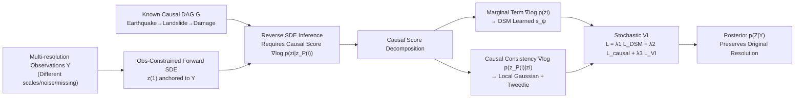

# Causal Score Conditioning for Multi-Resolution Latent Systems

**Conference**: ICLR 2026  
**OpenReview**: [https://openreview.net/forum?id=M4Z2A1jYpU](https://openreview.net/forum?id=M4Z2A1jYpU)  
**Code**: [https://github.com/PaperSubmissionFinal/ICLR2026](https://github.com/PaperSubmissionFinal/ICLR2026)  
**Area**: Causal Inference / Probabilistic Methods (Score-based Diffusion + Probabilistic Graphical Models)  
**Keywords**: causal graphical model, score-based diffusion, multi-resolution inference, variational inference, Markov blanket, disaster modeling

## TL;DR
This paper proposes SVGDM, which embeds score-based diffusion into causal directed graphs. By utilizing "causal score decomposition," it enables information propagation along causal edges across observations with different resolutions and noise levels. This allows for the joint inversion of multiple interdependent latent variables (e.g., earthquake → landslide → building damage) under heterogeneous and incomplete observations.

## Background & Motivation
**Background**: In complex systems such as Earth systems, epidemics, and climate, multiple latent variables influence each other through known physical causal mechanisms. Observational data—originating from remote sensing, InSAR, radar, or optical imagery—inherently possess varying spatial resolutions (30 m to 5 km), temporal frequencies, and noise characteristics. Machine learning is widely employed to invert the spatio-temporal states of these latent variables.

**Limitations of Prior Work**: Dominant multimodal or multi-source fusion methods rely on three assumptions often violated in reality: (1) variables have explicit closed-form dependencies; (2) observation quality is uniform (homogeneous resolution, modality, and noise); and (3) all variables are observable. At the methodological level, three major flaws exist: treating causally related variables as independent (thus losing causal information), failing to integrate multi-resolution observations effectively (often resorting to downsampling high-resolution data to a uniform scale, which erases detail), and lacking a theoretical characterization of cascaded approximation errors. A few works using diffusion to assimilate multi-resolution data are restricted to single-variable systems.

**Key Challenge**: To jointly invert multiple latent variables, the system must allow variables with high-quality observations to "compensate" for variables with low-quality observations (requiring information to flow across variables and scales) while preserving the original resolution of each observation. However, because causal paths and diffusion processes are coupled, direct posterior inference on a large number of latent variables is computationally infeasible.

**Goal**: Given a known (or partially known) causal DAG, estimate the posterior $p(Z|Y)$ of multiple causally related physical processes from multi-resolution, non-uniform, and incomplete observations. The approach must preserve original resolutions, leverage causal dependencies for information propagation, and provide theoretical guarantees for inference quality.

**Core Idea** (**Causal Score Decomposition + Observation-Constrained Diffusion**): Diffusion is selected because its forward SDE naturally encodes scale-dependent noise (where coarser resolution corresponds to higher noise), a feature that normalizing flows and standard variational inference cannot capture. The global score is then locally decomposed along the "causal blanket" (i.e., causal parents) of the graph, ensuring that the reverse SDE for each variable depends only on its own local score and those of its parents.

## Method

### Overall Architecture
SVGDM assigns an observation-constrained forward SDE to each latent variable $z_i$, anchoring $z(1)$ to the observation (unlike classical DDPM which collapses to $\mathcal{N}(0,I)$). Inference is performed via a reverse SDE, where the core of the drift term is the "causal score" $\nabla_{z_i}\log p_t(z_i|z_{P(i)})$. The methodology focuses on computing this causal score: it is first localized using the Markov blanket (Thm 2), then decomposed into a marginal term and a causal consistency term (Prop 1). The marginal term is learned via a network using Denoising Score Matching (DSM), while the causal consistency term is calculated using a local Gaussian approximation and the Tweedie formula (Thm 3). Finally, these are integrated into a stochastic variational inference objective for unified training.

### Key Designs

**1. Node-level Causal SDEs with Observation Constraints: Facilitating cross-variable and cross-resolution information flow.** The system defines an SDE with causal parent dependency for each node $i$: $dz_i(t)=f_i(z_i,z_{P(i)},t)dt+g_i(t)dW_i(t)$, where the Brownian motions of each node are independent. Thm 1 proves that this system has a unique strong solution and that the infinitesimal generator of the joint process can be decomposed as $L_t=\sum_i L_{i,t}$, where each local operator depends only on $z_i$ and its parents. Note that this is "locality of the generator" rather than conditional independence of $p_t$, as diffusion dynamics introduce additional dependencies at $t>0$. The authors explicitly treat this decomposition as an architectural prior. To incorporate heterogeneous observations, a term $\sum_k \lambda_{i,k}(t)[\phi_i^k(y_i^k,z_{P(i)})-z_i(t)]$ is added to the drift: $\phi_i^k$ maps observations of resolution $k$ back to the latent space, and $\lambda_{i,k}(t)$ controls the influence of that resolution. This is key to "preserving original resolution"—observations of different scales enter the same SDE through their respective $\phi_i^k$ without requiring prior downsampling alignment.

**2. Causal Score Decomposition via Markov Blanket: Localizing the global score into computable terms.** The reverse SDE (Lemma 1) requires the causal score $\nabla_{z_i}\log p_t(z_i|z_{P(i)})$, but the global score is computationally intractable. Drawing from the idea that global scores can be localized via Markov blankets in sequential diffusion, the authors treat causal parents $P(i)$ as the "causal blanket" for $z_i$. Via causal Markov properties $z_i \perp \text{NonDescendants}(z_i)\mid P(i)$, Thm 2 shows that the causal blanket relationship is approximately maintained after diffusion perturbation: $\nabla_{z_i}\log p_t(z_{1:N})\approx \nabla_{z_i}\log p_t(z_i,z_{P(i)})$. The approximation becomes exact as $t\to 0$, and for $t>0$, the error varies with noise $\sigma(t)$ and causal dependency strength. Further, Prop 1 splits it into two terms: $\nabla_{z_i}\log p_t(z_i|z_{P(i)})=\nabla_{z_i}\log p_t(z_i)+\nabla_{z_i}\log p_t(z_{P(i)}|z_i)$. The former is the marginal score (absorbing direct evidence from all resolution-specific observations), while the latter is the "causal consistency term"—it ensures that updates to $z_i$ remain compatible with the joint distribution of its parents, allowing observations of parent variables to inform child variables along causal paths.

**3. Estimating Scores via DSM and Local Gaussian + Tweedie.** The marginal term $\nabla_{z_i}\log p_t(z_i)$ is estimated by a neural network $s_{\psi_i}$ trained with continuous-time denoising score matching, where the objective is $L_{\text{DSM},i}=\mathbb{E}[\lambda(t)\|s_{\psi_i}(z_i(t),t)-\nabla_{z_i}\log p_t(z_i(t)|z_i(0))\|^2]$. Prop 2 ensures its global minimum is the true score. The causal consistency term uses a local Gaussian approximation $z_{P(i)}(t)|z_i(t)\sim\mathcal{N}(\mu_c(\hat z_i(t)),\Sigma_c)$, where the posterior mean $\hat z_i(t)$ is provided by the Tweedie formula $\hat z_i(t)=z_i(t)+\sigma_i(t)^2 s_{\psi_i}(z_i(t),t)/\mu_i(t)$, with derivatives obtained via the chain rule. Thm 3 provides validity conditions for this approximation (local log-concavity, diffusion noise dominating high-order non-linearity $\sigma(t)^2\gg\|\nabla^3\log p_t\|_\infty$, and bounded Tweedie reconstruction error) and an error bound of $O(\delta^2+\sigma(t)^{-2})$. It is most accurate in early low-noise stages and degrades gracefully as $t\to 1$; adaptive regularization $\lambda_{\text{reg}}\|\nabla\mu_c\|_F^2$ is added when conditions are violated. Although the theory uses Gaussian/log-concave assumptions for analysis, the implementation is robust even under heavy-tailed or skewed noise.

**4. Unified Training with SVI and Cascaded Error Analysis.** Given the learned reverse SDE, the variational posterior $q_\psi(Z|Y)$ is implicitly defined by the reverse SDE with the posterior score $\nabla_{z_i}\log q_{\psi,t}=s_{\psi_i}+\nabla_{z_i}\log p(Y|Z)$. The ELBO is obtained via Jensen's inequality, where entropy terms are computed using the normalizing flow Jacobian of the reverse SDE combined with Hutchinson trace estimation. The total objective is $L_{\text{total}}=\lambda_1\sum_i L_{\text{DSM},i}+\lambda_2\sum_i L_{\text{causal}}+\lambda_3\hat L_{VI}$. Section 4 provides a cascaded error analysis, categorizing errors into five types (Euler-Maruyama discretization $\varepsilon_1=O(\Delta t^{1/2})$, neural score $\varepsilon_2=O(1/\sqrt N+\lambda_{\text{reg}})$, local Gaussian $\varepsilon_3$, Tweedie $\varepsilon_4=O(\sigma(t)^2\varepsilon_2)$, and KDE entropy $\varepsilon_5$). Thm 4 gives a total error bound including cross-terms $O(\varepsilon_2\varepsilon_3)$, noting that the interaction between score estimation and Gaussian modeling is the most critical. The iterative training strategy (training scores first, then refining causal parameters) is designed to prevent catastrophic error accumulation, with Thm 5 guaranteeing $q_\psi\to p(z|y)$ as each $\varepsilon_i\to 0$.

## Key Experimental Results

### Main Results (Synthetic Data, 3-Node Causal System)
Latent variable reconstruction errors under three observation scenarios (mean ± std, lower is better); VFO is optimal, with systematic degradation from VFO→LFO→LPO, validating that the causal structure successfully propagates information between variables of varying quality.

| Scenario | Variable | MAPE | NRMSE | CRPS |
|------|------|------|-------|------|
| VFO (Var.-Res Full Obs.) | z1 | 0.0526 | 0.0683 | 0.0396 |
| | z2 | 0.0991 | 0.1239 | 0.0756 |
| | z3 | 0.0763 | 0.1031 | 0.0567 |
| LFO (Low-Res Full Obs.) | z1 | 0.0756 | 0.0922 | 0.0572 |
| | z3 | 0.1451 | 0.1814 | 0.1088 |
| LPO (Low-Res Partial Obs.)| z1 | 0.1067 | 0.1227 | 0.0810 |
| | z3 | 0.1961 | 0.2228 | 0.1515 |

Comparison with baselines: SVGDM outperforms domain-specific methods (VBCI, DisasterNet) by 2−3× and general variational inference methods by 10−20×. VI baselines show MAPE > 60%, highlighting the necessity of internalizing causal structure.

### Real-world Disaster Systems
- **Multi-Hazard Earthquake Assessment** (Joint estimation of landslide zLS, liquefaction zLF, and building damage zBD): For the 2020 Puerto Rico earthquake, AUROC reached 0.9331 / 0.9317 / 0.9512 across the three hazards, a 14–21% improvement over VI baselines (BBVI, ADVI, NUTS). 2021 Haiti earthquake achieved AUROC 0.9550 (landslide) / 0.9587 (damage); 2023 Turkey-Syria achieved 0.9488 (damage).
- **Wildfire Spread Prediction** (Spatio-temporal binary classification): F1 = 0.5913, AP = 0.4430, outperforming logistic regression and deep baselines like U-Net, ConvLSTM, and UTAE.

### Ablation Study
- **Loss Component Ablation**: Removing either the local DSM score, the causal blanket score, or the observation consistency term leads to consistent performance degradation.
- **Scalability**: Precision remains stable with 10–15 latent variables under sparse/dense causal graphs; runtime scales approximately linearly with the number of causal edges $|E|$.
- **Multi-view VAE Comparison** (JMVAE / MMVAE / MoPoE-VAE, which treat observations as views of a single shared latent): SVGDM achieves significantly lower NRMSE and MAPE on all latent variables, quantifying the accuracy lost when collapsing causally linked multi-resolution physical processes into a single shared latent variable.
- **Key Findings**: Causal structure is the dominant factor in performance (VI without causal info collapses to MAPE > 60%). The local Gaussian approximation causes only slight degradation under heavy-tailed/skewed noise, proving the theoretical assumptions are sufficient but not strictly required for stability.

## Highlights & Insights
- **Migration of "Causal Blanket" from Sequential Diffusion to General Causal DAGs**: Using causal parents as a Markov blanket for local score decomposition provides a clean interface between probabilistic graphical models and score-based diffusion. This keeps computational complexity scaling with causal edges rather than explosively with the number of variables.
- **Distinction Between Generator Locality and Conditional Independence**: The authors clearly state that $p_t$ is no longer strictly factorized at $t>0$. Treating the generator decomposition as an architectural prior rather than an exact property makes the theoretical claims more rigorous than works claiming diffusion preserves conditional independence.
- **Proper Application of Diffusion**: Forward SDEs encode scale-dependent noise, which perfectly aligns with the physical reality in remote sensing where coarser resolution correlates with stronger speckle, atmospheric delay, or resampling artifacts. This represents a substantive advantage over normalizing flows.
- **Comprehensive Cascaded Error Analysis**: By defining five types of approximation error and identifying critical cross-terms, the paper closes the loop between theory and engineering through its specific training sequence.

## Limitations & Future Work
- **Dependency on Known Causal Structure**: The method assumes the DAG is known; it is not directly applicable when the topology must be inferred from data. Future work could integrate joint structure discovery.
- **Fragility of Local Gaussian Approximation**: Under strong non-linearity that violates log-concavity, the approximation may degrade, necessitating more flexible approximation families.
- **Scalability Ceiling**: While linear with edges, complexity still poses challenges for extremely large systems.
- **Static Causality**: Current causal relationships are static; extending this to time-varying causal relationships remains an open direction.
- **Domain Specificity**: While results in earthquakes and wildfires are strong, causal graphs were derived from mature domain knowledge; performance in areas with unclear mechanisms (e.g., finance or early-stage epidemics) is unknown.

## Related Work & Insights
- **Score-based Diffusion / Inverse Problem Solving**: Builds on Song & Ermon (2019), Song et al. (2020b), and uses posterior sampling tools similar to Chung et al. (2022) and the Tweedie formula (Efron 2011; Kim & Ye 2021) for multi-variable causal settings.
- **Local Score Decomposition in Sequential Diffusion**: Rozet & Louppe (2023) used pseudo-blankets for decomposition in Markov chains; this work generalizes that to causal graph settings.
- **Probabilistic Graphical Models / Variational Inference**: Refers to Koller & Friedman (2009) and Blei et al. (2017), identifying that standard message passing/VI fails when node observation resolutions and noise levels differ significantly.
- **Spatio-temporal Data Assimilation**: Competitive with domain-specific methods like DisasterNet and VBCI, proving that a general causal score framework can consistently outperform them.
- **Insight**: For any Scientific ML problem involving known mechanistic dependencies and heterogeneous observations (climate remote sensing, epidemics, power grids), "causal blanket localization + observation-constrained diffusion" provides a reusable inversion paradigm. The key is injecting domain causal knowledge as a DAG into the score function rather than forcing heterogeneous observations into a single latent space.

## Rating
- **Novelty**: ⭐⭐⭐⭐ — Generalizing causal blanket score decomposition to general DAGs and handling multi-resolution via constrained SDEs is a clean and novel combination; one point deducted as the core idea (Markov blanket localized scores) is a migration of existing concepts.
- **Experimental Thoroughness**: ⭐⭐⭐⭐ — Comprehensive coverage across synthetic data, three earthquakes, and wildfires; significant performance gains (14–21%, AUROC > 0.93). One point deducted as key results (10–15 variables, detailed ablation tables) are relegated to the appendix.
- **Writing Quality**: ⭐⭐⭐⭐ — Theoretical derivations are logical and honest about approximations; one point deducted for several typos (orginal, obsevation, discrimiorginal) and high symbol density affecting readability.
- **Value**: ⭐⭐⭐⭐ — Directly addresses a real pain point in Earth systems and disaster assessment (heterogeneous, incomplete, multi-resolution observations). The paradigm of injecting causal knowledge into score functions has high transfer value for the Scientific ML community.

<!-- RELATED:START -->

## Related Papers

- [\[AAAI 2026\] CaDyT: Causal Structure Learning for Dynamical Systems with Theoretical Score Analysis](../../AAAI2026/causal_inference/causal_structure_learning_for_dynamical_systems_with_theoretical_score_analysis.md)
- [\[ICLR 2026\] Frequency-Domain Better than Time-Domain for Causal Structure Recovery in Dynamical Systems on Networks](frequency-domain_better_than_time-domain_for_causal_structure_recovery_in_dynami.md)
- [\[ICLR 2026\] Beyond DAGs: A Latent Partial Causal Model for Multimodal Learning](beyond_dags_a_latent_partial_causal_model_for_multimodal_learning.md)
- [\[ICLR 2026\] Conditional Independent Component Analysis for Estimating Causal Structure with Latent Variables](conditional_independent_component_analysis_for_estimating_causal_structure_with_.md)
- [\[ICLR 2026\] Distributional Equivalence in Linear Non-Gaussian Latent-Variable Cyclic Causal Models](distributional_equivalence_in_linear_non-gaussian_latent-variable_cyclic_causal_.md)

<!-- RELATED:END -->
