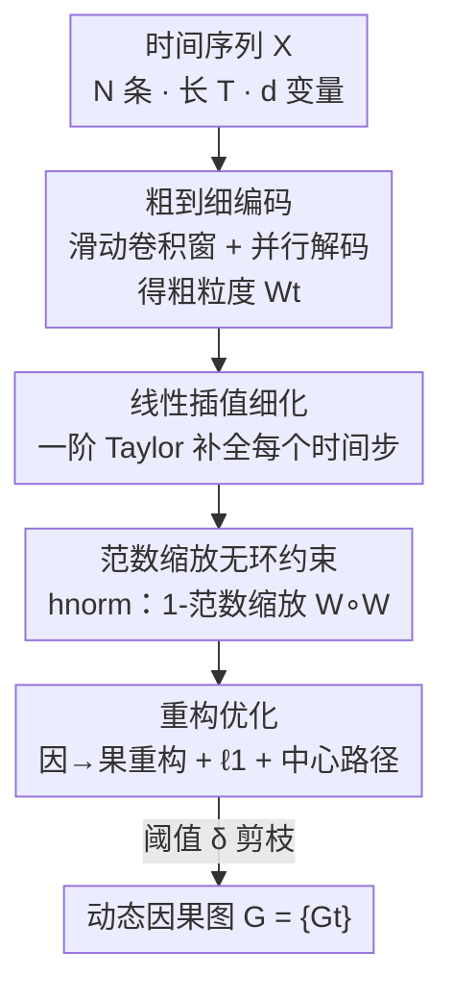

# Coarse-to-Fine Learning of Dynamic Causal Structures

**Conference**: ICLR2026  
**OpenReview**: [https://openreview.net/forum?id=ooqnLFagKq](https://openreview.net/forum?id=ooqnLFagKq)  
**Code**: To be confirmed  
**Area**: Causal Discovery / Temporal Causal  
**Keywords**: Dynamic causal structures, Granger causality, acyclicity constraints, linear interpolation, time-varying graphs

## TL;DR
This paper proposes **DyCausal**, which utilizes sliding convolutional windows to first capture "coarse-grained" causal structures of time series across multiple time steps. It then refines the causal matrices for each time step using first-order Taylor linear interpolation, coupled with an "always differentiable" acyclicity constraint $h_\text{norm}$ based on matrix 1-norm scaling. This approach enables the stable and efficient recovery of **fully dynamic** (both instantaneous and lagged causality vary over time) time-varying causal graphs for the first time, significantly outperforming existing methods on both synthetic and real-world data.

## Background & Motivation
**Background**: Discovering causal graphs from time series (temporal causal discovery) is a core task in causal learning. Mainstream approaches are divided into constraint-based (PC/FCI with conditional independence tests) and score-based (vector autoregression + sparse regularization, such as NOTEARS / DYNOTEARS / NTS-NOTEARS). Score-based methods have become dominant recently because they can be integrated with deep models and optimized end-to-end using differentiable acyclicity constraints.

**Limitations of Prior Work**: Most existing methods assume that causal relationships are **static**—while the data distribution of a time series may change, the underlying causal structure (which edges exist and their strengths) is assumed to be time-invariant. However, in reality, causal relationships can "emerge, change, or disappear": for instance, a patient's disease trajectory may shift with seasons, or traffic causality during morning and evening peaks can be entirely different. A few recent works (e.g., DyCAST) only allow **partial** causal components (only instantaneous or only lagged) to vary over time, while still imposing static assumptions on the remaining components, which contradicts the fully dynamic nature of reality.

**Key Challenge**: To achieve "fully dynamic" causal discovery (where both instantaneous and lagged causality change step-by-step), there are two unavoidable obstacles. The first is **efficiency and stability**—learning an individual causal graph for every time step leads to a parameter explosion and convergence difficulties; models often fail to converge when the number of nodes is large (e.g., 80 nodes). The second is the **acyclicity constraint**—causal graphs require the instantaneous part to be a DAG, but existing differentiable constraints ($h_\text{exp}$, $h_\text{poly}$, $h_\text{log}$) either suffer from numerical explosion/vanishing or are only optimizable within a limited spectral radius range. Crossing these boundaries necessitates restarting training with a lower learning rate, which is slow and unstable.

**Key Insight**: The authors leverage a key observation—since causality evolves **continuously and smoothly** over time, identifying coarse-grained states at a few time steps should, in principle, allow for the approximation of the entire time-varying trajectory. This transforms "hard step-by-step learning" into "coarse sampling + interpolation refinement," which is both computationally efficient and stable.

**Core Idea**: **Modeling time-varying causal trajectories in a "coarse-to-fine" two-stage manner**—convolutional windows encode coarse-grained states, linear interpolation completes each step, and an always-differentiable norm-scaled acyclicity constraint is applied to recover fully dynamic causal graphs efficiently and stably.

## Method

### Overall Architecture
DyCausal aims to solve the following: given $N$ time series of equal length sharing the same time-varying causal structure $X=\{X^1_{1:T},\dots,X^N_{1:T}\}$ (with $d$ variables per time step), it outputs the weighted adjacency causal matrix $W_t$ for each time step $t$. This is decomposed into an instantaneous part $W^\text{ins}_t$ and a lagged part $W^\text{lag}_t$ (with maximum lag $\tau$), where $W^\text{ins}_t$ must be a DAG.

The overall pipeline consists of three stages: "**Coarse Encoding → Fine Interpolation → Reconstruction Optimization**": ① A sliding convolutional window of width $N$ and length $K$ scans the sequence with stride $S$. At each position, a CNN encodes the data into a coarse-grained state vector $Z_t$, which is then "parallel decoded" into a causal matrix—thus only $\lfloor (T-K)/S\rfloor$ matrices need to be computed; ② First-order Taylor linear interpolation is applied between adjacent coarse matrices to complete the causal matrices for every time step, obtaining a fine-grained time-varying trajectory; ③ An end-to-end optimization is performed using a score-based objective (reconstructing "effect" from "cause" + $\ell_1$ sparsity + $h_\text{norm}$ constraint), followed by pruning small elements to obtain the dynamic causal graph $G$.

### Key Designs

**1. Coarse-to-Fine Encoding: Sliding Window + Parallel Decoding to reduce "Step-by-Step Learning" to "Few Steps + Interpolation"**

To address the parameter explosion and convergence issues of learning causal graphs for every time step, DyCausal does not learn a graph at every step. Instead, it uses a sliding window of width $N$, length $K$, and stride $S$ to scan the sequence. Each window $X_{t:t+K}$ is encoded into a state vector $Z_t=\text{CNN}(X_{t:t+K})\in\mathbb{R}^{dm}$, a coarse-grained representation of the causal structure. $Z_t$ is then decoded into the causal matrix $W_t\in\mathbb{R}^{dm\times d\tau}$.

Direct decoding would lead to a parameter complexity of $\mathcal{O}(d^3m^2\tau)$. Therefore, the authors designed a **two-level parallel decoding** scheme: $Z_t$ is first split into $m$ segments $\{z_{t,i}\in\mathbb{R}^d\}$ and decoded into $\{\tilde z_{t,i}\in\mathbb{R}^{d\tau}\}$ using $m$ parallel MLPs. Then, elements at the same positions are reorganized into $d\tau$ vectors $\{u_{t,j}\in\mathbb{R}^m\}$ and decoded into $\{\tilde u_{t,j}\in\mathbb{R}^{dm}\}$ using $d\tau$ parallel MLPs, which are concatenated to form $W_t=[\tilde u_{t,1}|\cdots|\tilde u_{t,d\tau}]$. This reduces the parameters from $\mathcal{O}(d^3m^2\tau)$ to $\mathcal{O}(d^2m\tau+d^2m^2\tau)$ and the computational complexity to $\mathcal{O}(d^2m^2\tau)$. For linear causality, $m=1$; for nonlinear, $m>1$ represents the number of hidden units.

**2. Fine Interpolation: First-order Taylor to complete every step from coarse states**

The causal matrices obtained in the previous step are separated by $S$ time steps. Based on the assumption that causality evolves continuously and smoothly, the authors posit that if $S$ is sufficiently small, the change in the causal matrix within the interval $[t, t+S]$ can be approximated as a deterministic linear function using the first-order Taylor formula:

$$W_{t+s}=W_t+\frac{W_{t+S}-W_t}{S}\cdot s,\quad s\in[0,S]$$

This is equivalent to linear interpolation between two coarse matrices. Consequently, encoding and decoding are not required for every step—calculating only $\lfloor (T-K)/S\rfloor$ matrices allows for the estimation of matrices for all time steps. This "coarse-to-fine" approach saves computation: even with $S\ge 2$, the workload is reduced by more than half, while interpolation ensures smooth and stable trajectories. Because both instantaneous and lagged parts are interpolated simultaneously, DyCausal can model **fully dynamic** causality.

**3. Norm-scaled acyclicity constraint $h_\text{norm}$: Making the constraint "always differentiable and optimizable"**

To solve the issues of existing acyclicity constraints (explosion/vanishing or boundary constraints), the authors modified the log-det type constraint. While $h_\text{log}=-\log\det(\alpha I-W\circ W)+d\log\alpha$ is more efficient than $h_\text{exp}$ or $h_\text{poly}$, it is only optimizable in the limited space $\{W:\rho(W\circ W)<\alpha\}$. Once the spectral radius exceeds $\alpha$, retraining is required. Using the fact that "matrix norm $\ge$ spectral radius," the authors scaled $W\circ W$ by its 1-norm:

$$h_\text{norm}=-\log\det\!\Big(\alpha I-\frac{W\circ W}{\|W\circ W\|_1}\Big)+d\log\alpha$$

Where $\alpha$ is a constant slightly larger than 1 (e.g., $1.001$, denoted as $1^+$), requiring no additional tuning. Because $\rho\big(\tfrac{W\circ W}{\|W\circ W\|_1}\big)<1^+$ always holds, the scaled matrix **always stays within the optimizable space**, eliminating retraining and hyperparameter searching. Key property (Theorem 1): $h_\text{norm}\ge 0$ and $=0$ if and only if $W$ is a DAG—since $\tfrac{W\circ W}{\|W\circ W\|_1}$ shares the same cycle characteristics as $W\circ W$. Theorem 2 further proves $h_\text{norm}$ satisfies three stability criteria: E-stability (no explosion to infinity), V-stability (no rapid vanishing to 0), and D-stability (constraint and gradients are computable almost everywhere). This is particularly important because directly using the spectral radius $\rho(A)$ yields uncomputable gradients during repeated eigenvalues, an issue $h_\text{norm}$ avoids.

### Loss & Training
The observed sequence is rearranged into a "cause" sequence $X^c=\{X^c_t:=[X_t|\cdots|X_{t-\tau}]\}$ and an "effect" sequence $Y=\{Y_t:=X_t\}$. The score-based objective requires the causal model to accurately reconstruct effects from causes while satisfying the acyclicity constraint (when $m=1$, $\hat Y_{t:t+K}=W_t X^c_{t:t+K}$):

$$\arg\min_{W,\theta}\ \frac{1}{NTK}\sum_{t=\tau+1}^{T-K}\|Y_{t:t+K}-\hat Y_{t:t+K}\|_2^2+\beta|W_t|_1,\quad \text{s.t.}\ h_\text{norm}(W^\text{ins}_t)=0$$

The problem is solved using the central path method: the reconstruction and sparsity objective is multiplied by a coefficient $\mu$ and added with $h_\text{norm}$ as a regularizer. In each iteration, $\mu$ is decreased (default decay $\gamma=0.1$, iterations $r=4$) before minimization. Finally, a threshold $\delta$ is used to prune small elements to obtain $G$. The method is flexible: for **nonlinear** cases, $m>1$, $W_t$ acts as the first layer of the reconstruction network, and $\tilde W_t$ is obtained by $\ell_2$ aggregation. for **ODE** models, it uses incremental reconstruction $\hat Y_{t:t+K}=\hat Y_{t-1:t-1+K}+\text{MLP}(\sigma(W_tX^c_{t:t+K}))$, and since ODEs do not involve instantaneous causality, $h_\text{norm}$ is removed and $r=1$.

## Key Experimental Results

### Main Results
Synthetic data utilized ER random graphs for ground truth, with edge weights set as sine/cosine functions to simulate dynamics. Comparisons included DyCAST (partial dynamic), DYNO (DYNOTEARS), and NTS-NO (NTS-NOTEARS, static). Evaluation was conducted at the start, middle, and end time steps for large graphs with $T=50$ and nodes $d=\{20, 80\}$:

| Time Step | Method | 20-node F1↑ | 20-node SHD↓ | 80-node F1↑ | 80-node SHD↓ |
|-----------|--------|-------------|--------------|-------------|--------------|
| $W_1$ (Start) | **DyCausal** | **91.43** | **7.40** | **93.85** | **18.20** |
|           | DYCAST | 29.51 | 45.43 | — (Non-conv) | — |
|           | DYNO | 3.52 | 78.40 | 0.34 | 294.90 |
| $W_{25}$ (Mid) | **DyCausal** | **94.38** | **4.10** | **95.20** | **13.40** |
|           | DYNO | 69.20 | 25.00 | 72.81 | 82.90 |
| $W_{50}$ (End) | **DyCausal** | **90.38** | **8.20** | **92.52** | **22.00** |
|           | DYCAST | 28.64 | 44.14 | — | — |

Key observation: Static methods like DYNO/NTS-NO fail significantly at the **boundaries** of the sequence (confusing boundary and middle distributions). DyCAST, due to its ODE-based trajectory, fails to identify causality with drastic weight changes (opposite signs at boundaries) and **fails to converge** on 80 nodes. Only DyCausal maintains high accuracy across all segments in fully dynamic scenarios.

Real-world data (CausalTime: Traffic, AQI, and Medical), with additional CUTS+ and JRNGC baselines:

| Method | Traffic F1↑ | AQI F1↑ | Medical F1↑ | Traffic Precision↑ |
|--------|-------------|---------|-------------|--------------------|
| **DyCausal** | **54.81** | **63.16** | **56.86** | **87.41** |
| CUTS+ | 45.21 | 58.20 | 30.23 | 80.10 |
| JRNGC | 52.04 | 55.36 | 52.05 | 68.04 |
| NTS-NO | 46.07 | 40.09 | 34.27 | 67.43 |

Ours ranked first in Precision and F1 across all scenarios. High Precision is particularly valuable in real-world data without verifiable ground truth as it provides more credible edges. Visualization in the Traffic subset clearly shows causality splitting into two distinct modes at $t=20$ (e.g., $x_4 \to x_8$ strength is near zero before $t=20$ and emerges thereafter), proving it captures real dynamic changes that other algorithms discard as noise.

### Ablation Study

| Configuration | Conclusion |
|---------------|------------|
| w/o Linear Interpolation (Appendix C.2) | Interpolation is **essential** for identifying dynamic causality; removing it prevents recovery of time-varying trajectories. |
| Acyclicity Contrast: $h_\text{norm}$ vs $h_\text{exp}/h_\text{poly}/h_\text{log}/h_\rho$ (Fig. 4) | As $k$ and $d$ increase, $h_\text{exp}/h_\text{poly}$ explode or vanish (E/V unstable); $h_\text{log}$ degrades rapidly on cyclic graphs as $d$ increases; $h_\rho$ is stable but has tiny gradients on cyclic graphs and exponential runtimes. **Only $h_\text{norm}$ is stable and efficient in all settings and penalizes cycles best.** |
| $h_\text{norm}$ vs $h_\text{log}$ (Appendix C.10) | Confirms that the improvement of $h_\text{norm}$ is effective and necessary. |

### Key Findings
- **Linear interpolation is the "lifeline" for fully dynamic discovery**: Removing it reverts the model to step-by-step learning, which is expensive and hard to converge. "Coarse sampling + interpolation" allows even 80-node graphs to converge stably (where DyCAST fails).
- **Boundaries best distinguish method quality**: Static or partially dynamic methods collapse at the start and end of sequences due to drastic weight changes (sign inversion). Ours shows its strongest advantage at these boundaries.
- **"Always optimizable" acyclicity constraints bring more than just accuracy**: They eliminate retraining and hyperparameter search, and also provide significant acceleration in static causal discovery (Appendix C.9).

## Highlights & Insights
- **The "Continuous smoothness $\Rightarrow$ reconstructible via coarse sampling" observation is clever**: It transforms a combinatorial explosion problem of "step-by-step graph learning" into "few key steps + Taylor interpolation." This is a successful application of signal continuity to causal discovery, and by interpolating instantaneous and lagged parts together, it achieves true fully dynamic modeling for the first time.
- **Norm-scaling for acyclicity is a reusable trick**: A single matrix inequality ("matrix norm $\ge$ spectral radius") expands the optimizable space of $h_\text{log}$ to the entire space while keeping cycle characteristics and gradient zeros unchanged. Any differentiable causal discovery work using log-det constraints could adopt this.
- **A single framework handles linear, nonlinear, and ODE models**: By simply adjusting $m$ and the reconstruction formula (adding MLP for nonlinear, using incremental reconstruction and removing $h_\text{norm}$ for ODE), the framework demonstrates strong generalization.

## Limitations & Future Work
- **Strong dependence on the "smooth continuity" assumption**: Linear interpolation relies on the premise that causality changes smoothly and $S$ is small enough. Although the paper claims acceptable accuracy on non-smooth dynamics (Appendix C.12), abrupt jumps are naturally disadvantageous for first-order Taylor approximation.
- **Assumption of shared causal structure across all sequences**: In reality, different individuals or regions may have different causal mechanisms. This homogeneity assumption limits the scope of application.
- **Instantaneous DAG requirement vs. unconstrained lagged parts**: This relies on the assumption that "lagged causality naturally does not form cycles over time." If hidden confounders or feedback loops exist, the reliability of recognition might be questioned.
- **Potential improvements**: Replacing the fixed stride $S$ with an adaptive one (denser sampling where causality changes rapidly), or using higher-order interpolation/splines to handle non-smooth dynamics.

## Related Work & Insights
- **vs DyCAST (Partial dynamic)**: DyCAST uses ODEs for trajectories and only allows one part (instantaneous or lagged) to be dynamic. Ours uses "convolutional windows + linear interpolation" to make both parts fully dynamic. DyCAST fails under weight inversions and non-convergence at 80 nodes, whereas Ours is more stable and accurate due to coarse encoding.
- **vs DYNOTEARS / NTS-NOTEARS (Static temporal causality)**: These use differentiable acyclicity constraints for static autoregressive discovery. They are insensitive to changing distributions and collapse at sequence boundaries. Ours inherits the score-based + acyclicity framework but adds coarse-to-fine time-varying modeling and replaces the constraint with $h_\text{norm}$.
- **vs $h_\text{log}$ (Bello et al. 2022)**: Ours performs norm-scaling on this basis, changing "limited optimizable space and retraining" into "always differentiable and optimizable" while retaining its beneficial properties and adding E/V/D stability.
- **vs $h_\rho$ (Nazaret et al. 2024)**: $h_\rho$ is stable but suffers from vanishing gradients on cyclic graphs and exponential runtime. $h_\text{norm}$ avoids this D-instability issue via norm-scaling.

## Rating
- Novelty: ⭐⭐⭐⭐⭐ First to perform fully dynamic discovery; both coarse-to-fine and norm-scaled constraints are novel and self-consistent.
- Experimental Thoroughness: ⭐⭐⭐⭐ Synthetic (multi-node/long-sequence/static-dynamic) + four real datasets + specific acyclicity comparisons; detailed in appendix, but main text tables are sparse.
- Writing Quality: ⭐⭐⭐⭐ Motivation, obstacles, and methods are logically clear; theorems and stability analysis are solid. Symbols are dense, and parallel decoding details require the diagram for full understanding.
- Value: ⭐⭐⭐⭐ Fully dynamic causal discovery is practical for time-varying systems (medical/traffic/finance). Norm-scaled constraints are widely reusable.

<!-- RELATED:START -->

## Related Papers

- [\[ICLR 2026\] Learning Dynamic Causal Graphs Under Parametric Uncertainty via Polynomial Chaos Expansions](learning_dynamic_causal_graphs_under_parametric_uncertainty_via_polynomial_chaos.md)
- [\[ACL 2026\] ClimateCause: Complex and Implicit Causal Structures in Climate Reports](../../ACL2026/causal_inference/climatecause_complex_and_implicit_causal_structures_in_climate_reports.md)
- [\[ICLR 2026\] Modeling Interference for Treatment Effect Estimation in Network Dynamic Environment](modeling_interference_for_treatment_effect_estimation_in_network_dynamic_environ.md)
- [\[ICLR 2026\] CARL: Preserving Causal Structure in Representation Learning](carl_preserving_causal_structure_in_representation_learning.md)
- [\[ICLR 2026\] Beyond DAGs: A Latent Partial Causal Model for Multimodal Learning](beyond_dags_a_latent_partial_causal_model_for_multimodal_learning.md)

<!-- RELATED:END -->
