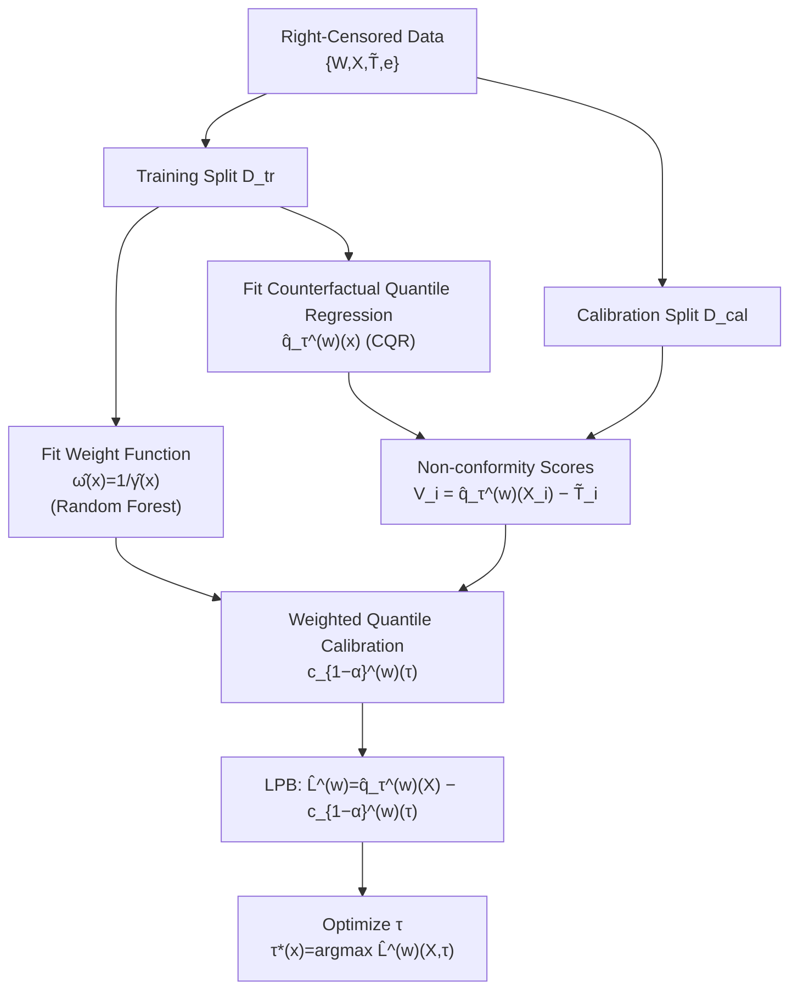

# Conformalized Survival Counterfactuals Prediction for General Right-Censored Data

**Conference**: ICLR 2026  
**OpenReview**: [https://openreview.net/forum?id=1j0ormf8uI](https://openreview.net/forum?id=1j0ormf8uI)  
**Code**: TBD  
**Area**: Causal Inference / Survival Analysis / Conformal Prediction  
**Keywords**: Counterfactual Prediction, Survival Analysis, Right-censored Data, Weighted Conformal, Lower Predictive Bound (LPB), Double Robustness  

## TL;DR
In clinical scenarios involving "general right-censoring + multiple treatment options," this paper utilizes the potential outcomes framework combined with weighted conformal prediction to construct a Lower Predictive Bound (LPB) for counterfactual survival times. It upgrades PAC-type approximate coverage from previous methods to **exact marginal coverage** and achieves double robustness against model misspecification.

## Background & Motivation

**Background**: In high-risk medical decision-making (e.g., oncology), clinicians need to predict "how long a patient might survive under different chemotherapy or radiotherapy regimens." This is fundamentally a counterfactual problem—only one outcome under a specific treatment can be observed for a given patient. Survival data is naturally **right-censored** (many patients are still alive at the end of follow-up, leaving the true survival time unknown). Traditional Cox or parametric survival models rely on distributional assumptions that are difficult to verify and fail to provide reliable uncertainty quantification. Instead of predicting the entire survival function, providing a conservative **Lower Predictive Bound (LPB)**—i.e., "the patient will survive at least $L$ years"—is more suitable for high-risk clinical decisions, as overly optimistic predictions may lead to harmful treatment choices.

**Limitations of Prior Work**: Conformal prediction has been introduced to right-censored survival analysis (Candès 2023 for Type-I censoring, Gui 2024 for adaptive cutoffs, Davidov 2025 for general right-censoring). However, these works have two major issues: (1) **Inability to provide LPBs for treatment effects**, with most only applicable when the censoring time exceeds a certain threshold; (2) They only provide **PAC-type guarantees**, meaning they approximately achieve marginal coverage on observed data. This essentially uses an empirical average $\hat\alpha(\tau)$ to approximate the population quantity $\alpha(\tau)$, leaving a persistent gap between the two.

**Key Challenge**: PAC-type coverage holds in an "average sense" but may fail for rare or extreme cases—precisely those that are most critical and require the strongest guarantees in clinical practice. Exact marginal coverage at the population level is required to ensure safe predictions for the entire population, including outliers.

**Goal**: Construct an LPB $\hat L^{(w)}_{N,n}(X)$ for **counterfactual survival times** under general right-censored data that satisfies exact marginal coverage: $P(T(w) \ge \hat L^{(w)}_{N,n}(X)) \ge 1-\alpha$ for any treatment $w$.

**Core Idea**: Under SUTVA and strong ignorability assumptions, the "coverage probability" is rewritten as a **weighted expectation**. This transforms the censored counterfactual problem into a standard **weighted conformal inference** problem. This allows the use of quantile regression to obtain an LPB with exact coverage, bypassing the approximation errors inherent in PAC-based methods where $\hat\alpha(\tau)\!\approx\!\alpha(\tau)$.

## Method

### Overall Architecture

Given data $\{W_i,X_i,\tilde T_i,e_i\}$ (where $\tilde T=\min(T,C)$ is the observed time and $e=\mathbb 1\{T<C\}$ is the event indicator), the method follows two steps: first, fit a **counterfactual quantile regression** $\hat q^{(w)}_\tau(x)$ and a **weight function** $\hat\omega(x)$ on the training split $\mathcal D_{tr}$; then, use weighted conformal prediction on the calibration split $\mathcal D_{cal}$ to calibrate the quantile estimate into an LPB with exact coverage guarantees. The critical theoretical bridge is a series of identity transformations that express the target coverage $\alpha$ as an expectation over samples where events occurred ($e=1$), weighted by a density ratio $\omega(x)$. This reduces the counterfactual/censored problem to a weighted conformal inference problem under covariate shift.

### Key Designs

**1. Rewriting Coverage Probability as Weighted Expectation.** This is the theoretical core. Previous adaptive cutoff methods only provided PAC guarantees because they defined $\alpha(\tau):=P(T<\hat q_\tau(X))$ and searched for a cutoff using the empirical version $\hat\alpha(\tau)$. This paper instead provides an upper bound **exactly equal to $\alpha$** for $P(V^{(w)}(X,\tilde T)\le c^{(w)}_{1-\alpha}(\tau))$. By applying strong ignorability ($\{T(1),T(0)\}\perp\!\!\!\perp (W,C)\mid X$), SUTVA, and the tower property, the following is derived:

$$\alpha = \mathbb E\!\left[\mathbb 1\!\left(V(\tilde T,X)\ge c^{(w)}_{1-\alpha}(\tau)\right)\cdot \frac{p(W=w,e=1)}{\gamma(x)}\;\Big|\;W=w,e=1\right],$$

where $\gamma(x):=p(W=w,e=1\mid x)$. This step transforms coverage over the **counterfactual population** $P_X\times P_{T(w)\mid X}$ into coverage over the sub-sample that received treatment $w$ and experienced an event ($e=1$, where $T=\tilde T$ is fully observed), using density ratio weighting. The difficulty of "unobserved ground truth" caused by censoring is bypassed by performing calibration only on samples where the ground truth is known.

**2. Density Ratio Weights and Weighted Quantile Calibration.** The weight $\omega(x)=\dfrac{p(W=w,e=1)}{\gamma(x)}$ is the Radon-Nikodym derivative $\frac{dP_X}{dP_{X\mid W=w,e=1}}(x)$, characterizing the covariate shift between the "general population distribution" and the "treated event-occurred subpopulation distribution." Since $p(W=w,e=1)$ cancels out in the numerator and denominator, one only needs to estimate $\hat\omega(x):=1/\hat\gamma(x)$ (fitted via a Random Forest classifier). Non-conformity scores are $V^{(w)}_i=\hat q^{(w)}_\tau(X_i)-\tilde T_i$ (CQR scores from Romano 2019). The calibration threshold follows the weighted conformal approach of Lei & Candès (2021):

$$c^{(w)}_{1-\alpha}(\tau)=\text{Quantile}\Big(1-\alpha;\textstyle\sum_{i}\hat p_i(x)\,\delta_{V^{(w)}_i}+\hat p_\infty(x)\,\delta_\infty\Big),\quad \hat p_i(x)=\frac{\hat\omega(x_i)}{\sum_j\hat\omega(x_j)+\hat\omega(x)},$$,

where $\hat L^{(w)}_{N,n}(X)=\hat q^{(w)}_\tau(X)-c^{(w)}_{1-\alpha}(\tau)$. The $\delta_\infty$ term is a conservative compensation for the test point itself, ensuring exact coverage in finite samples.

**3. $\tau$-Adaptive Optimization.** The theoretical guarantee holds for any $\tau\in(0,1)$. This allows for optimization—selecting $\tau$ to make the LPB as large (informative and less conservative) as possible. For each test point $x$:

$$\tau^*(x)=\arg\max_{\tau\in(0,1)}\big(\hat q^{(w)}_\tau(x)-c^{(w)}_{1-\alpha}(\tau)(x)\big).$$

Since coverage does not depend on the choice of $\tau$, this two-stage strategy ("fix coverage, then maximize LPB") does not violate validity while significantly improving utility.

**4. Theoretical Guarantees: Exact Coverage + Double Robustness.** Theorem 4.1 provides a distribution-free exact finite-sample bound: $P(T(w)\ge\hat L^{(w)}_{N,n}(X))\ge 1-\alpha-\tfrac12\mathbb E[|\hat\omega(X)-\omega(X)|]$, where coverage loss depends only on the weight estimation error. Theorem 4.2 proves **double robustness**: as long as **either** the weight function $\hat\gamma(x)$ or the counterfactual quantile $\hat q^{(w)}(x)$ is estimated consistently, asymptotic coverage $\ge 1-\alpha$ holds. This is crucial for clinical data where model misspecification is common.

## Key Experimental Results

The target coverage is set to $1-\alpha=90\%$. Metrics include empirical coverage rate and relative LPB (higher is more informative). Baselines: Uncab (uncalibrated), Naive, Focus, and Fused (PAC-type methods from Davidov 2025).

### Main Results (Synthetic Data, 6 Settings)

| Dimension | Ours | Naive / Focus | Fused |
|------|------|---------------|-------|
| Coverage Met | ✅ Closest to 90% in all settings | Partially conservative/unstable | ✅ but PAC-type |
| LPB Informativeness | **Highest (among met methods)** | Conservative | Significantly smaller than Ours in settings 3/4/5 |
| Guarantee Type | Exact Marginal Coverage | Approximate | PAC-type Approximate |

> Ours yields the largest LPB among all methods satisfying coverage; in settings 3/4/5, coverage is comparable to Fused but LPB is notably larger.

### Robustness (Outlier Injection, Setting 4)

Normal noise is subtracted from 10% of data to create smaller outliers ($\mathcal N(1,2)\to\mathcal N(20,2)$): Ours **maintains 90% coverage throughout**, while PAC-type Focus/Fused **fail to guarantee marginal coverage** in the presence of outliers—validating the motivation that PAC fails on extreme cases.

### Main Results (Clinical Data: 541 Non-Small Cell Lung Cancer Cases)

124-dimensional clinical + radiomics features, 4 radiotherapy/chemotherapy regimens. results align with clinical evidence: Median LPB for VMAT is higher than IMRT (consistent with superior clinical benefit of VMAT); addition of induction chemotherapy or concurrent chemotherapy leads to higher LPBs, demonstrating the method's potential as a benchmark for personalized treatment selection.

### Key Findings

- Exact coverage and high informativeness can coexist: while guaranteeing 90% coverage, the LPB is less conservative than PAC-type methods.
- Robustness to outliers is a substantive advantage of exact marginal coverage over PAC, rather than a mere theoretical detail.
- Consistent findings with clinical priors on real lung cancer data enhance the credibility of the method.

## Highlights & Insights

- **Turning Censoring from a "Challenge" into a "Resource"**: By using only samples with $e=1$ (where ground truth is observed) for calibration and correcting bias with density ratios, the method elegantly avoids the fundamental difficulty of unknown values in censored samples.
- **Clarifying the Clinical Significance of Exact vs. PAC Coverage**: The authors do not just claim theoretical superiority; the outlier experiments demonstrate that PAC fails exactly where high-risk medicine cares most—the tails.
- **Double Robustness for Practical Stability**: Given that either the weight model or the quantile model might be misspecified in clinical data, double robustness provides practical safety redundancy.

## Limitations & Future Work

- **The Cost of Tighter Guarantees**: Exact guarantees may result in wider prediction intervals relative to less strict methods in some settings.
- **Dependence on Strong Ignorability + Overlap**: Like all causal inference methods, the unverifiable assumption of no unobserved confounding is a prerequisite.
- **Weight Estimation Quality**: Theorem 4.1 shows that in high-dimensional settings, inaccurate density ratio estimation can erode the coverage guarantee.
- **Limited Real-world Data Scale**: The 541-case single-center dataset means external validity and multi-center generalization still need verification.

## Related Work & Insights

- **Survival Conformal Genealogy**: Candès 2023 (Type-I censoring) → Qi 2024 (best-guess imputation) → Gui 2024 (adaptive cutoff) → Davidov 2025 (general right-censoring, PAC). This work is the **first to achieve exact coverage** for counterfactual survival under general right-censoring.
- **Weighted Conformal Paradigm**: The mechanism builds on Lei & Candès (2021) and Jin et al. (2023), treating the "treatment vs. population" shift as a covariate shift problem.
- **Methodological Pattern**: The three-step pattern—identity transformation of coverage target → reduction to weighted conformal → $\tau$-adaptive optimization—can potentially scale to other uncertainty quantification problems involving missingness or censoring, such as competing risks.

## Rating
- **Novelty**: ⭐⭐⭐⭐ — First to bridge PAC to exact marginal coverage in survival counterfactuals; the weighted expectation rewrite is a clean and insightful theoretical contribution.
- **Experimental Thoroughness**: ⭐⭐⭐⭐ — 6 synthetic settings + outlier robustness + multiple treatments + real data; slightly penalized for small-scale real-world data.
- **Writing Quality**: ⭐⭐⭐⭐ — Clear motivation, solid theoretical derivation, and well-articulated clinical implications.
- **Value**: ⭐⭐⭐⭐ — Provides a benchmark with exact statistical guarantees for personalized treatment comparison, highly valuable for high-risk clinical AI.

<!-- RELATED:START -->

## Related Papers

- [\[ICLR 2026\] Adjusting Prediction Model Through Wasserstein Geodesic for Causal Inference](adjusting_prediction_model_through_wasserstein_geodesic_for_causal_inference.md)
- [\[NeurIPS 2025\] Differentiable Structure Learning and Causal Discovery for General Binary Data](../../NeurIPS2025/causal_inference/differentiable_structure_learning_and_causal_discovery_for_general_binary_data.md)
- [\[ICLR 2026\] Privacy-Protected Causal Survival Analysis Under Distribution Shift](privacy-protected_causal_survival_analysis_under_distribution_shift.md)
- [\[ICLR 2026\] Foundation Models for Causal Inference via Prior-Data Fitted Networks](foundation_models_for_causal_inference_via_prior-data_fitted_networks.md)
- [\[CVPR 2026\] Retrieving Counterfactuals Improves Visual In-Context Learning](../../CVPR2026/causal_inference/retrieving_counterfactuals_improves_visual_in-context_learning.md)

<!-- RELATED:END -->
