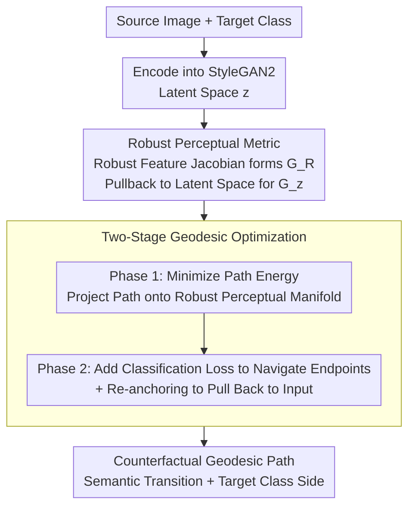

# Counterfactual Explanations on Robust Perceptual Geodesics

**Conference**: ICLR 2026  
**arXiv**: [2601.18678](https://arxiv.org/abs/2601.18678)  
**Code**: Code provided (anonymous)  
**Area**: Human Understanding / Explainable AI / Image Generation  
**Keywords**: Counterfactual Explanations, Geodesic Optimization, Perceptual Metrics, Adversarial Robustness, Interpretability

## TL;DR
The PCG (Perceptual Counterfactual Geodesic) method is proposed to generate semantically faithful counterfactual explanations via geodesic optimization on a robust perceptual manifold. A two-stage optimization ensures paths are perceptually natural and reach the target class, achieving an FID of 8.3 on AFHQ, significantly outperforming RSGD's 12.9.

## Background & Motivation

**Background**: Counterfactual explanations ("if the image changed like this, the classifier's prediction would change") are essential tools for model interpretability. Existing methods generate counterfactuals via gradient descent in pixel or latent space.

**Limitations of Prior Work**: Pixel-space counterfactuals easily produce unnatural adversarial perturbations. Latent-space methods may move off the manifold, leading to non-realistic images.

**Key Challenge**: There is a conflict between "minimal change" and "semantic plausibility" in Euclidean space. The shortest path in Euclidean distance often crosses non-realistic regions.

**Goal**: How to find the shortest path to a target category under the constraint of perceptual naturalness?

**Key Insight**: Compute geodesics on a Riemannian manifold defined by a robust perceptual metric. Shortest paths on the manifold naturally follow the "ridges" of the data distribution and avoid "low-density valleys."

**Core Idea**: The manifold is defined by the feature space of an adversarially trained robust model. Geodesics on this manifold serve as counterfactual paths.

## Method

### Overall Architecture

PCG addresses the following problem: given an image and a target category, find a counterfactual path from the original image to one classified as the target, where every frame is perceptually natural and remains on the data manifold. Perceptual naturalness is encoded into a Riemannian metric. On a manifold defined by robust model features, semantically similar points are close, while non-realistic regions are distant. Thus, the shortest path (geodesic) follows the data "ridges," bypassing "low-density valleys" that produce adversarial noise. The process involves two-stage optimization in the StyleGAN2 latent space: first, the path is projected onto the manifold (ensuring quality), then endpoints are pulled toward the target category (ensuring effectiveness). The resulting path is a smooth semantic transition on the correct side of the decision boundary.

### Key Designs

**1. Robust Perceptual Metric: Equating Semantic Similarity with Manifold Proximity**

Counterfactuals often degrade into adversarial perturbations because "minimal change" and "semantic plausibility" conflict in Euclidean space. PCG uses a Riemannian metric induced by an adversarially trained robust model. Specifically, the metric tensor is constructed from the Jacobians of intermediate features $h_k$ of a robust model:

$$G_R(x) = \sum_k w_k \, J(h_k(x))^\top J(h_k(x))$$

Weights are set as $w_k = 1/N_k$ (normalized by dimension). This metric is pulled back to the StyleGAN latent space via generator $g$:

$$G_z(z) = J(g(z))^\top \, G_R(g(z)) \, J(g(z))$$

The "robust" property is critical: feature gradients of robust models point toward true semantic directions rather than fragile adversarial directions. Thus, "closeness" under this metric corresponds to semantic similarity. This distinguishes PCG from RSGD, which uses fragile features from standard classifiers.

**2. Two-Stage Geodesic Optimization: Road Building before Navigation**

Directly optimizing for both shortest paths and classification targets simultaneously is unstable. PCG splits this into two steps. Phase 1 minimizes path energy under the $G_z$ metric to project the path onto the robust perceptual manifold:

$$E = \int \gamma'(t)^\top \, G_z \, \gamma'(t)\, dt$$

Phase 2 adds classification loss to this "manifold-aligned" path, guiding endpoints across the semantic boundary. A re-anchoring step pulls endpoints toward the input image to ensure "minimal change." Building the road before navigating proved more stable than joint optimization.

## Key Experimental Results

| Dataset | Method | FID | R-FID | R-LPIPS |
|--------|------|-----|-------|---------|
| AFHQ | RSGD | 12.9 | 37.8 | 0.68 |
| AFHQ | **PCG** | **8.3** | **9.1** | **0.17** |

### Key Findings
- PCG reduces R-LPIPS (Robust Perceptual Distance) from 0.68 to 0.17, indicating more natural counterfactuals.
- Intermediate frames on the counterfactual path are visually plausible (gradual transitions).
- Metrics defined by robust models outperform standard models (whose feature gradients lack semantic meaning).

## Ablation Study

### Impact of Metric Choice on Interpolation Quality

| Metric | Semantic Coherence | On-Manifold | Adversarial Vulnerability |
|------|-----------|-----------------|-----------|
| Z-Linear (Euclidean) | Poor, blurry intermediate frames | No | N/A |
| Pixel MSE Pullback | Poor, inconsistent attributes | Partial | High |
| Standard ResNet-50 Feature Pullback | Moderate, lighting drift | Yes | High |
| **Robust ResNet-50 Feature Pullback** | **Good, semantic transition** | **Yes** | **Low** |

### Quantitative Comparison of Counterfactuals (StyleGAN2)

| Method | AFHQ $\mathcal{L}_1$↓ | AFHQ $\mathcal{L}_{\mathcal{R}}$↓ | FFHQ $\mathcal{L}_{\mathcal{R}}$↓ | PlantVillage $\mathcal{L}_{\mathcal{R}}$↓ |
|------|-------|-------|-------|-------|
| REVISE | **1.20** | 2.70 | 2.78 | 2.87 |
| VSGD | 1.31 | 2.90 | 2.86 | 2.83 |
| RSGD | 1.73 | 2.79 | 2.81 | 2.88 |
| RSGD-C | 1.55 | 2.62 | 2.69 | 2.67 |
| **PCG** | 1.42 | **2.21** | **2.48** | **2.43** |

- REVISE has the lowest pixel $\ell_1$ but high $\mathcal{L}_{\mathcal{R}}$ (Robust Perceptual Distance), indicating it generates adversarial samples.
- PCG leads in robust metrics, proving it reaches the "correct side" of the semantic boundary.

### Necessity of Two-Stage Optimization
- Phase 1 ensures the path sticks to the robust perceptual manifold. Without it, Phase 2 collapses off-manifold.
- The re-anchoring step in Phase 2 ensures counterfactuals are as close as possible to the input.

## Highlights & Insights
- **Riemannian Geometry + Interpretability**: Applying geodesics to XAI is mathematically elegant and effective.
- **Crossing the "Semantic Divide"**: While previous work identified the semantic divide, PCG is the first to cross it using robust metrics.
- **Road then Navigate Strategy**: Minimizing energy first ensures path quality before introducing task objectives, leading to higher stability.
- **Systematic Failure Classification**: The study categorizes failures of existing methods into off-manifold traversal, local gradient traps, and generator exploitation of fragile metrics.

## Limitations & Future Work
- Requires adversarially trained models to define metrics, which are not available in all domains (e.g., medical or remote sensing).
- High computational cost for geodesic optimization due to repeated Jacobian-vector products.
- Only validated on image classification; counterfactuals for text or tabular data require different manifold definitions.
- Dependence on StyleGAN2/3; adaptation to diffusion models is needed.

## Related Work & Insights
- **vs REVISE**: REVISE assumes flat geometry in VAE space; PCG shows this assumption fails in image domains.
- **vs RSGD**: RSGD introduced Riemannian metrics but used fragile features; PCG fixes the geometry using robust features.
- **vs Santurkar et al. (2019)**: While they interpret robust models, PCG uses robust models to generate explanations for standard models.
- **Insight**: The concept of robust perceptual metrics can extend to any "perceptually natural" generative task, such as style transfer or inpainting.

## Rating
- Novelty: ⭐⭐⭐⭐⭐ The framework for using Riemannian geodesics in counterfactual explanations is highly novel.
- Experimental Thoroughness: ⭐⭐⭐⭐ Multiple datasets, two StyleGAN versions, and extensive quantitative baselines.
- Writing Quality: ⭐⭐⭐⭐ Rigorous mathematical derivation and clear illustrations.
- Value: ⭐⭐⭐⭐⭐ Provides a principled solution to metric issues in the XAI field.

<!-- RELATED:START -->

## Related Papers

- [\[ICML 2026\] Density-Guided Robust Counterfactual Explanations on Tabular Data under Model Multiplicity](../../ICML2026/causal_inference/density-guided_robust_counterfactual_explanations_on_tabular_data_under_model_mu.md)
- [\[ICLR 2026\] Synthesising Counterfactual Explanations via Label-Conditional Gaussian Mixture Variational Autoencoders](synthesising_counterfactual_explanations_via_label-conditional_gaussian_mixture_.md)
- [\[ACL 2025\] Counterfactual Explanations for Aspect-Based Sentiment Analysis](../../ACL2025/causal_inference/counterfactual_explanations_for_aspect-based_sentiment_analysis.md)
- [\[ICLR 2026\] Learning Robust Intervention Representations with Delta Embeddings](learning_robust_intervention_representations_with_delta_embeddings.md)
- [\[ICLR 2026\] Direct Doubly Robust Estimation of Conditional Quantile Contrasts](direct_doubly_robust_estimation_of_conditional_quantile_contrasts.md)

<!-- RELATED:END -->
