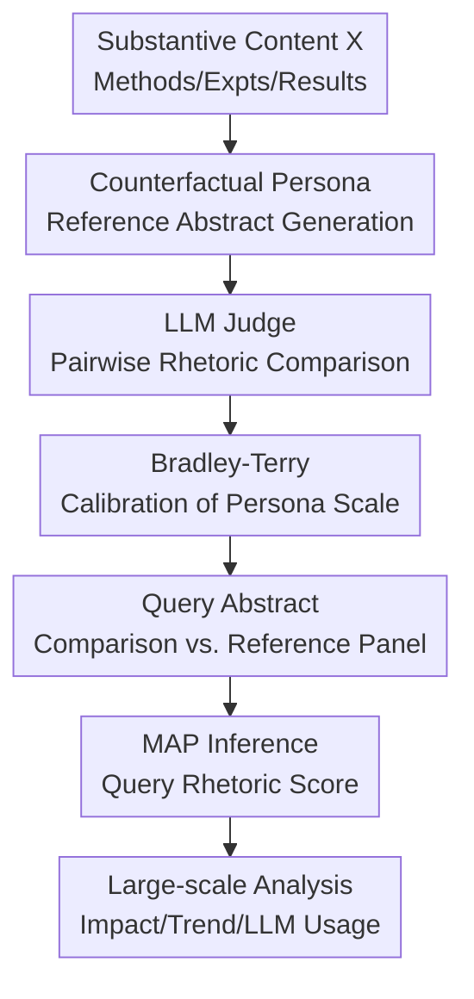

# Counterfactual LLM-based Framework for Measuring Rhetorical Style

**Conference**: ICLR 2026  
**OpenReview**: [https://openreview.net/forum?id=fiohEI16sf](https://openreview.net/forum?id=fiohEI16sf)  
**Code**: None  
**Area**: Causal Inference / Scientometrics / LLM Evaluation  
**Keywords**: Counterfactual measurement, rhetorical style, Bradley-Terry model, LLM Judge, scientific writing  

## TL;DR

This paper proposes a counterfactual LLM measurement framework: while fixing the substantive content $X$ (methods, experiments, results), different rhetorical personas generate counterfactual abstracts for the same paper. These abstracts are then calibrated into continuous "rhetorical strength" $Z$ scores using LLM Judge pairwise comparisons and the Bradley-Terry model. Empirical analysis of 8,485 ICLR submissions shows that stronger visionary rhetoric significantly predicts citations and media attention, and post-2023 rhetorical intensification is highly correlated with the adoption of LLM writing assistance.

## Background & Motivation

**Background**: Machine learning papers are becoming increasingly crowded, with rapid growth in conference submissions. Paper abstracts serve as a critical gateway for readers, reviewers, and media to quickly grasp contributions. Existing work in scientometrics and NLP uses promotional lexicons, certainty classifiers, or manual annotations of sensationalism/uncertainty to measure whether paper language is more positive, certain, or hyperbolic.

**Limitations of Prior Work**: Analyzing only the final abstract text $Y$ conflates "strong content" with "strong phrasing." A paper with solid results might reasonably use confident language, while another with mediocre evidence might use grand framing, appearing similar at the lexical level. Lexicons, classifiers, and direct LLM scoring are prone to distortion because they observe a single text and cannot see how the same content would appear under different writing styles.

**Key Challenge**: The goal is to measure the latent rhetorical style $Z$, but the observed value is the abstract $Y$ generated by both substantive content $X$ and rhetorical style. Without controlling for $X$, it is difficult to determine whether a "strong claim" stems from a stronger contribution or stronger packaging. This is formalized as $p(Y \mid X, Z)$: given substantive content like methods and results, rhetorical strength should explain variations in expression rather than the quality of the paper itself.

**Goal**: The authors aim to solve three sub-problems: first, constructing counterfactual abstracts that vary only in rhetoric for the same $X$; second, placing these abstracts on a comparable continuous rhetorical scale; and third, using this scale to measure real ICLR abstracts to analyze the impact on citations, media attention, and LLM adoption.

**Key Insight**: The paper leverages counterfactual intuition from causal inference: if the substantive content remains constant while only the author's style or narrative tone changes, would readers perceive it as bolder or more conservative? LLMs act as both "controlled writers" (generating what-if abstracts) and "pairwise judges" (comparing which abstract overclaims more), with statistical models aggregating these comparisons.

**Core Idea**: Generate counterfactual abstracts with varying rhetoric using LLM personas and decouple "rhetorical strength" from surface text and paper content using the Bradley-Terry pairwise comparison model.

## Method

### Overall Architecture

The framework consists of two stages: "constructing the counterfactual reference frame" and "projecting real abstracts onto the reference frame." In the first stage, substantive content $X$ is extracted from methods, experiments, and results. $K$ different rhetorical personas write counterfactual abstracts for the same content, and each persona's rhetorical score is calibrated via LLM Judge pairwise comparisons. In the second stage, for a query paper, persona-referenced abstracts are generated, the real abstract is compared against them, and the rhetorical strength of the query abstract is inferred using a regularized Bradley-Terry model.

The core contributions lie in "Counterfactual Persona Reference Abstract Generation," "LLM Judge Pairwise Rhetoric Comparison," "Bradley-Terry Calibration," and "MAP Inference." The extraction and downstream regression serve as necessary infrastructure. Formally, abstract writing is controlled by $X$ and $Z$: $X$ is the objective substantive basis, $Y$ is the final abstract, and $Z \in \mathbb{R}$ is the one-dimensional latent rhetorical strength. Higher $Z$ indicates stronger rhetorical style (emphasizing impact/novelty), while lower $Z$ indicates conservative writing (emphasizing boundaries/uncertainty).

### Key Designs

**1. Counterfactual Persona Generation: Fixing Content while Varying Style**

Traditional metrics fail because they only look at $Y$. This method extracts $X$ and requires different personas to generate abstracts for that $X$: $y_{A_k} \sim \mathrm{LLM}(x, \mathrm{prompt}_{A_k})$. Personas range from cautious and technical to visionary and promotional. The study uses 30 hand-designed personas, each constrained by system prompts and length requirements to ensure differences are attributable to rhetoric rather than content or length.

**2. LLM Judge Pairwise Comparison: Turning Direct Scoring into Relative Ranking**

Rather than asking for a 1-10 score, the LLM Judge compares two abstracts for the same content and determines which "makes stronger, more sensationalized, and over-hyped claims." Pairwise comparisons are more stable as the judge does not need to maintain a global scoring standard across different domains or years.

**3. Bradley-Terry Calibration: Inferring Continuous Scores from Pairwise Outcomes**

Given personas $A_1$ and $A_2$, the probability of $y_{A_1}$ being judged rhetorically stronger is modeled by Bradley-Terry: $P(y_{A_1} \succ y_{A_2}) = \frac{\pi_{A_1}}{\pi_{A_1}+\pi_{A_2}}$. The parameters $s_k=\log(\pi_k)$ provide continuous scores. This places all personas on a single one-dimensional scale, turning them into "anchors" for the reference frame.

**4. MAP Inference for Query Scores: Avoiding Extremes in Sparse Data**

A real abstract $y_q$ is compared against 30 persona abstracts. Since each query-persona pair has only one comparison, maximum likelihood estimation (MLE) might push scores to infinity if an abstract wins or loses all matches. The framework applies a Gaussian prior to $s_q = \log(\pi_q)$ and uses Maximum A Posteriori (MAP) estimation to stabilize results.

### Loss & Training

The framework is a "generation-comparison-inference" pipeline rather than a neural network training process. Calibration involves maximizing the Bradley-Terry likelihood for persona pairs. Query inference maximizes the posterior by combining the likelihood with a Gaussian prior. Implementation uses GPT-4o-min for extraction and GPT-4o for pairwise judging. The calibration phase used 8,700 comparisons, while the query phase for 8,485 ICLR papers involved approximately 254,550 comparisons.

## Key Experimental Results

### Main Results

The framework's ability to explain scientific outcomes was tested on 8,485 ICLR submissions (2017-2025). The regression models controlled for mean review scores, subfield, and year.

| Metric | Citation Coeff | Post Coeff | Tweet Coeff | Feeds Coeff | Patent Coeff | Account Coeff | Conclusion |
|------|---------------|-----------|------------|------------|-------------|---------------|------|
| Rhetorical Score (Ours) | 24.53*** | 3.19*** | 2.51*** | 0.03*** | 0.04** | 2.71*** | Consistently predicts citations and attention |
| Direct Rating Score | -26.11* | 0.74 | 0.75 | 0.00 | 0.01 | 0.77 | Unstable direction |
| Promotion Score | 20.01† | 0.64 | 0.51 | 0.02* | 0.02 | 0.57 | Marginally significant |
| Certainty Score | 59.56 | -12.74* | -9.74* | -0.02 | 0.17 | -9.97* | Inconsistent relationship |

Ours rhetorical score and review scores are nearly uncorrelated (Spearman $\rho=-0.015$), suggesting that the metric does not simply capture paper quality.

### Ablation Study

| Configuration / Validation | Key Metric | Description |
|-------------|----------|------|
| Complementary Persona Subsets | mean Spearman $\rho=0.89$ | Subsets of personas yield highly consistent rankings |
| Human vs LLM Judge | agreement 88.4% | LLM Judge aligns well with 42 Prolific participants |
| Human vs LLM BT Scale | Spearman $\rho=0.92$ | Aggregate human and LLM scales are strongly correlated |
| Persona Scale Convergence | $\rho > 0.95$ at $k=15$ | Large panels are not strictly necessary for stability |

### Key Findings

- **Distribution**: Our score follows a Gaussian-like distribution (-4.74 to 4.53), whereas direct LLM ratings suffer from low resolution (clustering at 2-3).
- **Subfield Variance**: Applied fields like CV and NLP show higher average rhetoric than theoretical fields like Optimal Transport.
- **Yearly Trend**: Rhetoric scores dipped slightly from 2018-2022 but rose sharply after 2023.
- **LLM Correlation**: Top rhetoric decile papers in 2024-2025 have an estimated LLM usage rate of 20.9%, compared to 9.0% in the bottom decile ($r=0.904$).

## Highlights & Insights

- **Hype as Measurement**: The paper shifts "hype" from a moral judgment to a measurement problem by using counterfactuals.
- **Counterfactual Robustness**: Directly addresses content-style confounding by generating multiple $Y$ for the same $X$.
- **Pairwise Superiority**: Pairwise comparison + Bradley-Terry is more robust than absolute scoring for subjective attributes.
- **Statistical Rigor**: MAP inference handles sparse comparison data effectively to prevent extreme score divergence.

## Limitations & Future Work

- **One-Dimensionality**: Reducing rhetoric to a single $Z$ overlooks nuances (e.g., claiming high impact vs. high certainty).
- **Persona Bias**: Personas are hand-designed and may reflect researcher bias.
- **Scope**: Analysis is limited to abstracts; rhetoric in introductions or titles also influences perception.
- **LLM Detection**: Correlation with LLM usage is estimated at a group level; individual-level causal evidence is still needed.

## Related Work & Insights

- **vs Promotional Lexicons**: Our approach distinguishes between justified strong claims and over-packaged weak claims by fixing the content base.
- **vs RLHF/DPO**: While using similar preference data forms, our goal is measurement (scaling) rather than policy optimization.
- **Insight**: If a text attribute is hard to label, fixing the content and varying the attribute via LLM generation is a powerful alternative to complex classification.

## Rating

- **Novelty**: ⭐⭐⭐⭐⭐
- **Experimental Thoroughness**: ⭐⭐⭐⭐☆
- **Writing Quality**: ⭐⭐⭐⭐☆
- **Value**: ⭐⭐⭐⭐⭐

<!-- RELATED:START -->

## Related Papers

- [\[ICLR 2026\] On Measuring Influence in Avoiding Undesired Future](on_measuring_influence_in_avoiding_undesired_future.md)
- [\[ICLR 2026\] NextQuill: Causal Preference Modeling for Enhancing LLM Personalization](nextquill_causal_preference_modeling_for_enhancing_llm_personalization.md)
- [\[ICLR 2026\] Meta-Router: Bridging Gold-standard and Preference-based Evaluations in LLM Routing](meta-router_bridging_gold-standard_and_preference-based_evaluations_in_llm_routi.md)
- [\[ACL 2026\] Parallel Universes, Parallel Languages: A Comprehensive Study on LLM-based Multilingual Counterfactual Example Generation](../../ACL2026/causal_inference/parallel_universes_parallel_languages_a_comprehensive_study_on_llm-based_multili.md)
- [\[ICLR 2026\] Efficient Ensemble Conditional Independence Test Framework for Causal Discovery](efficient_ensemble_conditional_independence_test_framework_for_causal_discovery.md)

<!-- RELATED:END -->
## Related Papers

- [\[ICLR 2026\] On Measuring Influence in Avoiding Undesired Future](on_measuring_influence_in_avoiding_undesired_future.md)
- [\[ICLR 2026\] NextQuill: Causal Preference Modeling for Enhancing LLM Personalization](nextquill_causal_preference_modeling_for_enhancing_llm_personalization.md)
- [\[ICLR 2026\] Meta-Router: Bridging Gold-standard and Preference-based Evaluations in LLM Routing](meta-router_bridging_gold-standard_and_preference-based_evaluations_in_llm_routi.md)
- [\[ACL 2026\] Parallel Universes, Parallel Languages: A Comprehensive Study on LLM-based Multilingual Counterfactual Example Generation](../../ACL2026/causal_inference/parallel_universes_parallel_languages_a_comprehensive_study_on_llm-based_multili.md)
- [\[ICLR 2026\] Efficient Ensemble Conditional Independence Test Framework for Causal Discovery](efficient_ensemble_conditional_independence_test_framework_for_causal_discovery.md)

<!-- RELATED:END -->
