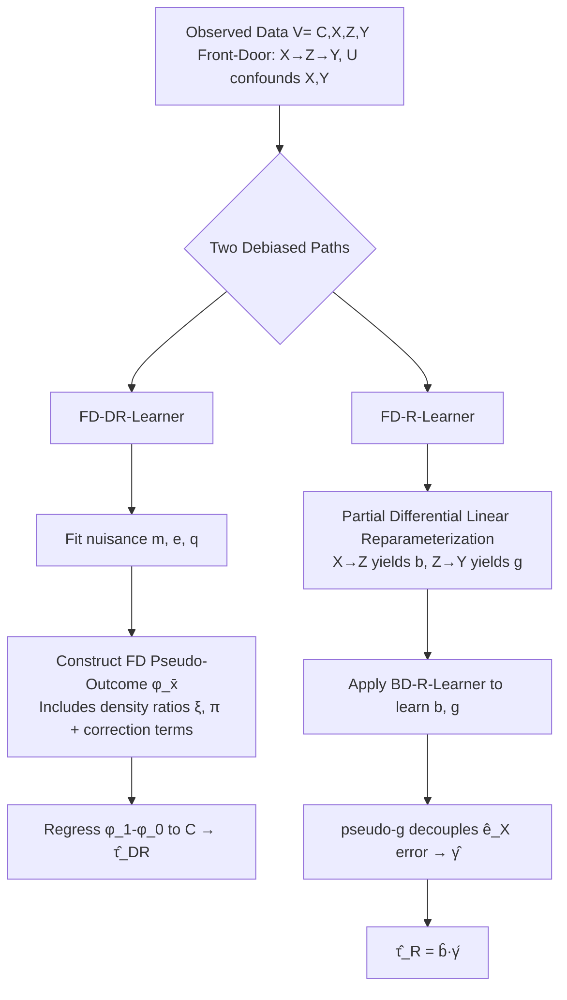

# Debiased Front-Door Learners for Heterogeneous Effects

**Conference**: ICLR 2026  
**Code**: [https://github.com/yonghanjung/FD-CATE](https://github.com/yonghanjung/FD-CATE)  
**Area**: Causal Inference / Heterogeneous Treatment Effects  
**Keywords**: Front-door adjustment, Heterogeneous treatment effects, Debiased learning, quasi-oracle rates, DR-Learner, R-Learner  

## TL;DR
This paper transplants the mature DR-Learner and R-Learner from back-door settings to **front-door identification** scenarios. It proposes two debiased estimators, FD-DR-Learner and FD-R-Learner, ensuring that the conditional front-door effect $\tau(C)$ achieves quasi-oracle rates even when nuisance functions converge at a slow rate of $n^{-1/4}$.

## Background & Motivation
**Background**: Causal inference from observational data faces the significant challenge of unobserved confounding—where the treatment $X$ is interfered with by latent variables $U$ that affect both $X$ and the outcome $Y$. In such cases, $E[Y|X=1]-E[Y|X=0]$ is biased. Pearl's front-door criterion provides a solution: identifying an observable mediator $Z$ that transmits the effect of $X$ to $Y$ (e.g., "Active seatbelt law $X$ → Seatbelt usage rate $Z$ → Occupant fatality $Y$"). As long as $Z$ itself is not confounded by $U$, the causal effect can be identified by bypassing the latent confounding between $X$ and $Y$.

**Limitations of Prior Work**: Although debiased estimation for the front-door direction has been progressed (Fulcher 2019, Guo 2023, Jung 2024, etc.), **nearly all focus on estimating the Average Treatment Effect (ATE)**. However, platforms and policymakers often require the **individualized conditional front-door effect $\tau(C)$**. On another track, while deep estimators for heterogeneous effects exist (LobsterNet by Xu & Gretton 2022, Chen 2025), they **lack debiasedness**—the estimation fails if the nuisance functions are not accurately fitted. In other words, "front-door + heterogeneity + debiasedness" have never been simultaneously satisfied (see comparison in Table 1c of the original paper).

**Key Challenge**: The strength of DR/R-Learners under the back-door setting stems from the debiasedness brought by Neyman orthogonalization, where slow convergence of nuisance functions does not hinder the target. However, the front-door estimator structure is more complex (involving three sets of nuisance functions $m, e, q$ and their density ratio combinations), making it impossible to directly copy the pseudo-outcome construction from the back-door setting.

**Goal**: Construct front-door versions of pseudo-outcomes and orthogonal losses, allowing "arbitrary off-the-shelf ML models + slow nuisances" to converge rapidly to $\tau(C)$. **Core Idea**: (1) **FD Pseudo-Outcome (FDPO)** formulates the front-door effect as a regressible quantity where nuisance errors only appear as second-order terms; (2) **Partial Differential Linear Reparameterization** decomposes the front-door effect into two standard back-door R-Learner sub-problems $b(C)$ ($X \to Z$) and $g(XC)$ ($Z \to Y$), using pseudo-g to decouple the error of the combined term $\gamma_g$ from $\hat{e}_X$.

## Method

### Overall Architecture
Two learners tackle the same goal $\tau(C)=\sum_{z,x}\{q(z|1C)-q(z|0C)\}e_x(C)m(zxC)$ via different paths: **FD-DR-Learner** follows a "single pseudo-outcome regression" path—constructing a pseudo-outcome whose conditional mean exactly equals $\tau_{\bar x}(C)$ and regressing it onto $C$; **FD-R-Learner** follows a "decompose-and-combine" path—rewriting the data generation process into two partial differential linear models, learning the path coefficients $b$ and $g$ using off-the-shelf back-door R-Learners, and then synthesizing them. Both rely on Neyman orthogonal structures to achieve second-order dependence on nuisance errors.

### Key Designs

**1. Front-Door Pseudo-Outcome (FDPO): Formulating the effect as a regressible quantity with second-order sensitivity to nuisance errors.** The core of FD-DR is constructing a pseudo-outcome $\varphi_{\bar x}(V;\eta)$ for each intervention value $\bar x$. it consists of three parts: a residual $Y-m(ZXC)$ weighted by the density ratio $\xi_{\bar x}(ZXC)=q(Z|\bar xC)/q(Z|XC)$, a correction term $r_{me}(ZC)-\nu_{meq}(XC)$ weighted by the inverse propensity $\pi_{\bar x}(XC)=\mathbb{I}(X=\bar x)/e(X|C)$, and a direct term $s_{mq\bar x}(XC)$:

$$\varphi_{\bar x}(V;\eta)=\xi_{\bar x}\{Y-m\}+\pi_{\bar x}\{r_{me}-\nu_{meq}\}+s_{mq\bar x}.$$

The elegance of this construction lies in two properties provided by Lemma 2: **Consistency** $\tau_{\bar x}(C)=E[\varphi_{\bar x}(V;\eta)\mid C]$, meaning regressing $\varphi_1-\varphi_0$ onto $C$ directly yields $\tau(C)$; and **Double Robustness**—when replacing the true values with estimates $\hat\eta$, the bias $E[\varphi_{\bar x}(V;\hat\eta)-\varphi_{\bar x}(V;\eta)]$ consists entirely of **cross-products** of nuisance errors (e.g., $\{\hat m-m\}\{\xi-\hat\xi\}$). Thus, if either $\hat q$ is accurate or $(\hat m, \hat e)$ are accurate, the first-order bias is canceled. Theorem 1 establishes $\|\hat\tau_{DR}-\tau\|_2^2\lesssim R_{DR}+\sum\|\hat m-m\|^2\|\hat\xi-\xi\|^2+\dots$, achieving quasi-oracle rates when all nuisances reach $n^{-1/4}$.

**2. Partial Differential Linear Reparameterization for Front-Door: Splitting one front-door problem into two back-door R-Learners.** Instead of directly handling the complex front-door estimator, FD-R first proves that the front-door structure is equivalent to a set of layered partial differential linear models (Prop. 2): $Z=a(C)+Xb(C)+\epsilon_Z$ describes $X \to Z$, and $Y=f(XC)+Zg(XC)+\epsilon_Y$ describes $Z \to Y$. Since $C$ satisfies the back-door criterion for $(X, Z)$ and $(X, C)$ for $(Z, Y)$, $b(C)$ and $g(XC)$ can be **learned using standard BD-R-Learners**, inheriting their debiasedness (slow nuisances do not impede convergence). Theorem 2 further proves that the heterogeneous front-door effect can be written as the product of these two path coefficients:

$$\tau(C)=b(C)\,\gamma_g(C),\qquad \gamma_g(C)=E[g(XC)\mid C].$$

This steps translates a "hard" front-door estimation into two "solved" sub-problems, with the added benefit that $b$ and $g$ serve as interpretable intermediate quantities of path intensities for $X \to Z$ and $Z \to Y$.

**3. pseudo-g: Decoupling the error of the combined term $\gamma_g$ from the propensity score $\hat e_X$.** After obtaining $\hat b, \hat g$, one must estimate $\gamma_g(C)=e_X(C)g(1C)+\{1-e_X(C)\}g(0C)$. A naive plug-in $\hat\gamma_{plug}$ directly substitutes $\hat e_X$, but its error $\hat\gamma_{plug}-\gamma_g$ contains an $\{g(1C)-g(0C)\}(\hat e_X-e_X)$ term—creating a bottleneck based on the propensity score's accuracy. This paper instead defines pseudo-g:

$$\zeta_{\tilde\eta_z}(XC)=\{1-e_X\}\tilde g(0C)+e_X\,\tilde g(1C)+\{X-e_X\}\{\tilde g(1C)-\tilde g(0C)\}.$$

Lemma 3 shows it satisfies $E[\zeta_{\eta_z}\mid C]=\gamma_g(C)$, and **the bias of $\hat e_X$ in the error correction term is canceled**—$E[\zeta_{\hat\eta_z}\mid C]-\gamma_g$ contains only $e_X\{\hat g(1C)-g(1C)\}+\{1-e_X\}\{\hat g(0C)-g(0C)\}$, which is purely determined by the error of $\hat g$, which can be efficiently learned via BD-R-Learner. Finally, regressing $\zeta$ onto $C$ yields $\hat\gamma$, returning $\hat\tau_R(C)=\hat b(C)\hat\gamma(C)$. Theorem 3 shows its error is controlled by the quasi-oracle rate plus second/fourth-order nuisance error terms, similarly achieving quasi-oracle at $n^{-1/4}$.

## Key Experimental Results

### Synthetic Experiments (True $\tau(C)$ known, nuisances using XGBoost)
Comparing RMSE (mean ± 95% CI) of the plug-in baseline FD-PI, FD-DR, and FD-R across four regimes:

| Experimental Setting | FD-PI (plug-in) | FD-DR | FD-R | Conclusion |
|---|---|---|---|---|
| (a) Varied Sample Size $n$, no structural noise | High | Low | Low | Both debiased learners consistently outperform plug-in |
| (b) Nuisance restricted to $n^{-1/4}$ slow rate | Very slow convergence | Reliable convergence | Reliable convergence | Validates debiasedness |
| (c) Injected noise $\rho\epsilon,\ \rho\in[0,1]$ | Deteriorates sharply with $\rho$ | Stable | **Lower and more stable** | FD-R is least sensitive to nuisance error |
| (d) Weak overlap (positivity approaches 0/1) | Severe degradation | Variance inflation (due to weights) | **Most stable, leading throughout** | FD-R is robust to weak overlap as it avoids density ratios |

### Real Case: State Seatbelt Laws and Fatality Rates (FARS)
State-year panel data, $X$=Active seatbelt law presence, $Z$=Seatbelt usage rate, $Y$=Occupant fatalities, $C$=Covariates:

- The distribution of $\hat\tau$ estimated by both learners is negatively skewed (laws reduce fatalities), with overall means of approximately $-0.047$ (FD-DR) and $-0.046$ (FD-R).
- Concentration curves show that **>95% of units saw a reduction in fatality rates under active laws**, with only a few showing increases, aligning with the expected protective effect of seatbelt laws.
- SHAP attribution indicates that **Age, Time of Day, and Driver status** are the dominant features explaining effect heterogeneity.

### Key Findings
- **Debiasedness is empirically verifiable**: When nuisances only reach the $n^{-1/4}$ slow rate, the plug-in significantly lags, while FD-DR/FD-R still converge rapidly, confirming the theory.
- **Operational division between FD-DR and FD-R**: FD-DR excels with accurate nuisances and sufficient overlap; FD-R is more robust when overlap is weak or nuisances are noisy—consistent with the theoretical assessment in §4.1.

## Highlights & Insights
- **The "Transplant + Reparameterization" paradigm is clean**: Instead of inventing entirely new estimators, the authors translate the front-door problem into solved back-door R-Learner sub-problems and use pseudo-outcomes/orthogonal losses to ensure debiasedness, reusing mature theoretical tools.
- **pseudo-g is the crowning touch**: It precisely identifies and eliminates a hidden source of slow convergence—where the combined term's error is bottlenecked by the propensity score—enabling FD-R to reach quasi-oracle rates.
- **Complementary rather than competitive**: §4.1 provides practitioner guidance (use FD-DR for strong overlap, FD-R for weak overlap) and proposes an adaptive routing mechanism based on overlap levels.
- **Model-agnostic**: Both nuisances and targets can use any off-the-shelf ML (XGBoost used in experiments), lowering the barrier for deployment.

## Limitations & Future Work
- **Reliance on positivity (overlap) assumptions**: Variance inflates as $e(X|C)$ or $q(Z|XC)$ approach 0/1 (especially for FD-DR). The authors suggest overlap diagnostics, ratio stabilization, and overlap-aware uncertainty, planning an adaptive mechanism for automatic routing to FD-R.
- **Limited to binary mediator $Z$**: The theory is established for binary $Z$. Extending this to continuous or multi-dimensional mediators—common in real-world scenarios—is a clear future direction.
- **Lack of direct comparison with deep heterogeneous front-door baselines**: Experiments mainly compare against plug-in; a side-by-side comparison of debiasedness gains against methods like LobsterNet is missing.

## Related Work & Insights
- **Back-door Debiasing Lineage**: AIPW (Robins 1994), TMLE (van der Laan), DR-Learner (Kennedy 2023), R-Learner (Nie & Wager 2021), orthogonal statistical learning (Foster & Syrgkanis 2023), DML (Chernozhukov 2018)—this work effectively migrates DR/R-Learners to the front-door setting.
- **Front-Door Average Effect Debiasing**: Fulcher 2019 (Doubly Robust FD-ATE), Guo 2023 (one-step/TMLE), Jung 2024 (Unified Covariate Adjustment); deep scalable but non-debiased approaches by Xu & Gretton 2022 / Xu 2024.
- **Heterogeneous Front-Door**: LobsterNet (multi-task neural net) by Chen 2025 is the most relevant prior work; this paper fills the gap by adding debiasedness.
- **Insight**: When an identification formula is complex, "reparameterizing into solved standard sub-problems and then designing orthogonal pseudo-outcomes" is a generalizable recipe for other identification criteria (e.g., napkin/general ID).

## Rating
- **Novelty**: ⭐⭐⭐⭐ Simultaneously satisfies "front-door + heterogeneity + debiasedness" for the first time. The pseudo-g decoupling and reparameterization are substantial new constructions while following a mature toolset migration path.
- **Experimental Thoroughness**: ⭐⭐⭐ Synthetic experiments systematically validate the theory across four regimes. The FARS case study is convincing, but a direct comparison with deep heterogeneous front-door baselines is missing.
- **Writing Quality**: ⭐⭐⭐⭐ Clear theoretical derivations. The 3D positioning in Table 1c and the practical guidance in §4.1 are helpful and improve readability.
- **Value**: ⭐⭐⭐⭐ Provides model-agnostic, individualized causal estimation tools with fast convergence guarantees for observational scenarios (policy, healthcare, platforms) where latent confounding exists but compliant mediators are available.

<!-- RELATED:START -->

## Related Papers

- [\[ICLR 2026\] ALM-MTA: Front-Door Causal Multi-Touch Attribution Method for Creator-Ecosystem Optimization](alm-mta_front-door_causal_multi-touch_attribution_method_for_creator-ecosystem_o.md)
- [\[ICLR 2026\] Learning Exposure Mapping Functions for Inferring Heterogeneous Peer Effects](learning_exposure_mapping_functions_for_inferring_heterogeneous_peer_effects.md)
- [\[ICLR 2026\] GDR-learners: Orthogonal Learning of Generative Models for Potential Outcomes](gdr-learners_orthogonal_learning_of_generative_models_for_potential_outcomes.md)
- [\[ICLR 2026\] Topological Causal Effects](topological_causal_effects.md)
- [\[ICLR 2026\] Matching without Group Barrier for Heterogeneous Treatment Effect Estimation](matching_without_group_barrier_for_heterogeneous_treatment_effect_estimation.md)

<!-- RELATED:END -->
