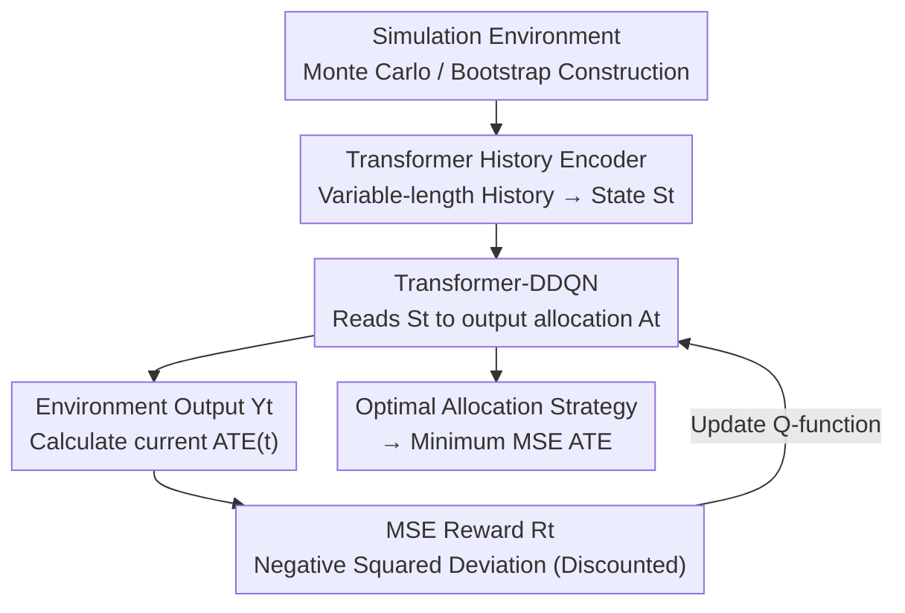

# Designing Time Series Experiments in A/B Testing with Transformer Reinforcement Learning

**Conference**: ICLR2026  
**OpenReview**: [https://openreview.net/forum?id=T9PNKPmjGc](https://openreview.net/forum?id=T9PNKPmjGc)  
**Code**: To be confirmed (authors promised to open-source in supplementary materials)  
**Area**: Causal Inference / Experimental Design / A/B Testing / Reinforcement Learning / Time Series Experiments  
**Keywords**: A/B Testing, Experimental Design, Average Treatment Effect, Carryover Effect, Transformer Reinforcement Learning

## TL;DR
Addressing the problem of how to allocate treatments (new vs. old strategy) in time-series experiments to minimize the MSE of ATE estimation. The paper proves an impossibility theorem stating that "allocation strategies ignoring full history are necessarily suboptimal." It then uses a Transformer to encode the full history into states and a double deep Q-network to learn the optimal allocation strategy using MSE directly as the (negative) reward. Across synthetic data, dispatch simulators, and real ride-hailing data, the MSE of this approach is consistently lower than various switchback and MDP-based designs.

## Background & Motivation

**Background**: A/B testing is the "gold standard" for strategy evaluation in companies like Airbnb, DoorDash, Meituan, Uber, and Didi—randomly assigning experimental units to a treatment group (new strategy) and a control group (old strategy) to estimate the Average Treatment Effect (ATE). However, in scenarios like ride-hailing, platforms apply strategies **sequentially over time to the same market** (e.g., using a new dispatch algorithm in one period and the old one in the next). The data is naturally a time series, rendering classic i.i.d. A/B testing assumptions inapplicable.

**Limitations of Prior Work**: Time-series A/B testing faces three major challenges: (1) **Carryover effects** are prevalent—dispatch or subsidy strategies at one moment change the spatial distribution of drivers, affecting future outputs and violating the SUTVA assumption. Direct application of i.i.d. methods can lead to insignificant ATE estimates. (2) **Treatment effects are extremely small**—improvements from new dispatch strategies are typically only 0.5%~2%, making them hard to distinguish from noise. (3) **Limited experiment duration**—experiments often only run for a few weeks, resulting in small sample sizes. The latter two issues must be mitigated through **meticulous experimental design** (deciding which strategy to deploy at each interval) while accounting for carryover effects.

**Key Challenge**: Existing time-series experimental designs share two fundamental limitations. First, their allocation strategies $\pi_t$ **depend only on finite history**—either just the current observation (Markov design), the initial action (static design), the last $q$ actions (short-memory design), or the time index $t$ (switchback design). Second, to analytically express the MSE optimization objective, they **impose restrictive assumptions** (MDP models, ARMA models, or carryover effects lasting only a few periods). Designs fail when real data violates these assumptions.

**Goal**: To find an optimal treatment allocation strategy $\pi=\{\pi_t\}$ in time-series A/B testing that minimizes the Mean Squared Error $\mathrm{MSE}(\pi)=\mathbb{E}_\pi([\widehat{\mathrm{ATE}}-\mathrm{ATE}]^2)$ without relying on restrictive assumptions, capable of handling arbitrary long-term carryover effects.

**Key Insight**: The authors first theoretically investigate whether "considering only partial history" loses optimality. The answer is yes, and it is **structurally inevitable**. This upgrades the necessity of "viewing the full history" from empirical intuition to a theorem, providing a solid justification for introducing Transformers capable of processing variable-length full history. Since analytical MSE is difficult to compute, RL is used to **directly numerically optimize** the MSE as a reward, completely bypassing modeling assumptions.

**Core Idea**: Use a Transformer to encode the full history as the state and RL to directly minimize the MSE, reframing "time-series experimental design" as a sequential decision-making reinforcement learning problem.

## Method

### Overall Architecture

The design of time-series A/B experiments is reformulated as a sequential decision problem: the experiment lasts $T$ periods. At the start of each period, feature $O_t$ is observed, and the decision-maker selects action $A_t\in\{-1,1\}$ (deploying control strategy -1 or treatment strategy 1). Output $Y_t$ is observed at the end of the period. The entire data sequence $\{O_t,A_t,Y_t\}$ is temporally correlated. This paper focuses on the **complementary design problem**: given an ATE estimator, how to allocate actions over time to minimize the final MSE.

The overall workflow (the RL interaction loop): First, construct a **simulated environment** to approximate the real data generation process. Within the environment, the **full history up to the current moment** is fed into a **Transformer encoder** at each period to obtain state $S_t$. A **Transformer-DDQN agent** processes $S_t$ to output action $A_t$. After the environment returns the output, the "squared deviation between the current ATE estimate and the Monte Carlo ground truth" is used as the **(negative) reward $R_t$**. Trajectories are repeatedly sampled to train the Q-function. Upon convergence, the greedy strategy becomes the optimal allocation strategy to be deployed.

### Key Designs

**1. Impossibility Theorem: Mandating Full History as a Rule**

Existing designs generally let $\pi_t$ depend on finite history information. The authors prove that this "shortcut" loses optimality. Assuming the ATE estimator is a **doubly robust estimator** (widely used in sequential decision-making), it is asymptotically unbiased under mild regularity conditions. Thus, the MSE is equivalent to its asymptotic variance $\mathrm{Var}(\pi)$. Theorem 1 proves: there exists a data generating process $\{P_t\}_t$ such that the optimal strategy $\pi$ that minimizes $\mathrm{Var}(\pi)$ **must depend on the entire past history at every moment $1\le t\le T$, and this optimal strategy is unique**. In other words, if $\pi_t$ misses any observation, action, or output from the past, it cannot be optimal. This result serves as the foundation of the paper, making the use of Transformers for full history a theoretical necessity rather than just an engineering choice.

**2. Transformer History Encoder: Compressing Variable-length History into State**

Since full history is required, the challenge is that the history length grows over time and dimensions vary. The authors define the RL state as the full history $S_t=\{O_1,A_1,Y_1,\dots,O_{t-1},A_{t-1},Y_{t-1},O_t\}$ and encode it using a Transformer with **masked self-attention**. The Transformer is chosen because: first, it naturally handles variable-length inputs to encode arbitrary history into a fixed representation; second, unlike RNNs, it captures **long-range dependencies**, ensuring that all historical variables affecting optimal allocation are utilized. This perfectly addresses carryover effects that persist throughout the experiment.

**3. Transformer-DDQN: Learning Optimal Allocation Greedily**

With the state representation, the authors use a variant of **Double Deep Q-Network (DDQN)** to learn the optimal allocation strategy. The Q-function is defined as:
$$Q_t(S_t,A_t)=\mathbb{E}_{\pi_{\mathrm{opt}}}\Big[\sum_{k=t}^{T}\gamma^{k-t}R_{k-t}\,\Big|\,S_t,A_t\Big],$$
where $\pi_{\mathrm{opt}}$ is the target optimal allocation strategy. The Q-function is parameterized by the masked self-attention Transformer. During training, trajectories are sampled from the simulation environment, and the loss is the squared error between the Q-function and the learning target, optimized using AdamW with cosine learning rate scheduling and gradient clipping. DDQN is used to mitigate overestimation bias in Q-learning.

**4. MSE as Reward: Direct Optimization without Modeling Assumptions**

Existing methods impose MDP/ARMA assumptions primarily to write an analytical MSE for optimization. Ours takes the opposite approach—since RL can numerically optimize any reward, the MSE itself is set as the reward. Specifically, before running RL, a large number of trajectories are run in the simulator using Monte Carlo to calculate $\mathrm{ATE}_{\mathrm{mc}}$ as the oracle ground truth. During RL, at each moment $t$, $\widehat{\mathrm{ATE}}(t)$ is calculated using the triplets up to $t$. The reward is:
$$R_t=-\alpha^{T-t}\big(\widehat{\mathrm{ATE}}(t)-\mathrm{ATE}_{\mathrm{mc}}\big)^2,$$
where $\alpha\in[0,1)$ is a discount factor. The negative sign ensures higher rewards for smaller MSE. The discount factor $\alpha^{T-t}$ downweights early steps where samples are few and ATE estimates are inaccurate. When $\alpha=0$, only the terminal reward $R_T$ matters. This directly anchors the reward to the MSE, allowing $\widehat{\mathrm{ATE}}(t)$ to be **any algorithm**, making the process independent of data generation assumptions.

### Loss & Training

The Q-function is learned using **squared loss** between the Q-value and the learning target. The optimizer is AdamW, paired with a cosine learning rate scheduler, gradient clipping, and mixed-precision training. The simulation environment is constructed in three ways: using a physical simulator if available; **sequentially** (estimating the process daily with collected data to design for the next day); or using **wild bootstrap** (Wu et al., 1986) to create a simulation from A/A data.

## Key Experimental Results

The evaluated designs include: **Ours (TRL)**; MDP-targeted **TMDP/NMDP** (daily switching); and four switchback designs **HW / BSZ / XCT / WSY** (alternating treatments at intervals). Three environments were tested with 400 simulation replicates each, comparing the MSE of ATE estimation.

### Main Results

| Environment | Settings | Conclusion | Representative Data (MSE, lower is better) |
|------|------|------|------|
| Synthetic Simulator | $n\in\{30,..,45\}$ days, $M=4$ intervals | TRL has smallest MSE/shortest CI in most settings | $n=45$ Setting(i): TRL **19** vs NMDP 28 / TMDP 48 / HW 47 |
| Real Ride-hailing A/A | $n\in\{21,..,42\}$, $M\in\{12,24\}$, 5% Lift | TRL consistently optimal, especially for small $n$ | $M=24,n=42$: TRL **67** vs HW 53? / NMDP 106 / TMDP 53 |
| Dispatch Simulator | $9\times9$ grid, 20 steps/day, $n\in\{35,40\}$ | TRL consistently optimal, MSE drops as $n$ grows | $n=40$: TRL **50** vs NMDP 66 / TMDP 62 |

> ⚠️ Note: The above numbers are estimates from the paper's charts (Figure 3–5). Units are $\times10^{-4}$ (synthetic/real) and $\times10^{-2}$ (dispatch). Refer to the original paper for precise values.

### Key Findings

- **Switchback underperforms in synthetic environments**: MSE for HW/BSZ/XCT is significantly higher. NMDP/TMDP are closer to TRL because synthetic data is i.i.d. daily (fitting their MDP assumptions), yet TRL remains superior by utilizing history via Transformer.
- **TMDP/NMDP degrade on real data**: A/A data outputs exhibit positive correlation. In this case, TMDP/NMDP (daily switching) lose optimality, while switchback and TRL benefit. TRL achieves the lowest MSE, particularly when sample size $n$ is small—addressing the limited duration pain point.
- **Greater advantage with fewer samples**: Across environments, TRL’s lead over baselines widens as $n$ decreases, indicating its capability to extract maximal information from history in small-sample regimes.

## Highlights & Insights

- **Reframing Experimental Design as RL Optimization**: The most ingenious step is recognizing that if analytical MSE requires assumptions, one should use RL to numerically optimize the MSE. Setting reward $R_t$ to reference the squared deviation uncouples the design from MDP/ARMA assumptions.
- **Theory Precedes Modeling**: The "Impossibility Theorem" justifies the Transformer. The motivation isn't "using Transformer because it's powerful," but "theory requires full history, and Transformer is the tool to process variable-length full history."
- **MSE-Specific Discounting**: The $\alpha^{T-t}$ discounting downweights early, noisy ATE estimates. This encodes the statistical intuition that estimation precision improves over time directly into the reward structure.

## Limitations & Future Work

- **Dependence on Simulator Fidelity**: The reward $\mathrm{ATE}_{\mathrm{mc}}$ is the ground truth in the simulator. If the simulator deviates from the real data generating process, the "optimal design" may only be optimal for the simulator.
- **Binary Treatments and Single Unit**: Actions are limited to $A_t\in\{-1,1\}$, and the method does not currently handle spillover or interference across multiple units.
- **Computational Cost**: Transformer-DDQN is significantly heavier than analytical designs. Furthermore, real-world ride-hailing data is often restricted by privacy agreements, limiting external reproducibility.
- **Lack of Theoretical Gap Analysis**: While the method proves partial history is suboptimal, it doesn't theoretically bound how close TRL gets to the unique optimal strategy; its advantage is primarily demonstrated empirically.

## Related Work & Insights

- **vs. Markov Designs (Glynn et al., 2020)**: They use finite MDPs where $\pi_t$ depends only on $O_t$. Ours proves this is suboptimal and uses full history with RL to bypass MDP assumptions.
- **vs. Static / Neyman Designs (Li et al., 2023a, TMDP/NMDP)**: They extend Neyman allocation to MDPs with intra-day fixed treatments where $\pi_t$ depends on the first action. These fail on real-world positively correlated data where TRL succeeds.
- **vs. Switchback Designs (Bojinov et al., 2023; Wen et al., 2025)**: They alternate treatments at fixed/random intervals where $\pi_t$ depends only on time. Ours does not restrict the switching pattern, making allocation conditional on the full history.

## Rating
- Novelty: ⭐⭐⭐⭐⭐ The combination of the impossibility theorem, Transformer history encoding, and MSE-as-reward is a fresh perspective in experimental design.
- Experimental Thoroughness: ⭐⭐⭐⭐ Covered synthetic, dispatch simulators, and real ride-hailing data with 400 replicates. However, results are mainly in charts, and real data is proprietary.
- Writing Quality: ⭐⭐⭐⭐ Clear theoretical motivation and methodological narrative. Reward and theorem sections may be challenging for non-statisticians.
- Value: ⭐⭐⭐⭐⭐ Directly addresses industrial A/B testing pain points (small effects, short duration, carryover effects). High potential for deployment in platform economies.

<!-- RELATED:START -->

## Related Papers

- [\[ICLR 2026\] TCD-Arena: Assessing Robustness of Time Series Causal Discovery Methods Against Assumption Violations](tcd-arena_assessing_robustness_of_time_series_causal_discovery_methods_against_a.md)
- [\[ICLR 2026\] Journey to the Centre of Cluster: Harnessing Interior Nodes for A/B Testing under Network Interference](journey_to_the_centre_of_cluster_harnessing_interior_nodes_for_ab_testing_under_.md)
- [\[ICLR 2026\] Resisting Contextual Interference in RAG via Parametric-Knowledge Reinforcement](resisting_contextual_interference_in_rag_via_parametric-knowledge_reinforcement.md)
- [\[NeurIPS 2025\] A Principle of Targeted Intervention for Multi-Agent Reinforcement Learning](../../NeurIPS2025/causal_inference/a_principle_of_targeted_intervention_for_multi-agent_reinforcement_learning.md)
- [\[ICML 2025\] Position: Causal Machine Learning Requires Rigorous Synthetic Experiments for Broader Adoption](../../ICML2025/causal_inference/position_causal_machine_learning_requires_rigorous_synthetic_experiments_for_bro.md)

<!-- RELATED:END -->
