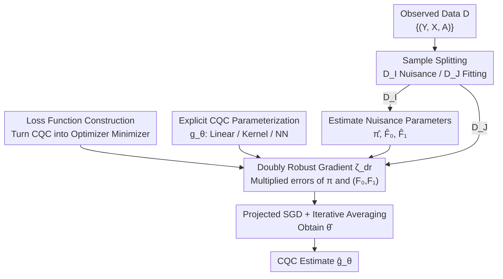

# Direct Doubly Robust Estimation of Conditional Quantile Contrasts

**Conference**: ICLR 2026  
**arXiv**: [2601.19666](https://arxiv.org/abs/2601.19666)  
**Code**: Reproduction code provided in supplementary materials  
**Area**: Causal Inference  
**Keywords**: heterogeneous treatment effect, conditional quantile comparator, doubly robust estimation, causal inference, quantile treatment effect

## TL;DR

Ours proposes the first **direct estimation method** for the Conditional Quantile Comparator (CQC). By explicitly parameterizing the CQC and combining it with doubly robust gradient descent, the method maintains theoretical double robustness while consistently outperforming existing indirect inversion methods in estimation accuracy, interpretability, and computational efficiency in experiments.

## Background & Motivation

**Background**: Heterogeneous Treatment Effect (HTE) analysis aims to learn the differentiated impacts of treatments on different individuals. CATE (Conditional Average Treatment Effect) and CQTE (Conditional Quantile Treatment Effect) are two classic estimators—CATE is highly interpretable but only provides mean information, while CQTE provides quantile-level information but is less interpretable.

**Limitations of Prior Work**: The recently proposed CQC (Conditional Quantile Comparator) attempts to combine the advantages of both by providing a transport mapping from the untreated response to the treated response. However, existing CQC estimation methods (Givens et al., 2024) require estimating an intermediate quantity (the CCDF contrast function $h$) followed by **inversion** to obtain the CQC estimate. This presents three problems: the CQC cannot be directly modeled or constrained; estimation error depends on the complexity of the intermediate function rather than the CQC itself; and evaluation incurs high computational overhead.

**Key Challenge**: The CQC itself may be very simple (e.g., the treatment effect is a linear scaling of the response $g^*(y_0|\mathbf{x}) = 2y_0$), but the estimation accuracy of indirect inversion methods is limited by the more complex intermediate function $h$.

**Goal**: Provide the first method for direct CQC estimation, allowing explicit parameterization of the CQC so that estimation error directly depends on the CQC's complexity.

**Key Insight**: Transform CQC estimation into an M-estimation problem—construct a loss function where the CQC is the minimizer and derive a doubly robust expression for its gradient, thereby achieving direct estimation via gradient descent.

**Core Idea**: By constructing a loss function and deriving its doubly robust gradient, the method bypasses intermediate function inversion, achieving the first direct parameterized estimation of CQC.

## Method

### Overall Architecture

The objective of this paper is to determine whether it is possible to skip intermediate functions and directly fit the Conditional Quantile Comparator (CQC) as the target of estimation using a parameter $\theta$. Prior approaches (Givens et al., 2024) followed a roundabout path—first estimating the CCDF contrast function $h$ and then inverting $h$ to obtain the CQC, which ties the estimation error to the complexity of $h$. This work reformulates the task as an M-estimation problem: constructing a loss function such that the true CQC $g^*$ is exactly the minimizer, then deriving the doubly robust form of its gradient. Consequently, the CQC can be trained directly using stochastic gradient descent like a standard parametric model.

The data-driven workflow consists of two steps. Given observations $D = \{(Y^{(i)}, X^{(i)}, A^{(i)})\}_{i=1}^{2n}$, **sample splitting** is performed: half of the data $D_\mathcal{I}$ is used to estimate nuisance parameters (propensity score $\hat{\pi}$ and two conditional CDFs $\hat{F}_0, \hat{F}_1$), and the other half $D_\mathcal{J}$ is used to fit the CQC parameter $\theta$. Stochastic gradient descent is then performed on $D_\mathcal{J}$ using the doubly robust gradient $\hat{\zeta}_{dr}$. Sample splitting ensures that nuisance parameter estimation and CQC fitting use non-overlapping data, preventing overfitting from contaminating the convergence analysis.

### Key Designs

**1. Loss Function Construction: Replacing "Root-Finding" with "Minimization"**

Indirect methods require inversion because CQC is defined as the root of $h=0$—finding a root naturally requires estimating the entire function $h$. This paper takes a different perspective: since the CCDF contrast function $h(y_1, y_0, \mathbf{x}) = F_1(y_1|\mathbf{x}) - F_0(y_0|\mathbf{x})$ is monotonically increasing with respect to $y_1$, any function whose derivative equals $h$ will reach its minimum at $h=0$ (i.e., $y_1 = g^*(y_0|\mathbf{x})$). Following this observation, Definition 2 defines the loss as the integral from the optimal point to the current point:

$$\bar{\ell}(y_1, y_0, \mathbf{x}) = \int_{g^*(y_0|\mathbf{x})}^{y_1} h(t, y_0, \mathbf{x})\, dt$$

Thus, the CQC transitions from being a "root of an equation" to a "minimizer of a loss," which can be approximated directly using optimizers. More importantly, Proposition 1 proves a direct upper and lower bound relationship between this loss value and the CQC estimation error. Consequently, the final estimation accuracy depends on the simplicity of the CQC itself rather than the complexity of the intermediate function $h$.

**2. Doubly Robust Gradient $\zeta_{dr}$: Multiplying Rather Than Adding Errors**

Once the loss is established, the gradient is required, but it contains unknown nuisance parameters. The naive IPW (Inverse Probability Weighting) only uses the propensity score $\pi$; if $\pi$ is biased, the entire gradient becomes biased. Equation 5 in the paper provides a doubly robust Monte-Carlo estimator:

$$\zeta_{dr}(\theta, y_0, \mathbf{z}) = \nabla_\theta g_\theta(y_0|\mathbf{x}) \left( \frac{a}{\pi(\mathbf{x})}[\mathbb{1}\{y \le g_\theta\} - F_1(g_\theta)] - \frac{1-a}{1-\pi(\mathbf{x})}[\mathbb{1}\{y \le y_0\} - F_0(y_0)] + F_1 - F_0 \right)$$

It introduces CCDF estimates $F_0, F_1$ as correction terms alongside the propensity score. The benefit of double robustness is that as long as either $\pi$ or $(F_0, F_1)$ is accurately estimated, the gradient remains unbiased. The estimation errors of the two types of nuisance parameters are **multiplied** in the final error term rather than being added, making the method much more tolerant of the estimation quality of nuisance parameters.

**3. Explicit Parameterization of CQC: Embedding Interpretability into Model Structure**

Indirect methods can only evaluate CQC at sampled points and cannot yield a checkable global form. Because this work uses direct estimation, users can freely choose parameter families—linear models, kernel methods, or neural networks. For example, in a linear model:

$$g_\theta(y_0|\mathbf{x}) = (\theta_{sc}^\top \mathbf{x} + \theta_{sc,0})\, y_0 + (\theta_{sh}^\top \mathbf{x} + \theta_{sh,0})$$

The first term is a **scaling component** that varies with $y_0$, and the second is a **shifting component** independent of $y_0$. The structure of the treatment effect is explicitly decomposed into "how much magnification + how much translation," which can be read directly from the parameters. Explicit parameterization also allows regularizing or bandwidth selection to impose prior knowledge (e.g., treatment effects should be smooth or scaling components should be restricted) directly onto the model.

### Loss & Training

Training utilizes sample splitting in conjunction with projected stochastic gradient descent. Parameters start at $\theta^{(1)} = 0$. After each gradient update, the parameter is projected back into a ball of $\|\theta\| \le B$ to ensure boundedness. The learning rate is chosen based on the scenario: $\mu_t = \frac{Bc}{2\rho\sqrt{n}}$ for general cases, and a more aggressive $\mu_t = \frac{1}{\xi_2 \eta_2 n}$ when the density has a lower bound (better condition). The final estimate is not the last step but an average of all iterations $\hat{\theta} = \frac{1}{n}\sum_{t=1}^n \theta^{(t)}$, which is the form for which the convergence bound (typically $O(1/\sqrt{n})$) holds.

## Key Experimental Results

### Main Results

Data Generation: $X \sim N(0, I_{10})$, $Y|X,A \sim N(\sin(\pi \mathbf{v}^\top \mathbf{x}) + a\gamma \mathbf{v}^\top \mathbf{x}, 1)$, $\pi(\mathbf{x}) = \sigma(\mathbf{v}^\top \mathbf{x})$

True CQC: $g^*(y_0|\mathbf{x}) = y_0 + \gamma \mathbf{v}^\top \mathbf{x}$ (linear), while the CCDF contrast function contains high-frequency sine terms.

| Experiment | Est. DR-Lin | Est. DR-NN | Est. Inv. DR | Est. IPW |
|------|------------|-----------|-------------|---------|
| CQC Slope γ=1 (MAE) | **Lowest** | Close to DR-Lin | Higher | Highest |
| CQC Slope γ=4 (MAE) | **Lowest** | Close to DR-Lin | Significantly Degraded | Severely Degraded |
| Sample Size n=200 (MAE) | **Lowest** | Slightly Higher | Higher | High |
| Sample Size n=2000 (MAE) | **Lowest** | Slightly Higher | Higher | High |

### Ablation Study

Sensitivity to nuisance parameter estimation error (adding different levels of biased noise to logits):

| Noise Level | Est. DR-Lin | Est. DR-NN | Est. Inv. DR | Est. IPW |
|---------|------------|-----------|-------------|---------|
| 0 (No extra noise) | **Lowest** | Near Lowest | Medium | Medium-High |
| 0.5 | **Lowest** | Slightly Higher | Close | Higher |
| 1.0 | **Lowest** | Slightly Higher | Slightly higher than DR-Lin | High |
| 2.0 | Close | Slightly Higher | **Close** | Significantly High |

### Key Findings

1. Direct parameterization methods (DR-Lin, DR-NN) consistently outperform indirect inversion methods across all sample sizes and CQC slope settings.
2. As the CQC slope increases, the advantage of the direct method becomes more pronounced—because the CCDF contrast function becomes complex while the CQC remains simple.
3. Robustness to nuisance parameter error: Both methods demonstrate double robustness, but the indirect method is slightly less sensitive under high noise levels.
4. The neural network model (DR-NN) performs well even without knowing the true parametric form, only slightly trailing the correctly specified linear model.
5. **Real-world data (employment project)**: CQC estimates reveal that as age increases, the treatment effect shifts from multiplicative scaling to uniform translation.

## Highlights & Insights

1. **First Direct Estimation of CQC**: Bypasses intermediate function inversion, directly linking estimation accuracy to CQC complexity.
2. **Theoretical Convergence Guarantees**: Theorem 3 provides finite sample bounds, $O(1/\sqrt{n})$ in general cases and $O(\log n / n)$ when density is bounded from below.
3. **Interpretability through Explicit Parameterization**: Model parameters can be directly inspected to understand the structure of treatment effects (e.g., scaling vs. shifting components), rather than only being evaluable at sampled points.
4. **Simplicity of CQC under Non-uniform Effects**: When treatment effects are scaling-based (e.g., doubling income), the CQC is a simple linear $g^*(y) = 2y$, whereas CATE and CQTE may contain complex high-frequency terms.

## Limitations & Future Work

1. The actual sensitivity of the direct estimator to nuisance parameter error is slightly higher than that of indirect methods (despite both being theoretically doubly robust), warranting further investigation.
2. Double robustness applies to the loss function rather than directly to the CQC estimation error—it only translates to CQC error bounds under specific conditions (Proposition 1(b)).
3. Convergence results only apply to parametrically linear models ($g_\theta = \theta^\top f$) and do not cover non-linear parameterizations such as deep neural networks.
4. Future Work: Explore whether a CQC doubly robust estimator in conditional expectation form (similar to the DR-learner for CATE) can be developed.

## Related Work & Insights

- **CATE Estimation**: Kennedy (2023b)'s DR-learner provides a doubly robust direct estimation of CATE—this work extends similar ideas to quantile-level CQC.
- **CQTE Estimation**: Kallus & Oprescu (2023)'s doubly robust CQTE estimation—CQC relates to CQTE via $\tau_q\{F_0(y_0|\mathbf{x})|\mathbf{x}\} = g(y_0|\mathbf{x}) - y_0$.
- **Random Fourier Features**: Linear parameterization assumptions can be extended to non-parametric kernel methods using Random Fourier Features.

## Rating

- Novelty: ⭐⭐⭐⭐ First direct CQC estimator with a clever approach using M-estimation for loss construction, though it remains within the HTE doubly robust framework.
- Experimental Thoroughness: ⭐⭐⭐⭐ Multi-dimensional simulation comparisons (slope, sample size, noise) + real data + ablation, though experiments on high-dimensional X and non-linear CQC are limited.
- Writing Quality: ⭐⭐⭐⭐⭐ Clear motivation, rigorous mathematical derivation, and intuitive visualization (Figure 1 comparing CQC vs CATE/CQTE).
- Value: ⭐⭐⭐⭐ Significant advancement in HTE estimation within causal inference, though CQC is still a relatively new estimator whose application range needs further expansion.

<!-- RELATED:START -->

## Related Papers

- [\[ICLR 2026\] Overlap-Adaptive Regularization for Conditional Average Treatment Effect Estimation](overlap-adaptive_regularization_for_conditional_average_treatment_effect_estimat.md)
- [\[ICLR 2026\] IGC-Net for Conditional Average Potential Outcome Estimation Over Time](igc-net_for_conditional_average_potential_outcome_estimation_over_time.md)
- [\[ICLR 2026\] Causal Discovery via Quantile Partial Effect](causal_discovery_via_quantile_partial_effect.md)
- [\[ICML 2025\] Doubly Protected Estimation for Survival Outcomes Utilizing External Controls for Randomized Clinical Trials](../../ICML2025/causal_inference/doubly_protected_estimation_for_survival_outcomes_utilizing_external_controls_fo.md)
- [\[ICLR 2026\] Counterfactual Explanations on Robust Perceptual Geodesics](counterfactual_explanations_on_robust_perceptual_geodesics.md)

<!-- RELATED:END -->
