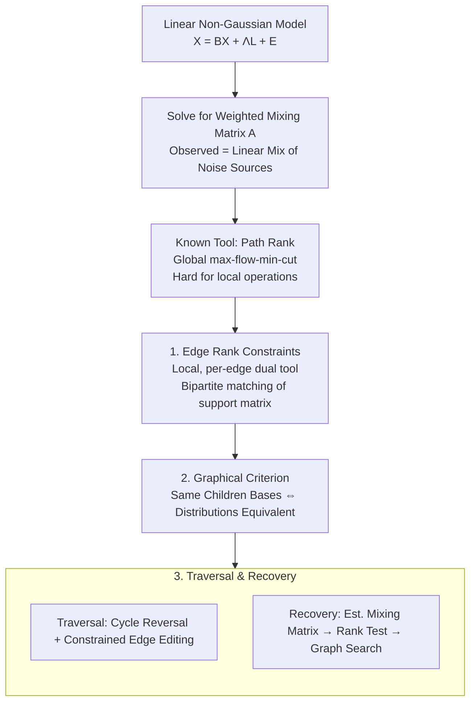

# Distributional Equivalence in Linear Non-Gaussian Latent-Variable Cyclic Causal Models

**Conference**: ICLR 2026 (Oral)  
**arXiv**: [2603.04780](https://arxiv.org/abs/2603.04780)  
**Code**: [MarkDana/Equiv-LiNG-Latent](https://github.com/MarkDana/Equiv-LiNG-Latent) / [Live Demo](https://equiv.cc/)  
**Area**: Causal Inference / Causal Discovery  
**Keywords**: Causal Discovery, Latent Variables, Cyclic Causal Models, Distributional Equivalence, Edge Rank Constraints, Non-Gaussian Models

## TL;DR

This work provides the first complete graphical criterion for distributional equivalence between causal graphs containing both latent variables and cycles under the linear non-Gaussian setting without relying on any structural assumptions. The core tool introduced is **edge rank constraints**. Based on this, algorithms for traversing equivalence classes and recovering causal models from data are developed—marking the first equivalence characterization and discovery method for parametric causal models without structural assumptions.

## Background & Motivation

**Background**: Causal discovery aims to infer causal relationships from observed data, which is a fundamental task in causal inference. In real-world scenarios, data often involve unobserved latent variables and causal cycles, such as feedback loops in gene regulatory networks or mutual causality in economic systems. These factors make causal discovery an extremely challenging problem.

**Limitations of Prior Work**:
1. Most methods require latent variables to follow specific indicator patterns (e.g., each latent variable must affect at least two observed variables and cannot be shared).
2. Some methods restrict latent variables to interacting only in specific ways (e.g., no direct latent-to-latent causal relationships).
3. Almost all methods prohibit cycles in the causal graph, processing only DAG structures.
4. These structural assumptions are frequently violated in practical applications, severely limiting the scope of these methods.

**Key Challenge**: The primary obstacle toward a general, structural-assumption-free method is the **lack of equivalence characterization**. Typically, identification methods cannot be designed without knowing what can be identified (i.e., which graphs generate identical observed distributions). Without an equivalence theory, the upper bound of reachable precision for causal discovery remains unknown.

**Goal**: Establish a complete theory of equivalence under the linear non-Gaussian model (LiNG-Latent). The core innovation is the introduction of **edge rank constraints**, a new tool that fills the gap left by current independence constraints which are incomplete in latent variable settings, thereby achieving a complete graphical criterion.

## Method

### Overall Architecture

This paper does not propose a new estimator but first clarifies which causal graphs are indistinguishable under the most general linear non-Gaussian setting with latent variables and cycles. It then designs algorithms for traversing equivalence classes and recovering models from data. The framework revolves around the model $X = BX + \Lambda L + E$: where $X$ is the vector of observed variables, $B$ is the coefficient matrix between observed variables (allowing cycles), $L$ represents latent variables, $\Lambda$ is the effect matrix from latents to observed variables, and $E$ is non-Gaussian independent noise. Solving this yields $X = A E$, where each observed variable is expressed as a linear mixture of all noise sources (including latent-driven terms). This **weighted mixing matrix** $A$ encodes the complete causal structure. Consequently, determining whether "two graphs are equivalent" translates to whether "the sets of mixing matrices they can generate are identical."

The method proceeds in three stages: Building upon known **path ranks** which are globally defined and difficult for local graph operations, the authors introduce the **edge rank constraints** (Design 1) as a local, per-edge dual tool. These are used to simplify equivalence criteria into checkable **graphical criteria** (Design 2), which are finally implemented in algorithms for **equivalence class traversal and data recovery** (Design 3).

### Key Designs

**1. Edge Rank Constraints: A local, per-edge dual tool to complement global path ranks**

Traditional latent-variable causal discovery relies heavily on **independence constraints**—if no causal path exists between two variables, they should be statistically independent. However, this is incomplete when latent variables exist, as two observed variables may be correlated via a common latent even without a direct causal path. A more general tool is the **rank constraint**—examining the rank of submatrices of the mixing matrix, where independence is a special case (rank 0). This corresponds to the **path rank** $\rho_G(Z,Y)$, defined by the maximum number of vertex-disjoint paths from $Y$ to $Z$ (max-flow-min-cut). While path ranks are theoretically sufficient for equivalence, they are **global**; a single edge modification can unpredictably change global path ranks, making them unsuitable for structure search. The authors propose the **edge rank** $r_G(Z,Y)$, defined via the "maximum bipartite matching from $Y$ to $Z$" on the binary **support matrix** $Q(G)$ ($\mathrm{mrank}(Q(G)_{Z,Y})=r_G(Z,Y)$), proving its **duality** with path rank. Being local and edge-operable, edge ranks enable efficient graph traversal.

**2. Graphical Criteria for Distributional Equivalence: Simplifying "Indistinguishability" to Checkable "Children Bases"**

Criteria based solely on path ranks are impractical as they require checking all vertex permutations and $(Z,Y)$ subsets, which is exponentially complex. The locality of edge ranks allows the criterion to be decomposed into checking **individual observed variables** $X_i$. The final graphical criterion states: two irreducible models are distributionally equivalent if and only if there exists a permutation $\pi$ such that their "children bases" (families of subsets $\mathrm{bases}_G(Y)$ defined by perfect matchings) are identical on $L$ and every $L\cup\{X_i\}$. This reduces global conditions to local checks akin to "same adjacencies and v-structures." Non-Gaussianity serves as a lever: compared to Gaussian models, non-Gaussian noise provides extra identifiable information, resulting in finer equivalence classes, consistent with the LiNGAM tradition.

**3. Equivalence Class Traversal and Data Recovery: Implementing Criteria into Algorithms**

The graphical criterion only determines equivalence; it does not generate classes or recover models. This work provides algorithms for both. Traversal uses a **transformation characterization** similar to the Meek conjecture: applying two types of edits—(a) reversing disjoint simple cycles and (b) adding/deleting edges based on whether $V_j$ is a "coloop" in the support matrix—while maintaining edge rank constraints. Recovery follows the inverse chain: estimating the mixing matrix via Overcomplete ICA (OICA), determining the number of latents, identifying valid edge rank constraints/children bases via matrix rank tests, and finally searching for graphs that satisfy all constraints. This constitutes the first latent causal discovery method requiring no structural assumptions.

## Key Experimental Results

### Main Results: Validation of Equivalence Characterization

| Experimental Setting | Evaluation | Key Results |
|---------|---------|---------|
| Synthetic (No cycles, no latents) | Degenerates to LiNGAM setting | Fully consistent with known results, verifying correctness |
| Synthetic (Cycles, no latents) | Cyclic causal models | Graphical criterion correctly identifies all equivalent/non-equivalent pairs |
| Synthetic (No cycles, with latents) | Latent Variable DAGs | Edge rank constraints provide finer equivalence classes than independence constraints alone |
| Synthetic (Cycles + Latents) | Most general setting | Criterion is complete—graphs within the equivalence class are truly indistinguishable |
| Interactive Demo (equiv.cc) | User-defined validation | Users manually specify graphs; the system displays the equivalence class in real-time |

### Ablation Study: Contribution of Constraint Types

| Constraint Combination | Equivalence Class Granularity | Strength of Identifiability |
|---------|-----------|-------------|
| Independence Constraints Only | Coarse (multiple non-equivalent graphs merged) | Weak |
| Independence + Edge Rank | Finest (Exact equivalence class) | **Strongest** |
| Gaussian Model + All Constraints | Intermediate | Medium (Non-Gaussianity provides extra info) |
| Non-Gaussian + Rank Only (No Indep.) | Near Finest | Strong (Rank constraints encompass independence) |

### Key Findings

- **Edge rank constraints are indispensable**: Relying only on independence results in multiple non-equivalent graphs being erroneously grouped; edge rank constraints narrow the class precisely.
- **Non-Gaussianity provides significant identifiability**: Compared to Gaussian models, the equivalence classes are smaller (more graphs are distinguishable), which aligns with classical LiNGAM conclusions.
- **Cycles do not fundamentally obstruct causal discovery**: Cyclic relationships expand equivalence classes but do not make the problem unsolvable.
- **Complexity is manageable**: While equivalence class size grows with graph complexity, the method remains tractable for medium-scale graphs ($\sim$10 variables).

## Highlights & Insights

- **Strong Theoretical Breakthrough**: The first complete characterization of equivalence for parametric causal models without structural assumptions—a milestone in the field.
- **ICLR 2026 Oral**: The Oral presentation status reflects the high recognition of its theoretical contribution by reviewers.
- **Independent Value of New Tools**: Edge rank constraints have broader potential applications beyond this paper for various latent variable causal discovery problems.
- **Precise Problem Positioning**: The insight that "equivalence characterization is the prerequisite for general methods" provides epistemological guidance for the causal discovery community.
- **High Practicality**: The availability of open-source code and the interactive demo at equiv.cc lowers the barrier for entry.

## Limitations & Future Work

- Limited to linear model assumptions; non-linear causal relationships are not addressed.
- The non-Gaussian assumption may not hold in some domains (e.g., nearly Gaussian financial data).
- The computational complexity of the search algorithm grows exponentially with the number of variables, leaving scalability for large-scale problems (>20 variables) to be verified.
- Equivalence class traversal faces combinatorial explosion in extremely large classes.
- Systematic evaluation on large-scale real-world datasets is currently lacking (experiments focus on synthetic and small-scale validation).
- Potential for extension to mixed non-Gaussian-Gaussian or partially non-linear model settings.

## Rating

- Novelty: ⭐⭐⭐⭐⭐
- Experimental Thoroughness: ⭐⭐⭐
- Writing Quality: ⭐⭐⭐⭐
- Value: ⭐⭐⭐⭐⭐

<!-- RELATED:START -->

## Related Papers

- [\[AAAI 2026\] I-CAM-UV: Integrating Causal Graphs over Non-Identical Variable Sets Using Causal Additive Models with Unobserved Variables](../../AAAI2026/causal_inference/i-cam-uv_integrating_causal_graphs_over_non-identical_variable_sets_using_causal.md)
- [\[ICML 2025\] Estimating Causal Effects in Gaussian Linear SCMs with Finite Data](../../ICML2025/causal_inference/estimating_causal_effects_in_gaussian_linear_scms_with_finite_data.md)
- [\[ICML 2025\] Latent Variable Causal Discovery under Selection Bias](../../ICML2025/causal_inference/latent_variable_causal_discovery_under_selection_bias.md)
- [\[ICLR 2026\] Conditional Independent Component Analysis for Estimating Causal Structure with Latent Variables](conditional_independent_component_analysis_for_estimating_causal_structure_with_.md)
- [\[ICML 2026\] Causal-JEPA: Learning World Models through Object-Level Latent Masking](../../ICML2026/causal_inference/causal-jepa_learning_world_models_through_object-level_latent_masking.md)

<!-- RELATED:END -->
