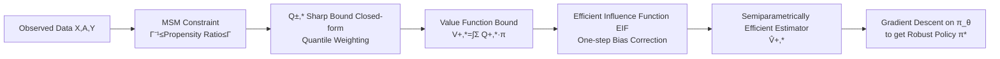

# Efficient and Sharp Off-Policy Learning under Unobserved Confounding

**Conference**: ICLR 2026  
**OpenReview**: [https://openreview.net/forum?id=7nTKiJLkWS](https://openreview.net/forum?id=7nTKiJLkWS)  
**Code**: [https://github.com/konstantinhess/Efficient_sharp_policy_learning](https://github.com/konstantinhess/Efficient_sharp_policy_learning)  
**Area**: Causal Inference / Off-Policy Learning / Sensitivity Analysis  
**Keywords**: Unobserved Confounding, Marginal Sensitivity Model (MSM), Semiparametric Efficiency, Sharp Bound, Robust Policy Learning  

## TL;DR
This work derives a **closed-form expression + semiparametrically efficient estimator** for the sharp bounds of the value function in personalized off-policy learning under unobserved confounding. It simplifies the originally unstable minimax optimization into a standard minimization problem and proves that minimizing this estimator yields the optimal confounding-robust policy.

## Background & Motivation
- **Background**: Off-policy learning aims to learn the optimal policy for treatment assignment given covariates from observational data. Standard approaches (DM/IPW/DR) rely on the **unconfoundedness assumption**, which posits that observed covariates $X$ capture all factors influencing both treatment selection and outcomes.
- **Limitations of Prior Work**: In reality, the unconfoundedness assumption is almost always violated. For instance, a patient's ethnicity may influence treatment access, but it is often unrecorded. When unobserved confounding $U$ exists, the value function $V(\pi)$ is **not point-identified**, causing standard methods to yield biased estimates or even "harmful" policies.
- **Key Challenge**: The only existing method for this task, Kallus & Zhou (2018a/2021), utilizes the Marginal Sensitivity Model (MSM) for robust learning but suffers from two major drawbacks: (i) it requires solving a **minimax optimization** based on IPW results, which is unstable; (ii) it **lacks semiparametric efficiency**, resulting in high variance, poor finite-sample performance, and bounds that are not sharp.
- **Goal**: Within the MSM framework, derive a closed-form solution for the worst-case bound of the value function and construct a semiparametrically efficient estimator proven to lead to the optimal robust policy.
- **Core Idea**: **Analytically resolve the "inner sup" before optimization.** By expressing the sharp bounds of $Q(a,x)$ in a closed-form (quantile-weighted) via the MSM, the worst-case value $V^{+,*}(\pi)=\sup_{\tilde p\in\mathcal P(\Gamma)}V(\pi)$ obtains an explicit expression. This reduces the minimax problem to a simple minimization over $\pi$. One-step bias correction (based on the efficient influence function) is then applied to ensure the estimator achieves minimum variance.

## Method

### Overall Architecture
The method consists of a four-step pipeline: ① Using the MSM to constrain the ratio of the true propensity score to the nominal propensity score (confounding strength characterized by $\Gamma\ge 1$); ② Deriving the closed-form quantile-weighted expressions for the sharp bounds of the conditional mean of potential outcomes $Q^{\pm,*}(a,x)$, thereby obtaining the closed-form for the value function bounds $V^{\pm,*}(\pi)$; ③ Deriving the **efficient influence function (EIF)** for these bounds to construct a one-step bias-corrected estimator $\hat V^{+,*}(\pi)$, achieving semiparametric efficiency; ④ Parameterizing the policy class as a neural network $\pi_\theta$ and performing gradient descent on $\hat V^{+,*}(\pi_\theta)$ (with sample splitting/cross-fitting) to obtain the robust policy.

### Key Designs

**1. Analytically resolving the inner sup of the minimax into closed-form sharp bounds:** This is the "lever point" of the paper. The original objective is $\pi^*=\arg\min_{\pi}\sup_{\tilde p\in\mathcal P(\Gamma)}V(\pi)$, where the inner supremum over all distributions compatible with the MSM is the root of Kallus & Zhou's numerical minimax instability. The authors prove (Prop. 4.1) that the sharp upper bound can be decomposed pointwise: $V^{\pm,*}(\pi)=\int_{\mathcal X}\sum_a Q^{\pm,*}(a,x)\,\pi(a\mid x)\,dp(x)$, where $Q^{\pm,*}$ has the closed-form $Q^{\pm,*}(a,x)=c^{\mp}(a,x)\mu^{\pm}(a,x)+c^{\pm}(a,x)\bar\mu^{\pm}(a,x)$. Here $c^{\pm}(a,x)=b^{\pm}e(a,x)+\Gamma^{\pm1}$, $b^{\pm}=1-\Gamma^{\pm1}$, and $\mu^{\pm},\bar\mu^{\pm}$ are truncated conditional expectations of the outcome $Y$ partitioned by conditional quantiles $F^{-1}_{x,a}(\alpha^{\pm})$ (with $\alpha^+=\Gamma/(1+\Gamma)$). Intuitively, the worst case equates to "piling probability mass into the tail of the distribution that yields the worst outcome within MSM limits," making the bound determined by quantile thresholds. Consequently, the $\sup$ is computed explicitly, leaving only the outer $\arg\min_\pi V^{+,*}(\pi)$ minimization, bypassing unstable IPW minimax.

**2. One-step bias-corrected estimator based on the EIF:** The sharp bound $V^{+,*}$ depends on a set of nuisance functions $\eta=\{e(a,x),F^{-1}_{a,x}(\alpha^{\pm}),\mu^{\pm},\bar\mu^{\pm}\}$. Directly plugging in estimated $\hat\eta$ (naive plug-in) introduces first-order bias from nuisance estimation errors. The authors derive the EIF for this sharp bound (non-trivial as it supports **discrete multi-treatment** rather than just binary), and use it for one-step bias correction: $\hat V^{+,*}(\pi)=\mathbb P_n\{\text{plug-in term}-\widehat{\text{first-order bias}}\}$ (Eq. 15, including correction terms for quantile indicators $\hat\Delta^+$, truncated expectations $\hat\mu^+,\hat{\bar\mu}^+$, etc.). Theorem 4.3 proves that under mild conditions ($\mathbb E[|Y|^2]<\infty$ and bounded density near quantiles), this estimator is **semiparametrically efficient**, achieving the lowest variance among unbiased estimators.

**3. Learning guarantees: Minimizing the estimated bound $\Rightarrow$ Optimal robust policy:** Accurate bound estimation is insufficient without ensuring that "minimizing this bound yields a good policy." The authors provide a generalization bound using the Rademacher complexity $R_n(\Pi)$ of the policy class (Theorem 4.4): assuming $|Y|\le C_y$ and $C_v=2C_y(1+\Gamma^{-1}+\Gamma)$, with probability at least $1-\delta$, $V(\pi)\le \hat V^{+,*}(\pi)+2C_v\big(R_n(\Pi)+\tfrac52\sqrt{\tfrac{1}{2n}\log\tfrac2\delta}\big)$ holds for all $\pi\in\Pi$. This implies that the estimated sharp upper bound tracks the unknown true value with high probability; thus, minimizing $\hat V^{+,*}$ with sufficient samples also minimizes $V$, deriving the optimal $\pi^*$.

**4. Extension to baseline-relative policy improvement:** In medicine, a "standard of care" $\pi_0$ often serves as a baseline. The focus shifts to the regret of relative improvement $R_{\pi_0}(\pi)=V(\pi)-V(\pi_0)$ (negative values indicate improvement). The authors prove that the results translate directly: providing a closed-form regret upper bound $R^+_{\pi_0}(\pi)=\int\sum_a\big(Q^{+,*}(a,x)\pi(a\mid x)-Q^{-,*}(a,x)\pi_0(a\mid x)\big)dp(x)$ (Cor. 4.5), a corresponding semiparametrically efficient estimator (Cor. 4.6), and an **improvement guarantee** (Cor. 4.7) — if the empirical estimate $\hat R^+_{\pi_0}(\pi)$ is negative, $\pi$ is guaranteed with high probability to be superior to the baseline without introducing harm, which is critical in high-risk medical scenarios.

## Key Experimental Results

### Main Results: Sensitivity to Confounding Strength (Synthetic Data, Lower Regret is Better)
The data generation process follows Kallus et al. (2019) with binary treatment. The true confounding $\Gamma^*$ in the DGP and the sensitivity parameter $\Gamma$ in the estimator are varied synchronously. Regret relative to a random policy is reported.

| Method | $\Gamma^*{=}2$ | $\Gamma^*{=}6$ | $\Gamma^*{=}10$ | $\Gamma^*{=}14$ | $\Gamma^*{=}16$ |
|---|---|---|---|---|---|
| Standard IPW | −1.31 | −0.09 | −0.06 | −0.05 | −0.03 |
| Standard DR | −1.30 | −0.18 | −0.07 | −0.05 | −0.04 |
| Kallus & Zhou (2018a/2021) | −1.21 | −0.40 | −0.16 | −0.10 | −0.08 |
| **Ours (Efficient+Sharp)** | **−1.12** | **−0.89** | **−0.64** | **−0.50** | **−0.30** |

The performance gap widens as confounding increases: standard methods fail almost entirely when $\Gamma^*>1$. The only comparable baseline, Kallus & Zhou, also degrades rapidly. Ours achieves a **Gain** of approximately **4x** at large $\Gamma^*$.

### Ablation Study and Robustness

| Experiment | Setting | Key Findings |
|---|---|---|
| Sensitivity Parameter Misspecification (Fig. 3) | DGP fixed at $\Gamma^*{=}7$, estimator $\Gamma$ swept from 1 to 100 | Even with total misspecification (e.g., $\Gamma{=}100$), Ours significantly outperforms biased DR; Kallus & Zhou reverts to baseline quickly when $\Gamma$ is large. |
| Semiparametric Efficiency (Fig. 4) | Efficient estimator vs. naive plug-in of sharp bounds | The efficient estimator yields lower regret at low sample sizes, and the gain becomes more pronounced as sample size increases (validating minimum variance). |
| Real-world Medical Data (Fig. 5) | International Stroke Trial (4 treatments: Aspirin/Heparin/Both/None) | Ours remains optimal at $\Gamma{=}24$, showing best treatment strategy and robustness to $\Gamma$. It only degrades at extremely small $\Gamma$ where confounding is ignored. |

### Key Findings
- Standard DM/IPW/DR methods fail systematically under confounding — this is a violation of assumptions, not a tuning issue.
- The combination of closed-form sharp bounds and efficient estimation makes the method highly robust to misspecification of the sensitivity parameter, a feat minimax baselines cannot achieve.
- The method naturally supports **discrete multi-treatment** scenarios (e.g., the 4 stroke treatments), breaking the binary treatment limitation found in most sensitivity analysis literature.

## Highlights & Insights
- **"Resolve inner sup, then optimize outer" Paradigm**: Simplifying an unstable minimax problem into a closed-form upper bound + simple minimization under the MSM structure is the most elegant contribution and the root of performance gains.
- **Semiparametric Efficiency in Policy Learning**: While sharp bounds + EIF have been used for CATE estimation, this work is the first to bridge "efficient estimation of sharp bounds" to policy learning, necessitating new influence function derivations for discrete treatments.
- **Verifiable Safety Guarantees**: Cor. 4.7 provides a testable condition where a negative empirical regret bound guarantees non-inferiority to standard treatments, offering high utility for high-risk decision-making.

## Limitations & Future Work
- **Dependence on MSM and proper $\Gamma$ setting**: The method is essentially "worst-case optimization within a given confounding upper bound." Determining $\Gamma$ still requires domain knowledge; while robust to misspecification, an underestimated $\Gamma$ loses protection.
- **Heavy Nuisance Estimation**: Requires estimating propensity scores, conditional quantiles, and truncated expectations. This is more complex than standard DR and the overhead may not be justified in low-confounding/small-sample settings.
- **Static Single-step Setting**: Currently focused on single-step, discrete treatment policy learning. Continuous treatments and sequential/MDP scenarios (dynamic policies) are left for future work, where influence functions will differ.
- **Inherent Limits of MSM**: MSM only constrains the propensity ratio. It cannot capture all forms of confounding structures. Sharp bound forms would need re-derivation for other sensitivity models.

## Related Work & Insights
- **Off-Policy Learning (Unconfounded)**: DM (Qian & Murphy 2011), IPW (Swaminathan & Joachims 2015), DR (Athey & Wager 2021; Dudik et al. 2011). This work generalizes the "Efficient Influence Function" concept from DR to confounded sharp bound settings.
- **Confounding-Robust Policy Learning**: Kallus & Zhou (2018a/2021) is the direct precursor; this work improves upon it via "sharp bounds + semiparametric efficiency + closed-form."
- **Causal Sensitivity Analysis**: MSM (Tan 2006) and CATE sharp bounds (Dorn & Guo 2022; Frauen et al. 2023). This paper adopts the $Q^{\pm,*}$ quantile decomposition but shifts the goal from CATE estimation to policy value optimization.
- **Insight**: For robust optimization with inner sup/inf, if the constraint set has a good structure (like MSM ratio constraints), resolving the inner layer into a closed form is generally more stable and efficient than direct minimax; "Sharp Bounds + EIF correction" serves as a methodological template transferable to many partial identification problems.

## Rating
- **Novelty**: ⭐⭐⭐⭐⭐ First work to provide semiparametrically efficient estimation for value function sharp bounds under MSM and prove it leads to optimal robust policies. Closed-form minimax is a powerful simplification.
- **Experimental Thoroughness**: ⭐⭐⭐⭐ Validated across synthetic data (varying confounding/misspecification/efficiency) and a real stroke trial with multi-treatment; scale is relatively small.
- **Writing Quality**: ⭐⭐⭐⭐⭐ Logical progression from motivation to theory, algorithm, and guarantees. Theorem explanations and intuition are well-balanced.
- **Value**: ⭐⭐⭐⭐⭐ Directly addresses the challenge of unconfoundedness violations in high-risk sectors (health/policy) with verifiable safety guarantees. Strong theoretical and practical significance.

<!-- RELATED:START -->

## Related Papers

- [\[ICLR 2026\] Causal Imitation Learning under Expert-Observable and Expert-Unobservable Confounding](causal_imitation_learning_under_expert-observable_and_expert-unobservable_confou.md)
- [\[ICLR 2026\] Function Induction and Task Generalization: An Interpretability Study with Off-by-One Addition](function_induction_and_task_generalization_an_interpretability_study_with_off-by.md)
- [\[ICLR 2026\] Efficient Ensemble Conditional Independence Test Framework for Causal Discovery](efficient_ensemble_conditional_independence_test_framework_for_causal_discovery.md)
- [\[ICLR 2026\] Privacy-Protected Causal Survival Analysis Under Distribution Shift](privacy-protected_causal_survival_analysis_under_distribution_shift.md)
- [\[ICLR 2026\] Learning Dynamic Causal Graphs Under Parametric Uncertainty via Polynomial Chaos Expansions](learning_dynamic_causal_graphs_under_parametric_uncertainty_via_polynomial_chaos.md)

<!-- RELATED:END -->
