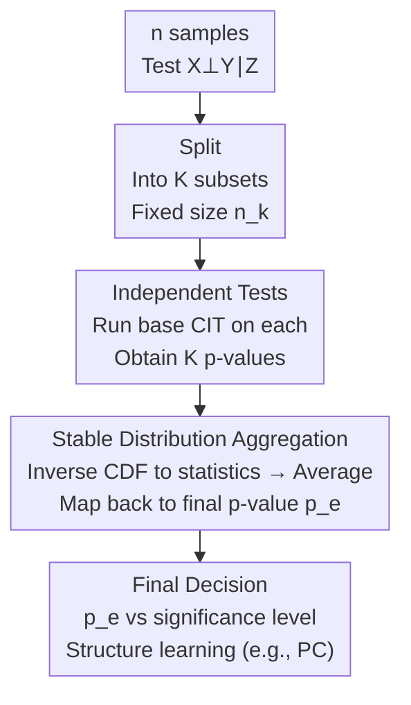

# Efficient Ensemble Conditional Independence Test Framework for Causal Discovery

**Conference**: ICLR 2026  
**arXiv**: [2509.21021](https://arxiv.org/abs/2509.21021)  
**Code**: None  
**Area**: Causal Inference  
**Keywords**: conditional independence test, causal discovery, ensemble method, stable distribution, p-value combination

## TL;DR

The E-CIT (Ensemble Conditional Independence Test) framework is proposed. By splitting data into subsets, executing tests independently, and merging results based on a p-value aggregation method for **stable distributions**, it reduces the computational complexity of any conditional independence test to linear with respect to sample size. Simultaneously, it maintains or even enhances test power in complex scenarios such as heavy-tailed noise and real-world data.

## Background & Motivation

**Background**: Constraint-based causal discovery (e.g., the PC algorithm) relies on massive conditional independence tests (CIT) to determine causal structures. KCIT (Kernel-based CIT) is one of the most popular methods but has a time complexity of $O(n^3)$ relative to sample size.

**Limitations of Prior Work**: 
   - The high computational complexity of CIT itself is the core bottleneck of causal discovery (rather than the number of tests).
   - Existing acceleration methods (RCIT, FastKCIT) are specifically optimized for KCIT and are not general frameworks.
   - Shah & Peters (2018) proved that no single CIT is effective under all conditional dependence structures—therefore, a general acceleration framework is more valuable than improving a single method.

**Key Challenge**: Large samples are required to ensure test power, but the high complexity of CIT makes computation infeasible for large datasets.

**Goal**: Design a general, plug-and-play framework that can be applied to any CIT method to reduce computational overhead while maintaining statistical power.

**Key Insight**: Drawing from ensemble learning ideas—splitting data into fixed-size subsets, performing independent tests, and then aggregating p-values. The key innovation lies in the aggregation method: utilizing the closure property of stable distributions to design a p-value merging method with guaranteed consistency.

**Core Idea**: Divide and Conquer + Stable Distribution p-value Aggregation = Linear Complexity Acceleration Framework for any CIT.

## Method

### Overall Architecture

E-CIT aims to solve a direct problem: constraint-based causal discovery requires performing numerous CITs, and a single CIT often has high complexity (e.g., KCIT is $O(n^3)$), making it computationally intractable for large samples. It adopts "divide and conquer" from ensemble learning, splitting one large-sample test into several small-sample tests and merging them. Given $n$ samples and a test for $X \perp\!\!\!\perp Y \mid Z$, the data is first evenly partitioned into $K$ subsets of fixed size $n_k$ ($n = K \cdot n_k$). **Any** base CIT is run independently on each subset to obtain $K$ p-values $\{p_1, \ldots, p_K\}$. Finally, a merging method based on stable distributions aggregates these into a final p-value for algorithms like PC to determine edge existence.

The true challenge lies not in "splitting" or "running"—these are general scaffolds—but in **how to merge**. With small subsets, the p-value distribution varies drastically with data mechanisms and CIT methods. The aggregation must preserve statistical properties while adapting to different scenarios. Thus, the technical weight of E-CIT is concentrated on the aggregation step. The benefit stems from the fixed subset size: the total overhead of the base CIT becomes $K \times O(f(n_k)) = O(n)$, linearizing any complex method. It is "plug-and-play"—it does not modify the base CIT internals, only wrapping it with splitting and aggregation.

> "Splitting" and "Independent Tests" are generic steps. The actual innovation lies in the "Stable Distribution p-value Aggregation"—detailed in the key designs below.

### Key Designs

**1. Stable Distribution-based Aggregation: Providing analytical solutions and adjustability (Definition 2)**

The difficulty after splitting is merging $K$ p-values while preserving statistical properties. E-CIT leverages the closure property of stable distributions: if $X_j \sim \mathbf{S}(\alpha, \beta, \gamma, \delta)$ are i.i.d., their mean is also a stable distribution, $\frac{1}{K}\sum_j X_j \sim \mathbf{S}(\alpha, \beta, K^{1/\alpha - 1}\gamma, \delta)$. Each subset p-value is mapped back to a statistic via the inverse CDF of a stable distribution, and then averaged:

$$T_e = \frac{1}{K} \sum_{k=1}^K F_S^{-1}(p_k),$$

The final p-value is $p_e = F_{S'}(T_e)$, where $S' = \mathbf{S}(\alpha, \beta, K^{1/\alpha-1}\gamma, \delta)$. This is elegant because the aggregated distribution has an explicit expression (no Monte Carlo approximation needed), and parameter $\alpha$ precisely controls tail thickness. When $\alpha = 2$, it defaults to Stouffer’s Z-score method; when $\alpha = 1$, it becomes the Cauchy combination, unifying a family of classical p-value merging methods under one adjustable knob to adapt to different CIT and data characteristics.

**2. Theoretical Guarantees: Proving the "Ensemble does not damage the test" (Theorem 1 & 2)**

It must be proven that aggregation does not destroy statistical properties. Theorem 1 establishes validity, admissibility, and unbiasedness—under precise p-values and a true null hypothesis, $p_e$ remains uniformly distributed on $[0,1]$, thus Type I error is controlled. More critical is the consistency in Theorem 2: power approaches 1 as $K \to \infty$ under remarkably weak conditions: ① expected p-value of sub-tests $\le \alpha_e$; ② p-value density on $[0, 1/2]$ is not lower than its mirror image; ③ parameters $\alpha \ge 1, \beta = \delta = 0$. These do not assume the data generation process, only that each sub-test is "reasonably valid." This is why E-CIT is more valuable than improving a single CIT: even if the base CIT lacks consistency in complex scenarios, the ensemble framework can recover it.

**3. Flexibility: Adapting to alternative distributions via one-dimensional $\alpha$**

Why make $\alpha$ adjustable? Per the Neyman-Pearson lemma, the optimal p-value merging statistic should be a monotonic transformation of $-\sum_k \log f_1(p_k)$, where density $f_1$ under the alternative hypothesis varies with the CIT method and dependence structure. A single fixed merging method cannot be optimal for all cases. Traditional methods correspond to fixed $\alpha$ values; E-CIT collapses this into a one-dimensional parameter, allowing a single knob to approximate optimal merging across different CITs and noise characteristics.

### Loss & Training

- Unsupervised method, no training required.
- Practical recommendations: $n_k = 400$ (empirical), $\alpha \in \{1.75, 2.0\}$, $\beta = \delta = 0$, $\gamma = 1$.

## Key Experimental Results

### Main Results

Data generation: Post-nonlinear models, $Z$ follows Normal or Laplace, noise follows Student-t, Cauchy, or Laplace.

**Efficiency Comparison (Figure 2, KCIT acceleration)**:

| Method | Time Complexity | Runtime (n=2000) | Type I Error | Test Power |
|------|-----------|----------------|-------------|---------|
| KCIT (Original) | $O(n^3)$ | ~100s | ~0.05 | Baseline |
| RCIT | $O(n)$ | ~0.1s | ~0.05 | Slightly < KCIT |
| FastKCIT | $O(n \log n)$ | ~1s | ~0.05 | Near KCIT |
| **E-KCIT** | $O(n)$ | ~0.1s | ~0.05 | **Near or > KCIT (better in heavy tails)** |

**Generality across methods (Table 2, n=1200, Normal Z, t-noise df=2)**:

| Method | Orig. Power | Ensemble Power (α=1.75) |
|------|------------|------------------------|
| RCIT | 0.548 | **0.623** |
| LPCIT | 0.422 | **0.447** |
| CMIknn | 0.982 | 0.988 |
| FisherZ | 0.510 | **0.561** |
| CCIT | 0.904 (Type I=0.454!) | 0.816 (Type I=0.286↓) |

### Ablation Study

**Real Data: Flow-Cytometry (Table 3)**:

| Method | Orig. F1 | Ensemble F1 |
|------|---------|------------|
| KCIT | 0.624 | **0.695** |
| RCIT | 0.665 | **0.687** |
| LPCIT | 0.691 | **0.741** |
| CMIknn | 0.779 | 0.756 |
| FisherZ | 0.737 | **0.767** |

### Key Findings

1. **Significant Speedup**: E-KCIT reduces KCIT’s $O(n^3)$ to $O(n)$, comparable to RCIT.
2. **Enhanced Power**: Under heavy-tailed noise (Student-t df=2, Cauchy), E-KCIT power exceeds KCIT and RCIT due to more stable estimation on subsets.
3. **Generality**: Effective across 6 different CIT methods (KCIT, RCIT, LPCIT, CMIknn, CCIT, FisherZ).
4. **Real Data Advantage**: Improved F1-scores by 2-5% on Flow-Cytometry data for most methods.
5. **CCIT Discovery**: E-CIT significantly reduced the excessively high Type I error of CCIT (from 0.45+ to 0.28-0.34), trading a small amount of power for better calibration.
6. **Causal Discovery Application (Figure 3)**: On nonlinear additive noise graphs, E-KCIT outperformed both KCIT and RCIT in F1 and SHD metrics.

## Highlights & Insights

1. **General Framework**: It is an **accelerator** rather than a new CIT—it can be plugged into any existing method.
2. **Weak Theoretical Conditions**: No assumptions on data/model; it only requires the sub-tests to be "reasonably valid."
3. **Clever Use of Stable Distributions**: Leveraging closure properties for precise p-value aggregation with flexible control via $\alpha$.
4. **Practical Insight**: In complex scenarios (heavy tails, real data), ensembles can improve power because small-sample estimates are more stable, and aggregation leverages their collective strength.

## Limitations & Future Work

1. Theory assumes i.i.d. sub-test p-values—correlations may exist (e.g., time-series or distribution shift).
2. Optimal $\alpha$ selection is context-dependent; current recommendations $\{1.75, 2.0\}$ are empirical.
3. Subset size $n_k$ must be large enough to ensure sub-test validity—curse of dimensionality may still hit for very high-dimensional $Z$.
4. Very strong methods (e.g., CMIknn) see smaller gains, suggesting the framework is best for accelerating medium-power methods.
5. Future work: Handling correlated p-values, optimizing $\alpha$ for specific CITs, and adaptive selection of subset sizes.

## Related Work & Insights

- **RCIT (Strobl et al., 2019)**: Accelerates KCIT using random Fourier features—but only applies to KCIT.
- **FastKCIT (Schacht & Huang, 2025)**: Uses GMM for data splitting—similar logic but designed only for KCIT.
- **Cauchy Combination Method (Liu & Xie, 2020)**: Uses Cauchy distributions to merge p-values in WGS tests—E-CIT generalizes this to stable distributions for CIT.
- **Inspiration**: Divide-and-conquer plus aggregation is a universal paradigm for large-scale statistical testing, with potential for other high-cost testing problems.

## Rating

- Novelty: ⭐⭐⭐⭐ Creatively applies stable distribution properties to CIT p-value aggregation; the framework is clean and practical, though divide-and-conquer itself is not new.
- Experimental Thoroughness: ⭐⭐⭐⭐⭐ Synthetic + real data + causal discovery; 6 CIT methods across multiple noise distributions and sample sizes.
- Writing Quality: ⭐⭐⭐⭐ Clear structure, good transition between theory and experiments; proofs appropriately relegated to the appendix.
- Value: ⭐⭐⭐⭐ Highly practical—can be directly inserted into existing causal discovery pipelines with significant implications for large-scale tasks.

<!-- RELATED:START -->

## Related Papers

- [\[ICLR 2026\] Causal Discovery in the Wild: A Voting-Theoretic Ensemble Approach](causal_discovery_in_the_wild_a_voting-theoretic_ensemble_approach.md)
- [\[ICML 2026\] Toward Scalable and Valid Conditional Independence Testing with Spectral Representations](../../ICML2026/causal_inference/toward_scalable_and_valid_conditional_independence_testing_with_spectral_represe.md)
- [\[ACL 2025\] IRIS: An Iterative and Integrated Framework for Verifiable Causal Discovery](../../ACL2025/causal_inference/iris_an_iterative_and_integrated_framework.md)
- [\[CVPR 2026\] A Polynomial Chaos Framework for Causal Discovery in Nonlinear Uncertain Systems](../../CVPR2026/causal_inference/a_polynomial_chaos_framework_for_causal_discovery_in_nonlinear_uncertain_systems.md)
- [\[ICLR 2026\] Theoretical Guarantees for Causal Discovery on Large Random Graphs](theoretical_guarantees_for_causal_discovery_on_large_random_graphs.md)

<!-- RELATED:END -->
