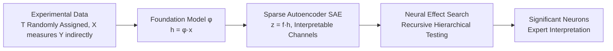

# Exploratory Causal Inference in SAEnce

**Conference**: ICLR 2026  
**OpenReview**: [https://openreview.net/forum?id=Ml8t8kQMUP](https://openreview.net/forum?id=Ml8t8kQMUP)  
**Code**: To be confirmed  
**Area**: Causal Inference / Interpretability  
**Keywords**: Exploratory Causal Inference, Sparse Autoencoders, Foundation Models, Multiple Hypothesis Testing, Treatment Effect Discovery, Neural Effect Search  

## TL;DR
This paper proposes the "Exploratory Causal Inference" paradigm: rather than requiring scientists to presuppose which effects to measure, it uses foundation models + Sparse Autoencoders (SAEs) to map high-dimensional raw observations (e.g., ant behavior videos) into interpretable neural channels. Then, a recursive hierarchical testing algorithm titled **Neural Effect Search** automatically discovers unknown outcome variables from data that are truly affected by the treatment in Randomized Controlled Trials (RCTs).

## Background & Motivation

**Background**: Randomized Controlled Trials (RCTs) are the backbone of science, but they rely on manually predefined hypotheses—scientists first guess that "treatment T affects outcome Y," then label data and test for differences. Meanwhile, modern science is shifting toward an "atlas" mode: large-scale general datasets such as whole-genome atlases, 33-cancer sequencing, and cell imaging under thousands of perturbations call for an empirical perspective of "looking at the data before asking questions."

**Limitations of Prior Work**: The rationalist paradigm (including Prediction-Powered Causal Inference by Cadei et al.) suffers from the **Matthew effect**—researchers are led by prior successful studies, narrowing effect hypotheses to a few repeatedly studied behaviors, potentially missing truly important but unthought-of effects. Furthermore, data scales are too large to "see what is interesting" with the naked eye.

**Key Challenge**: Transitioning to an empirical approach by directly scanning neural representations for significant effects hits a fundamental paradox—Sparse Autoencoders (SAEs) struggle to achieve perfect disentanglement. **Any neuron even slightly entangled with a true effect will be judged as "significantly affected by the treatment" once testing power is sufficient (as sample size $n$ or effect size $\tau$ increases)**. Even Bonferroni correction cannot save this, eventually labeling hundreds of irrelevant neurons as significant and rendering results uninterpretable.

**Goal**: To **statistically reliably discover unknown outcome variables Y affected by treatment** from indicative high-dimensional observations (images, videos) without requiring scientists to presuppose hypotheses, and to return interpretative power to domain experts.

**Core Idea**: A `Foundation Model → SAE → Recursive Hierarchical Testing` pipeline. **Key Innovation**: Using progressive stratification to lock the "principal aligned neuron" corresponding to the strongest effect in each round, treating it as a proxy for the discovered latent variable to control for its leakage contribution in subsequent tests. This "peels off" truly independent effect factors one by one, bypassing the paradox.

## Method

### Overall Architecture
The pipeline consists of four steps: (i) Collect RCT experimental data (treatment $T$ is randomly assigned, outcome $Y$ is only indirectly reflected in high-dimensional observations $X$); (ii) Use a pre-trained foundation model $\phi$ to encode raw observations into representations $h=\phi(x)$, then train an SAE to re-parameterize $h$ into sparse, interpretable "measurement dictionary" codes $z$; (iii) Use Neural Effect Search to identify channels in the code space significantly affected by the treatment; (iv) Hand over significant neurons to domain experts for interpretation (e.g., matching a specific behavior). The SAE is trained directly on trial data to avoid pre-trained model biases contaminating scientific conclusions.

### Key Designs

**1. From foundation model features to sparse measurement dictionaries: Turning unreadable representations into testable channels.** Foundation model features $h\in\mathbb{R}^d$ have rich semantic structures, but individual coordinates do not correspond to human-readable concepts. Thus, an SAE is used to encode it into high-dimensional sparse codes with linear reconstruction: $z=g(E^\top h+b_e),\ \hat{h}=Dz+b_d$. The training goal is the reconstruction loss with a sparsity penalty: $\min_{D,z\ge0}\mathbb{E}\|h-Dz-b_d\|_2^2+\lambda S(z)$. Each input is approximated as $h\approx b_d+\sum_j z_j d_j$, making each coordinate $z_j$ a "detector" for a simple attribute—an approximately monosemantic measurement channel that scientists can examine post-hoc. However, the authors explicitly acknowledge that SAEs cannot be perfectly monosemantic, and cross-factor leakage is inevitable.

**2. Leakage metrics and the "Exploratory Causal Inference Paradox": Characterizing why naive multiple testing collapses.** The authors define neurons "activated by factor $Y_k$" ($|(v_k)_j|\ge\varepsilon$) using the neural representation of concept $Y_k$: $v_k:=\mathbb{E}[Z\mid do(Y_k=1)]-\mathbb{E}[Z\mid do(Y_k=0)]$, and define the leakage set $A_\varepsilon=\bigcup_k\{j:|(v_k)_j|\ge\varepsilon\}$ and leakage index $\rho_\varepsilon=|A_\varepsilon|/m$. Under ideal monosemanticity, $|A_\varepsilon|=r$ (number of true effects), but actual leakage makes $|A_\varepsilon|=O(m)\gg r$. The authors formalize the paradox with two theorems: **Theorem 3.1**—as long as $\rho_\varepsilon m$ neurons have non-zero effects, as $n\to\infty$, the non-centrality parameter of the t-statistic grows by $\sqrt{n}$, overwhelming the Bonferroni threshold (approx. $\sqrt{2\log m}$), and almost all neurons in $A_\varepsilon$ will inevitably be rejected; **Theorem 3.2**—the same failure occurs if the effect size $s\to\infty$ with a fixed $n$. The intuition is: neurons entangled with true effects will sooner or later be misjudged as independent significant effects as testing power increases; thus, multiple testing correction is helpless here.

**3. Neural Effect Search (NES): Peeling off true effects one by one via recursive stratification.** NES is the core algorithm, following the logic of "discover the strongest effect, control for it, then find the next." In each round, it runs NeuralEffectTest on unselected neurons $j\notin S$ (performing stratification on the selected set $S$, with optional arm-wise residualization) to obtain effect estimates $\hat{\tau}_j$ and p-values. It filters a significant set $R$ using Bonferroni correction ($p_j<\alpha/m$), selects the strongest $R_1$ according to $|\hat{\tau}_j|$ to add to $S$, and calls the process recursively until no significant neurons are found. Key insight: treating the discovered principal aligned neuron $Z_1$ as a proxy for its underlying true latent variable $Y_1$ for stratification effectively controls all leakage mediated by $Y_1$, zeroing out the mean of the adjusted statistics for remaining neurons so only undiscovered effects "surface" in the next round. **Theorem 4.1** proves that under the assumption of SAE approximate decoupling, as $n\to\infty$, the NES output converges to exactly $r$ neurons, each primarily aligned with a different $Y_k$, such that $\mathbb{E}[|S_{\text{final}}|]\to r$. Thus, NES is both a robust multiple testing correction method for entanglement and a decoupling algorithm that "peels off one effect factor at a time." For small samples, Bonferroni correction can be relaxed for more aggressive (though potentially more false-positive) exploration.

The internal NeuralEffectTest (Algorithm 2) handles "re-estimating each neuron's effect conditioned on discovered effects": it stratifies samples based on $S$, ensuring the treatment effect estimate for neuron $j$ is conducted while "controlling for true latent variables corresponding to $S$." Further arm-wise residualization (residualizing with selected neurons within each treatment arm) reduces variance and improves efficiency without losing consistency. Intuitively, in the first round, multiple coordinates appear affected due to entanglement, but the coordinate best aligned with a true direction $v_k$ will maximize the treatment effect and be selected with probability approaching 1 under Bonferroni control; subsequent stratification "subtracts" the contribution of discovered directions—their leakage into other neurons is averaged out in expectation, and collider bias introduced by treatment conditioning is bounded—thus "peeling the onion" until all $r$ principal directions are found and the process naturally stops.

## Key Experimental Results

### Main Results (Semi-synthetic Benchmark + Real Ecological Trial)

| Setting | Data/Encoder | Task | Key Results |
|---------|--------------|------|-------------|
| Semi-synthetic RCT | CelebA attributes (hat/glasses) + SigLIP + SAE | Known ground truth, discovery of $r=2$ dual effects | NES is the only method where Precision/IoU does not collapse as $n$ and $\tau$ increase |
| Real Trial ISTANT | Ant social immunity videos + DINOv2 + SAE (n=44 videos) | Unsupervised discovery of treatment-affected behaviors | Returned only 2 neurons, consistent with previous manual labeling conclusions |

### Semi-synthetic Benchmark (Scanning Testing Power)

| Method | Recall at High Power | Precision/IoU at High Power |
|--------|----------------------|-----------------------------|
| t-test / FDR / Bonferroni | →1 (Finds effects) | Drops significantly (Falls into paradox, FP flood) |
| top-k selection | Partial | Similarly misled by entanglement |
| **NES** | →1 | **Remains High** (Best trade-off) |
| Baseline (known r) | — | Both Precision/Recall <0.5 (Finds strongest effect but misses the second) |

### Ablation Study (Appendix E)
The authors added three types of validation in the appendix:

| Ablation Dimension | Content | Conclusion |
|--------------------|---------|------------|
| Statistical Assumptions | Verifying premises like approximate decoupling/alignment for consistency theorems | Generally holds when SAE monosemanticity is reasonable |
| Consistency Scan | Repeating NES across various $n, \tau$, and seeds | Stable behavior, converges to true effect count $r$ |
| Additional Baselines | Comparison with more testing/selection strategies | NES consistently leads in Precision-Recall trade-off |

Additionally, SAE monosemanticity itself was quantitatively evaluated first (on CelebA attributes, see Figure 8 in the original paper) to extract "ground truth neurons" for $Y$, following which Recall/Precision/IoU measured the discovery quality—this workflow ensures ground truth reliability for the semi-synthetic benchmark.

### Key Findings
- **Paradox Empirically Replicated**: All standard multiple testing methods labeled weakly entangled channels as significant (Precision ≪ 1) as $n$ or $\tau$ increased; only NES was immune.
- **Dual Discoveries in Real Trials**: Neuron 394 corresponds to grooming behavior—exactly the significant effect identified and verified by previous rationalist manual labeling, and it happened to be the strongest predictor for grooming (F1=0.398) among all 4608 SAE codes. Neuron 550 corresponds to black positioning markers in the background (F1=0.568), exposing design bias between treatment allocation and recording batches in small samples.
- **"Discovery of Design Bias" Seen as a Benefit**: While the second neuron is not a biological effect, it is a truly existing statistically significant signal. The method reports it faithfully for expert adjudication rather than masking it.
- **NES Not Necessary for Small Samples/Weak Effects**: At $n=30$ or $\tau=0.1$, the paradox has not yet surfaced, and naive t-tests or top-k may be more exploratory (at the cost of more false positives).

## Highlights & Insights
- **Paradigm Shift**: This work clearly distinguishes between "rationalist" (hypothesize first) and "empirical" (discover first) causal inference within a statistical framework, noting they are complementary—empiricism enriches rationalism with data-driven hypotheses, countering the Matthew effect.
- **First Systematic Use of SAEs for Causal Inference**: The authors claim this is the first successful application of Sparse Autoencoders for causal analysis in scientific trials, distinguishing it from works like HypotheSAEs that only focus on correlation—this work provides causal discovery with statistical significance testing.
- **Solid Theoretical Characterization**: The paradox of "higher power, more false positives" is counter-intuitive yet clearly proven with two theorems, followed by the consistency theorem of NES as a remedy.
- **Elegant Recursive Stratification**: Using discovered neurons as proxies for latent variables to control mediation effects serves as both multiple testing correction and effect disentanglement.

## Limitations & Future Work
- **Discrete Outcome Assumption**: The method only handles binary/discrete outcomes $Y$, as continuous concepts in SAEs are not yet well understood; extending to continuous effects is left for future work.
- **Reliance on SAE Approximate Decoupling**: Consistency theorems rely on the assumption that SAE codes approximately decouple true effects. If SAEs are heavily polysemantic or the foundation model is biased, discoveries may be distorted; recent negative results regarding SAE interpretability (pseudo-interpretability on random networks, inability to isolate atomic concepts) cast uncertainty.
- **Interpretation Gap (F1 < 1)**: In real trials, the F1 of the principal neuron for grooming was only 0.398, indicating other entangled effects or broader representations exist; "treatment effect on a neuron" cannot be equated to "treatment effect on an interpretable behavior" without further labeling.
- **Weak Statistical Guarantees in Small Samples**: ISTANT had only 44 videos, requiring relaxed Bonferroni thresholds. There is a gap between theoretical consistency ($n\to\infty$) and small-sample practice.
- **Interpretation Still Requires Experts**: The method identifies statistically significant signals; which ones have scientific meaning is still judged by experts. Automation stops at hypothesis generation.

## Related Work & Insights
- **Heterogeneous Treatment Effects (HTE)**: Causal trees/forests (Athey & Imbens 2016) ask "who is affected" (heterogeneity in low-dimensional covariates $W$); this work dually asks "what is affected" (discovery of $Y$ in high-dimensional unknown spaces).
- **Causal Abstraction & Representation**: Visual/Causal Feature Learning (Chalupka et al.) discovers macro-variables by clustering $P(X\mid do(T))$, but requires high-dimensional density estimation and only guarantees single grouping. This work finds all statistically significant effects without density estimation. Interventional causal representation learning identifies intervention side $W$ but not invariant outcomes $Y$, making it unsuitable for exploratory causal inference.
- **SAE for Scientific Discovery**: Similar in direction to HypotheSAEs (using SAE surfaces for target-related readable patterns) but fundamentally different—the latter is correlational, while this work focuses on causal effects and provides inference procedures.
- **Inspiration**: When data scale exceeds human inspection capacity and it is unknown what to measure, "using foundation models to turn raw signals into interpretable channels + using recursive algorithms with statistical guarantees to peel off true effects" is a reusable scientific discovery paradigm applicable to cell imaging, gene perturbation, and other large-scale atlas scenarios.

## Rating
- Novelty: ⭐⭐⭐⭐⭐ Proposes the new "Exploratory Causal Inference" paradigm, formalizes a counter-intuitive statistical paradox, and provides a targeted algorithm. First use of SAEs for trial causal analysis; dual originality in concept and method.
- Experimental Thoroughness: ⭐⭐⭐⭐ Combination of semi-synthetic benchmarks (controlled ground truth, multi-dimensional scans of $n/\tau$) and real ecological trials. Real-world conclusions match prior manual labels, but there is only one real-world case with a small sample size; external validity needs verification in more domains.
- Writing Quality: ⭐⭐⭐⭐⭐ Clear progression from rational/empirical comparison to paradox theorems and NES consistency proofs. Figures (2-6) and theorems are clear; the "SAEnce" title is a clever pun.
- Value: ⭐⭐⭐⭐ Provides a feasible path with statistical guarantees for data-driven causal discovery in large-scale scientific data. Directly applicable to experimental ecology and cell imaging; serves as a positive case for the "utility" of SAEs.

<!-- RELATED:START -->

## Related Papers

- [\[ICLR 2026\] Stochastic Neural Networks for Causal Inference with Missing Confounders](stochastic_neural_networks_for_causal_inference_with_missing_confounders.md)
- [\[ICLR 2026\] Adjusting Prediction Model Through Wasserstein Geodesic for Causal Inference](adjusting_prediction_model_through_wasserstein_geodesic_for_causal_inference.md)
- [\[ICLR 2026\] Foundation Models for Causal Inference via Prior-Data Fitted Networks](foundation_models_for_causal_inference_via_prior-data_fitted_networks.md)
- [\[ICML 2026\] Controllable Generative Sandbox for Causal Inference](../../ICML2026/causal_inference/controllable_generative_sandbox_for_causal_inference.md)
- [\[ICLR 2026\] Ice Cream Doesn't Cause Drowning: Benchmarking LLMs Against Statistical Pitfalls in Causal Inference](ice_cream_doesnt_cause_drowning_benchmarking_llms_against_statistical_pitfalls_i.md)

<!-- RELATED:END -->
