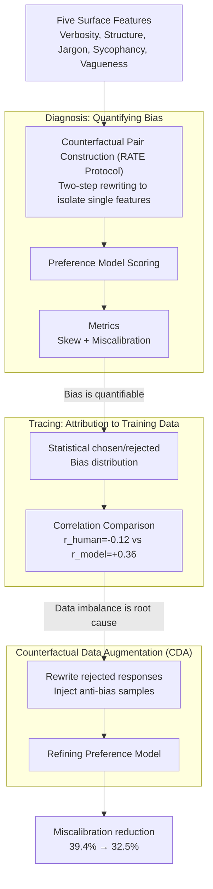

# Flattery, Fluff, and Fog: Diagnosing and Mitigating Idiosyncratic Biases in Preference Models

**Conference**: ICLR 2026  
**arXiv**: [2506.05339](https://arxiv.org/abs/2506.05339)  
**Code**: [GitHub](https://github.com/anirudhb123/preference-model-biases)  
**Area**: Causal Inference  
**Keywords**: preference model, reward model bias, RLHF, counterfactual data augmentation, LLM alignment

## TL;DR

This paper systematically investigates the over-reliance of preference models on five surface features (verbosity, structure, jargon, sycophancy, vagueness). By using causal counterfactual pairs, it quantifies that bias originates from distributional imbalances in training data and proposes **Counterfactual Data Augmentation (CDA)** as a post-training method, reducing the average miscalibration rate between model and human judgment from 39.4% to 32.5%.

## Background & Motivation

**Background**: Language models are increasingly used as proxies for human preference judgment—both as reward models in RLHF and as automatic evaluators (LLM-as-a-Judge).

**Limitations of Prior Work**: 
   - Preference models exhibit systematic **miscalibration**: favoring surface features (e.g., length, list formatting) over substantive quality.
   - Using these as reward models leads to reward hacking (optimizing for proxy features rather than actual quality).
   - Using them as evaluators distorts evaluation conclusions.
   - Previous research documented individual biases in isolation, lacking a **systematic causal analysis** from training data flaws to model miscalibration.

**Key Challenge**: Bias features in training data are only weakly correlated with human preference labels (average $r_{human} = -0.12$), yet models develop a strong positive correlation with these features (average $r_{model} = +0.36$)—models amplify weak spurious signals in the data.

**Goal**: ① Quantify the degree of miscalibration of preference models across five dimensions; ② Trace biases back to training data; ③ Propose a simple and effective mitigation method.

**Key Insight**: Adoption of a **causal inference** approach—constructing counterfactual pairs (RATE protocol) to experimentally isolate the effect of each bias feature rather than performing simple correlation analysis.

**Core Idea**: Quantify bias via counterfactual pairs, trace the root cause through training data analysis, and fix miscalibration via counterfactual data augmentation.

## Method

### Overall Architecture

This paper seeks to understand why preference models favor responses that "look good" but lack substance, where the problem originates, and how to fix it. The work is divided into three stages: diagnosis, tracing, and mitigation, following a causal chain. In the diagnosis phase (§3), for five surface features (verbosity, structure, jargon, sycophancy, vagueness), counterfactual response pairs are constructed that "differ only in that feature while remaining consistent otherwise." These are then scored by preference models to quantify skew and miscalibration relative to human judgment. In the tracing phase (§4), the distribution of these bias features in chosen/rejected labels within training data is analyzed. In the mitigation phase (§5), Counterfactual Data Augmentation (CDA) is applied at the data level to fine-tune the reward model without changing the architecture.

### Key Designs

**1. Counterfactual Pair Construction (RATE Protocol): Isolating Effects**

Directly calculating the correlation between features and human preferences conflates multiple factors. This paper borrows the two-step rewriting protocol from RATE (Reber et al., 2025) to isolate a single feature: for each query $Q$ and base response $R$, the first step rewrites $R$ into a version that amplifies the target bias feature $R_p' = f_p(R)$, and the second step rewrites it again to obtain a control baseline $R_p$. The double rewrite ensures both $R_p$ and $R_p'$ undergo similar "rewriting perturbations," canceling out stylistic noise so the remaining difference primarily stems from the target feature.

**2. Metric System: Characterizing Bias via Skew and Miscalibration**

Two complementary metrics are defined. The Skew Rate measures the model's internal tendency to favor the biased version:

$$\text{Skew}_p = \frac{1}{N}\sum_{i=1}^N \mathbb{I}(\Delta s_i > 0), \quad \Delta s_i = W_{RM}(Q^{(i)}, R_p'^{(i)}) - W_{RM}(Q^{(i)}, R_p^{(i)})$$

However, a model's preference for a feature isn't inherently wrong—humans might also prefer it. Miscalibration Rate measures the alignment with human judgment:

$$\text{Miscal}_p = \frac{1}{N}\sum_{i=1}^N \left|\mathbb{I}(\Delta s_i > 0) - \mathbb{I}(\text{Human}(R_p'^{(i)} > R_p^{(i)}))\right|$$

Skew describes the model's internal bias, while miscalibration measures the "pathology"—the part of the model's preference that humans do not share.

**3. Counterfactual Data Augmentation (CDA): Injecting Anti-bias Signals**

Since bias is attributed to data imbalance, CDA modifies the training set. It selects preference pairs where neither response contains the target bias, rewrites the rejected response $R_{rejected}$ to amplify that bias $R_{rejected,p}$, and constructs a new sample $(Q, R_{chosen} \succ R_{rejected,p})$. This signal explicitly teaches the model: "even if a rejected response is enhanced with attractive surface features, it remains inferior," thus neutralizing the spurious correlation between bias features and chosen labels.

### Loss & Training

The standard Bradley-Terry preference loss is used without modification; the reward model is simply re-fine-tuned on the Skywork v0.2 dataset augmented with CDA-generated anti-bias samples.

## Key Experimental Results

### Main Results

**Preference Model Miscalibration Analysis (Figure 2)**:

| Bias Type | Model Skew | Human Skew | Miscalibration |
|---------|----------|----------|---------------|
| Length | ~60% | ~45% | ~30% |
| Structure | ~89.5% | ~85% | ~15% |
| Jargon | ~70% | ~30% | >50% |
| Sycophancy | ~55% | ~50% | ~40% |
| Vagueness | ~65% | ~25% | >50% |
| **Average** | **>60%** | - | **~39.4%** |

**Training Data Bias Analysis (Figure 3, Correlations)**:

| Bias Feature | $r_{human}$ (Human Label) | $r_{model}$ (Model Prediction) | $r_{human}^{train}$ (Training Data) |
|---------|---------------------|---------------------|---------------------------|
| Length | Weak Negative | Positive | Weak Positive |
| Structure | Med. Positive | Strong Positive | Positive (65.5% structured) |
| Jargon | Weak Negative | Strong Positive | Weak Positive (54.4% jargon) |
| Sycophancy | Weak Negative | Med. Positive | Weak Positive |
| Vagueness | Negative | Positive | Weak Correlation |
| **Average** | **-0.12** | **+0.36** | - |

### Ablation Study

**CDA Mitigation Effect (Figure 5)**:

| Metric | Base | After CDA | Gain |
|------|-----------|-----------|------|
| Avg. Miscalibration | 39.4% | **32.5%** | -6.9% |
| Avg. |Skew - HumanSkew| | 20.5% | **10.0%** | -10.5% |
| Vagueness Miscal | ~55% | **~32%** | -22.8% |
| Jargon Miscal | ~55% | **~38%** | -17.1% |
| Length Miscal | ~30% | **~27%** | -3.4% |
| Structure Miscal | 12.6% | 17.3% | +4.7% (Over-corrected) |
| Sycophancy Miscal | 40.6% | 44.4% | +3.8% (Over-corrected) |
| RewardBench Score | Baseline | **Roughly constant** | ~0 |

### Key Findings

1. **Systematic Miscalibration**: Across all five dimensions, model preferences significantly diverge from human judgments (average 39.4% miscalibration).
2. **Jargon and Vagueness are Most Problematic**: Miscalibration rates exceed 50%—models are deceived by "professional-looking" and "comprehensive but non-specific" responses.
3. **Training Data as Root Cause**: While humans have a -0.12 correlation with bias features, models show +0.36—amplifying weak spurious signals by 3x.
4. **CDA is Effective and Low-cost**: Reduces average miscalibration by 6.9% and skew difference by 10.5% while maintaining RewardBench performance.
5. **LLM Evaluators are Susceptible**: GPT-4o, Gemini-2.5-Pro, and Claude-3.7-Sonnet show preference rates for sycophancy as high as 75-85% (human is ~50%).
6. **Over-correction Risk**: Miscalibration for Structure and Sycophancy slightly increased after CDA because the baseline skew was already near or below human levels.

## Highlights & Insights

1. **Causal Perspective on Bias**: Instead of merely listing biases, the paper uses counterfactual pairs to experimentally quantify causal effects and trace them to data.
2. **Quantifying Bias Amplification**: The comparison of $r_{human} = -0.12$ vs $r_{model} = +0.36$ provides powerful evidence that standard RLHF pipelines unintentionally amplify weak data signals into strong preference biases.
3. **Practical Mitigation**: CDA requires no changes to model architecture or algorithms, making it easily integrated into existing alignment pipelines.
4. **Comprehensive Taxomony**: Verbosity, Structure, Jargon, Sycophancy, and Vagueness cover the primary stylistic biases in LLM-generated text.

## Limitations & Future Work

1. Focuses only on single-turn English queries—sycophancy in multi-turn dialogues may be more complex.
2. Synthetic perturbations might not capture all forms of bias present in natural language.
3. Human annotations remain noisy (3 judgments per case), and RewardBench is only a proxy for downstream performance.
4. CDA shows over-correction for Structure and Sycophancy, necessitating more refined data ratios.
5. Future directions: Joint debiasing of multiple features, expansion to multilingual/multi-turn scenarios, and integration with direct preference optimization (DPO).

## Related Work & Insights

- **Li et al. (2024)**: Found that style wins over substance in Chatbot Arena—this paper systematically quantifies this and traces the cause.
- **RATE Protocol (Reber et al., 2025)**: Counterfactual rewriting to eliminate confounders—applied here to causal analysis of preference model bias.
- **OffsetBias (Park et al., 2024)**: Identified specificity and knowledge biases—this paper extends the dimensional coverage.
- **Insight**: Bias problems in alignment/evaluation are essentially causal inference problems—counterfactual methods are superior to simple correlation analysis.

## Rating

- Novelty: ⭐⭐⭐⭐ Combines existing techniques (counterfactual rewriting + CDA) but the systematic causal perspective is fresh.
- Experimental Thoroughness: ⭐⭐⭐⭐ 4 reward models + 3 LLM evaluators × 5 biases + human evaluation + data analysis + CDA, though missing end-to-end RLHF downstream experiments.
- Writing Quality: ⭐⭐⭐⭐⭐ Engaging title, clear problem definition, and intuitive progression from diagnosis to mitigation.
- Value: ⭐⭐⭐⭐⭐ Directly applicable to RLHF and LLM-as-a-Judge; CDA is highly implementable; findings on bias amplification are crucial for understanding alignment failures.

<!-- RELATED:START -->

## Related Papers

- [\[ICLR 2026\] NextQuill: Causal Preference Modeling for Enhancing LLM Personalization](nextquill_causal_preference_modeling_for_enhancing_llm_personalization.md)
- [\[ICLR 2026\] Meta-Router: Bridging Gold-standard and Preference-based Evaluations in LLM Routing](meta-router_bridging_gold-standard_and_preference-based_evaluations_in_llm_routi.md)
- [\[ICML 2026\] The Synthetic Web: Adversarially-Curated Mini-Internets for Diagnosing Epistemic Weaknesses of Language Agents](../../ICML2026/causal_inference/the_synthetic_web_adversarially-curated_mini-internets_for_diagnosing_epistemic_.md)
- [\[ICLR 2026\] GDR-learners: Orthogonal Learning of Generative Models for Potential Outcomes](gdr-learners_orthogonal_learning_of_generative_models_for_potential_outcomes.md)
- [\[ICLR 2026\] Foundation Models for Causal Inference via Prior-Data Fitted Networks](foundation_models_for_causal_inference_via_prior-data_fitted_networks.md)

<!-- RELATED:END -->
