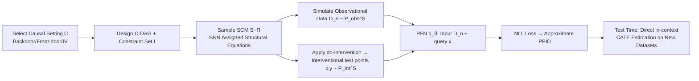

# Foundation Models for Causal Inference via Prior-Data Fitted Networks

**Conference**: ICLR 2026  
**OpenReview**: [https://openreview.net/forum?id=d2L1ndOKjq](https://openreview.net/forum?id=d2L1ndOKjq)  
**Code**: [https://github.com/yccm/CausalFM](https://github.com/yccm/CausalFM)  
**Area**: Causal Inference / Tabular Foundation Models / In-Context Learning  
**Keywords**: PFN, Causal Inference, CATE, Structural Causal Model, Bayesian Inference, Instrumental Variables, Front-door Adjustment  

## TL;DR
CausalFM adapts the "tabular foundation model" PFN to causal inference: it uses Structural Causal Models (SCMs) to generate synthetic priors and pre-trains a Transformer on synthetic data. This enables the model to directly provide Bayesian-style CATE estimates for backdoor, front-door, and instrumental variable settings via in-context learning without retraining.

## Background & Motivation
- **Background**: Deep learning has become a mainstay for causal effect estimation (S/T/X-learner, TARNet, DR-learner, etc.), excelling at handling high-dimensional covariates and heterogeneous effects. Simultaneously, foundation models (LLMs, ViT) have dominated NLP/CV by following the "pre-train once, infer directly at test time, no retraining" paradigm. PFNs (Prior-Data Fitted Networks, such as TabPFN) brought this paradigm to tabular prediction: pre-training on synthetic prior data and realizing approximate Bayesian inference through in-context learning.
- **Limitations of Prior Work**: Mainstream causal methods require retraining, manual model selection, and hyperparameter tuning for every new dataset, lacking the flexibility of "out-of-the-box" usage. This is incompatible with the test-time inference paradigm of foundation models.
- **Key Challenge**: Directly applying PFNs to causality is non-trivial—the prediction target is the **interventional distribution** $P_{\text{int}}$, but available data comes from the **observational distribution** $P_{\text{obs}}$. There is an identification gap between the two (consistency, positivity, unconfoundedness/front-door/IV conditions). Two concurrent works (CausalPFN, Do-PFN) either only support backdoor adjustment or fail to provide identifiability guarantees.
- **Goal**: Provide a **universal recipe** to train PFN foundation models for various causal inference settings (backdoor, front-door, IV) built upon rigorous identifiability.
- **Core Idea**: **Utilize SCMs to construct a Bayesian prior for "observational-interventional distribution pairs"**, allowing the PFN to learn approximate posterior predictive interventional distributions (PPID) on synthetic counterfactual data. Consequently, one only needs the causal query $Q$ itself, without manually deriving the identification formula $\bar{Q}$ for each setting.

## Method

### Overall Architecture
CausalFM consists of two components: **Prior Construction** (how to create synthetic data) and **Training Algorithms** (how to train the PFN). On the prior side, it no longer models $P_{\text{obs}}$ in isolation but uses SCMs to simultaneously characterize the $(P_{\text{obs}}, P_{\text{int}})$ pair. On the training side, it modifies the standard PFN loss to a form of "feeding observational data, predicting interventional outcomes," allowing the model to learn cross-dataset in-context causal inference on counterfactual data simulated by synthetic SCMs.

### Key Designs

**1. SCM Prior: Modeling "observational-interventional pairs" instead of just observational distributions.** A naive approach would place a prior directly on $P_{\text{obs}}$ and obtain estimators via identification formulas $\bar{Q}$, but this requires manually deriving $\bar{Q}$ for every setting (IV settings even require solving integral equations) and makes it difficult to control the prior distribution of the causal query $Q$, leading to prior misspecification. CausalFM shifts to placing priors on distribution pairs $(P_{\text{obs}}, P_{\text{int}}) \in \mathcal{P}_{\text{obs}} \times \mathcal{P}_{\text{int}}$. SCMs serve as the natural vehicle: sampling latent variables $U \sim P$, applying structural equations $f$ to get $P^S_{\text{obs}}$, and performing $do(A=a)$ interventions to get $P^S_{\text{int}}$. The paper defines a prior that only places mass on SCMs compatible with setting $C$ as a **C-SCM-Prior** and uses **Cluster-DAG (C-DAG)** to compress many possible DAGs into shared structures.

**2. Well-specified prior and Identifiability Theorem.** The paper defines a prior as $C$-well-specified if and only if the query on the posterior predictive interventional distribution is a consistent estimator:
$$Q\!\left(\int P^S_{\text{int}}\,\Pi(S\mid D_n)\,dS\right) \longrightarrow Q(P^*_{\text{int}}),\quad n\to\infty.$$
The critical **Theorem 4.3** explains why the prior must be restricted to identifiable settings: if prior mass is placed on a set of SCMs $\mathcal{Z}$ that violate identifiability (i.e., $Q(P^S_{\text{int}}) \neq \bar{Q}(P^S_{\text{obs}})$), the prior cannot be well-specified under weak assumptions, leading to asymptotic inconsistency. This is a potential risk in Do-PFN: when the causal quantity is not identified, the posterior may never converge to the truth, resulting in asymptotically uninformative estimates. Therefore, CausalFM follows the classical philosophy of "separation of identification and estimation": identification is left to domain knowledge (selecting the correct setting), while estimation is left to the PFN.

**3. Constructing samplable high-dimensional priors via Bayesian Neural Networks.** Given a well-specified C-DAG $G_c$ and constraint set $I$ (e.g., backdoor requires positivity $P^S_{\text{obs}}(A=a\mid X=x)>0$; IV requires additive structural equations $f^S_Y = f^S(X,A)+g^S(X,U)$), the algorithm traverses clusters by DAG hierarchy. Pure latent clusters are fixed to standard normal $U^{(i)}\sim\mathcal{N}(0,I)$. Clusters containing both observational and latent variables use **cluster BNN priors** inspired by TabPFN $g^{(i)}_\theta:\text{pa}(C_i)\to\mathbb{R}^r,\ \theta\sim\Pi_{C_i}$ for high-dimensional but internally unstructured covariates. Pure observational clusters use **observational BNN priors** $f^{(i)}_\theta$, directly treating network outputs as structural equation assignments.

**4. Modified PFN Loss: Feeding Observation, Predicting Intervention.** Standard PFN loss only performs posterior prediction within the same distribution. CausalFM modifies the loss to:
$$\mathcal{L}(\theta) = \mathbb{E}_{N\sim\Pi_N}\,\mathbb{E}_{S\sim\Pi}\,\mathbb{E}_{(X,Y)\sim P^S_{\text{int}}}\,\mathbb{E}_{D\sim P^S_{\text{obs}}}\big[-\log q_\theta(Y\mid X, D_N)\big],$$
where the context data $D_N$ is sampled from the observational distribution, while the predicted $(X,Y)$ is sampled from the interventional distribution of the same SCM. In implementation, for each sample: sample size $N_j$, SCM $S_j$, and observational dataset are simulated. Then $do(A{=}1)$ and $do(A{=}0)$ are applied to the SCM to obtain test points $(x_j, y_j(1){-}y_j(0))$, minimizing $\hat{\mathcal{L}}(\theta)=\sum_j[-\log q_\theta(y_j(1){-}y_j(0)\mid D^j_{N_j}, x_j)]$. Unlike MSE loss, using NLL allows for interpreting the output as an approximation of the entire PPID—providing both point estimates and **uncertainty quantification**.

## Key Experimental Results

### Main Results (Standard CATE, PEHE↓, 10 Synthetic + Jobs)

| Method | Synthetic | Jobs |
|---|---|---|
| S-learner | 0.734 | 0.697 |
| X-learner | 0.563 | 0.802 |
| RA-learner | 0.609 | 0.652 |
| CausalPFN (FM) | 0.557 | 0.528 |
| DoPFN (FM) | 0.586 | 0.482 |
| **CausalFM (ours)** | **0.515** | **0.478** |

### IV and Front-door Settings (PEHE↓)

| Setting | Strongest Baseline | CausalFM |
|---|---|---|
| Binary IV | DeepIV 0.427 | **0.422** |
| Continuous IV | DeepIV 0.516 | 0.579 |
| Front-door | Plug-in(NN) 0.889 | **0.847** |

### Key Findings
- **Competitive or superior to specialized estimators without retraining**: Ranked first in both metrics for standard CATE; slightly outperformed the specialized DeepIV in Binary IV; better than linear/RF/NN plug-in learners for front-door adjustment.
- **Superior to CausalPFN / DoPFN within the PFN route**, and the only one to simultaneously cover backdoor, front-door, and IV settings.
- **Uncertainty quantification via Bayesian properties** allows for warnings in scenarios with poor treatment overlap, benefiting downstream decision-making.

## Highlights & Insights
- **Theoretically grounded paradigm shift**: Instead of simply applying TabPFN to causal data, it formalizes "what SCM priors yield consistent estimates" (Theorem 4.3), hard-coding identifiability into the prior to address the risk of non-convergence in Do-PFN.
- **Engineering of "Identification to Human, Estimation to Model"**: Practitioners only need domain knowledge to select the correct causal setting; the remaining statistical estimation is handled by the out-of-the-box foundation model.
- **Modeling via interventional distribution pairs** bypasses the trouble of manually deriving identification formulas $\bar{Q}$ for each setting, which is a key decoupling compared to naive PFN ideas.

## Limitations & Future Work
- **Evaluated only on synthetic/semi-synthetic data**: Due to the fundamental problem of causal inference (missing counterfactual outcomes), PEHE cannot be evaluated on real data. The authors plan to verify robustness in real A/B tests.
- Current instantiations focus on conditional interventional queries like CATE; more complex causal functionals are not yet covered.
- Identifiability still relies on manually selecting the correct setting. Sensitivity analysis is required when assumptions are violated.

## Related Work & Insights
- **Amortized/Synthetic Pre-training Causal Methods**: BBCI (Bynum et al. 2025) also uses synthetic pre-training for multi-setting causality but is non-Bayesian and its data generation is not designed for high dimensions.
- **Concurrent PFN Causal Work**: CausalPFN (backdoor only) and Do-PFN (no identifiability guarantees, risk of asymptotic inconsistency)—CausalFM advances both in coverage and theoretical assurance.
- **Insight**: The recipe of "Foundation Model = Synthetic Prior + In-context Inference" can be migrated to any statistical task where identification and estimation are separable. The key lies in designing **well-specified priors** to guarantee posterior consistency.

## Rating
- Novelty: ⭐⭐⭐⭐⭐ 
- Experimental Thoroughness: ⭐⭐⭐ 
- Writing Quality: ⭐⭐⭐⭐ 
- Value: ⭐⭐⭐⭐ 

<!-- RELATED:START -->

## Related Papers

- [\[ICLR 2026\] Stochastic Neural Networks for Causal Inference with Missing Confounders](stochastic_neural_networks_for_causal_inference_with_missing_confounders.md)
- [\[ICLR 2026\] Adjusting Prediction Model Through Wasserstein Geodesic for Causal Inference](adjusting_prediction_model_through_wasserstein_geodesic_for_causal_inference.md)
- [\[ICLR 2026\] Exploratory Causal Inference in SAEnce](exploratory_causal_inference_in_saence.md)
- [\[ICLR 2026\] Frequency-Domain Better than Time-Domain for Causal Structure Recovery in Dynamical Systems on Networks](frequency-domain_better_than_time-domain_for_causal_structure_recovery_in_dynami.md)
- [\[ICLR 2026\] Ice Cream Doesn't Cause Drowning: Benchmarking LLMs Against Statistical Pitfalls in Causal Inference](ice_cream_doesnt_cause_drowning_benchmarking_llms_against_statistical_pitfalls_i.md)

<!-- RELATED:END -->
