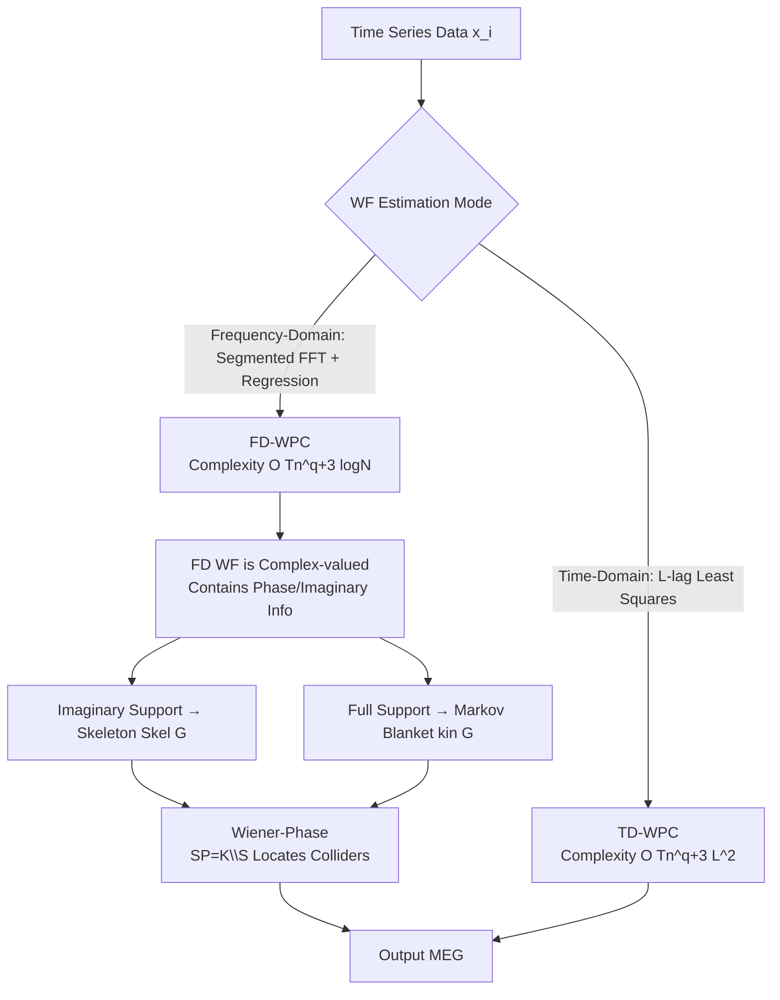

# Frequency-Domain Better than Time-Domain for Causal Structure Recovery in Dynamical Systems on Networks

**Conference**: ICLR 2026  
**OpenReview**: [https://openreview.net/forum?id=S1OCRfHJAg](https://openreview.net/forum?id=S1OCRfHJAg)  
**Code**: TBD  
**Area**: Causal Inference / Dynamical Systems / Time Series  
**Keywords**: Causal Structure Recovery, Wiener Filtering, Frequency Domain, Markov Equivalence Graph, Phase Information, FFT  

## TL;DR
Addressing causal graph recovery for networked dynamical systems, this paper theoretically proves that frequency-domain Wiener filtering is faster than the time-domain ($O(L^2/\log N)$ speedup via FFT). It discovers that **phase information** unique to complex estimations in the frequency domain can directly reveal skeletons and colliders across a large class of networks, leading to the proposed "Wiener-Phase" algorithm that avoids combinatorial CI tests.

## Background & Motivation
**Background**: Static causal discovery is relatively mature—algorithms like PC/FCI rely on Fischer-z or Chi-squared tests for Conditional Independence (CI) to recover Markov Equivalence Graphs (MEG). However, when **inter-temporal dynamic dependencies** exist between entities (e.g., power grids, consensus dynamics, chemical reactions, climate), treating each time point as a random variable leads to a combinatorial explosion. Meanwhile, Granger causality relies on "lagged observability" assumptions, which fail when the sampling rate is lower than the system time constant.

**Limitations of Prior Work**: A primary line connecting dynamic time series with causal discovery uses Wiener filtering (WF) for multivariate projection—projecting $x_i$ onto a set of time series $x_C$. Whether the corresponding WF coefficients are zero encodes d-separation relationships, enabling a dynamic version of CI tests. However, traditional WF projections are performed in the **time domain**: incorporating $L$ past and future samples causes the least-squares dimensionality to expand quadratically with $L$, making it computationally heavy for large networks or long delays.

**Key Challenge**: WF projection can be calculated in both time and frequency domains. **Which one is better?** This question has not been systematically quantified before—there is a lack of sample complexity comparisons between the two, and the fact that the frequency domain naturally produces complex numbers containing "phase" information (absent in the time domain) has been overlooked.

**Goal**: Provide non-asymptotic concentration bounds and sample complexity comparisons for TD vs. FD WF estimation, prove the computational advantages of the frequency domain, and utilize the phase structure of complex frequency-domain estimates as a new tool for graph recovery.

**Key Insight**: **[Frequency Acceleration + Phase as Structure]** — ① Use FFT for WF projection in the frequency domain to compress the number of regression samples per frequency from $T$ to $T/N$, achieving an overall $O(L^2/\log N)$ complexity improvement; ② Leverage the support set of the imaginary part of frequency-domain WF (no counterpart in time-domain) to directly recover the skeleton, then combine it with full WF support to recover the Markov blanket, efficiently locating colliders and bypassing combinatorial pairwise CI tests.

## Method

### Overall Architecture
The system is modeled as a **Linear Dynamic Influence Model (LDIM)**: $X(\omega) = H(\omega)X(\omega) + E(\omega)$, where non-zero terms $H_{vu}\neq 0$ of the transfer function $H(\omega)$ correspond to directed edges $u\to v$, and the noise PSD matrix is diagonal and positive definite. In this model, whether the coefficients of the multivariate Wiener filter $W_{i\cdot C}(\omega)=\Phi_{x_i x_C}(\omega)\Phi^{-1}_{x_C x_C}(\omega)$, projecting node $i$ onto node set $C$, are zero serves as a criterion for d-separation/CI. Ours follows two paths to recover the MEG: one embeds WF into a modified PC algorithm (Wiener-PC, including both TD and FD WF estimations), and the other bypasses combinatorial CI using phase information (Wiener-Phase).

### Key Designs
**1. FFT projection replacing time-domain least squares: Reducing bottleneck from $L^2$ to $\log N$.** The TD approach constructs a regression matrix of dimensions $(T-2L+1)\times(2L+1)m$ for each node (Eq. 4-5), projecting $x_i(t)$ onto the current, $L$ past, and $L$ future steps of $x_j$. The single-node least-squares complexity is approximately $O(Tm^2L^2)$. The FD approach (Eq. 6) first splits each sequence into $R=T/N$ segments, performs FFT of length $N$ on each, and then performs a small regression at **each frequency point** $\omega_k$: $W^{(f)}_{i\cdot C}(\omega_k)=\arg\min_\beta \frac{N}{T}\lVert X_i(\omega_k)-X_C(\omega_k)\beta\rVert_2^2$. Since the effective sample size per frequency is only $T/N$, the complexity per frequency drops to $O(Tm^2/N)$, totaling $O(Tm^2\log N)$ across all frequencies. Compared to TD, FD achieves an $O(L^2/\log N)$ speedup in the worst case—the more samples and longer the delay, the greater the advantage.

**2. Modifying PC with d-separation WF criteria: Dynamic Wiener-PC.** Static CI tests (Fischer-z, Chi-squared) fail on time series due to temporal correlations (F1 of Fisher-Z PC in Table 1 is only 24.44). Based on Lemma 3.1—"If $i,j$ are d-separated given $Z$, then $W_{i\cdot[j,Z]}[j](\omega)=0$, and the converse holds almost everywhere"—Ours replaces CI tests in the PC algorithm with "whether the WF coefficient is smaller than threshold $\tau$." The algorithm iterates through d-separation sets $z$ for each pair $(i,j)$; once $|W^{(f)}_{i\cdot[j,z]}[j](\omega_k)|<\tau$, the edge is removed and the separation set recorded, followed by collider identification and orientation.

**3. Phase as Structure—Wiener-Phase bypassing combinatorial CI.** This is the most imaginative step: FD WF is complex-valued, containing phase/imaginary information with no TD counterpart. Under two mild assumptions (**Assumption 1**: All incoming edges to the same node have the same phase $\angle H_{ki}=\angle H_{kj}$, satisfied by power grids, consensus, etc.; **Assumption 2**: $H_{ij}\neq 0\Rightarrow \Im\{H_{ij}\}\neq 0$, ensuring consistent skeleton recovery), Lemma 4.2 shows the skeleton can be recovered purely from imaginary support—$\Im\{W_{i\cdot \bar i}[j](\omega)\}\neq 0$ if and only if $(i,j)$ or $(j,i)$ is a real edge. Simultaneously, Lemma 4.1 uses full support (real + imaginary) to recover the "kinship set" $\mathrm{kin}_G$ (Markov blanket). Wiener-Phase subtracts the two to obtain the **strict spouse set** $SP=K\setminus S$, then identifies colliders $c$ by testing $W^{(f)}_{i\cdot[j,c]}[j]\neq 0$ for each spouse pair. This reduces overall complexity to $O(n^3(T\log N+q^2))$, significantly outperforming combinatorial W-PC in high-degree ($q$) networks.

**4. Non-asymptotic concentration bounds for sample complexity.** To show FD does not trade accuracy for speed, non-asymptotic concentration bounds are provided for both (Theorem 5.1 TD, Theorem 5.2 FD). Under exponential decay of autocorrelation and bounded PSD eigenvalues, TD requires $T=O(Ln)$ samples and FD requires $T=O(Nn)$ samples for error $\epsilon$. When $N\approx L$, sample complexities are comparable. Thus, FD gains computational speedup via FFT **without losing statistical efficiency**; simulations even show lower reconstruction error for FD in small-sample regimes.

## Key Experimental Results

### Main Results (20-node Synthetic + River-runoff Real Data)

| Algorithm | F1 (Synth) | CS (Synth) | Runtime (s, Synth) | F1 (River) | Runtime (s, River) |
|---|---|---|---|---|---|
| Fisher-Z PC | 24.44 | 21.73 | 0.625 | 52.63 | 0.526 |
| CD-NOD | 23.80 | 19.93 | 0.421 | 54.05 | 0.179 |
| GC (Granger) | 48.65 | 50.9 | 0.939 | 33 | 0.22 |
| TPC | 78.57 | 70.12 | 4016.57 | 43.64 | 1548.29 |
| **FFT-WPC** | **100** | **100** | 1011.62 | **75** | 9.041 |
| **Wiener-Phase** | 93.55 | 92.97 | **1.37** | 48.3 | **0.026** |

Synthetic data was generated using VAR models starting from 6 nodes. FFT-WPC achieved perfect F1 on 20 nodes, while Wiener-Phase achieved 93.55 F1 in 1.37s (approx. 3000× faster than TPC's 4016s).

### Ablation Study

| Setting | Observation |
|---|---|
| 25 Random DAGs: FD-WPC vs TD-WPC | FD requires significantly fewer samples for the same accuracy; calculation time differs by an order of magnitude. |
| 50-Node Scalability | FFT-WPC: CS=97.5%, but takes ≈40 hours; Wiener-Phase: CS=99.83%, takes only **19.49 seconds**. |
| Real river-runoff (4600 samples) | FFT-WPC F1=75, significantly better than TPC(43.64)/GC(33). |

### Key Findings
- Frequency domain is not "trading accuracy for speed": FD-WPC accuracy is at least equal to TD, and more precise at small samples, while being an order of magnitude faster.
- Phase information gives Wiener-Phase extreme scalability—from 40 hours (combinatorial W-PC) to 20 seconds for 50 nodes, validating the avoidance of pairwise CI.
- Static CI tests (Fisher-Z/CD-NOD) almost completely fail on dynamic data (F1≈24), confirming the need for specialized tools like WF.

## Highlights & Insights
- **Elevating "Frequency Complex Numbers" from calculation tools to information sources**: Phase is a dimension non-existent in the time domain; the authors keenly transform it into a criterion for direct skeleton recovery, a genuine novelty.
- **Theory + Algorithm + Empirical Loop**: Provides concentration bounds for sample complexity, FFT complexity analysis for speedup, and validation across synthetic, scalability, and real-world benchmarks.
- **Targeting Real-word Systems**: Assumption 1 (shared phase for in-edges) fits linear dynamic networks like power grids and consensus dynamics perfectly.

## Limitations & Future Work
- **Dependence on LDIM and LTI Assumptions**: The method is built on linear models; non-linear dynamical systems are not covered.
- **Boundaries of Wiener-Phase Assumptions**: If Assumption 1 is not met, the guarantee of phase-based structure recovery fails, requiring a fallback to combinatorial W-PC.
- **FFT-WPC Scalability**: For large networks, FFT-WPC still suffers from combinatorial complexity; real scalability comes from Wiener-Phase. Extending phase methods to networks violating Assumption 1 is an open problem.
- **Limited Real-world Data Scale**: Tested only on river-runoff and transistor circuits; robustness in broader fields (neuroscience, large climate networks) needs validation.

## Related Work & Insights
- **WF and Causal Structure**: Works by Materassi & Salapaka laid the foundation for using WF for moral graphs/CI tests; this paper systematizes them into FD algorithms.
- **Frequency Domain Asymmetry**: Besserve et al. and Shajarisales et al. used power spectrum asymmetry for pairwise directionality; this work handles full graph recovery with intermediate variables.
- **Dynamic Causal Discovery Baselines**: Granger, TPC, and CD-NOD are the main targets, with Ours surpassing them in both accuracy and speed.
- **Insight**: When an estimator naturally lies in the complex domain, do not use its magnitude only—phase/imaginary parts may encode structural information unobservable in the real domain.

## Rating
- **Novelty**: ⭐⭐⭐⭐ — "Phase as causal skeleton" is a highly original observation.
- **Experimental Thoroughness**: ⭐⭐⭐⭐ — Synthetic/Scalability/Real data + multiple SOTA comparisons, though real datasets are few.
- **Writing Quality**: ⭐⭐⭐⭐ — Clear theory-algorithm-empirical lines; notation is dense but rigorous.
- **Value**: ⭐⭐⭐⭐ — Provides practical algorithms with both accuracy and speed for dynamical systems.

<!-- RELATED:START -->

<!-- RELATED:END -->

## Related Papers

- [\[AAAI 2026\] CaDyT: Causal Structure Learning for Dynamical Systems with Theoretical Score Analysis](../../AAAI2026/causal_inference/causal_structure_learning_for_dynamical_systems_with_theoretical_score_analysis.md)
- [\[NeurIPS 2025\] Domain-Adapted Granger Causality for Real-Time Cross-Slice Attack Attribution in 6G Networks](../../NeurIPS2025/causal_inference/domain-adapted_granger_causality_for_real-time_cross-slice_attack_attribution_in.md)
- [\[ICLR 2026\] Stochastic Neural Networks for Causal Inference with Missing Confounders](stochastic_neural_networks_for_causal_inference_with_missing_confounders.md)
- [\[ICLR 2026\] Causal Score Conditioning for Multi-Resolution Latent Systems](causal_score_conditioning_for_multi-resolution_latent_systems.md)
- [\[CVPR 2026\] CGU-Bayes: Causal Graph Uncertainty-Guided Bayesian Inference for Domain Generalization](../../CVPR2026/causal_inference/cgu-bayes_causal_graph_uncertainty-guided_bayesian_inference_for_domain_generali.md)

<!-- RELATED:END -->
