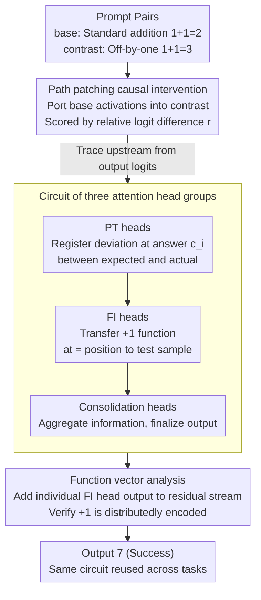

# Function Induction and Task Generalization: An Interpretability Study with Off-by-One Addition

**Conference**: ICLR 2026  
**arXiv**: [2507.09875](https://arxiv.org/abs/2507.09875)  
**Code**: [INK-USC/function-induction](https://github.com/INK-USC/function-induction)  
**Area**: LLM/NLP  
**Keywords**: mechanistic interpretability, in-context learning, induction heads, function vectors, task generalization, path patching  

## TL;DR

Through the counterfactual task of off-by-one addition (e.g., 1+1=3, 2+2=5), this study utilizes path patching to discover a **function induction** mechanism within Large Language Models—an attention head circuit capable of inductive reasoning at the function level, transcending token-level pattern matching—and demonstrates that this mechanism is reusable across tasks.

## Background & Motivation

1. **Importance of Task-level Generalization**: As LLM application scenarios expand, it is impractical to include all tasks in training data. Therefore, the ability of models to complete unseen tasks via in-context learning (ICL) during inference is crucial.
2. **Limitations of Prior Work**: Previous mechanistic understandings of ICL primarily centered on induction heads (token-level copy-paste, i.e., [A][B]...[A]→[B]) and function vectors (single-step mapping tasks like Country→Capital). There is insufficient understanding of complex generalization scenarios involving **multi-step reasoning** or **newly defined concepts**.
3. **Design of Off-by-one Addition**: This task consists of two steps—standard addition plus an unexpected +1 operation (i.e., 1+1=3). It is a counterfactual, multi-step synthetic task. The model must either learn the +1 rule to output 7 (successful generalization) or follow arithmetic rules to output 6 (failed generalization).
4. **Experimental Findings Driving Deep Analysis**: Six mainstream LLMs (Llama-2/3, Mistral, Gemma-2, Qwen-2.5, Phi-4) effectively complete this task, with accuracy monotonically increasing with the number of shots. This universal phenomenon inspired an in-depth investigation of the internal mechanisms.
5. **From Token Induction to Function Induction**: Traditional induction heads induce a zero-order constant function $f = \text{output}([B])$. This paper aims to reveal whether models can induce a first-order function $f(x) = x + 1$, elevating the understanding from token-level to function-level.
6. **Verification of Cross-task Reuse**: If function induction is a general mechanism, it should be reused across tasks with similar structures but different sub-steps. This is significant for understanding the compositionality and flexibility of models.

## Method

### Overall Architecture

This study does not train any models but primarily dissects Gemma-2 (9B) using path patching for causal intervention to reverse-engineer the internal circuit behind off-by-one addition. The core approach involves constructing a prompt pair differing by only one rule: a base prompt for standard addition (1+1=2) and a contrast prompt for off-by-one addition (1+1=3). Activations from the latter are replaced layer-by-layer with those from the former to observe if the output "collapses" from "+1 behavior" back to "standard addition." Starting from the output logits and tracing upstream, the circuit converges to three groups of attention heads with clear divisions of labor—collaborating in the order of PT → FI → Consolidation during forward computation to implement $f(x)=x+1$. Finally, function vector analysis independently verifies that FI heads in this circuit indeed write the +1 function into the residual stream.

### Key Designs

**1. Path Patching Causal Intervention: Quantifying the causality of "+1"**

Attention weights alone cannot determine which component is truly responsible for +1, as correlation does not equal causation. Path patching is used: forward passes are performed on base and contrast prompts, and a specific component's activation $M(\cdot|x_{base})$ is ported into the contrast prompt's forward pass. To quantify the impact, logit difference is defined as $F(C, x) = C(y_{base}|x) - C(y_{cont}|x)$, and the normalized relative logit difference is $r = \frac{F(M', x_{cont}) - F(M, x_{cont})}{F(M, x_{cont}) - F(M, x_{base})}$. An $r$ closer to $-100\%$ indicates that the component is a causal source of the +1 behavior. This allows for an unbiased extraction of the circuit structure.

**2. Circuit of Three Attention Head Groups: Decomposing multi-step reasoning**

After layer-wise path patching, the information flow converges to three groups of heads. In the order of forward computation: **Previous Token (PT) Heads** register the "deviation between the expected answer (e.g., 2) and the actual answer (e.g., 3)" at each example's answer $c_i$ position by looking back at the preceding "=" token. **Function Induction (FI) Heads** are the primary focus, retrieving this deviation at the test sample's "=" position to "transfer" the implicit +1 function. Unlike traditional induction heads that copy specific tokens [B] ($f=\text{output}([B])$), FI heads induce a first-order function $f(x)=x+1$. **Consolidation Heads** aggregate information in the final layers to finalize the output. While the **discovery order** is reversed (Consolidation → FI → PT), the information flow follows PT → FI → Consolidation.

| Group | Name | Function | Attention Pattern |
|------|------|------|-----------|
| Group 3 | **Previous Token (PT) Heads** | Register "deviation between expected and actual" at answer position | Attends to the "=" token immediately preceding $c_i$ |
| Group 2 | **Function Induction (FI) Heads** | Carry +1 function from ICL examples to test sample | Attends to answer tokens $c_i$ across preceding examples |
| Group 1 | **Consolidation Heads** | Aggregate information for final output | Primarily attends to current token and `<bos>` |

**3. Function Vector Analysis: Verifying that FI heads carry +1**

To prove FI heads encode the +1 function, a naive prompt (e.g., "2=2\n3=?") is used, adding a single FI head's output directly to the residual stream. Heatmaps show that each FI head only writes a "fragment" of the +1 function: some promote $x+1$, others inhibit $x-1$, or promote numbers greater than $x$. No single head is complete, but when 6 to 9 heads are summed, they form a complete +1 function, proving it is a distributedly encoded causal mechanism.

As no training is involved, evaluation uses two metrics: **Accuracy** of off-by-one addition and the relative logit difference **$r$**.

## Key Experimental Results

### Main Results: ICL Performance and FI Heads Ablation

| Model | 4-shot Acc | 8-shot Acc | 16-shot Acc | After FI Heads Ablation |
|------|-----------|-----------|------------|-----------------|
| Llama-2 (7B) | ~15% | ~35% | ~55% | Reverts to standard addition |
| Mistral-v0.1 (7B) | ~20% | ~50% | ~65% | Reverts to standard addition |
| Gemma-2 (9B) | 33% | ~70% | 86% | 0% (off-by-one), 100% (standard) |
| Llama-3 (8B) | ~60% | ~95% | ~98% | Reverts to standard addition |
| Phi-4 (14B) | ~65% | ~98% | ~99% | Reverts to standard addition |

Ablating 6 FI heads causes the model to lose the off-by-one capability entirely (accuracy drops to 0%), while random ablation has minimal impact.

### Ablation Study: Cross-task Generalization

| Task Pair | Base Task | Contrast Task | Contrast Acc (Full Model) | Contrast Acc (Ablated FI Heads) |
|--------|-----------|---------------|------------------------|----------------------------|
| Off-by-2 Addition | Standard | +2 Addition | Non-trivial | Significant drop |
| Shifted MMLU | Standard MCQA | Answer Shift +1 | Non-trivial | Significant drop |
| Caesar Cipher (k=2) | ROT-0 | ROT-2 | Non-trivial | Significant drop |
| Base-8 Addition | Base-10 | Base-8 | Non-trivial | Significant drop |

**Key Findings**: The same FI heads are reused across all four task pairs, proving the **flexibility and compositionality** of the function induction mechanism.

### Base-8 Addition Error Analysis

| Case | Description | Correct Behavior | Model Accuracy | Error Type |
|------|------|----------|-----------|----------|
| Case 1 | No carry | No adjustment | 93% | 7% Over-generalization |
| Case 2 | Carry, adjust units/tens | Adjust both | 16% | 84% Under-generalization |
| Case 3 | Carry, adjust units only | Adjust units | 14% | 83% Under-generalization |

This shows that while models can induce simple +2 functions, they struggle with conditional triggers (e.g., applying +2 only under specific conditions).

## Highlights & Insights

- **Novelty**: Generalizing induction heads from zero-order (token copying) to first-order (function induction $f(x)=x+1$) is a fundamental advancement in understanding ICL mechanisms.
- **Key Insight**: The off-by-one addition task elegantly combines counterfactual reasoning with arithmetic, allowing for the decomposition of multi-step reasoning.
- **Mechanism Mechanism**: The same FI circuit is reused in diverse tasks like MCQA shifts and Caesar Ciphers, indicating a universal "function offset" module.
- **Value**: Analysis of Base-8 addition reveals that models may achieve accuracy through unexpected shortcut algorithms (performing Base-10 then +2), suggesting that raw accuracy may mask reasoning flaws.

## Limitations & Future Work

1. **Circuit Imperfection**: Identified circuits do not perfectly satisfy faithfulness and completeness standards (which often conflict with minimality).
2. **Focus on Attention**: The role of MLP layers was not analyzed in depth, nor were the internal QK/OV circuits of individual heads.
3. **Restricted Function Types**: Only "offset" functions ($f(x) = x + k$) were verified; more complex non-linear transformations remain unexplored.
4. **Synthetic Nature**: Mechanisms have not been validated in natural language contexts.
5. **Non-linearity of Digit Representation**: LLM digit tokens are often mapped to Fourier feature spaces rather than linear spaces, complicating interpretability.
6. **Failure of Conditional Induction**: The failure in Base-8 addition tasks highlights current limitations in "multi-step induction + multi-step task" capabilities.

## Related Work & Insights

- **Induction Heads (Olsson et al., 2022)**: Ours naturally extends this concept from token-level to function-level.
- **Function Vectors (Todd et al., 2024)**: FI heads and FV heads have similar roles but occupy different layers; FI heads can be seen as specialization of FV mechanisms in the late stages of multi-step tasks.
- **Latent Multi-step Reasoning**: Provides circuit-level evidence for implicit multi-step reasoning in models.
- **Alignment**: Suggests that behaviors like sycophancy may share similar structures—where models induce a "belief modification function" from the context.

## Rating

- **Novelty**: ⭐⭐⭐⭐⭐
- **Experimental Thoroughness**: ⭐⭐⭐⭐
- **Writing Quality**: ⭐⭐⭐⭐⭐
- **Value**: ⭐⭐⭐⭐

<!-- RELATED:START -->

## Related Papers

- [\[ICLR 2026\] Efficient and Sharp Off-Policy Learning under Unobserved Confounding](efficient_and_sharp_off-policy_learning_under_unobserved_confounding.md)
- [\[ICLR 2026\] On the Eligibility of LLMs for Counterfactual Reasoning: A Decompositional Study](on_the_eligibility_of_llms_for_counterfactual_reasoning_a_decompositional_study.md)
- [\[ACL 2026\] Function Words as Statistical Cues for Language Learning](../../ACL2026/causal_inference/function_words_as_statistical_cues_for_language_learning.md)
- [\[NeurIPS 2025\] LLM Interpretability with Identifiable Temporal-Instantaneous Representation](../../NeurIPS2025/causal_inference/llm_interpretability_with_identifiable_temporal-instantaneous_representation.md)
- [\[CVPR 2025\] Joint Scheduling of Causal Prompts and Tasks for Multi-Task Learning](../../CVPR2025/causal_inference/joint_scheduling_of_causal_prompts_and_tasks_for_multi-task_learning.md)

<!-- RELATED:END -->
