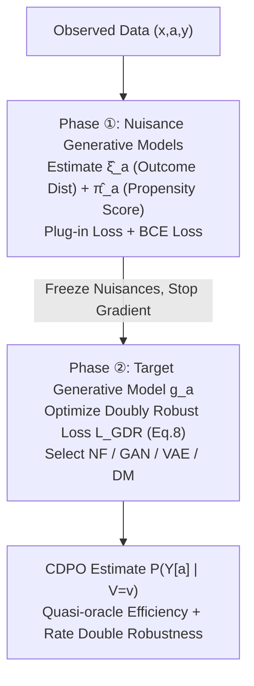

# GDR-learners: Orthogonal Learning of Generative Models for Potential Outcomes

**Conference**: ICLR 2026  
**OpenReview**: [https://openreview.net/forum?id=bbmcIaEmJG](https://openreview.net/forum?id=bbmcIaEmJG)  
**Code**: [https://github.com/Valentyn1997/gdr-learners](https://github.com/Valentyn1997/gdr-learners)  
**Area**: Causal Inference / Generative Models / Potential Outcome Distributions  
**Keywords**: Conditional Distribution of Potential Outcomes (CDPO), Neyman-orthogonality, Doubly Robust, quasi-oracle efficiency, conditional generative models  

## TL;DR
This paper proposes a suite of universal **Neyman-orthogonal (doubly robust) generative learners, GDR-learners**. These learners integrate any SOTA conditional generative model (NF / GAN / VAE / Diffusion) into a two-stage objective loss that is first-order insensitive to nuisance estimation errors. This allows for estimating the **entire conditional distribution** of potential outcomes (rather than just the expectation) with "quasi-oracle efficiency + rate double robustness."

## Background & Motivation
- **Background**: Causal machine learning aims to predict potential outcomes (PO) after intervention. Recent research has shifted from estimating the conditional average potential outcome (CAPO) to estimating the **conditional distribution of potential outcomes (CDPO)** $P(Y[a]\mid V=v)$. Distributions capture intrinsic stochasticity (aleatoric uncertainty, heavy tails, multi-modality), which is critical for high-stakes decision-making in fields like healthcare. Various generative models (CEVAE, GANITE, NOFLITE, DiffPO, PO-Flow, etc.) have been adapted the model CDPO.
- **Limitations of Prior Work**: Existing methods rarely consider the **optimality of the overall learning process**. To the authors' knowledge, no method satisfies general **Neyman-orthogonality**. Orthogonality provides quasi-oracle efficiency (learning the target model as if true nuisances were known, even if nuisance convergence is slow) and rate double robustness (slow convergence in one nuisance can be compensated by another). Current learners are either plug-in (projecting only on the $A=a$ sub-population) or RA / IPTW (where nuisance errors propagate to the target risk at the same order).
- **Key Challenge**: Although DiffPO (Ma et al. 2024) proposed an "orthogonal" IPTW learner, it only holds under the **stringent condition** that the target model class exactly contains the true CDPO (termed "partial orthogonality"). Once the model class is constrained due to fairness or interpretability requirements, orthogonality fails.
- **Goal**: Construct a **generative-model-agnostic** CDPO learner that maintains general Neyman-orthogonality for any (even restricted) target model class.
- **Core Idea**: **[First-order Bias Correction]** Starting from an RA-learner, the authors use the efficient influence function of the target risk for **one-step bias correction**. This results in a doubly robust objective loss utilizing both propensity scores and conditional outcome densities, making the risk first-order insensitive to nuisance estimation errors.

## Method

### Overall Architecture
GDR-learner is a **two-stage, model-agnostic** meta-learner. Given observed data $\{(x_i,a_i,y_i)\}$, the goal is to estimate the CDPO $P(Y[a]\mid V=v)$. Under standard causal identification assumptions (consistency, strong overlap, ignorability), $P(Y[a]=y\mid V=v)=\mathbb{E}[\xi_a(y\mid X)\mid V=v]$, where $\xi_a(y\mid x)=P(Y=y\mid X=x,A=a)$ is the conditional outcome density. The two stages are: **① Phase 1**: Estimate nuisance functions $\eta=(\hat\xi_a,\hat\pi_a)$ (conditional outcome distribution + propensity score $\pi_a(x)=P(A=a\mid x)$); **② Phase 2**: Freeze nuisances and use the doubly robust loss $\hat{\mathcal{L}}_{\text{GDR}}$ to fit a selected target generative model $g_a$.

### Key Designs

**1. Universal Target Generative Risk: Unifying four generative model types into one loss.** Learning CDPO is formulated as finding the **best projection** of the true CDPO onto a predefined model class $G=\{g_a(y,z\mid v)\}$ according to some distributional distance. The unified target risk is written as $\mathcal{L}(g_a)=\mathbb{E}\big[\mathbb{E}_{Z\sim\varepsilon_z}\log g_a(Y[a],Z\mid V)\big]$, where $Z$ is an auxiliary latent variable and $\varepsilon_z$ is its sampling distribution. By varying the $(g_a,Z,\varepsilon_z)$ triplet, this single equation can instantiate Conditional Normalizing Flows (CNF, corresponding to KL divergence), Conditional GANs (CGAN, corresponding to JS divergence), Conditional VAEs (CVAE, KL + inference gap), and Conditional Diffusion (CDM, KL + inference gap). This unification is the foundation for GDR's "plug-and-play" compatibility with SOTA generative models.

**2. One-step Bias Correction for a Doubly Robust Loss.** Naive learning follows three paths: plug-in loss $\hat{\mathcal{L}}_{\text{PI}}$, regression adjustment (RA) loss (relying only on $\hat\xi_a$), and IPTW loss (relying only on $\hat\pi_a$). However, their nuisance errors propagate at the first order. GDR applies one-step bias correction to the RA-learner to obtain the core loss:

$$\hat{\mathcal{L}}_{\text{GDR}}(g_a,\hat\eta)=\mathbb{P}_n\Big\{\tfrac{\mathbb{1}\{A=a\}}{\hat\pi_a(X)}\,\mathbb{E}_{Z}\log g_a(Y,Z\mid V)+\big(1-\tfrac{\mathbb{1}\{A=a\}}{\hat\pi_a(X)}\big)\!\int_Y\!\big[\mathbb{E}_Z\log g_a(y,Z\mid V)\big]\hat\xi_a(y\mid X)\,dy\Big\}$$

The first term is an IPTW-style weighting term, and the second term uses $\hat\xi_a$ to correct the counterfactual integral. Together, they **utilize both nuisances**, formulating the estimate as "main term + bias correction term."

**3. Neyman-orthogonality and Resulting Optimality Guarantees.** Theorem 1 proves that the risk of $\hat{\mathcal{L}}_{\text{GDR}}$ satisfies $D_\eta D_g \mathcal{L}_{\text{GDR}}(g_a^*,\eta)[g_a-g_a^*,\hat\eta-\eta]=0$, meaning the risk gradient is **first-order insensitive** to nuisance misspecification. Theorem 2 further provides $\|g_a^*-\hat g_a\|_G^2\lesssim(\text{Optimization Error})+\|\xi_a-\hat\xi_a\|_{L_4}^2\cdot\|\pi_a-\hat\pi_a\|_{L_4}^2$. Nuisance errors appear only in **product/higher-order** forms, resulting in **(a) quasi-oracle efficiency** (each nuisance only needs an $o_P(n^{-1/4})$ rate) and **(b) rate double robustness**. Crucially, this guarantee holds even for **restricted model classes $G$**, whereas the "partial orthogonality" of IPTW fails under restriction—this is the fundamental advantage of GDR over DiffPO.

**4. Instantiation and Training Stability.** Both nuisance and target models are implemented using the same four generative model types, conditioned via hypernetworks or FiLM. Training involves two steps: Phase ① optimizes plug-in + BCE to learn nuisances; Phase ② freezes nuisances (gradient stop) and trains the target model with $\hat{\mathcal{L}}_{\text{GDR}}$. The integral over $\hat\xi_a$ in Eq. (8) is approximated via MC sampling with $n_{\text{MC}}=1$ (thus $\hat\xi_a$ only needs to provide a sampling mechanism, not an explicit density, making it compatible with GAN/VAE/DM). EMA weights ($\lambda=0.995$) and noise regularization are used to stabilize the second phase.

## Key Experimental Results

### Main Results: Synthetic Data (Varying Training Size)
On noisy-moons synthetic data ($d_y=2,d_x=2$), the authors compare plug-in / IPTW / RA / GDR combined with four generative models using out-of-sample W2 distance.

| Observation | Result |
|-------------|--------|
| Increasing data size | GDR-learners achieve best performance (consistent with asymptotic optimality expectations) |
| $n_{\text{train}}\in\{2000,4000\}$ | **GDR-CDMs (Diffusion) are overall optimal** |
| Small sample sizes | Asymptotic advantage is less pronounced; gaps are smaller |

### ACIC 2016 (77 Semi-synthetic Datasets, Log-prob Metric)
Reporting the percentage of runs where GDR outperforms other learners:

| Baseline | (a) Full setup a=0/a=1 | (b) Linear restricted setup a=0/a=1 |
|----------|------------------------|------------------------------------|
| vs Plug-in | 45.97% / 44.42% | **51.43% / 54.81%** |
| vs IPTW | 47.27% / 50.65% | **61.82% / 60.26%** |
| vs RA | 8.05% / 10.13% | 22.34% / 25.45% |

- **Full setup** ($V=X$, model class unrestricted): GDR is approximately equivalent to IPTW (theory predicts both are orthogonal here).
- **Linear restricted setup** (target model limited to a single linear layer): Only GDR remains orthogonal, **outperforming plug-in and IPTW in most runs**, validating the core selling point of "orthogonality under restricted model classes."

### HC-MNIST High-Dimensional Confounding ($d_x=785, n=70000$)

| Learner | CNFs a=1 | CDMs a=1 |
|---------|----------|----------|
| Plug-in | 0.653 | 0.601 |
| IPTW | 0.635 | 0.595 |
| RA | 0.593 | 0.574 |
| **GDR** | **0.572** | **0.572** |

GDR is consistently optimal across most generative models and treatment arms, proving effectiveness under high-dimensional confounding.

### Key Findings
- The advantage of GDR emerges as sample size grows (asymptotic optimality).
- GDR does not necessarily outperform RA on log-prob metrics—quasi-oracle efficiency is guaranteed for $L_2$ norms, while log-prob is sensitive to outliers.
- The diffusion version (GDR-CDMs) shows the best overall performance.

## Highlights & Insights
- **"Model-agnostic + general orthogonality" unified framework**: The first learner to extend Neyman-orthogonality from conditional means to the **entire conditional distribution** for any (including restricted) generative model class, filling the gap left by DiffPO's "partial orthogonality."
- **One target risk for four generative models**: CNF, GAN, VAE, and DM are unified by the same loss, making it architecturally simple to swap components and enjoy double robustness.
- **Balance of theory and usability**: $n_{\text{MC}}=1$ approximation allows nuisances to require only sampling capabilities, enabling implicit models like GANs/VAEs/Diffusion to serve as nuisances.
- **Honest boundary definition**: Clear explanation of when to use IPTW vs. GDR via scenario analysis.

## Limitations & Future Work
- **Advantage limited to restricted model classes**: When $V=X$ and the model class is unrestricted, GDR degrades to equivalence with IPTW; its strength lies in fairness/interpretability-constrained scenarios.
- **Inferior to RA under Log-prob**: Quasi-oracle efficiency is only $L_2$-guaranteed, which doesn't translate to metrics sensitive to support like log-prob.
- **Convergence rate dependency**: Theorem 2 requires nuisances to reach $o_P(n^{-1/4})$. Estimating conditional densities is harder than conditional means, and whether this is achievable in high dimensions remains an open question.
- **(Semi-)synthetic experiments**: End-to-end validation in real-world healthcare or similar high-stakes settings is still lacking.

## Related Work & Insights
- **CAPO Meta-learners**: DR-learner (Kennedy 2023), R-learner (Nie & Wager 2021) focus on conditional means; this work elevates the "doubly robust + quasi-oracle" philosophy to the distributional level.
- **CDPO Generative Methods**: CEVAE/TEDVAE (VAE-based), GANITE (GAN+RA), NOFLITE (Flow-based plug-in), DiffPO (Diffusion-based IPTW, partial orthogonality)—these serve as instantiation counterparts for this work.
- **Insight**: By treating "efficient influence function + one-step bias correction" as a universal recipe, one can systematically add double robustness to any generative estimation problem involving "projection into a model class."

## Rating
- **Novelty**: ⭐⭐⭐⭐⭐ First to extend general Neyman-orthogonality to the full distribution of potential outcomes while decoupling from generative model types.
- **Experimental Thoroughness**: ⭐⭐⭐⭐ Covers synthetic, ACIC 2016, HC-MNIST, and Colored-MNIST with 16 model combinations, though lacks real-world deployment validation.
- **Writing Quality**: ⭐⭐⭐⭐ Clear progression from theorems to intuitions and scenario maps; high notation density might pose a barrier to non-causal experts.
- **Value**: ⭐⭐⭐⭐ Provides a plug-and-play doubly robust recipe for distributional causal estimation, with significant potential for uncertainty-aware decision-making.

<!-- RELATED:START -->

- **DiffPO**: Ma et al., 2024. (Partial orthogonality for diffusion models).
- **DR-learner**: Kennedy, 2023. (Doubly robust learning for conditional average treatment effects).
- **GANITE**: Yoon et al., 2018. (GAN-based potential outcome estimation).

<!-- RELATED:END -->

## Related Papers

- [\[ICLR 2026\] An Orthogonal Learner for Individualized Outcomes in Markov Decision Processes](an_orthogonal_learner_for_individualized_outcomes_in_markov_decision_processes.md)
- [\[ICLR 2026\] Debiased Front-Door Learners for Heterogeneous Effects](debiased_front-door_learners_for_heterogeneous_effects.md)
- [\[ICLR 2026\] IGC-Net for Conditional Average Potential Outcome Estimation Over Time](igc-net_for_conditional_average_potential_outcome_estimation_over_time.md)
- [\[ICLR 2026\] Overlap-Weighted Orthogonal Meta-Learner for Treatment Effect Estimation over Time](overlap-weighted_orthogonal_meta-learner_for_treatment_effect_estimation_over_ti.md)
- [\[ICML 2026\] Rank-Learner: Orthogonal Ranking of Treatment Effects](../../ICML2026/causal_inference/rank-learner_orthogonal_ranking_of_treatment_effects.md)

<!-- RELATED:END -->
