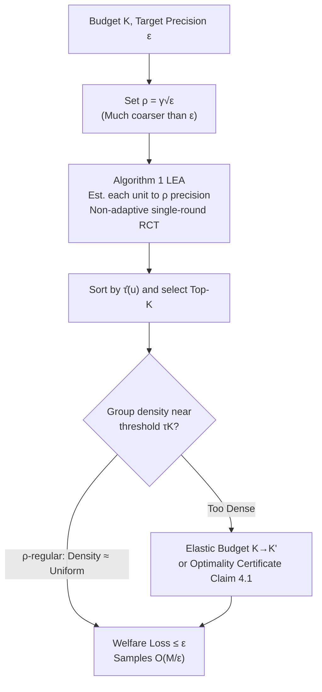

# Good Allocations from Bad Estimates

**Conference**: ICLR 2026  
**OpenReview**: [https://openreview.net/forum?id=rxZdaKhu2I](https://openreview.net/forum?id=rxZdaKhu2I)  
**Code**: TBD  
**Area**: Causal Inference / Treatment Effect Estimation / Sample Complexity Theory  
**Keywords**: CATE estimation, Treatment allocation, Sample complexity, Welfare maximization, $\rho$-regularity  

## TL;DR
This paper proves a counter-intuitive conclusion: **the sample size required for allocating limited treatment resources (treatment allocation) to target groups is smaller than the sample size required to accurately estimate the treatment effect (CATE) for each group by a factor of $1/\epsilon$**—requiring only $O(M/\epsilon)$ instead of $O(M/\epsilon^2)$ samples, because "coarse estimates are sufficient for making near-optimal allocation decisions."

## Background & Motivation
**Background**: When resources for a welfare intervention (money transfers, medication, educational resources) are limited, the standard practice is to first use a randomized controlled trial (RCT) to estimate the Conditional Average Treatment Effect (CATE) $\tau(u)$ for each group (school, county, age bracket), then rank them by estimated values to distribute resources to the top $K$ groups.

**Limitations of Prior Work**: Estimating the treatment effect of a single group to an error $\epsilon$ requires $\Theta(1/\epsilon^2)$ samples (a classic lower bound for mean estimation derived from Hoeffding/Le Cam). Consequently, estimating all CATEs for $M$ groups (the **FullCATE** problem) requires $\Theta(M/\epsilon^2)$ samples. It has long been assumed that since allocation depends on estimation, the sample complexity of the allocation problem and the estimation problem are equivalent, both hitting this quadratic lower bound.

**Key Challenge**: The goal of allocation is to "select the right $K$ groups," not to "know the exact effect for every group." Are these two tasks truly equal in difficulty? While instances requiring $\Omega(M/\epsilon^2)$ samples exist in the worst case, **this quadratic lower bound is fragile**—it only appears when the effects of all groups are clustered precisely around the optimal threshold, which almost never occurs in real-world data.

**Goal**: To decouple the allocation problem from the estimation problem and provide instance-dependent sample complexity upper bounds, proving that "allocation requires only linear $O(M/\epsilon)$ samples under typical distributions."

**Core Idea (Coarse Estimates Suffice)**: Allocation is essentially determining whether $\tau(u)$ is above or below the optimal threshold $\tau_K$ for each group. Groups far from the threshold can be correctly classified with very coarse estimates. Even if groups near the threshold are misclassified, the **total welfare loss remains small** because their effects are already close to each other. This creates a "win-win" structure where the only bad case is having many groups neither far from nor close to the threshold.

## Method

### Overall Architecture
The paper does not propose a new estimator but rather adjusts the "estimation precision" dial: instead of estimating each $\tau(u)$ to precision $\epsilon$, it estimates to a precision $\rho=\Theta(\sqrt{\epsilon})$ and selects the Top-$K$ based on these coarse estimates. The logical chain is: **Allocation → Threshold discrimination problem → Coarse estimates (precision $\sqrt\epsilon$) suffice → Few groups near the threshold in "smooth" distributions → Total welfare loss constrained within $\epsilon$ → Sample size reduced to $O(M/\epsilon)$**. When smoothness is occasionally violated, "verifiable optimality certificates" and "elastic budgets" are used as backups.

### Key Designs

**1. Reducing allocation to threshold discrimination: Precision need not be uniform.** The optimal allocation set can be written as $U^*=\{u\mid\tau(u)\ge\tau_K\}$, where $\tau_K$ is the minimum true effect among the selected groups (the $K$-th largest $\tau$ value). Thus, "selecting which $K$ groups" is equivalent to "determining whether $\tau(u)\ge\tau_K$ or $<\tau_K$ for each $u$." The key observation is: **the required precision for discrimination decreases as $\tau(u)$ moves further from $\tau_K$**—coarser estimates suffice for groups far from the threshold. Only groups lying close to the threshold require high precision, yet these are precisely the groups where "misclassification doesn't hurt" because their true effects are similar. This step replaces the uniform precision requirement of the "estimation problem" with an "adaptive precision requirement based on distance."

**2. Low-precision non-adaptive algorithm (LEA) and the optimal $\rho=\Theta(\sqrt\epsilon)$ tradeoff.** The algorithm introduces a precision dial $\rho$: it obtains a $(\rho,\delta/M)$-accurate estimate $\hat\tau(u)$ for each unit (using $\rho=\gamma\sqrt\epsilon$) and selects the $K$ units with the largest $\hat\tau$. Since precision is only $\rho$, the sample size per unit (given by Hoeffding) is $O(\ln(M/\delta)/\rho^2)=O(\ln(M/\delta)/\epsilon)$, totaling $O(M\ln(M/\delta)/\epsilon)$—one $1/\epsilon$ factor less than FullCATE. The algorithm is deliberately **non-adaptive and single-round**, as real-world RCTs often allow only one round. Multi-stage adaptivity could further reduce samples but is less practical. Setting $\rho$ to $\sqrt\epsilon$ is not arbitrary: it is the optimal balance between "making the precision as low as possible" and "keeping allocation loss small"—the welfare loss is proportional to $\rho$, and the number of groups near the threshold is also proportional to $\rho$, which together yield a loss of magnitude $\rho^2 = \epsilon$. LEA guarantees (Lemma 5) that $|\hat\tau_K-\tau_K|\le\rho$, and all groups with $\tau(u)>\tau_K+2\rho$ must be selected, while those with $\tau(u)<\tau_K-2\rho$ must be excluded.

**3. ρ-regularity: Smoothing conditions to tighten welfare loss to ϵ.** Groups in the "dead zone" $D=[\tau_K,\tau_K+2\rho]$ may be selected arbitrarily, causing a welfare loss bounded by $\frac{4\rho K_0}{V(A_1)+(\tau_K+2\rho)K_0}$, where $K_0$ is the number of selected groups in the dead zone. To keep this loss $\le\epsilon$, the probability mass $\theta_K=\Pr_\tau[\tau_K,\tau_K+2\rho]$ must not be too large. The paper defines **ρ-regularity**: a distribution $Z$ is $\rho$-regular if any interval $S$ of length $\ge 2\rho$ satisfies $\Pr_Z[S]\le c\cdot U[S]$ (where $c=\Theta(1)$ and $U$ is the uniform distribution). Intuitively, this "prevents excessive mass accumulation in small intervals," which is a weak smoothness requirement depending only on the shape of the CDF. Under this condition, $\theta_K\approx 2\rho c$, substituting into the loss expression yields a $\rho^2$ term in the numerator, making the loss $=(\sqrt\gamma\rho)^2=\epsilon$. This yields the main theorem: **On $\rho$-regular distributions, $O(M/\epsilon)$ samples yield a $(1-\epsilon)$-optimal allocation** (Theorem 7). Gaussian, Beta, and Uniform distributions all satisfy this, with $\gamma$ between $0.07$ and $0.2$. More importantly, the authors prove that even on the most regular uniform distribution, FullCATE still requires $\Omega(M/\epsilon^2)$ (Theorem 6), thereby **strictly separating the sample complexity of allocation from estimation**.

**4. Quantiles suffice + Verifiable certificates + Elastic budget.** Allocation depends only on the CDF/quantiles: $\tau_K=F^{-1}(1-K/M)$. Coarse estimates $\hat\tau$ naturally provide an approximation $\hat F$ of the CDF, satisfying the sandwich bound $\hat F(t-\rho)\le F(t)\le\hat F(t+\rho)$. This provides two practical tools: first, an instance-optimality condition (Claim 4.1) $\int_{\tau_K}^{\tau_K+2\rho}tf\,dt-\int_{\tau_K-2\rho}^{\tau_K-\alpha_K}tf\,dt\le\epsilon\int_{\tau_K}^{1}tf\,dt$. Decision-makers can **self-verify** if the current allocation is near-optimal using a small sample—if not, they can sample more. Second, when the threshold for the original budget $K$ hits a high-density region, an **elastic budget** fine-tunes $K$ to a neighboring $K'$, moving the threshold $\tau_{K'}$ into a low-density interval to maintain the near-optimal solution with $O(M/\epsilon)$ samples.

## Key Experimental Results

### Main Results
Using 5 real-world RCT datasets, treatment effects estimated from the full data were treated as ground truth. These were sub-sampled at different levels to compare ALLOC (Ours) against FullCATE in terms of normalized allocation welfare (Budget = 30%).

| Dataset | Grouping Basis | Budget K | Conclusion |
|---------|----------------|----------|------------|
| STAR | School | K=23 | Near-optimal with far fewer than $O(M/\epsilon^2)$ samples |
| TUP | Baseline Poverty| K=15 | Same as above |
| NSW | Baseline Income | K=9 | Same as above |
| Acupuncture | Age | K=7 | Same as above |
| Post-op | BMI | K=5 | Same as above |

Key Findings (Figure 1): **In all datasets, the sample size used by ALLOC was not only far below the worst-case $O(M/\epsilon^2)$ (red line) but even below the theoretical upper bound $O(M/\epsilon)$ (green line)**. The empirical curves quickly approached the optimal welfare of 1.0, suggesting real treatment effect distributions generally satisfy (or exceed) the $\rho$-regularity assumption.

### Ablation Study

| Dimension | Setting | Observation |
|-----------|---------|-------------|
| Group Partitioning | Various partitions | Conclusions are robust; near-optimal allocation is universal |
| Budget Size | Various K values | Near-optimality achieved with few samples across budgets |
| Elastic Budget | fine-tuning K→K' | Rescued the few failed instances |

### Key Findings
- **Underpowered RCTs can still yield excellent allocations**: An RCT with insufficient samples for accurate CATE estimation can still produce near-optimal resource allocation—"estimating every value" and "allocating to every group" are distinct tasks.
- **Rule of Thumb**: $M/\epsilon$ samples suffice for $(1-\epsilon)$-optimal allocation; standard CATE sample size calculations are overly pessimistic for allocation purposes.

## Highlights & Insights
- **Conceptual Decoupling**: Precisely distinguishing "treatment effect estimation" from "treatment allocation" and providing a quadratic separation in sample complexity—a strong extension of recent trends (Perdomo, Shirali, etc.) questioning the necessity of prediction for resource allocation.
- **Fragility of the Lower Bound**: Identifying that the $\Omega(M/\epsilon^2)$ lower bound only holds in pathological cases (all units clustered at the threshold) and using $\rho$-regularity to characterize the boundaries of "typical distributions."
- **Operational Feasibility**: The algorithm is non-adaptive, single-round, and ready for standard RCT deployment. The accompanying optimality certificate allows decision-makers to prove the quality of their solution using few samples.

## Limitations & Future Work
- **Smoothness Assumption Failure**: $\rho$-regularity fails in extreme distributions (many units tightly clustered at the threshold). While "verifiable certificates + elastic budgets" mitigate this, elastic budgets imply deviating from $K$, which may be policy-restricted.
- **Hidden Estimation Difficulty**: By assuming an estimation oracle, the paper abstracts away real-world difficulties like causal identification, confounding, and observational design to focus on sample complexity.
- **Homogeneous Costs and All-or-Nothing Assumptions**: Assumes identical treatment costs and either full or no treatment per unit. Extensions to heterogeneous costs, individual-level (rather than group-level) allocation, and continuous budgets are natural directions.
- **Non-adaptivity**: Although multi-stage adaptive RCTs can further reduce samples, the authors focused on single-stage methods for practical feasibility.

## Related Work & Insights
- **Prediction for Allocation**: Direct inspiration from Perdomo et al. (2025) and Shirali et al. (2024), the latter of which compares unit-level vs. individual-level targeting. This paper quantifies the "coarse estimation is enough" intuition.
- **Optimal Targeting Rules**: Connects to the literature on targeting under heterogeneity (Manski 2004, Athey & Wager 2021), focusing on sample complexity rather than specific estimation strategies.
- **Best-arm / Subset Identification (Bandits)**: While CATE estimation lower bounds are established via bandit literature, this work deliberately avoids adaptive processes to ensure real-world viability.
- **Insight**: "The precision required for estimation-for-decision-making is determined by the marginal sensitivity of the decision, not the precision of the estimation itself"—this logic applies to ranking, Top-K retrieval, and thresholding tasks.

## Rating
- Novelty: ⭐⭐⭐⭐⭐ Elevates the "Allocation $\ne$ Estimation" intuition to a theorem with quadratic sample separation; the $\rho$-regularity + $\sqrt\epsilon$ tradeoff is elegant and original.
- Experimental Thoroughness: ⭐⭐⭐⭐ 5 real RCTs with robustness checks. While relying on sub-sampling of full datasets as ground truth, it strongly supports the theory.
- Writing Quality: ⭐⭐⭐⭐⭐ Progression from motivation to intuition to formalization is clear. The "win-win" narrative and engineering backups (certificates/elastic budget) are well-articulated.
- Value: ⭐⭐⭐⭐⭐ Directly challenges standard practices in CATE sample size calculation for policy; the conclusion that underpowered RCTs can be sufficient for allocation is highly impactful.

<!-- RELATED:START -->

## Related Papers

- [\[ICLR 2026\] LLMs Struggle to Balance Reasoning and World Knowledge in Causal Narrative Understanding](llms_struggle_to_balance_reasoning_and_world_knowledge_in_causal_narrative_under.md)
- [\[ICLR 2026\] Action-Guided Attention for Video Action Anticipation](action-guided_attention_for_video_action_anticipation.md)
- [\[ICLR 2026\] On Measuring Influence in Avoiding Undesired Future](on_measuring_influence_in_avoiding_undesired_future.md)
- [\[ICLR 2026\] Learning Robust Intervention Representations with Delta Embeddings](learning_robust_intervention_representations_with_delta_embeddings.md)
- [\[ICLR 2026\] Overlap-Weighted Orthogonal Meta-Learner for Treatment Effect Estimation over Time](overlap-weighted_orthogonal_meta-learner_for_treatment_effect_estimation_over_ti.md)

<!-- RELATED:END -->
