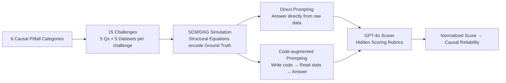

# Ice Cream Doesn't Cause Drowning: Benchmarking LLMs Against Statistical Pitfalls in Causal Inference

**Conference**: ICLR 2026  
**OpenReview**: [https://openreview.net/forum?id=MGMG7yQ18v](https://openreview.net/forum?id=MGMG7yQ18v)  
**Code**: CausalPitfalls (Paper indicates public release, repository to be confirmed)  
**Area**: Causal Inference / LLM Evaluation  
**Keywords**: Causal Inference, LLM Evaluation Benchmark, Statistical Pitfalls, Simpson's Paradox, Confounding Bias, Code-Augmented Reasoning  

## TL;DR
The study proposes the **CausalPitfalls** benchmark, featuring 6 categories, 15 challenges, 75 questions, and 75 datasets generated by structural causal models. It systematically tests whether LLMs fall into classic statistical traps such as Simpson's Paradox and selection bias, revealing that even the strongest models possess a "causal reliability" of less than 45%.

## Background & Motivation
**Background**: Causal inference is the cornerstone of high-risk decision-making in medicine, economics, and public policy. The impressive performance of LLMs in solving scientific problems and clinical reasoning has led to expectations that they can automatically perform statistical causal analysis. Several works (Kiciman 2023, Jin 2023, etc.) have evaluated the causal capabilities of LLMs.

**Limitations of Prior Work**: Most existing benchmarks focus on "simplified tasks"—requiring models to recognize semantic causal relationships from variable names or directly draw conclusions from raw data. These evaluations ignore the factor that truly distinguishes experts from laypeople: **robustness to statistical pitfalls**. Models may provide causal assertions that appear plausible but are directly refuted by the data, yet this unreliability remains unquantified.

**Key Challenge**: Fluent surface-level responses create an "illusion of competence." Rigorous statistical causal inference requires anchoring conclusions in evidence, checking assumptions, and ruling out alternative explanations, yet LLMs may rely on irrelevant cues or statistical artifacts to provide confident but incorrect outputs. The paper highlights this contradiction with two failure cases: (1) **Brand Bias**—for the same data, simply changing a beverage label from "HealthPlus" to "UltraSugar" caused GPT-4o and Gemini to flip their conclusion from beneficial to harmful; (2) **Spurious Causality**—on real Dutch research funding data, all tested models incorrectly attributed random fluctuations to gender discrimination or Simpson's Paradox, while strict statistical analysis showed neither was present.

**Goal**: Build a benchmark to quantitatively measure the "causal reliability" of LLMs, covering the most common and easily misjudged statistical pitfalls in the real world.

**Core Idea**: **Use structural causal models to generate questions, use rubrics for scoring, and use a dual-protocol comparison**—decompose causal pitfalls into controllable synthetic scenarios, pair each question with a hidden scoring rubric, and measure both "direct response" and "code-augmented response" modes to simultaneously quantify causal reasoning capability and reliability.

## Method

### Overall Architecture
CausalPitfalls is an evaluation pipeline consisting of "Question Generation → Testing → Scoring." It derives 15 challenges based on 6 major causal pitfall categories, with each challenge including 5 questions of increasing difficulty and 5 datasets simulated using Structural Causal Models (DAG + structural equations), each containing >500 samples with linear and non-linear mechanisms. LLMs answer under two protocols: **Direct Prompting** to test original causal intuition and **Code-augmented Prompting** where the model writes executable statistical code before answering based on the results. Finally, an independent GPT-4o scorer uses hidden rubrics to award points, summarized into a single "Causal Reliability" metric.

### Key Designs

**1. Hierarchical Question Generation for Six Pitfalls: Translating "Expert Intuition" into Controllable Difficulty Gradients.** The benchmark classifies causal inference errors into six categories—Confounding Bias & Spurious Correlation, Intervention & Experimental Reasoning, Counterfactuals & Hypothetical Reasoning, Mediation & Indirect Effects, Causal Discovery & Structural Learning, and Causal Generalization & External Validity—further refined into 15 specific challenges like Simpson’s Paradox, Berkson's Bias, and sequential mediation. Each core problem in a challenge is written in 5 difficulty versions: the simplest level explicitly asks to "adjust for confounder {CONFOUNDER} and judge if Simpson’s Paradox exists," while the "Hardest" level only provides "Evaluate whether {TREATMENT} causally affects {OUTCOME}" without additional hints. This gradient allows the evaluation to distinguish between "true understanding" and "guessing based on prompts."

**2. Data Generation via Structural Causal Models: Making Ground Truth Controllable and Verifiable.** Data is simulated based on Pearl’s causal diagrams and structural equations rather than being sampled randomly. Each structural equation represents a causal mechanism rather than a pure statistical association; equation coefficients directly encode causal effects, making the "true causal effect" a verifiable ground truth—mathematically equivalent to simulating potential outcomes under the Neyman–Rubin framework. Structural equations include both linear and non-linear forms (non-linear link functions, interaction terms) to ensure the evaluation is not restricted to linear relationships.

**3. Dual Protocol Comparison: Separating "Causal Intuition" from "Computational Execution."** Direct Prompting examines the internal ability of the model to draw causal conclusions directly from raw data without tools; Code-augmented Prompting requires the model to first generate executable code for statistical analysis before answering based on the numerical results. The latter decouples "low-level data parsing" from "high-level causal reasoning"—the model uses code to condense raw tables into summary statistics and reasons based on clean numbers. Comparing the scores of the two protocols allows for precise localization of where computational assistance is useful and where intuition suffices.

**4. Scoring Rubrics + GPT-4o Automatic Evaluation + Human Calibration: Quantifying Reliability into a Single Metric.** Each pitfall is paired with a detailed scoring rubric (developed based on epidemiological reporting standards like STROBE), awarding points based on whether the model effectively handles the pitfall. A single challenge score is normalized as $\text{Normalized Score}(\%)=\frac{\text{score}}{\text{max score}}\times100\%$, and the average of all challenges represents the "**Causal Reliability**." To avoid evaluation bias, an independent GPT-4o is used for automatic scoring, validated by three statisticians who manually scored 150 randomly sampled responses. The reliability of the automated evaluation was verified using a gap metric $\text{Gap}=\frac{1}{150}\sum_{i=1}^{150}\frac{|\text{score}^{(i)}_{\text{LLM}}-\text{score}^{(i)}_{\text{human}}|}{s_{\max,i}}\in[0,1]$ (where 0 indicates perfect consistency).

## Key Experimental Results

### Main Results (Causal Reliability %, Means across 6 Categories + Average)

| Model | Protocol | Conf | Interv | Counter | Med | Disc | Ext | **Average** |
|------|------|------|--------|---------|-----|------|-----|---------|
| GPT-o4-mini | Direct | 41.4 | 45.2 | 18.6 | 57.7 | 37.0 | 44.5 | **40.7** |
| GPT-o4-mini | Code | 62.0 | 51.9 | 17.0 | 50.0 | 26.7 | 50.7 | **43.0** |
| Deepseek-chat | Direct | 25.9 | 52.4 | 12.9 | 53.8 | 20.8 | 28.7 | **32.4** |
| Deepseek-chat | Code | 38.6 | 48.7 | 10.9 | 47.1 | 25.8 | 45.6 | **36.1** |
| Gemini-2.0-flash | Direct | 20.1 | 37.6 | 13.4 | 46.7 | 13.5 | 14.9 | **24.4** |
| Gemini-2.0-flash | Code | 37.2 | 43.0 | 14.3 | 42.2 | 16.2 | 38.0 | **31.8** |
| GPT-4.1 | Direct | 17.3 | 33.6 | 6.6 | 53.3 | 16.4 | 24.3 | **25.2** |
| GPT-4.1 | Code | 47.1 | 42.7 | 12.3 | 49.4 | 23.9 | 48.6 | **37.3** |
| Mistral-7b | Direct | 17.3 | 29.8 | 5.7 | 19.2 | 8.4 | 6.2 | **14.4** |
| Mistral-7b | Code | 4.7 | 13.2 | 1.4 | 11.1 | 6.4 | 9.1 | **7.7** |

Conf=Confounding/Spurious, Interv=Intervention, Counter=Counterfactual, Med=Mediation, Disc=Discovery, Ext=Generalization/External Validity.

### Ablation Study (Causal Reliability % by Difficulty, Direct Prompting)

| Model | Very Easy | Easy | Medium | Hard | Very Hard |
|------|------|----|----|----|------|
| GPT-o4-mini | 60.7 | — | — | — | 17.8 |
| Gemma2-9b | 20.5 | 15.6 | 14.2 | 6.7 | 5.5 |
| Llama3.1-8b | 28.0 | 20.9 | 19.9 | 10.7 | 5.8 |

Under the code-augmented protocol, GPT-o4-mini's reliability on "Very Hard" questions rose from 17.8% (direct prompting) to 32.8%, indicating that computational aid is particularly helpful for difficult problems.

### Key Findings
- **The strongest are still failing**: Average reliability for all models was below 45%, with GPT-o4-mini leading at 40.7%/43.0%, which is far from a trustworthy level.
- **Medium-sized models can outperform large models**: The optimized Deepseek-chat achieved the highest score of 52.4% in the Intervention/Experimental Reasoning category, exceeding larger frontier systems in specific scenarios.
- **Code acceleration is not a panacea**: It amplified the advantages of strong models (GPT-4.1 increased from 25.2% to 37.3%) but hindered small open-source models (Mistral-7B dropped from 14.4% to 7.7% due to high code error rates); allowing a single debugging step could bring them back to direct prompting levels.
- **Performance collapses with increasing difficulty**: Reliability monotonically decreases as prompts are reduced; counterfactual reasoning (Counter) is a global weakness for nearly all models.

## Highlights & Insights
- **Identifies the real issue**: The study does not evaluate "correctness" in a vacuum, but rather "susceptibility to traps," which is the critical dimension separating statistical experts from laypeople and more closely represents real-world decision risks than existing accuracy benchmarks.
- **SCM-based question generation provides verifiable ground truth**: Using SCM/DAG to encode causal mechanisms allows the "correct answer" to have a mathematical definition, avoiding disputes over ground truth inherent in observational benchmarks.
- **Diagnostic value of dual protocols**: By decoupling "data parsing" and "causal reasoning," it clearly shows that strong models benefit from code while weak models are conversely hindered by it, providing empirical basis for when LLMs should invoke statistical tools.
- **Highly persuasive failure cases**: Case studies on brand bias and spurious gender discrimination vividly demonstrate how LLMs can be led astray by semantic labels and random noise, providing excellent counterexamples.

## Limitations & Future Work
- **Relatively low ceiling with subjective absolute values**: Normalized scores depend on human-designed rubrics; the strictness of different rubrics affects whether a score is "40% or 60%," requiring caution in cross-benchmark comparisons.
- **Risk of homologous evaluation bias with GPT-4o**: While 150 samples were human-calibrated, using an LLM to judge other LLMs might lead to shared blind spots on certain traps.
- **Primarily synthetic**: Most data is simulated by SCMs; while mechanisms are controllable, there is still a gap between this and the noise structures or measurement errors of real-world observational data, requiring more real-world datasets for external validity.
- **Does not involve multi-turn/tool-calling agents**: Current testing is based on single-turn Q&A. Providing a full statistical software environment and multi-turn reflection might lead to a significantly different reliability ceiling, which is a direction worth following.

## Related Work & Insights
- **Comparison with Kiciman 2023, Jin 2023**: The former proved LLMs can infer causal directions solely from variable names, while the latter used causal graphs to generate synthetic data for evaluation—this study extends the synthetic data approach but pivots from "accuracy" to "robustness and reliability against statistical pitfalls."
- **Methodological Foundation**: Built upon Pearl's do-calculus, the Neyman–Rubin potential outcomes framework, and classic statistical traps such as Simpson's Paradox and Berkson's bias.
- **Insights**: (1) "Reliability/Robustness" should be a first-class citizen alongside "Accuracy" when evaluating LLM reasoning; (2) The idea of using structural equations to create verifiable ground truth can be transferred to other reasoning evaluations requiring ground truth; (3) Whether code assistance is beneficial depends on the base model's capabilities, having direct reference value for the design of tool-enhanced agents.

## Rating
- **Novelty**: ⭐⭐⭐⭐ — Re-framing causal evaluation from "accuracy" to "reliability against statistical traps," involving 6 trap types and dual protocols, is novel and addresses a core issue.
- **Experimental Thoroughness**: ⭐⭐⭐⭐ — Covers 10 open and closed-source models, 6 trap types, 15 challenges, and 5 difficulty levels, with 150 human-calibrated scoring points, providing solid results.
- **Writing Quality**: ⭐⭐⭐⭐ — Uses vivid cases like "ice cream causes drowning," "brand bias," and "spurious gender discrimination" to explain abstract problems clearly with a distinct structure.
- **Value**: ⭐⭐⭐⭐ — Provides a quantitative warning and a reusable benchmark for using LLMs in high-risk causal decision-making, offering practical guidance for trustworthy causal reasoning research.

<!-- RELATED:START -->

<!-- RELATED:END -->

## Related Papers

- [\[ICLR 2026\] LLMs Struggle to Balance Reasoning and World Knowledge in Causal Narrative Understanding](llms_struggle_to_balance_reasoning_and_world_knowledge_in_causal_narrative_under.md)
- [\[ICLR 2026\] Exploratory Causal Inference in SAEnce](exploratory_causal_inference_in_saence.md)
- [\[ICLR 2026\] Adjusting Prediction Model Through Wasserstein Geodesic for Causal Inference](adjusting_prediction_model_through_wasserstein_geodesic_for_causal_inference.md)
- [\[ICLR 2026\] Foundation Models for Causal Inference via Prior-Data Fitted Networks](foundation_models_for_causal_inference_via_prior-data_fitted_networks.md)
- [\[ACL 2026\] Function Words as Statistical Cues for Language Learning](../../ACL2026/causal_inference/function_words_as_statistical_cues_for_language_learning.md)

<!-- RELATED:END -->
