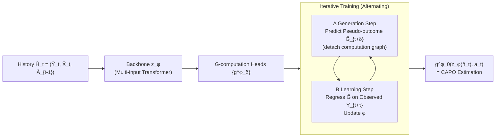

# IGC-Net for Conditional Average Potential Outcome Estimation Over Time

**Conference**: ICLR 2026  
**OpenReview**: [https://openreview.net/forum?id=ZmhpqpKzAT](https://openreview.net/forum?id=ZmhpqpKzAT)  
**Code**: [https://github.com/konstantinhess/IGC_net](https://github.com/konstantinhess/IGC_net)  
**Area**: Causal Inference / Temporal Potential Outcome Estimation / Medical Decision Making  
**Keywords**: Time-varying confounding, G-computation, Conditional Average Potential Outcome (CAPO), Iterative regression, Counterfactual prediction, MIMIC-III  

## TL;DR
This paper proposes **IGC-Net**: the first neural network to estimate temporal Conditional Average Potential Outcomes (CAPO) through pure regression-based iterative G-computation end-to-end. It correctly adjusts for time-varying confounding while bypassing the zero-division instability of Inverse Probability Weighting (IPW) and the high-dimensional full distribution estimation of G-Net.

## Background & Motivation
**Background**: Estimating "what the future outcome would be under a specific treatment sequence" (i.e., temporal CAPO) from observational data like Electronic Health Records (EHR) and wearables is a core task in personalized medicine. The primary challenge is **time-varying confounding**—in multi-step prediction, future covariates/outcomes are affected by past treatments and, in turn, influence future treatment assignments. Since these future covariates are unobservable at inference time (runtime confounding), simple conditioning on history leads to biased estimators.

**Limitations of Prior Work**: Existing neural methods fall into two categories, both with significant flaws. ① Methods without proper correction (CRN, CT, TE-CDE) rely on "balanced representations" to handle confounding. However, balancing is designed for variance reduction, not debiasing. They target incorrect estimators, leading to **asymptotic bias** (bias remains even with infinite data), which is irresponsible for medical deployment. ② Methods with proper correction also face issues: RMSNs use IPW to construct pseudo-outcomes, requiring cumulative products of inverse propensity scores for multi-step prediction, leading to frequent **division by near-zero values** and variance explosion. G-Net / G-transformer use G-computation but must estimate the **entire distribution** (all higher-order moments) of all time-varying confounders at every future step, relying on Monte Carlo (MC) sampling for indirect inference, which is high-dimensional and inefficient.

**Key Challenge**: The goal is to "correctly adjust for time-varying confounding by targeting the right estimator" while "avoiding the pitfalls of IPW zero-division and full-distribution estimation"—existing methods can only achieve one of these.

**Goal**: Construct an end-to-end neural model that performs proper G-computation adjustment using only low-variance regressions, without estimating probability distributions or utilizing MC sampling.

**Core Idea**: **Regression-based Iterative G-computation**—rewrite the nested conditional expectations of G-computation into a sequence of recursive regressions using "pseudo-outcomes." The network alternates between a **Generation Step (A)** to predict intermediate pseudo-outcomes and a **Learning Step (B)** to update weights via regression. Integrated into an end-to-end architecture, this approach only requires estimating the first moments of low-dimensional random variables.

## Method

### Overall Architecture
IGC-Net reformulates the nested G-computation formula for estimating CAPO $\mathbb E[Y_{t+\tau}[a_{t:t+\tau-1}]\mid \bar H_t]$ given history $\bar H_t$ and future treatments $a_{t:t+\tau-1}$ into a chain of conditional expectation regressions. The model comprises a **neural backbone** $z_\phi(\cdot)$ (multi-input Transformer or LSTM) that encodes the history into latent states, and **$\tau$ G-computation heads** $\{g^\phi_\delta\}_{\delta=0}^{\tau-1}$ that perform iterative regressions. During training, it alternates between "generating intermediate pseudo-outcomes" and "regression learning." The outermost head $g^\phi_0$ serves as the final CAPO estimator.

### Key Designs

**1. Rewriting Nested G-computation as Recursive Pseudo-outcome Regression: Replacing Full Distribution Integrals with First-Moment Chains.** G-computation identifies causal quantities as a sequence of nested conditional expectations. While G-Net estimates the joint distribution of all future confounders and integrates, which is $(\tau-1)\times(d_x+d_y)$ dimensional and requires MC sampling, this paper defines **pseudo-outcomes** $G^{\bar a}_{t+\tau}=Y_{t+\tau}$ as the innermost ground truth. By setting $g^{\bar a}_{t+\delta}(\bar h^t_{t+\delta})=\mathbb E[G^{\bar a}_{t+\delta+1}\mid \bar H^t_{t+\delta}, A_{t:t+\delta}=a_{t:t+\delta}]$ and $G^{\bar a}_{t+\delta}=g^{\bar a}_{t+\delta}(\bar H^t_{t+\delta})$, the nested expectation (Eq. 8–9) is transformed into a recursive regression chain from $\delta=\tau-1$ down to $\delta=0$. Finally, $g^{\bar a}_t(\bar h_t)$ yields the desired CAPO (Proposition 1 proves this recursion recovers CAPO and correctly adjusts for TVC). Each step becomes a $d_y$-dimensional regression, reducing the high-dimensional G-Net problem into $\tau$ low-dimensional regressions.

**2. End-to-End Training with Alternating Generation and Learning Steps: Predicting Missing Intermediate Pseudo-outcomes.** Since only the innermost $G^{\bar a}_{t+\tau}=Y_{t+\tau}$ is observed, intermediate pseudo-outcomes $\{G^{\bar a}_{t+\delta}\}_{\delta=1}^{\tau-1}$ lack labels. IGC-Net handles this by running a **Generation Step (A)** per iteration, using current heads to predict $\tilde G^{\bar a}_{t+\delta}=g^\phi_\delta(z_\phi(\bar H^t_{t+\delta}, a_{t:t+\delta-1}), a_{t+\delta})$ as missing pseudo-outcomes—this step is **detached** from the gradient graph. Then, a **Learning Step (B)** re-encodes observed histories $\bar H_{t+\delta}$ and regresses onto the previously generated $\tilde G^{\bar a}_{t+\delta+1}$ by minimizing:
$$\mathcal L=\frac{1}{T-\tau}\sum_{t=1}^{T-\tau}\Big(\frac1\tau\sum_{\delta=0}^{\tau-1}\big(g^\phi_\delta(Z^{\bar A}_{t+\delta}, A_{t+\delta})-\tilde G^{\bar a}_{t+\delta+1}\big)^2\Big).$$
Key logic: Since the head at $\delta=\tau-1$ learns the ground truth $Y_{t+\tau}$ (Eq. 18) under supervision, the $\tilde G^{\bar a}_{t+\tau-1}$ it generates becomes increasingly accurate. Consequently, $g^\phi_{\tau-2}$ learns from a more accurate target. This outer-to-inner "refinement" ensures $g^\phi_0$ converges to the correct CAPO estimator (Proposition 2).

**3. Multi-input Transformer Backbone + Dual Path Treatment/Observation Encoding.** The backbone uses three encoder-only sub-transformers $\{z_{\phi_k}\}$ to process inputs $\bar Y_t$, $\bar X_t$, and $\bar A_{t-1}$ separately (inspired by Causal Transformer) while sharing information. The latent state $Z^{\bar A}_{t+\delta}$ is fed to the G-computation heads. The generation step encodes along the **interventional treatment sequence** $a$, while the learning step encodes along **observed treatments** $\bar A$. This dual design neuralizes the G-computation principle of "taking the outer expectation over interventions while conditioning on observations," ensuring the model targets CAPO rather than simple factual prediction.

**4. Theoretical Variance Suppression: Regression Pseudo-outcomes vs. IPW.** Proposition 3 proves that the variance of pseudo-outcomes constructed by IPW is strictly greater than that of IGC-Net's iterative G-computation. While RMSNs multi-step predictions multiply propensity scores—leading to weighting explosions when positivity is violated—IGC-Net utilizes squared error regression without inverses, ensuring stability over long horizons.

## Key Experimental Results

### Main Results: Synthetic Tumor Data ($\tau=2$, RMSE, lower is better)
As confounding strength $\gamma$ increases from 10 to 20, IGC-Net remains the most optimal and stable:

| Method | $\gamma=10$ | $\gamma=14$ | $\gamma=18$ | $\gamma=20$ |
|---|---|---|---|---|
| CRN | 4.05 | 5.24 | 5.08 | 4.80 |
| TE-CDE | 4.08 | 4.39 | 4.44 | 4.72 |
| CT | 3.44 | 3.88 | 4.13 | 4.49 |
| RMSNs | 3.34 | 3.92 | 4.60 | 4.62 |
| G-transformer | 5.42 | 5.46 | 5.67 | 6.00 |
| G-Net | 3.51 | 3.91 | 4.22 | 4.24 |
| **IGC-Net** | **3.13** | **3.30** | **3.41** | **3.71** |
| Gain (rel.) | 6.4% | 15.0% | 17.4% | 12.5% |

### Main Results: Semi-synthetic (MIMIC-III, $d_x=25$ covariates, RMSE)
Improvements increase with prediction window $\tau$, achieving up to **26.7%** relative gain over the best baseline:

| Method (N=3000) | $\tau=2$ | $\tau=4$ | $\tau=6$ |
|---|---|---|---|
| CT | 0.32 | 0.49 | 0.61 |
| RMSNs | 0.66 | 0.86 | 1.00 |
| G-Net | 0.54 | 0.88 | 1.11 |
| **IGC-Net** | **0.24** | **0.36** | **0.48** |
| Gain (rel.) | 26.7% | 25.2% | 21.6% |

### Ablation Study

| Configuration | Result |
|---|---|
| IGC-Net (multi-input transformer) | Best performance |
| IGC-LSTM (LSTM backbone) | Highly competitive, suggesting gains stem from G-computation paradigm rather than Transformer architecture |
| Biased Transformer (no iterative generation/learning) | Significantly worse, proving the necessity of iterative correction |

### Key Findings
- **Correct correction is vital for stability**: Methods without proper correction (CRN/CT/TE-CDE) show high variance as confounding increases; IGC-Net remains stable.
- **Advantages scale with dimension and window size**: High-dimensional covariates and long horizons highlight the weaknesses of IPW (instability) and G-Net (curse of dimensionality), where IGC-Net shows the largest gains.
- **Real-world MIMIC-III ICU factual prediction (sanity check)**: IGC-Net matches CT as the best performer, showing it does not degrade when time-varying correction isn't strictly necessary.
- **Positivity Sensitivity**: IGC-Net remains optimal even when positivity is violated by large treatment assignment logits, confirming Proposition 3.

## Highlights & Insights
- **Neuralizing Classical Statistical G-computation**: While previous work used biased heuristics, high-variance IPW, or high-dimensional distributions, this work finds a "fourth path": recursive regression estimating only first moments without sampling or inverse weights.
- **Theoretical Grounding**: Three propositions guarantee recursion recovers CAPO, end-to-end training correctly identifies it, and variance is strictly lower than IPW. 
- **Refinement Dynamics**: The training process is elegant—the innermost layer anchored by ground truth provides biological "seeds" of supervision that refine outer layers through the pseudo-outcome chain, solving the "chicken-and-egg" problem of missing intermediate labels.

## Limitations & Future Work
- **Standard Identifiability Assumptions**: Like all G-computation methods, it relies on consistency, positivity, and sequential ignorability; bias persists under unobserved confounding.
- **Evaluation Constraints**: Counterfactual ground truth is unobservable in real EHR data, limiting causal accuracy verification mainly to synthetic and semi-synthetic setups.
- **Action Space**: Currently limited to discrete binary treatments ($A_t\in\{0,1\}^{d_a}$); expanding to continuous dosages and irregular sampling is a future direction.
- **Complexity**: Training costs for iterative generation/learning scale linearly with $\tau$.

## Related Work & Insights
- **G-methods Genealogy** (Robins et al.): MSM, Structural Nested Models, G-computation, and TMLE are classic tools for TVC. This paper adapts Bang & Robins’ iterative G-computation to neural networks and extends it to CAPO (heterogenized with individual features), unlike works that only estimate APO.
- **Neural Temporal CAPO**: The landscape includes CRN/CT/TE-CDE (balancing), RMSNs (IPW), and G-Net/G-transformer (full-distribution G-comp). IGC-Net addresses the weaknesses of both by being "correctly adjusted yet low-variance."
- **Insights**: ① Mapping statistical estimators' recursive structures directly to network layers is a powerful paradigm and could be extended to neuralized TMLE. ② Dual-path encoding is a lightweight way to embed *do*-calculus semantics into sequence models.

## Rating
- **Novelty**: ⭐⭐⭐⭐⭐ First end-to-end neural CAPO model based on pure regression iterative G-computation.
- **Experimental Thoroughness**: ⭐⭐⭐⭐ Comprehensive scanning across confounding strength, sample size, and window length; slightly limited by the inherent difficulty of real-world counterfactual evaluation.
- **Writing Quality**: ⭐⭐⭐⭐⭐ Precise problem positioning; Table 1 effectively highlights competitors' flaws.
- **Value**: ⭐⭐⭐⭐ Highly relevant for personalized medical decision-making from EHR/wearable data.

<!-- RELATED:START -->

## Related Papers

- [\[ICLR 2026\] Overlap-Adaptive Regularization for Conditional Average Treatment Effect Estimation](overlap-adaptive_regularization_for_conditional_average_treatment_effect_estimat.md)
- [\[ICLR 2026\] Direct Doubly Robust Estimation of Conditional Quantile Contrasts](direct_doubly_robust_estimation_of_conditional_quantile_contrasts.md)
- [\[ICLR 2026\] Overlap-Weighted Orthogonal Meta-Learner for Treatment Effect Estimation over Time](overlap-weighted_orthogonal_meta-learner_for_treatment_effect_estimation_over_ti.md)
- [\[ICLR 2026\] GDR-learners: Orthogonal Learning of Generative Models for Potential Outcomes](gdr-learners_orthogonal_learning_of_generative_models_for_potential_outcomes.md)
- [\[ICLR 2026\] ActiveCQ: Active Estimation of Causal Quantities](activecq_active_estimation_of_causal_quantities.md)

<!-- RELATED:END -->
