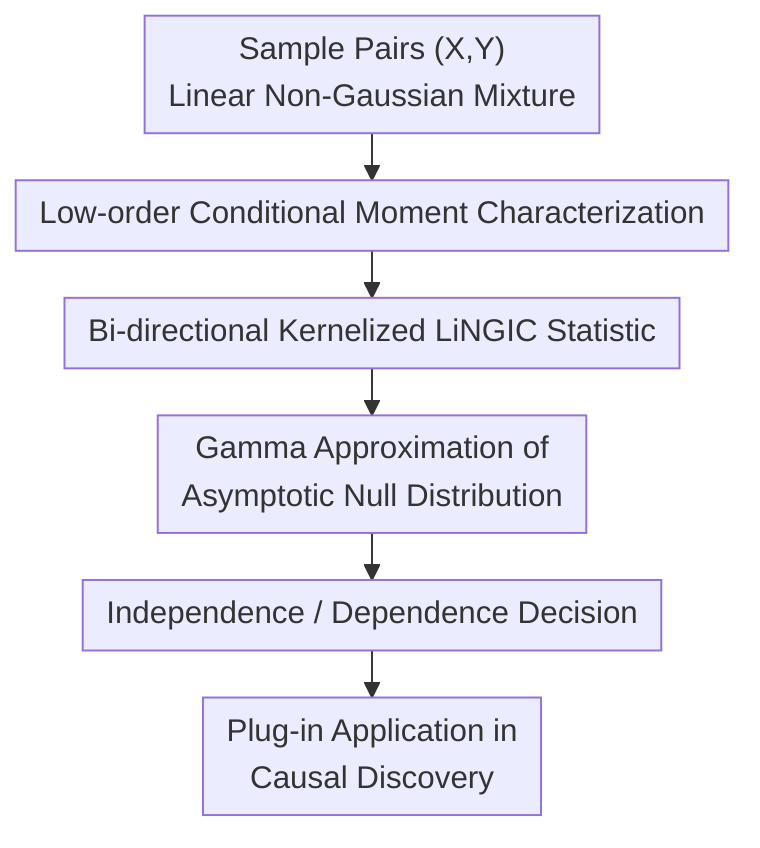

# Independence Test for Linear Non-Gaussian Data and Applications in Causal Discovery

**Conference**: ICLR2026  
**OpenReview**: [https://openreview.net/forum?id=Uc1EAICxTD](https://openreview.net/forum?id=Uc1EAICxTD)  
**Code**: No public code available  
**Area**: Causal Inference / Causal Discovery  
**Keywords**: Linear Non-Gaussian Models, Independence Test, LiNGAM, Conditional Moments, Kernel Methods  

## TL;DR
This paper proves that in linear non-Gaussian mixture models, constant conditional mean and constant conditional variance are sufficient to imply independence. Based on this, a kernel independence test named LiNGIC is proposed, which is simultaneously sensitive to first- and second-order conditional moments. LiNGIC demonstrates higher statistical power than general tests like HSIC in synthetic data and Direct-LiNGAM causal discovery.

## Background & Motivation
**Background**: Independence testing is the most frequently invoked foundational module in causal discovery. In the Linear Non-Gaussian Acyclic Model (LiNGAM), Direct-LiNGAM identifies exogenous variables by determining whether a variable is independent of the regression residuals. In scenarios involving latent variables, GIN conditions also require numerous independence tests to identify latent causal structures. Therefore, the statistical power of the test directly impacts the quality of the learned causal graph.

**Limitations of Prior Work**: In practice, researchers typically plug general non-parametric tests such as HSIC, dCor, or RDC into the LiNGAM/GIN workflows. While these can theoretically cover a wide range of dependence forms and control Type I errors, this "generality" is not free in finite samples: the tests search for arbitrary non-linear and high-order dependence patterns, failing to fully utilize the structural prior that the "data is a linear non-Gaussian mixture," which often sacrifices power.

**Key Challenge**: The identifiability of linear non-Gaussian models relies on very specific structural assumptions; however, downstream tests often treat samples as coming from a general joint distribution. In other words, while the causal model utilizes non-Gaussianity, the independence test does not exploit the constraints of linear non-Gaussian mixtures, leading to a mismatch between the foundational link in the methodology chain and the modeling assumptions.

**Goal**: The authors aim to answer two questions. First, can independence between linear non-Gaussian mixture variables be characterized by lower-dimensional conditions than "vanishing covariance of all bounded continuous functions"? Second, if such a characterization exists, can it be converted into a computable test statistic with asymptotic guarantees that can be directly embedded into causal discovery algorithms?

**Key Insight**: The paper starts from the conditional mean and conditional variance. For general non-linear non-Gaussian data, merely requiring $E(Y\mid X)$ and $Var(Y\mid X)$ to be constant does not guarantee independence, as high-order shapes like skewness or kurtosis might still vary with $X$. However, in linear non-Gaussian mixtures, if $X$ and $Y$ share the same non-Gaussian source, this sharing will be exposed by the first- or second-order conditional moments.

**Core Idea**: Replace the general independence characterization with "constant conditional mean + constant conditional variance," and then use kernel covariance to simultaneously detect $Cov(f(X),Y)$ and $Cov(f(X),Y^2)$. This yields an independence test specifically designed for linear non-Gaussian causal discovery.

## Method
### Overall Architecture
The methodology of this paper can be viewed as a pipeline from theoretical characterization to a computable test, and finally to a replacement module for causal discovery. The input is a set of sample pairs $D=\{(x_i,y_i)\}_{i=1}^n$, assumed to be linear mixtures of independent non-Gaussian sources; the output is a "Reject/Fail to Reject $X\perp\!\!\!\perp Y$" decision, serving as an independence test component in algorithms like Direct-LiNGAM.

The core process first proves that within linear non-Gaussian models, independence is equivalent to $E(Y\mid X)$ being constant and $Var(Y\mid X)$ being constant. These conditions are then rewritten as $Cov(f(X),Y)=0$ and $Cov(f(X),Y^2)=0$ for any bounded continuous function $f$. Finally, the authors construct the LiNGIC statistic using a Gaussian kernel on one side and a quadratic polynomial kernel on the other, providing thresholds via a Gamma approximation of the asymptotic null distribution.

### Key Designs
**1. Low-order Conditional Moment Characterization: Compressing Independence to Mean and Variance**

The general definition of independence requires $P_{XY}=P_XP_Y$, or equivalently, that all pairs of bounded continuous functions are uncorrelated, which is difficult to test directly in finite samples. The most critical theoretical result of this paper is: if $X=\sum_j b_j\varepsilon_j$ and $Y=\sum_j a_j\varepsilon_j$, where $\varepsilon_j$ are independent and non-Gaussian, then $X\perp\!\!\!\perp Y$ if and only if there exist constants $c$ and $\sigma_0^2$ such that $E(Y\mid X)=c$ and $Var(Y\mid X)=\sigma_0^2$.

The intuition is that if $X$ and $Y$ share a source $\varepsilon_j$, this shared term will cause the conditional structure of $Y$ given $X$ to change. Under the linear non-Gaussian assumption, this sharing cannot be simultaneously hidden from both the conditional mean and conditional variance. The proof decomposes $X,Y$ into shared and unique source parts and utilizes the Darmois-Skitovich theorem and characteristic functions: if shared sources exist while both conditional moments remain constant, those sources must be Gaussian, contradicting the non-Gaussian assumption. Therefore, the set of shared sources must be empty, implying independence.

**2. Bi-directional Kernelized LiNGIC Statistic: Simultaneous Detection of Conditional Correlation in $Y$ and $Y^2$**

With the conditional moment characterization, the problem transforms into testing whether both $E(Y\mid X)$ and $E(Y^2\mid X)$ are constant. The authors further prove that under linear non-Gaussian models, independence is equivalent to $Cov(f(X),Y)=0$ and $Cov(f(X),Y^2)=0$ for any bounded continuous function $f$. This step is crucial as it converts the conditional mean/variance test into a zero-value test for a kernel covariance operator.

The specific approach uses a universal kernel (e.g., Gaussian kernel) on the $X$ side to approximate a rich class of functions, and a quadratic polynomial kernel on the $Y$ side so that the feature space only needs to cover the directions $y$ and $y^2$ related to the first- and second-order conditional moments. The first version can be written as $LiNGIC_1(X,Y)=\|Cov(\phi(X),\psi(Y))\|_{HS}^2$, with an empirical estimator similar to HSIC: $LiNGIC_{1b}(D)=n^{-2}Tr(K_XHL_YH)$. Unlike standard HSIC, the polynomial kernel here is not intended to generalize to all dependencies but to target the two low-order moments sufficient in linear non-Gaussian theory.

**3. Symmetrization Design: Avoiding Sensitivity to Variable Roles and Heavy Tails**

$LiNGIC_1(X,Y)$ alone is asymmetric because the quadratic polynomial kernel is placed on the $Y$ side and the Gaussian kernel on the $X$ side. When $Y$ has heavy tails or extreme values, the unboundedness of the polynomial kernel may lead to numerical instability. The authors thus combine both directions into the final statistic $LiNGIC(X,Y)=\|Cov(\phi_1(X),\phi_2(Y))\|_{HS}^2$, which is equivalent to the sum of $LiNGIC_1(X,Y)$ and $LiNGIC_1(Y,X)$.

On a sample basis, the final biased estimator is $LiNGIC_b(D)=n^{-2}Tr(K_XHL_YH)+n^{-2}Tr(K_YHL_XH)$, where $K$ denotes the Gaussian kernel Gram matrix, $L$ denotes the quadratic polynomial kernel Gram matrix, and $H=I-\frac{1}{n}\mathbf{1}\mathbf{1}^\top$ is the centering matrix. This design ensures the statistic remains consistent under the swap of $X$ and $Y$ and makes the test more suitable for repeated calls in causal discovery algorithms.

**4. Gamma Approximation of Asymptotic Null Distribution: Turning Theory into a Practical Test**

An independence test must provide not only a statistic but also a critical value for a given significance level $\alpha$. The authors prove that under the null hypothesis $H_0:X\perp\!\!\!\perp Y$, $nLiNGIC_b(D)$ asymptotically converges to a weighted sum of chi-squares $\sum_l\lambda_l\chi^2_{1l}$. Under the alternative hypothesis, $LiNGIC_b(D)$ converges to a Gaussian distribution at a rate of $\sqrt{n}$. This provides the theoretical basis for test consistency.

Since estimating an infinite weighted sum of chi-squares is complex and permutation tests are slow, the paper adopts Gamma moment matching similar to HSIC. It estimates $A=E[nLiNGIC_b(D)]$ and $B=Var(nLiNGIC_b(D))$, then assumes $nLiNGIC_b(D)\sim Gamma(\gamma,\beta)$ where $\gamma=A^2/B$ and $\beta=B/A$. The authors provide $O(n^{-1})$ bias estimates for $A$ and $B$, maintaining a computational complexity of $O(n^2)$, which is the same order as standard kernel independence tests.

## Loss & Training
This work does not involve training a model but rather designing a statistical test; thus, there is no traditional loss function. The actual testing procedure involves constructing Gram matrices for the Gaussian and quadratic polynomial kernels using samples, computing $LiNGIC_b(D)$, and then obtaining a null distribution threshold via Gamma approximation or permutation tests. If the statistic exceeds the critical value corresponding to the significance level $\alpha$, the null hypothesis of independence is rejected.

In experiments, the significance level is fixed at $0.05$. All methods relying on characteristic kernels use the Gaussian kernel. Standard HSIC uses Gamma approximation, and permutation versions (e.g., RDC) use 500 permutations. The authors also compare the Gamma approximation and permutation versions of LiNGIC to demonstrate that the derived asymptotic thresholds are practically applicable.

## Key Experimental Results

### Main Results
The authors first compare the independence test itself on synthetic linear non-Gaussian mixture data, and then embed the test into Direct-LiNGAM for causal discovery. In synthetic data, dependent cases involve $X$ and $Y$ sharing non-Gaussian independent sources, while independent cases use disjoint sets of sources. Distributions include Laplace, Student-t, Uniform, and Truncated Normal, with varying sample sizes and numbers of sources.

| Experimental Setting | Metric | LiNGIC Result | Baseline Methods | Conclusion |
|--------|------|-------------|----------|------|
| Linear Non-Gaussian Mixture, $n=500$, Sources $d=2\sim6$ | Test Power / Type I error | Highest or near-highest power in most distributions; Type I error centered around 0.05 | HSIC, HSIC-RFF, dCor, LFHSIC | Utilizing linear non-Gaussian structure yields stronger power in finite samples |
| Fixed 3 sources, Sample size $n=300\sim1100$ | Test Power | Power increases steadily with sample size, overall higher than general tests | HSIC, dCor, etc. | Higher power is not achieved by relaxing Type I error but by being more sensitive at the same significance level |
| Dependency strength $c=0.1\sim1.0$, Student-t, $n=500$ | Power | Increases with $c$ from weak to strong dependency; reaches 0.95 at $c=1.0$ | HSIC is 0.83 at $c=1.0$ | More sensitive to linear non-Gaussian dependencies caused by shared sources |
| Direct-LiNGAM on SACHS synthetic data | SHD / F1 | Lower SHD and higher F1 under most noise types | Direct-LiNGAM + HSIC/HSIC-RFF/dCor | Improvements in independence testing translate to causal graph recovery |

In Direct-LiNGAM experiments with the SACHS structure, the performance advantage of substituting the original test with LiNGIC is evident. Under Uniform noise, SHD drops from 2.1 (HSIC) to 0.8, and F1 rises from 0.93 to 0.98. Under Laplace noise, SHD drops from 1.0 to 0.2, and F1 rises from 0.96 to 0.99. Under Truncated Normal, the SHD of HSIC is 13.2 with F1 0.60, while LiNGIC achieves SHD 6.3 and F1 0.79. Results for Student-t are competitive across all methods.

### Ablation Study
The paper does not feature "module removal" ablations typical of deep learning papers but provides analysis experiments explaining the necessity of the design: additional baselines, Gamma vs. Permutation, sensitivity to dependency strength, runtime, and real-world data evaluation.

| Configuration / Analysis | Key Metric | Description |
|------------|---------|------|
| HSIC vs. LiNGIC across distributions | Type I error and Power | LiNGIC maintains higher power on Laplace/Student-t/Uniform; advantage is smaller for Truncated Normal (closer to Gaussian) |
| Additional baselines (SCIT, RDC, MI) | Power / Type I error | SCIT reduces to a general test when $Z=\emptyset$; its power is generally lower than LiNGIC as it does not exploit the linear non-Gaussian structure |
| Gamma Approx vs. Permutation | Performance and Overhead | Permutation estimates the null distribution well but is expensive; Gamma approx preserves performance while being suitable for larger samples |
| Runtime, $n=500\sim5000$ | Seconds | $O(n^2)$ complexity like HSIC, but with larger constants; e.g., at $n=5000$, HSIC takes ~0.995s while LiNGIC takes ~3.126s, far faster than permutations |
| Real SACHS observational data | F1 / SHD | On real data, LiNGIC (F1 0.22, SHD 15) is outperformed by dCor (F1 0.29, SHD 14), suggesting real biological data may not strictly satisfy linear non-Gaussian assumptions |

### Key Findings
- The primary gain of LiNGIC comes from "aligning test assumptions with data generation assumptions": it is more likely to detect dependency in finite samples when the true dependency stems from shared non-Gaussian linear sources.
- Type I error control remains reliable. Across multiple experiments, the Type I error of LiNGIC fluctuates around the significance level (0.05), indicating that the power increase is not simply due to aggressive rejection of the null.
- Advantages diminish as non-Gaussianity weakens. Improvement persists in Truncated Normal cases and complex graphs but at a reduced magnitude, consistent with theoretical assumptions.
- Benefits in causal discovery are manifest. Improvements in SHD/F1 for Direct-LiNGAM indicate that more accurate foundational tests affect exogenous variable identification and causal ordering.
- Real-world SACHS results provide a reality check: LiNGIC does not dominate all methods, suggesting that non-linearity, intervention confounding, measurement noise, or model misspecification in real data can weaken the advantages of a specialized test.

## Highlights & Insights
- The most clever aspect of this paper is compressing an independence problem that seemingly requires a "complete function class" into conditional mean and conditional variance under linear non-Gaussian assumptions. It provides a formal necessary and sufficient condition and logical proof rather than just stating that low-order moments are useful.
- The use of the quadratic polynomial kernel in LiNGIC is highly targeted. While standard HSIC pursues characteristic kernels to capture arbitrary dependency, this work restricts one side to quadratic features to cover $Y$ and $Y^2$, perfectly matching the first- and second-order moments in the theory. This "seeing less but seeing the right thing" approach is insightful.
- The symmetrization is pragmatic. While the initial statistic already corresponded to the theory, the authors recognized that variable roles and heavy tails could cause practical issues, thus combining both directions to reduce implementation fragility.
- From a methodological standpoint, this paper serves as a reminder that test modules in causal discovery should not always be replaced with general-purpose tools. If the structural equation model has clear assumptions, the test statistic should align with them to avoid wasting information in finite samples.
- This logic can be transferred to other scenarios where structural assumptions are strong but tests are generic, such as conditional independence tests under specific noise models, residual tests in linear latent variable models, or component independence determination in ICA.

## Limitations & Future Work
- Theoretical guarantees rely heavily on the linear non-Gaussian mixture assumption. If real data exhibits significant non-linear mixtures, heteroscedastic noise, feedback loops, or strong measurement error, constant conditional moments no longer suffice for independence, and LiNGIC's advantages may vanish or even mislead.
- The complexity remains quadratic. While of the same order as HSIC, LiNGIC requires the combination of two sets of kernels, leading to higher constant overhead. In high-dimensional graphs with repeated calls, the runtime is noticeably higher than HSIC. Future work could consider Random Fourier Features or Nyström approximations.
- Real-world data experiments did not show overwhelming superiority. The higher F1 of dCor on real SACHS data suggests a gap between model assumptions and reality, indicating that LiNGIC should be viewed as a powerful tool when structures match, rather than a default replacement for all data.
- The current discussion focuses on pairwise independence. While the appendix notes that joint independence in linear non-Gaussian ICA frameworks can be reduced to pairwise independence, a direct multivariate version of LiNGIC remains an open direction.
- Threshold estimation relies on asymptotic approximations. In cases of very small samples or heavy-tailed extreme values, the Gamma approximation may still exhibit bias. Robust calibration strategies or adaptive mechanisms for choosing between permutation and Gamma approximations deserve further study.

## Related Work & Insights
- **vs. HSIC**: HSIC uses characteristic kernels to detect generalized dependency and has broader applicability; LiNGIC sacrifices generality to gain power in linear non-Gaussian scenarios by restricting one side of the kernel to quadratic features.
- **vs. dCor / RDC**: Both are general dependency measures without linear non-Gaussian assumptions. The advantage of the proposed method lies in its sensitivity when structural priors exist, while its disadvantage is its potential lack of robustness under model misspecification.
- **vs. Original Direct-LiNGAM Test**: Direct-LiNGAM relies on independence between variables and residuals. This paper does not rewrite the algorithm but replaces its most basic component, making the original algorithm more compatible with the non-Gaussian structure of LiNGAM.
- **vs. GIN Condition Methods**: GIN also heavily relies on independence judgments in linear non-Gaussian models with latent variables. LiNGIC can serve as a low-level test module for these workflows, potentially reducing accumulated errors from multiple tests.
- **Insight for Future Research**: Instead of seeking ever more general independence tests, it is often better to ask "how will dependency manifest as the minimal statistical signal under this specific model?" and then design the test around that signal.

## Rating
- Novelty: ⭐⭐⭐⭐⭐ The result that conditional mean and variance characterize independence in linear non-Gaussian mixtures is highly distinctive and links directly to computable statistics.
- Experimental Thoroughness: ⭐⭐⭐⭐ Synthetic experiments, causal discovery applications, runtime analysis, and additional baselines are comprehensive; real-world data results are modest but presented honestly.
- Writing Quality: ⭐⭐⭐⭐ The theoretical thread is clear, and the proofs and derivations are complete; however, some sections are formula-dense and require a strong statistical background.
- Value: ⭐⭐⭐⭐⭐ Extremely practical for causal discovery methods like LiNGAM/GIN that depend on independence tests, providing a flagship example of "structural assumption-driven test design."

<!-- RELATED:START -->

- **Direct-LiNGAM**: Shimizu et al., 2011. (Foundation for the application)
- **HSIC**: Gretton et al., 2005. (The primary baseline and technical inspiration)
- **GIN**: Xie et al., 2020. (Potential application scenario for latent variables)

<!-- RELATED:END -->

## Related Papers

- [\[ICLR 2026\] Efficient Ensemble Conditional Independence Test Framework for Causal Discovery](efficient_ensemble_conditional_independence_test_framework_for_causal_discovery.md)
- [\[ICLR 2026\] Distributional Equivalence in Linear Non-Gaussian Latent-Variable Cyclic Causal Models](distributional_equivalence_in_linear_non-gaussian_latent-variable_cyclic_causal_.md)
- [\[ICML 2025\] Estimating Causal Effects in Gaussian Linear SCMs with Finite Data](../../ICML2025/causal_inference/estimating_causal_effects_in_gaussian_linear_scms_with_finite_data.md)
- [\[ICLR 2026\] Causal Discovery via Quantile Partial Effect](causal_discovery_via_quantile_partial_effect.md)
- [\[ICLR 2026\] Causal Discovery in the Wild: A Voting-Theoretic Ensemble Approach](causal_discovery_in_the_wild_a_voting-theoretic_ensemble_approach.md)

<!-- RELATED:END -->
