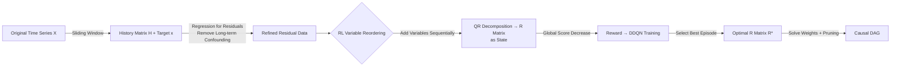

# Influence without Confounding: Causal Discovery from Temporal Data with Long-term Carry-over Effects

**Conference**: ICLR 2026  
**OpenReview**: [https://openreview.net/forum?id=s0nYSwlV3I](https://openreview.net/forum?id=s0nYSwlV3I)  
**Code**: To be confirmed  
**Area**: Causal Discovery / Temporal Causal / Reinforcement Learning  
**Keywords**: Temporal causal discovery, long-term carry-over effects, QR decomposition, topological order, Deep Q-Network, structural Hamming distance  

## TL;DR
To address spurious causality caused by "ancient historical values directly influencing the present" (long-term carry-over confounding), this paper proves the equivalence between the "OLS score" and the "diagonal of the R matrix from QR decomposition" to identify the true topological order. It eliminates long-term confounding using residuals from limited-step historical regression and proposes the LEVER method, which utilizes a DQN to efficiently search for the optimal variable order using the R matrix as the state.

## Background & Motivation
**Background**: Temporal causal discovery aims to recover causal DAGs between variables from time series, serving as a foundation for physical law discovery and root cause analysis. Mainstream approaches (Granger, PCMCI, NTS-NOTEARS, DYNOTEARS) typically expand variables into temporal nodes based on a **fixed maximum lag** and perform conditional independence tests or optimization with acyclicity constraints.

**Limitations of Prior Work**: Real-world systems often exhibit **long-term carry-over effects**, where the current value of a variable depends not only on the current values of its parents but also on their accumulated impact over a long historical period (e.g., the sustained pull of advertising on sales). These impacts span vast time scales, making them difficult to observe or model. Fixed-lag methods only cover recent steps; **ignored ancient historical nodes influence multiple current variables simultaneously, leading to misidentification of direct causal links between current variables**—a phenomenon known as "historical confounding."

**Key Challenge**: Eliminating historical confounding requires incorporating longer histories, but expanding variables with more lags causes a node explosion (e.g., 10 variables lead to $4.2 \times 10^{18}$ candidate structures), resulting in prohibitive computational and memory costs. **"De-confounding" and "scalability" are inherently in conflict**.

**Goal**: Recover the summary causal skeleton under a more challenging setting where ancient history can exert direct causal effects (rather than being mediated solely through intermediate observed nodes), while balancing accuracy and efficiency.

**Key Insight**:
- **Theoretical Insight**: Strictly equate "scoring topological orders using OLS error" with "the sum of squares of the diagonal of the R matrix after QR decomposition of the data matrix," directly linking causal discovery to QR decomposition in linear algebra. It is further proved that **regressing on only a few limited historical steps to obtain residuals is sufficient to maintain causal identifiability** (Limited-History Theorem).
- **Algorithmic Insight**: Since the R matrix uniquely encodes the score and causal weights, it is used as the state representation for RL. A DQN models "finding the optimal topological order" as a sequential variable selection process. The action space is only $O(d)$, avoiding the overhead of neural state encoders.

## Method

### Overall Architecture
LEVER decomposes temporal causal discovery into a three-stage pipeline: ① **History Refinement**—After sliding window sampling, the final step is regressed on the preceding historical steps within the window, and residuals are taken to "subtract" long-term historical confounding. ② **RL Variable Reordering**—Using the R matrix from the QR decomposition of the residual data as the state and the global score decrease as the reward, a Double DQN sequentially adds variables to the data sequence to find the optimal topological order. ③ **Structure Recovery**—The causal weight matrix is solved directly from the optimal R matrix, followed by pruning weights near zero to obtain a sparse DAG.

### Key Designs

**1. Equivalence of OLS Score and QR Decomposition: Turning "Order Evaluation" into "Reading R Matrix Diagonals."** The paper defines the score of a topological order $\pi$ using OLS error: for each variable $j$, it is fitted using its predecessors $\mathrm{pa}_\pi(j)$ in order $\pi$. The sum of squared residuals is $\mathrm{Score}(\pi;Y)=\sum_{j=1}^d \lVert Y_{:,j}-Y_{:,\mathrm{pa}_\pi(j)}\hat\beta_j\rVert_2^2$. The key insight (Theorem 1) is: if data is arranged as $Y^\pi$ according to $\pi$ and QR decomposed as $Y^\pi=QR$ ($R$ is upper triangular with positive diagonals), then this score equals the sum of squares of the R matrix diagonal: $\mathrm{Score}(\pi;Y)=\sum_{i=1}^d R_{i,i}^2$. This compresses "solving one regression per variable" into "one QR decomposition and reading the diagonal," with a complexity of $O(md^2)$ and numerical stability. Theorem 2 ensures that with sufficient samples, the **true topological order almost surely achieves the minimum expected score**.

**2. From Scoring to Structure: Direct Weight Extraction and Pruning.** A "complete DAG" obtained from the true topological order contains redundant edges. Theorem 3 provides a closed-form solution: causal weights $W_{\mathrm{pa}_\pi(j),j}$ can be calculated directly from blocks of $R$: $W_{\mathrm{pa}_\pi(j),j}=R_{\circ(j-1),\circ(j-1)}^{-1}\cdot R_{\circ(j-1),j}$, where $\circ k$ denotes the first $k$ elements. Theorem 4 guarantees the existence of a threshold $\theta$ such that removing edges with $|W_{i,j}| < \theta$ yields a graph identical to the true causal graph.

**3. Limited History Refinement: Using $h$-step History to Leverage Infinite Confounding.** This is the core for handling long-term carry-over. The system is assumed to be Linear Time-Invariant (LTI) $X[t]=\sum_{\tau=0}^{t}X[t-\tau]g(\tau)+\epsilon(t)$, where the impulse response $g(\tau)$ can persist. Theorem 5 proves that using the **entire history** for regression maintains identifiability, but the full history is unavailable. By introducing Assumption 3 ($g(\tau)$ satisfies a linear recurrence $g(\tau)=\sum_{i=1}^h k_i\,g(\tau-i)$), Theorem 6 (Limited-History Theorem) proves: **residuals $\dot Y[t]$ obtained by regressing only on $X[t-1],\dots,X[t-h]$ still allow the true topological order to minimize the score**.

**4. RL Reordering with R-matrix State: $O(d)$ Actions and Zero Encoding Overhead.** Finding the optimal order is modeled as an MDP. The action is "appending refined data of an unselected variable to the sequence," with an action space of size $d-i+1$ at step $i$. The state is the R matrix from the current sequence's QR decomposition. The reward is the decrease in the global score: $\mathrm{GlobalScore}=\sum_{i=1}^{| \Gamma |}R_{i,i}^2+\sum_{j\notin\Gamma}\mathrm{RSS}_{\Gamma\to j}$. Double DQN is used to mitigate overestimation. Because the state is the R matrix rather than a neural embedding, the runtime per episode on a 20-node graph is only 0.25 seconds with 10.36 MB peak memory, significantly lower than RL (19.45s / 24.40MB) and CORL (1.71s / 64.68MB).

## Key Experimental Results

### Main Results

Static data (Erdős–Rényi graphs, 500 i.i.d. samples, 8 baselines):

| Graph Set | Metric | PC | NOTEARS | RL | CORL | SCORE | LEVER |
|-----------|--------|----|---------|----|----|-------|-------|
| G(10,20)  | F1↑    | 0.4574 | 0.7308 | 0.3809 | 0.5930 | 0.8179 | **0.8899** (▲8.79%) |
| G(10,20)  | FPR↓   | 0.0949 | 0.0208 | 0.0580 | 0.0206 | 0.0329 | **0.0123** (▼40.96%) |
| G(10,20)  | SHD↓   | 19.00  | 8.00   | 18.33  | 12.00  | 6.67   | **4.00** (▼40.00%) |
| G(20,40)  | F1↑    | 0.5528 | 0.7898 | 0.3770 | 0.5228 | 0.7918 | **0.8337** (▲5.30%) |
| G(20,40)  | SHD↓   | 32.00  | 13.54  | 34.00  | 25.85  | 15.50  | **11.60** (▼14.29%) |

Temporal data (with long-term carry-over): Compared to the best baseline, **SHD decreased by 64%–88% and F1 increased by 45%–101%**. Regarding efficiency, the runtime for NOTEARS and PC increased by 203x and 69x respectively when handling temporal data (due to node expansion), whereas LEVER's history refinement only added 0.0017s.

### Ablation Study

Replacing the RL reordering module with static baselines (LV-PC / LV-NOTEARS / etc.) on temporal data confirms that while the RL module is "replaceable," the full LEVER integration achieves higher precision.

Robustness to assumption violations (randomly nullifying causal dependencies, retaining only lags 3/5/10/25):

| Dataset | SHD↓ | F1↑ |
|---------|------|-----|
| Standard | 4 | 0.8947 |
| Modified (lag=3) | 5 | 0.8718 |
| Modified (lag=5) | 5 | 0.8718 |
| Modified (lag=10) | 3 | 0.9231 |
| Modified (lag=25) | 6 | 0.8421 |

### Key Findings
- **R-matrix as state is key to efficiency**: Compared to RL/CORL, both time and memory are significantly reduced, validating the value of replacing neural encoders with R matrices.
- **Long-term dependencies exceed fixed lags**: Heatmaps show $g(\tau)$ remains significant at $\tau=10/20/50$, whereas fixed-lag models inevitably miss these and introduce confounding.
- **Real-world performance**: On the wind tunnel dataset `wt_walks_v1` (16 nodes, 26 edges), LEVER achieved SHD=22 and F1=0.5769, significantly outperforming PCMCI (35 / 0.3636) and NTS-NOTEARS (37 / 0.3019).

## Highlights & Insights
- **Linking Causal Discovery to QR Decomposition**: The equivalence between the OLS score and $R$ diagonal squares allows "scoring, ordering, weighting, and pruning" to converge into a single QR decomposition process.
- **"Finite History ≈ Infinite History" Identifiability**: Proving identifiability with only $h$-step historical residuals under the linear recurrence assumption effectively simplifies the "infinite confounding" problem.
- **Clever State Representation**: Using linear algebraic quantities (R matrix) instead of learned embeddings for RL states provides a lightweight paradigm for RL-based causal discovery.

## Limitations & Future Work
- **LTI Assumptions**: The theory relies on linear, time-invariant impulse responses; there are no theoretical guarantees for non-linear scenarios.
- **Linear Recurrence of $g(\tau)$**: Total de-confounding via finite history depends on $g(\tau)$ being linearly representable by its first $h$ steps, which may not hold for all real systems.
- **Window Length $w$ Trade-off**: Larger $w$ provides more history but fewer samples $m$; adaptively selecting $w$ remains an engineering challenge.

## Related Work & Insights
- **Static Causal Discovery**: PC (CI tests, combinatorial explosion), NOTEARS (continuous optimization), SCORE (links score estimation to recovery), RL/CORL (order-based but often uses neural encoders). LEVER shares the reordering intuition with CORL but uses the R matrix as a watershed for efficiency.
- **Temporal Causal Discovery**: Traditional methods assume direct causal dependencies span only finite durations. Ours **relaxes the assumption that "ancient history is only mediated,"** allowing direct ancient causal influence.
- **Insight**: When the "score" for combinatorial search can be replaced by a closed-form quantity from a matrix decomposition, both theoretical identifiability and computational efficiency are often gained.

## Rating
- **Novelty**: ⭐⭐⭐⭐ The link between OLS scores and QR diagonals, plus the finite-history identifiability proof, are solid theoretical contributions.
- **Experimental Thoroughness**: ⭐⭐⭐⭐ Covers static/temporal synthetic and real wind tunnel data, 8 baselines, and robustness tests.
- **Writing Quality**: ⭐⭐⭐⭐ Clear progression from theory to method to experiments; well-illustrated pipelines and confounding scenarios.
- **Value**: ⭐⭐⭐⭐ Long-term carry-over is a real pain point in industrial time series (advertising, root cause analysis); the method is efficient and practical.

<!-- RELATED:START -->

## Related Papers

- [\[AAAI 2026\] Learning Subgroups with Maximum Treatment Effects without Causal Heuristics](../../AAAI2026/causal_inference/learning_subgroups_with_maximum_treatment_effects_without_causal_heuristics.md)
- [\[ICLR 2026\] On Measuring Influence in Avoiding Undesired Future](on_measuring_influence_in_avoiding_undesired_future.md)
- [\[ICLR 2026\] Topological Causal Effects](topological_causal_effects.md)
- [\[ICLR 2026\] Independence Test for Linear Non-Gaussian Data and Applications in Causal Discovery](independence_test_for_linear_non-gaussian_data_and_applications_in_causal_discov.md)
- [\[ICLR 2026\] Causal Imitation Learning under Expert-Observable and Expert-Unobservable Confounding](causal_imitation_learning_under_expert-observable_and_expert-unobservable_confou.md)

<!-- RELATED:END -->
