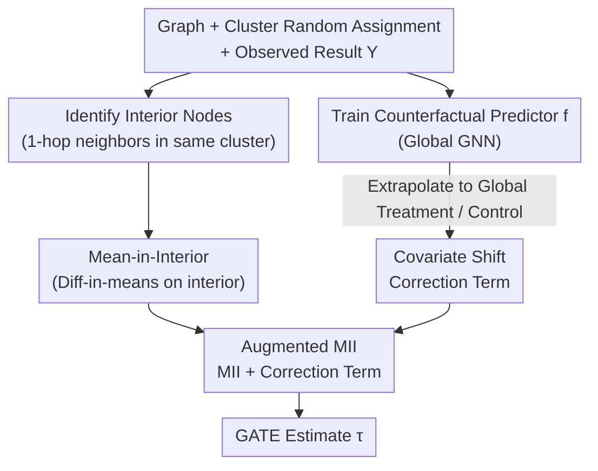

# Journey to the Centre of Cluster: Harnessing Interior Nodes for A/B Testing under Network Interference

**Conference**: ICLR2026  
**arXiv**: [2602.04457](https://arxiv.org/abs/2602.04457)  
**Code**: [GitHub](https://github.com/Cqyiiii/AMII-Harnessing-Interior-Nodes-for-Network-Experiments)  
**Area**: Causal Inference  
**Keywords**: A/B testing, network interference, causal inference, cluster randomization, GATE estimation

## TL;DR

To address the high variance issue in GATE estimation during A/B testing under network interference, this paper proposes the Mean-in-Interior (MII) estimator, which averages results only for nodes inside clusters to significantly reduce variance. Furthermore, an augmented AMII estimator is developed using a counterfactual predictor for covariate shift correction, achieving both low bias and low variance.

## Background & Motivation

In A/B testing for online platforms, the classic SUTVA assumption (where each user's outcome depends only on their own treatment) is frequently violated: a user's behavior in a social network is influenced by the treatment status of their neighbors, a phenomenon known as **network interference**. Typically, the **Global Average Treatment Effect (GATE)** is targeted for estimation, representing the difference in average outcomes between global treatment and global control scenarios.

To manage network interference, **cluster-level randomization** is the industry standard: community detection is performed on the graph to identify clusters, which are then randomly assigned as treatment units. Within this framework, **interior nodes** (those whose 1-hop neighbors are entirely within the same cluster) have local environments that naturally approximate global treatment or control, making them ideal samples for GATE estimation.

However, existing methods suffer from fundamental variance issues:

- **HT Estimator**: Employs inverse probability weighting for every node satisfying the exposure condition. The weight is calculated as $(1/p)^c$ (where $c$ is the number of different clusters connected to the node). In real-world social networks, $c$ can reach dozens, leading to weight explosion and extreme variance.
- **CAE Estimator**: Uses two-level averaging (within-cluster then across-clusters). Although it replaces inverse probability weighting with means, its two-tier structure retains unnecessary complexity when clustering quality is suboptimal.
- **DIM Estimator**: Entirely ignores graph structure, leading to severe bias in the presence of interference.

Analysis of the Facebook social network (11,586 nodes, 568,309 edges) by the authors shows that while interior nodes account for only about 8% of the total, they constitute the vast majority of samples retained after filtering for exposure conditions. This observation directly inspired the method proposed in this paper.

## Core Problem

1. **Variance Explosion**: Existing network-aware estimators (e.g., HT) require exponential inverse probability weights for boundary nodes, resulting in extremely high variance in early-stage experiments with low treatment proportions ($p \le 10\%$).
2. **Selection Bias**: Interior nodes systematic differ from the overall population in terms of covariate distributions (e.g., degree, number of connected clusters, and other network-dependent features). Directly averaging outcomes for interior nodes introduces bias.
3. **Difficulty in Interference Function Extrapolation**: At low treatment proportions, it is necessary to extrapolate from local observations to global scenarios. Nonlinear interference functions (e.g., square root, quadratic) hinder the performance of pure regression methods.

## Method

### Overall Architecture

This paper addresses the problem of estimating the Global Average Treatment Effect (GATE) accurately (low bias) and stably (low variance) during A/B testing under network interference. The approach consists of two steps. The first is the **Mean-in-Interior (MII)** estimator: after performing cluster-level randomization, boundary nodes are discarded, and a difference-in-means is calculated solely for interior nodes. This replaces the explosive weights of HT with moderate uniform weights to suppress variance. The second step is the **Augmented MII (AMII)**: a counterfactual predictor (e.g., a GNN) is trained on the full graph and extrapolated to global treatment and global control scenarios. This is used to construct a correction term that compensates for the covariate shift between the interior subgroup and the overall population. This correction is added to MII to eliminate bias while maintaining low variance. Finally, AMII is rationalized from the **Prediction-Powered Inference (PPI)** perspective as a semi-supervised estimator that uses predictions for debiasing.

### Key Designs

**1. Mean-in-Interior Estimator: Replacing Explosive Inverse Probability Weights with Uniform Weights**

To satisfy unbiasedness for boundary nodes, existing HT estimators apply exponential weights $(1/p)^c$ ($c$ is the number of connected clusters, which can be dozens in real networks), leading to uncontrolled variance. MII addresses this by discarding all boundary nodes and calculating the difference-in-means on interior nodes: $\hat{\tau}_{MII} = \frac{\sum_{i \in \text{Int}} z_i Y_i}{\sum_{j \in \text{Int}} z_j} - \frac{\sum_{i \in \text{Int}} (1-z_i) Y_i}{\sum_{j \in \text{Int}} (1-z_j)}$, where all retained samples use uniform weights. This is justified because 1-hop neighbors of interior nodes are in the same cluster, naturally approximating global treatment/control environments. Under NIA assumptions and technical conditions such as "the proportion of interior nodes is asymptotically uniform across clusters and represents the cluster," MII satisfies consistency $\hat{\tau}_{MII} - \tau = o_p(1)$. For a typical potential outcome model $Y_i(\mathbf{z}) = \beta z_i + h(\sum_j z_j / \deg_i, v_i)$, each interior node is an unbiased estimate of the global mean, and the equal-weighted average minimizes variance according to the Cauchy-Schwarz inequality.

**2. Augmented MII: Removing Interior Selection Bias via Counterfactual Prediction**

The weakness of MII is the systematic difference in network covariates (degree, number of connected clusters, etc.) between interior nodes and the overall population, which introduces selection bias. AMII introduces a counterfactual predictor $f(\mathbf{z}, X, A)$ (using a 3-layer Chebyshev convolutional GNN), trained on the entire graph and extrapolated to full treatment $\mathbf{1}$ and full control $\mathbf{0}$. The correction term is constructed as $\hat{\tau}_{AMII} = \hat{\tau}_{MII} + \big(\frac{1}{n}\sum_j f(\mathbf{1},X,A)_j - \frac{1}{s_1}\sum_{i \in \text{Int}} z_i f(\mathbf{1},X,A)_i\big) - \big(\frac{1}{n}\sum_j f(\mathbf{0},X,A)_j - \frac{1}{s_0}\sum_{i \in \text{Int}} (1-z_i) f(\mathbf{0},X,A)_i\big)$. The terms in parentheses capture the gaps between the global population and the interior subgroup for treatment and control groups respectively. Bias analysis (Theorem 4.1) quantifies this: under a partially linear model $Y_i(\mathbf{z}) = (\beta + \alpha u_i)z_i + h(\cdot)$, the MII bias is $\alpha(\mu_{\text{Int}} - \mu)$, while AMII bias is reduced to $(\mathbb{E}[\hat{\alpha}_n] - \alpha)(\mu - \mu_{\text{Int}})$. As long as the linear portion of the regression is accurate, bias is significantly reduced. When there is no distribution difference between the groups, the correction term is zero, ensuring harmlessness.

**3. Semi-supervised / PPI Perspective: Network Experiments as "Debiasing using Predictions"**

Rearranging AMII yields $\hat{\tau}_{AMII,1} = \frac{1}{n}\sum_j f(\mathbf{1},X,A)_j + \frac{1}{s_1}\sum_{i \in \text{Int}} z_i (Y_i - f(\mathbf{1},X,A)_i)$, which matches the point estimate form of **Prediction-Powered Inference (PPI)**. Here, interior nodes serve as labeled data (with selection bias), while boundary nodes provide representative covariates but only partial label information. This perspective clarifies the essence of AMII: it performs "debiasing using predictions"—correcting the selection bias of interior nodes caused by clustering. This complements the classic doubly-robust estimator's "debiasing predictions using labels." The difference is that standard PPI assumes labeled samples are MCAR, whereas interior nodes are inherently a biased subgroup, requiring AMII to handle this distribution shift.

## Key Experimental Results

1,000 Monte Carlo simulations were conducted on the Facebook network (11,586 nodes, 95 clusters via Louvain clustering, interior nodes $\approx 8\%$):

| Setting | Method | Key Performance |
|------|------|---------|
| NIA holds ($r_2=0$), $p=0.1$ | AMII | Significantly lowest MSE; bias much lower than MII/CAE/Hájek |
| NIA holds, $p=0.3$ | MII | Variance remains consistently lowest among all methods |
| 2-hop interference ($r_2=1$), $p=0.1$ | AMII | Advantage in bias correction is even more pronounced |
| No interaction, no 2-hop interference | MII | Nearly unbiased with lowest variance; optimal choice |
| Low treatment proportion $p=0.1$ | GNN | Poor performance due to insufficient information for effective extrapolation |

### Key Findings:

- **AMII achieves optimal MSE in all settings**, even when $p=0.1$ and the GNN alone performs poorly.
- **MII consistently has the lowest variance**, though its bias is affected by differences in network covariate distributions.
- When the interaction term coefficient increases from 0.5 to 1, the advantage of AMII becomes more prominent.
- Increasing clustering resolution $\gamma$ from 2 to 5 reduces variance, but increasing it to 10 shows marginal improvement (presence of irreducible variance).
- Training $f$ on the full graph in low $p$ settings is significantly better than training only on boundary nodes; the two converge as $p$ increases.

## Highlights & Insights

- **Conceptual Simplicity**: The core idea of MII—averaging only interior nodes—is straightforward but backed by solid theoretical support.
- **AMII's PPI Perspective**: Elegantly unifies counterfactual prediction adjustments with the semi-supervised learning framework, providing a richer theoretical foundation for the estimator.
- **High Relevance to Industrial Practice**: Validated that covariate distribution differences between interior and boundary nodes indeed exist on billion-scale social platforms.
- **Harmlessness Property**: AMII’s correction term does not introduce additional bias when there is no distribution difference between interior nodes and the total population.
- **Weaker Theoretical Assumptions than CAE**: Consistency for MII only requires the proportion of interior nodes to be asymptotically uniform and representative, rather than requiring constant means within clusters.

## Limitations & Future Work

- **Consistency Proven, CLT Not Established**: Lacks direct hypothesis testing and confidence interval construction; practical deployment requires alternatives like bootstrap.
- **Low Proportion of Interior Nodes** (approx. 8%): This may be even lower in extremely sparse graphs or with poor clustering, limiting data utilization efficiency.
- **GNN Predictor Choice**: The paper uses a simple 3-layer Chebyshev convolution; more powerful architectures might further enhance AMII.
- **Limited to NIA and Linear 2-hop Interference**: More complex interference patterns (e.g., higher-order, dynamic networks) were not addressed.
- **Simulation-Based Experiments**: While evidence of distribution differences on industrial platforms was shown, real-world A/B testing results were not reported.

## Related Work & Insights

| Method | Bias | Variance | Applicable Scenario |
|------|------|------|---------|
| DIM | Severe (ignores network) | Low | No interference |
| HT/Hájek | Unbiased/Low (under NIA) | Extremely High (weight explosion) | Theoretical analysis |
| CAE | Moderate | Moderate | Good clustering quality |
| GNN Regression | Model/$p$ dependent | Unstable | High treatment proportion |
| **MII (Ours)** | Moderate (covariate shift) | **Lowest** | NIA + Good clustering |
| **AMII (Ours)** | **Lowest** | Comparable to MII | **General Recommendation** |

Comparison with the PPI framework (Angelopoulos et al., 2023): PPI assumes labeled samples are MCAR (Missing Completely At Random), whereas interior nodes in this work exhibit selection bias, requiring AMII to handle this distribution shift.

## Rating

- Novelty: ⭐⭐⭐⭐ — Although the MII concept is simple, it was not formally proposed before; the PPI perspective for AMII is a novel contribution.
- Experimental Thoroughness: ⭐⭐⭐⭐ — Extensive ablation studies across different settings, though lacking real-world platform A/B test results.
- Writing Quality: ⭐⭐⭐⭐⭐ — Clear motivation, balanced theory and intuition, with a logical progression from MII to AMII.
- Value: ⭐⭐⭐⭐ — Highly practical for the online experimentation field, aligning theoretical contributions with practical needs.

<!-- RELATED:START -->

## Related Papers

- [\[ICLR 2026\] Modeling Interference for Treatment Effect Estimation in Network Dynamic Environment](modeling_interference_for_treatment_effect_estimation_in_network_dynamic_environ.md)
- [\[ICLR 2026\] Designing Time Series Experiments in A/B Testing with Transformer Reinforcement Learning](designing_time_series_experiments_in_ab_testing_with_transformer_reinforcement_l.md)
- [\[ICLR 2026\] Resisting Contextual Interference in RAG via Parametric-Knowledge Reinforcement](resisting_contextual_interference_in_rag_via_parametric-knowledge_reinforcement.md)
- [\[ICML 2026\] Toward Scalable and Valid Conditional Independence Testing with Spectral Representations](../../ICML2026/causal_inference/toward_scalable_and_valid_conditional_independence_testing_with_spectral_represe.md)
- [\[ICLR 2026\] Efficient and Sharp Off-Policy Learning under Unobserved Confounding](efficient_and_sharp_off-policy_learning_under_unobserved_confounding.md)

<!-- RELATED:END -->
