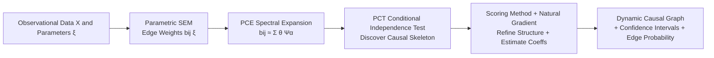

# Learning Dynamic Causal Graphs Under Parametric Uncertainty via Polynomial Chaos Expansions

**Conference**: ICLR 2026  
**OpenReview**: [https://openreview.net/forum?id=4bnCXOtHTm](https://openreview.net/forum?id=4bnCXOtHTm)  
**Code**: To be confirmed  
**Area**: Causal Inference / Causal Discovery  
**Keywords**: Causal Discovery, Parametric Uncertainty, Polynomial Chaos Expansion (PCE), Dynamic Causal Graphs, Industrial Processes, Uncertainty Quantification  

## TL;DR
The strength of each causal edge is upgraded from a "static weight" to a "function of operating parameters $\xi$." This function is learned using Polynomial Chaos Expansion (PCE) to discover causal structures that change dynamically with operating conditions, providing provable identifiability and convergence guarantees.

## Background & Motivation
**Background**: Causal discovery has evolved through three main schools: constraint-based (PC/FCI), score-based (GES/NOTEARS), and functional causal models (LiNGAM/ANM/PNL), enabling the recovery of a Directed Acyclic Graph (DAG) from observational data. However, a latent premise of the vast majority of methods is that the **causal graph is static**—the strength of each edge is a fixed value independent of the context.

**Limitations of Prior Work**: Real industrial systems violate this assumption. In a chemical reactor, the impact of feed temperature on product quality strongly depends on catalyst activity, which degrades over time; heat exchanger efficiency changes with fouling levels, rewriting the entire thermal control loop. That is, causal effects are **functions of measurable operating parameters**. These parameter dependencies are not noise but critical information for process optimization and predictive maintenance. Existing Bayesian causal discovery (DiBS, BCD Nets) can quantify the posterior uncertainty of graphs and parameters, but they address **epistemic uncertainty** stemming from finite samples and still treat each edge as a static quantity without characterizing how edge strength shifts with operating conditions.

**Key Challenge**: The static graph assumption versus the physical reality of industrial causal mechanisms drifting continuously with parameters. Once data from different operating conditions are mixed for marginal independence testing, effects with sign reversals cancel each other out on the margins, leading tests to misjudge them as "independent" and causing the entire causal edge to be missed.

**Goal**: Instead of replacing existing epistemic/aleatory uncertainty modeling, this work **adds a new dimension**—making each causal edge explicitly a function of a low-dimensional operating parameter vector $\xi$. The goal is to learn a complete parametric causal structure from observational data, accompanied by identifiability proofs and convergence algorithms.

**Core Idea**: **[Functional Causal Representation + PCE Spectral Projection]** transforms the infinite-dimensional problem of "learning a function $b_{ij}(\xi)$" into a finite-dimensional problem of "estimating spectral coefficients $\theta_{ij,\alpha}$" via orthogonal polynomial basis truncation, making the problem learnable, provable, and quantifiable in terms of uncertainty.

## Method

### Overall Architecture
PCT-CD connects four stages into a pipeline: first, constructing a **Parametric Structural Equation Model (SEM)** by defining causal coefficients as functions of parameters $\xi$; second, using **PCE** to expand these functions into spectral coefficients, converting infinite dimensions to finite ones; third, using a newly designed **Conditional Independence Test** to discover the initial causal skeleton in the parameter space; finally, refining the structure and quantifying the strength and confidence intervals of each edge using a score-based method with **Natural Gradient**.

### Key Designs

**1. Parametric SEM: Treating Causal Edges as Functions Rather than Constants.** This work moves away from assuming $b_{ij}$ in $X_i = \sum_{j} b_{ij} X_j + \epsilon_i$ is a constant, instead making it a function of operating parameters: $X_i = \sum_{j \in PA_i} b_{ij}(\xi) X_j + \epsilon_i$, where $\xi \in \mathbb{R}^d$ represents known measurable operating conditions (ambient temperature, catalyst age, raw material quality, etc.) following a known distribution $\mu_\xi$; $b_{ij}(\xi) \in L^2(\Xi)$ is an unknown square-integrable function. A key convention is that the **edge set $E$ does not change with $\xi$, only the edge weights $b_{ij}(\xi)$ vary**, decoupling "structure discovery" from "strength modeling": the topology remains stable while only the "tuning" of each edge changes. Noise $\epsilon_i$ is assumed to be independent, centered, sub-Gaussian, and at most one is Gaussian (following LiNGAM's non-Gaussian identifiability conditions).

**2. PCE Spectral Representation: Learning Functions via Orthogonal Polynomials.** The difficulty lies in $b_{ij}(\xi)$ being an infinite-dimensional object. This work utilizes the Wiener–Askey scheme: for common $\mu_\xi$, there exists an adapted set of orthogonal polynomial bases $\{\Psi_\alpha(\xi)\}$ (Hermite for Gaussian, Legendre for Uniform, Laguerre for Exponential). The function is expanded with this basis and truncated to a total order $N_p$:
$$b_{ij}(\xi) \approx \sum_{\alpha \in A_{N_p}} \theta_{ij,\alpha} \Psi_\alpha(\xi), \quad \theta_{ij,\alpha} = \frac{\langle b_{ij}, \Psi_\alpha \rangle_{L^2}}{\langle \Psi_\alpha^2 \rangle_{L^2}}$$
This step transforms "learning functions" into "estimating finite spectral coefficients $\theta_{ij,\alpha}$." Theoretically, for $s$-th order differentiable functions, the error decays polynomially as $C N_p^{-s}$, and for analytic functions (common in physical systems), it decays exponentially as $C\exp(-\gamma N_p^{1/d})$. When the parameter dimension $d$ is large, the basis size $P=\binom{N_p+d}{d}$ explodes; thus, **hyperbolic truncation** is used to prioritize low-order interaction terms and compress the basis size.

**3. PCT Conditional Independence Test: Testing in Parameter Space to Avoid Marginal Cancellation.** Standard CI tests act on the marginal distributions of $(X_A, X_B, X_Z)$. When effects reverse sign with $\xi$, they cancel out marginally, leading to false independence. This work instead tests whether the **conditional covariance function** $C_{AB|Z}(\xi) := \mathrm{Cov}(X_A, X_B \mid X_Z, \xi)$ is zero everywhere: PCT conditional independence is defined as $\|C_{AB|Z}\|^2_{L^2(\mu_\xi)} = \mathbb{E}_\xi[C_{AB|Z}(\xi)^2] = 0$. After a PCE expansion of this covariance function, the null hypothesis is equivalent to "the spectral coefficient vector being zero." Specifically, $X_A, X_B$ are first regressed onto the interaction features $\{X_k \Psi_\alpha(\xi)\}$ to obtain residuals. The product of residuals $r_A r_B$ is the conditional covariance signal at $\xi^{(t)}$. By constructing $v^{(t)} := r^{(t)}_{A} r^{(t)}_{B}\, \psi(\xi^{(t)})$, the multivariate CLT provides the Wald statistic:
$$T_{PCT} = m\, \hat{C}^\top \hat{\Sigma}^{-1}_{\text{reg}} \hat{C} \xrightarrow{d} \chi^2_{df}$$
This test is inserted as a CI oracle into a PC-style skeleton search.

**4. Score-based Refinement + Natural Gradient: Robust and Single-step Convergence.** Since the constraint-based skeleton is unstable with finite samples, it is used for initialization followed by score optimization. The PCT-BIC score is defined as the least squares fit plus a group sparsity penalty $\lambda \|(E,\Theta)\|_0 = \lambda\sum_{i,j} \mathbb{1}\{\|\theta_{ij}\|_2 > 0\}$ (counting whether the "entire edge coefficient group" is non-zero to encourage a sparse DAG). When the DAG is fixed, the penalty is constant, and optimization of $\Theta$ reduces to least squares for each node. Since regressors depend on $\xi$ and are correlated, the empirical Fisher information $\hat{F}_i = \frac{1}{\sigma_\epsilon^2 m}\Phi_i^\top \Phi_i$ is generally non-diagonal. This work uses Fisher preconditioning (natural gradient) for updates:
$$\theta_i \leftarrow \theta_i - \eta (\Phi_i^\top \Phi_i + \varepsilon_{\text{reg}} I)^{-1} \Phi_i^\top (\Phi_i \theta_i - x_i)$$
Theoretically, linear convergence is achieved for $0<\eta<2$, and when $\varepsilon_{\text{reg}}=0, \eta=1$, **least squares optimality is reached in a single step**. Combined with greedy edge perturbations (accepting only those maintaining acyclicity) and warm starts, the entire process yields the final graph, functional relationships, confidence intervals for causal strength, and edge existence probabilities.

The theoretical section provides three conclusions: Theorem 1 (Identifiability) proves that under non-Gaussian noise and other assumptions, the DAG $G$ and the function family $\{b_{ij}(\xi)\}$ can be uniquely recovered from the joint distribution of $(X,\xi)$ (generalizing LiNGAM to the parametric setting); Theorem 2 (Sample Complexity) provides the sample size $m \gtrsim \frac{\sigma_\epsilon^2}{\gamma \kappa_{N_p}^2}(sP)\log(2n^2P/\delta)$ required to recover the truncated edge set, characterizing dependency on the number of interaction features $sP$, design well-posedness $\gamma$, and the weakest effective edge strength $\kappa_{N_p}$; Theorem 3 provides the linear/single-step convergence of the natural gradient mentioned above.

## Key Experimental Results

### Main Results
Validation was performed on a dataset of a chemical reactor network at the Parkland refinery in Canada: 10,000 samples, 9 process variables, 11 ground-truth causal edges verified by engineering principles, and 3 sources of parametric uncertainty (heat transfer coefficient $\xi_1$, reaction rate constant $\xi_2$, yield factor $\xi_3$). Comparison with 23 SOTA methods (parameters $N_p=4, \alpha_{sig}=0.05, \lambda=1, B=200$).

| Method | TP | FP | FN | Prec. | Recall | F1 | SHD |
|------|----|----|----|-------|--------|-----|-----|
| ICA-LiNGAM | 1 | 14 | 10 | 0.067 | 0.091 | 0.077 | 24 |
| DirectLiNGAM | 2 | 13 | 9 | 0.133 | 0.182 | 0.154 | 22 |
| LiNGAM | 5 | 10 | 6 | 0.333 | 0.455 | 0.385 | 16 |
| NOTEARS | 5 | 5 | 6 | 0.500 | 0.455 | 0.476 | 11 |
| FCI | 5 | 4 | 6 | 0.556 | 0.455 | 0.500 | 10 |
| GES / GIES | 6 | 5 | 5 | 0.545 | 0.545 | 0.545 | 10 |
| CAM / GraNDAG / SAM | 8 | 6 | 3 | 0.571 | 0.727 | 0.640 | 9 |
| **Ours (PCT-CD)** | **10** | **1** | **1** | **0.909** | **0.909** | **0.909** | **2** |

PCT-CD correctly identifies 10 out of 11 true edges, with only 1 false positive and 1 false negative, SHD=2, F1=90.9%, nearly double that of the next best methods (CAM/GraNDAG/SAM at 64.0%).

### Uncertainty Quantification Table
A unique capability of PCT-CD is expressing each edge strength as a continuous function of $\xi$, providing 95% confidence intervals, bootstrap existence probabilities, and dominant parameters:

| Edge | Mean | 95% CI | Boot Prob | Dominant $\xi$ |
|----|------|--------|-----------|-----------|
| $X_1 \to X_2$ | 0.642 | [0.411, 0.873] | 0.95 | $\xi_1$ (Heat Transfer) |
| $X_1 \to X_3$ | 0.465 | [0.305, 0.669] | 0.88 | $\xi_2$ (Reaction) |
| $X_7 \to X_9$ | 0.452 | [0.317, 0.632] | 0.95 | $\xi_3$ (Yield) |
| $X_6 \to X_9$ | 0.109 | [0.034, 0.156] | 0.93 | $\xi_2$ (Reaction) |

### Key Findings
- The strength of the strongest edge $X_1\to X_2$ varies by more than 100% depending on heat transfer conditions, while weaker edges are more constrained—proving that static weights indeed lose critical information.
- The three parameters each govern a different class of paths: heat transfer $\xi_1$ dominates feed and thermal control paths, reaction $\xi_2$ controls intermediate conversion, and yield $\xi_3$ determines product quality paths, consistent with engineering intuition.
- By method category: constraint-based methods (PC/FCI) have decent precision but low recall (conservative edge omission); score-based methods (GES/NOTEARS) are fundamentally limited by the static graph assumption; traditional LiNGAM suffers severe model misspecification under parameter changes (38.5% F1), and ICA-LiNGAM performs worst (7.7%).

## Highlights & Insights
- **Paradigm Shift**: The transition from "static graphs" to "dynamic functions" directly addresses a real pain point in industrial causal discovery. Rather than starting from scratch, it systematically grafts PCE—a mature uncertainty quantification tool—onto causal discovery for the first time.
- **Theoretical Closure**: Identifiability + finite sample complexity + convergence theorems are all present. The single-step convergence of natural gradients in the linear Gaussian view is an elegant engineering property.
- **CI Testing Captures the Essence**: Explicitly identifying the hidden failure mode where "marginal independence tests fail under sign reversal" and cleanly solving it via the $L^2$ norm of the conditional covariance function is the most insightful step of the method.
- **High Interpretability**: Instead of outputting a single graph, the method outputs "how each edge changes with which condition + with what confidence it exists," which is a core requirement for safety-critical industrial control.

## Limitations & Future Work
- **Single Experiment**: Validation was performed only on one chemical reactor dataset (9 variables, 11 edges), which is small in scale and limited to a single domain. It lacks cross-domain and large-scale ($n \gg 9$) empirical evidence, leaving generalization uncertain.
- **Linear SEM Assumption**: The core of the model is a **linear** SEM where edge weights vary with parameters. Non-linear causal mechanisms (non-linearity between variables themselves) are not yet covered, which the authors list as future work.
- **Strong Assumptions**: Requirements include causal sufficiency (no unobserved confounding), faithfulness, known $\xi$ distribution or empirical orthogonal bases, and at most one Gaussian noise—conditions that may not all be met in industrial field settings, especially the no-confounding assumption.
- **Curse of Dimensionality**: The basis size $P=\binom{N_p+d}{d}$ explodes combinatorially with the parameter dimension $d$. Hyperbolic truncation only mitigates this, and the sample complexity term $sP$ remains heavy in high-dimensional parameter spaces.
- **Future Work**: The authors propose extending the work to unobserved confounding, more complex non-linear interactions, and applications in online adaptive control.

## Related Work & Insights
- **Three Schools of Causal Discovery**: Constraint-based (PC/FCI/RFCI), score-based (GES/FGES/NOTEARS/DAG-GNN/RL-BIC), and functional causal models (LiNGAM/DirectLiNGAM/VAR-LiNGAM/ANM/PNL)—this work acts as a supplement rather than a replacement, with identifiability proofs directly generalized from LiNGAM.
- **Bayesian Causal Discovery**: DiBS and BCD Nets quantify posterior uncertainty of graphs/parameters (epistemic uncertainty), which is orthogonally complementary to the "parametric uncertainty" in this work.
- **Time-varying/Context-aware Causal Structures**: Work on time-varying causality by Song et al. and Huang et al. is closely related, but explicitly defining edge weights as parameter functions via PCE is a new perspective.
- **PCE Itself**: Proposed by Wiener and popularized by Xiu & Karniadakis, it is mature in engineering uncertainty quantification, sensitivity analysis, and process monitoring. To the authors' knowledge, this is the first systematic application in causal discovery—a research paradigm worth emulating: "grafting a mature tool from domain A onto a core problem in domain B."

## Rating
- **Novelty**: ⭐⭐⭐⭐ First systematic introduction of PCE to causal discovery. The "causal edge = parameter function" paradigm is clear and well-targeted, supported by identifiability proofs.
- **Experimental Thoroughness**: ⭐⭐⭐ Comprehensive comparison with 23 baselines showing significant improvement, but validated only on a single small-scale chemical dataset. Lacks systematic synthetic parameter sweeps and cross-domain large-scale empirical tests.
- **Writing Quality**: ⭐⭐⭐⭐ Smooth logic through motivation, method, theory, and experiments. Clearly explains hidden failure modes like "marginal cancellation." Formulas and theorems are well-organized.
- **Value**: ⭐⭐⭐⭐ Clear value for safety-critical scenarios like industrial process control, root cause analysis, and predictive maintenance. Uncertainty-aware causal functions are a practical necessity, and the paradigm is transferable.

<!-- RELATED:START -->

## Related Papers

- [\[CVPR 2026\] A Polynomial Chaos Framework for Causal Discovery in Nonlinear Uncertain Systems](../../CVPR2026/causal_inference/a_polynomial_chaos_framework_for_causal_discovery_in_nonlinear_uncertain_systems.md)
- [\[ICLR 2026\] Coarse-to-Fine Learning of Dynamic Causal Structures](coarse-to-fine_learning_of_dynamic_causal_structures.md)
- [\[ICLR 2026\] Theoretical Guarantees for Causal Discovery on Large Random Graphs](theoretical_guarantees_for_causal_discovery_on_large_random_graphs.md)
- [\[ICLR 2026\] Query-Specific Causal Graph Pruning under Tiered Knowledge](query-specific_causal_graph_pruning_under_tiered_knowledge.md)
- [\[ICLR 2026\] Causal Imitation Learning under Expert-Observable and Expert-Unobservable Confounding](causal_imitation_learning_under_expert-observable_and_expert-unobservable_confou.md)

<!-- RELATED:END -->
