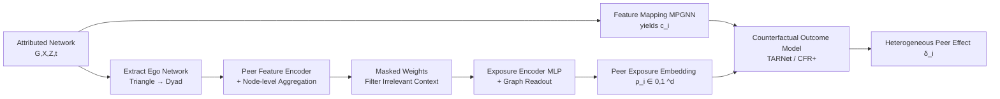

# Learning Exposure Mapping Functions for Inferring Heterogeneous Peer Effects

**Conference**: ICLR 2026  
**OpenReview**: [https://openreview.net/forum?id=bXYp5AIMju](https://openreview.net/forum?id=bXYp5AIMju)  
**Code**: TBD  
**Area**: Causal Inference / Network Interference / Graph Neural Networks  
**Keywords**: Peer effects, exposure mapping function, network interference, heterogeneous causal effects, causal network motifs, GNN  

## TL;DR
This paper proposes **EGONETGNN**, which uses Graph Neural Networks to **automatically learn** the "exposure mapping function" in network peer effects. It eliminates the need to manually specify counts of treated neighbors, enabling robust estimation of heterogeneous peer effects even when influence mechanisms are unknown or depend on local structures (triangles, clustering coefficients, attribute similarity).

## Background & Motivation
**Background**: In scenarios such as social or contact networks, an individual's outcome is affected by the treatments of their neighbors, a phenomenon known as "interference." Causal inference characterizes "peer effects" by relying on an **exposure mapping function** $\phi_e$, which compresses "neighbors' treatments + network structure" into a scalar or low-dimensional "peer exposure value" to compare counterfactual outcomes.

**Limitations of Prior Work**: This mapping function is almost always **manually specified**—such as "whether any neighbor is treated" (binary), "proportion of treated neighbors," "linear thresholds," "proportions weighted by edge strength/attribute similarity," or "causal network motif counts." However, real influence mechanisms are rarely known, and **once the function is misspecified, causal effect estimates become biased**.

**Key Challenge**: (1) To learn this function automatically, existing works often apply standard Message Passing GNNs (MPGNNs) like GCN/GIN, but theory has proven that MPGNNs **cannot count subgraphs with cycles** (e.g., closed triangle motifs), making them unable to express mechanisms depending on local structures like clustering coefficients or common friends. (2) While manual extraction of causal network motif counts is informative, it is computationally expensive, inflexible, and ignores context like edge weights.

**Goal**: Completely move away from "manually defined exposure mapping functions" by **learning an end-to-end** function that can count complex local motifs, remain insensitive to irrelevant contexts, and output bounded, uniformly distributed peer exposure representations for **heterogeneous peer effect (HPE)** estimation.

**Core Idea** (**Automatic Exposure Learning + Ego-Network Transformation for Expressivity**): The node regression problem is transformed into a "graph regression" for each node by extracting its **ego network** (containing only neighbors and the edges between them). This causes triangular structures involving the ego node to degenerate into dyads (edges) within the ego network, bypassing the bottleneck where MPGNNs cannot count closed triangles. This is combined with masked weights and losses for coverage, entropy, and sparsity to ensure expressivity, invariance, and representation quality.

## Method

### Overall Architecture
On top of the standard "feature mapping + counterfactual outcome model" setup, EGONETGNN adds a learning module for the **exposure mapping function**. The process is: first, use an MPGNN to encode the attributed network into feature embeddings $c_i$ (handling confounding/effect modification); then, extract the ego network for each node, inject neighbor treatments and edge attributes, and perform node-level aggregation to capture local structure; after passing through masked weight layers and an MLP encoder, a graph-level readout produces bounded peer exposure embeddings $\rho_i \in [0, 1]^d$; finally, $(\pi_i, \rho_i, c_i)$ are fed into a TARNet/CFR+ counterfactual outcome model to estimate peer effects.

### Key Designs

**1. Ego Network Transformation: Converting "Uncountable Triangles" into "Countable Edges" to fundamentally enhance expressivity.** This is the foundation of the model's expressive power. Standard MPGNNs fail because peer exposure for node $v_i$ often depends on local structures between neighbors (e.g., how many closed triangles treated neighbors form), which MPGNNs cannot count. EGONETGNN extracts an ego network $\bar{G}_i(\bar{V}_i,\bar{E}_i)$ for each node $v_i$, where $\bar{V}_i$ contains only neighbors of $v_i$ and $\bar{E}_i$ contains edges between those neighbors. In this subgraph, the original "$v_i$–$v_j$–$v_k$" closed triangle degenerates into a "$v_j$–$v_k$" dyad because $v_i$ is removed, allowing ordinary node aggregation to count it. The authors prove **Proposition 2**: EGONETGNN is sufficient to express all four types of causal network motifs: dyads, open triads, closed triads, and open tetrads—something standard MPGNNs cannot do. Since $v_i$ itself is not in the ego network, its edge attributes $Z_{ij}$ are converted into neighbor node attributes $\bar{X}_j = Z_{ij}$ to ensure no loss of edge weight information.

**2. Feature Mapping and Peer Feature Encoding: Decoupling self-attributes and explicitly modeling "similarity between self and neighbors."** The feature mapping uses a decoupled MPGNN to separate the node's own latent representation $\Theta_0(X_i)$ from the aggregated neighbor/edge attributes $h_i^l$, resulting in $c_i = \Theta_0(X_i)\,\|\,h_i^l$, allowing $c_i$ to cleanly serve as a confounding control/effect modification variable. The peer feature encoder explicitly encodes the feature **distance** between the ego and each peer: $c_{ij} = \Theta_{\text{feat}}(c_j\,\|\,(c_i-c_j)^2)$, enabling the model to capture mechanisms like "attribute similarity" (e.g., neighbors of the same gender having higher influence). Node aggregation is then performed on the ego network: $h_j^l = h_j^{l-1} + \sum_{k\in N_j} h_k^{l-1}$, with initial states $h_k^0 = t_k\,\|\,\bar{X}_k\,\|\,c_{ik}\,\|\,Z_{jk}$ incorporating neighbor treatment, attributes, feature encoding, and edge attributes.

**3. Masked Weights + Log Transformation Encoding: Promoting invariance and injecting inductive biases for "proportion/scale."** To make representations **insensitive to irrelevant context** (invariance), the aggregated hidden state $h_j^{\text{agg}} = \bar{X}_j\,\|\,c_{ij}\,\|\,h_j^L$ passes through a masked fully connected layer $h_j^{\text{mask}} = \text{ReLU}\big((\sigma(W_{\text{mask}})\odot W_{\text{agg}})\,h_j^{\text{agg}} + b_{\text{agg}}\big)$, where the mask $\sigma(W_{\text{mask}})$ learns to shut off irrelevant dimensions. This is followed by an exposure encoder $h_j^{\text{exp}} = \text{ReLU}(\Theta_{\text{exp}}(\ln(\text{ReLU}(\Theta_{\text{enc}}(h_j^{\text{mask}}))+1)))$, where the $\ln$ transformation rescales large values in scale-free networks and introduces an inductive bias for capturing ratio-based mechanisms.

**4. Dual Bounded Readout + Four Prior Losses: Ensuring exposure representations are bounded, well-covered, and end-to-end learnable.** The graph readout aggregates $\rho_i\in[0,1]^d$ via two paths: one is $\sum_j (t_j h_j^{\text{exp}})/\sum_j h_j^{\text{exp}}$ (analogous to the "proportion of treated neighbors," with weights learned by the network), and the other is $1-e^{-\sum_j (t_j h_j^{\text{exp}})}$ (analogous to the "number of treated neighbors"). Both naturally fall in $[0,1]$, where $0$ indicates no exposure. The end-to-end loss integrates four priors: **balance loss** (autoencoder reconstruction from CFR+ and Wasserstein IPM to balance treated/control distributions while maintaining expressivity), **coverage loss** $L_{\text{cov}}=(\text{mean}(\rho)-0.5)^2+(\text{var}(\rho)-\tfrac{1}{12})^2+(\text{range}(\rho)-1)^2$ (approximating a uniform $[0,1]$ distribution to prevent "mode collapse"), **entropy loss** to push masks toward 0/1, and **层次sparsity loss** to assign high weights to a few masks. The total loss is $L=\tfrac1n\sum_i L_{y_i}+L_{\text{bal}}+\lambda_{\text{cov}}L_{\text{cov}}+\lambda_{\text{ent}}L_{\text{ent}}+\lambda_{\text{sp}}L_{\text{sp}}+\lambda_{L1}\|\Theta_{\text{gnn}}\|_1$, where the L1 term further promotes sparsity/invariance. The counterfactual model uses TARNet (shared embedding + dual prediction heads) or CFR+ with its own autoencoder (using reconstruction loss to mitigate expressivity loss during distribution balancing).

## Key Experimental Results

### Main Results
HPE estimation error $\epsilon_{PEHE}$ (lower is better) on semi-synthetic BlogCatalog data where the true exposure mechanism depends on clustering coefficient, connected components, common friends, or attribute similarity:

| Mechanism | Ours-TARNet | Ours-CFR+ | GNN-Motifs | INE-TARNet | 1GNN-HSIC | DWR | NetEst | CauGramer |
|---|---|---|---|---|---|---|---|---|
| Clustering Coeff | 2.13±1.9 | **0.95±0.5** | 2.39±1.2 | 2.35±0.7 | 6.21±3.7 | 7.49±4.6 | 4.53±1.5 | 6.16±2.1 |
| Conn. Components | **1.47±0.9** | 1.50±0.7 | 4.98±1.6 | 4.78±1.1 | 6.78±1.9 | 7.68±1.6 | 8.56±0.7 | 7.07±1.2 |
| Common Friends | 2.86±1.3 | **2.24±1.6** | 2.81±1.3 | 2.50±0.9 | 10.30±6.0 | 8.72±2.8 | 5.34±1.3 | 5.18±2.0 |
| Attr. Similarity | 3.95±2.7 | 3.65±2.4 | 4.64±2.1 | **3.59±1.8** | 15.25±4.7 | 17.96±3.7 | 11.71±2.2 | 14.45±5.7 |

The two variants of EGONETGNN achieve the best results in three out of four mechanisms, with particularly notable advantages in mechanisms depending on local structures (connected components, common friends). Only in the attribute similarity mechanism does INE-TARNet perform slightly better (homophily makes neighbor attributes nearly homogeneous, benefiting simple baselines).

### Ablation Study
Partial results for three variants (Full / No mask / No feature encoder+mask) showing $\epsilon_{PEHE}$:

| Mechanism | BC (Common Fr.) | BA (Common Fr.) | WS (Common Fr.) | BC (Clust. Coeff) | BA (Clust. Coeff) | WS (Clust. Coeff) | BC (Attr. Sim.) | BA (Attr. Sim.) | WS (Attr. Sim.) |
|---|---|---|---|---|---|---|---|---|---|
| Ours (w/o feat&mask) | 2.07±1.3 | 0.27±0.2 | 0.31±0.1 | 2.11±0.8 | 0.97±0.7 | 1.91±1.3 | 3.18±1.9 | 13.73±2.8 | 13.85±4.0 |

Conclusion: Removing masked weights introduces bias due to sensitivity to irrelevant context; removing the feature encoder MLP weakens the ability to capture attribute similarity mechanisms (error surges in attribute similarity columns). However, for pure local structure mechanisms, ignoring irrelevant features can be better—indicating that **the feature encoder adds expressivity while masked weights promote invariance**.

### Key Findings
- **RQ1 (Synthetic Networks)**: All methods perform well when the preferential attachment parameter $m=1$ (sparse star-like, no cycles), but as edge density increases and complex topologies emerge, baselines degrade sharply due to insufficient expressivity, while EGONETGNN maintains a significant advantage in dense networks.
- **RQ4 (Representation Quality, Table 3)**: The absolute correlation between learned exposure representations and true exposure far exceeds the "proportion of treated friends" baseline in local structure mechanisms like clustering coefficients (0.81 vs. 0.17) and common friends (0.73 vs. 0.09).
- **RQ5 (Robustness)**: Even in the simplest setting where all baseline assumptions are correct (true mechanism is neighbor proportion), the proposed method performs better by handling complex effect modification and counterfactual flips. It remains competitive under violated assumptions like 10% feature zeroing + Gaussian noise and two-hop interference.
- **Model Selection**: Using prediction loss combined with coverage loss on a 20% validation set is more robust than using prediction loss alone—coverage loss prevents the exposure representation from collapsing into "correlated but untrue" patterns (preventing overfitting).

## Highlights & Insights
- **Transforms the long-standing pain point of "exposure mapping function misspecification" in causal inference into a representation learning problem** that can be learned end-to-end. Rather than simply applying GNNs, it theoretically diagnoses the expressivity flaws of MPGNNs and provides a targeted solution.
- **Ego network transformation is an elegant "root cause" trick**: It uses graph structural transformation (Triangle → Dyad) rather than parameter stacking to gain motif counting ability, backed by the provable guarantees of Proposition 2.
- **Four prior losses target "specific ailments" of causal exposure representations**: coverage loss prevents collapse, masked/entropy/sparsity promote invariance, and balance loss controls confounding—encoding causal constraints directly into the loss rather than relying solely on data fitting.
- **Honest failure analysis**: Explicitly notes counter-intuitive findings, such as simple baselines performing better under homophily in attribute similarity mechanisms or removing features yielding better results in specific cases.

## Limitations & Future Work
- **Theory only covers expressivity**: The main results concern the subgraph counting power of GNNs + misspecification decomposition of counterfactual prediction error, but the asymptotic properties/tight bounds of HPE estimation under complex GNNs are not yet established.
- **Strong assumptions**: Relies on neighborhood interference (1-hop only), no unobserved confounding, and requires reliable attributed networks as input. Two-hop interference and noisy networks were only tested for robustness, not theoretically guaranteed.
- **Computational overhead**: Ego network processing makes it roughly $\rho_E \times \text{avg}(d)$ times more expensive than standard MPGNNs (edge density × average degree), leaving scalability on large dense graphs to be addressed.
- **Single effect type**: Currently only estimates peer effects and does not cover other network effects like direct effects or total effects.
- **Evaluation on synthetic/semi-synthetic data**: Lacks real-world data with ground-truth counterfactuals (a common issue in causal inference, but one that limits external validity).

## Related Work & Insights
- **Taxonomy of Exposure Mapping Functions**: From binary (at least one treated neighbor), linear threshold, and proportion of treated neighbors (Hudgens & Halloran 2008) to weighted proportions/sums (Forastiere 2021; Zhao 2024) and causal network motifs counts (Yuan 2021)—this work unifies and automates this manually designed lineage.
- **GNN for Causal Estimation**: Builds on TARNet/CFR (Shalit 2017), NetEst (Jiang & Sun 2022), and TNet (Chen 2024). It directly compares with recent automatic exposure learning works like AEMNet (Mao 2025) and CauGramer (Wu 2025), pointing out their insufficient expressivity when using off-the-shelf GCN/GIN.
- **GNN Expressivity Theory**: Directly cites conclusions from Chen et al. 2020 regarding GNN subgraph counting power as a foundation for method design and theoretical proof—a good example of "using expressivity theory to guide causal method design."
- **Inspiration**: When "manual feature engineering + high risk of misspecification" is the primary source of error in a field, rather than manually adding more complex features, it is better to design a learnable module based on expressivity theory that can encompass and surpass those manual features. This paper grounds this approach in network causal inference.

## Rating
- **Novelty**: ⭐⭐⭐⭐ First to systematically combine "automatic exposure mapping learning" with "GNN expressivity theory + ego network transformation" with provable guarantees.
- **Experimental Thoroughness**: ⭐⭐⭐⭐ Covers 3 synthetic networks, 2 semi-synthetic networks, 5 mechanisms, 9+ baselines, and 5 RQs including ablation/representation quality/robustness/model selection. Points deducted for lack of real-world scenario validation.
- **Writing Quality**: ⭐⭐⭐⭐ Clear problem definition, progressive motivation, and strong correspondence between theory and experiments. Formulas are dense but notation is consistent.
- **Value**: ⭐⭐⭐⭐ Addresses the practical pain point of exposure function misspecification in network causal inference, with direct implications for social, medical, and educational fields.

<!-- RELATED:START -->

## Related Papers

- [\[ICLR 2026\] Debiased Front-Door Learners for Heterogeneous Effects](debiased_front-door_learners_for_heterogeneous_effects.md)
- [\[AAAI 2026\] Causal Inference Under Threshold Manipulation: Bayesian Mixture Modeling and Heterogeneous Treatment Effects](../../AAAI2026/causal_inference/causal_inference_under_threshold_manipulation_bayesian_mixtu.md)
- [\[ICLR 2026\] Topological Causal Effects](topological_causal_effects.md)
- [\[ICLR 2026\] Matching without Group Barrier for Heterogeneous Treatment Effect Estimation](matching_without_group_barrier_for_heterogeneous_treatment_effect_estimation.md)
- [\[ICLR 2026\] A Relative Error-Based Evaluation Framework of Heterogeneous Treatment Effect Estimators](a_relative_error-based_evaluation_framework_of_heterogeneous_treatment_effect_es.md)

<!-- RELATED:END -->
