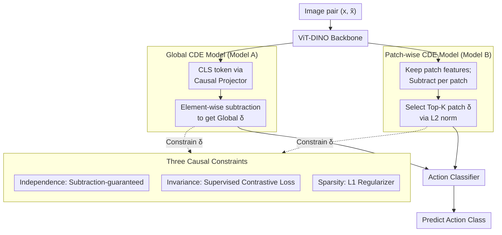

# Learning Robust Intervention Representations with Delta Embeddings

**Conference**: ICLR 2026  
**arXiv**: [2508.04492](https://arxiv.org/abs/2508.04492)  
**Code**: [Project Page](https://palimisis.github.io/Learning-Robust-Intervention-Representations-with-Delta-Embeddings/)  
**Area**: Causal Representation Learning / OOD Generalization  
**Keywords**: Causal Representation Learning, Delta Embeddings, out-of-distribution, Intervention, Contrastive Learning

## TL;DR

The authors propose the Causal Delta Embedding (CDE) framework, which represents interventions/actions as the vector difference between pre- and post-intervention states in a latent space. By applying three constraints—independence, sparsity, and invariance—the framework learns robust intervention representations. It significantly outperforms baselines in OOD generalization within the Causal Triplet challenge and automatically discovers the anti-parallel semantic structure of antonymous actions.

## Background & Motivation

**Understanding how the world responds to actions and interventions is a core capability of AI**: Agents operating in dynamic environments must recover the underlying mechanisms that generate and transform data to achieve causal reasoning and robust generalization.

**Deep learning models fail to generalize under distribution shifts**: Standard models rely on correlations rather than causal mechanisms. When the data distribution changes (e.g., encountering unseen object-action combinations), performance drops sharply.

**Causal Representation Learning (CRL) focuses on variable identification but neglects intervention representations**: Most CRL work focuses on identifying latent causal variables and their relationships (e.g., VAE frameworks, score-based methods), while few methods address learning generalizable representations of actions/interventions themselves.

**Two key CRL hypotheses guide the method design**:
   - **Independent Causal Mechanisms (ICM) Hypothesis**: The data generation process consists of autonomous and independent modules.
   - **Sparse Mechanism Shift (SMS) Hypothesis**: An intervention typically affects only a small number of causal mechanisms.

**Two types of OOD generalization challenges**:
   - **Compositional Shift**: Unseen object-action combinations appear during testing (e.g., "open door" and "close drawer" seen in training, but "open drawer" tested).
   - **Systemic Shift**: Entirely new object categories appear during testing.

## Method

### Overall Architecture

The goal of CDE is to learn action/intervention representations that generalize across objects and scenarios, remaining recognizable even for unseen object-action combinations. The Core Idea is to model an "action" as a directional vector in the latent space: given a pair of observations $(x, \tilde{x})$ before and after an intervention, an encoder $\phi$ (ViT-DINO backbone + causal projector) maps both images to the latent space. The Delta embedding is obtained via element-wise subtraction: $\delta_a := \phi(\tilde{x}) - \phi(x)$. Under ideal counterfactual assumptions, this difference vector should satisfy $\delta_a = [0 \cdots \tilde{z}_a - z_a \cdots 0]^T$—where only dimensions modified by action $a$ are non-zero, and shared background elements cancel out.

The method is implemented through three components: three causal constraints (independence, sparsity, invariance) define the desired properties of the Delta vector; two network architectures extract Deltas—the Global CDE model (Model A using the CLS token) for global effects, and the Patch-wise CDE model (Model B using Top-K patch-wise differences) for local effects. The resulting Deltas from both branches are fed into a single action classifier, while the constraints are enforced via three loss terms during training.

### Key Designs

**1. Three Causal Constraints: Independence, Sparsity, and Invariance**

CDE translates classic CRL hypotheses into three properties for the Delta vector. **Independence** requires the action representation to be free from interference by scene attributes; this is naturally achieved through subtraction, as shared backgrounds are canceled. **Sparsity** stems from the SMS hypothesis: an intervention only modifies a few mechanisms, so $\delta_a$ should be sparse. **Invariance** requires the same action applied to different objects to result in similar representations—e.g., "open" should be the same vector whether the object is a door or a drawer, formalized as $\text{Var}_{x \sim P(X)}[\delta_a(x)] \approx \mathbf{0}$.

**2. Global CDE Model (Model A): Capturing Image-Level Actions via CLS Token**

For scenarios where an action affects the entire scene, Model A uses a minimalist path: ViT-DINO extracts the CLS token for each image, which is mapped to an $l$-dimensional latent space. Element-wise subtraction yields the Delta for action classification. The underlying Structural Equation Model is $\tilde{z}_a = z_a + \delta_a + \epsilon$, where $\epsilon$ is zero-mean independent noise, corresponding to "actionable counterfactual" scenarios with random perturbations.

**3. Patch-wise CDE Model (Model B): Isolating Local Changes via Top-K Patches**

In multi-object scenes where actions modify local regions, global embeddings may "average out" subtle signals. Model B retains all ViT patch outputs, calculates Deltas per patch, and selects the Top-K patches with the largest L2 norms. Losses are calculated independently for each selected patch. This mechanism focuses attention on regions of change, preventing dilution by large, static backgrounds.

### Loss & Training

The three constraints are implemented as a weighted sum of three losses: $\mathcal{L}_{\text{total}} = \mathcal{L}_{\text{CE}} + \alpha_{\text{contrast}} \mathcal{L}_{\text{contrast}} + \alpha_{\text{sparsity}} \mathcal{L}_{\text{sparsity}}$. Cross-entropy $\mathcal{L}_{\text{CE}}$ ensures discriminative power for action classification. The Supervised Contrastive Loss $\mathcal{L}_{\text{contrast}}$ pulls Deltas of similar actions together and pushes different ones apart, enforcing invariance:

$$\mathcal{L}_{\text{contrast}} = \sum_{i=1}^{B} \frac{-1}{|P(i)|} \sum_{p \in P(i)} \log \frac{\exp(\text{sim}(\delta_i, \delta_p)/\tau)}{\sum_{j \neq i} \exp(\text{sim}(\delta_i, \delta_j)/\tau)}$$

Sparsity is enforced via the regularization $\mathcal{L}_{\text{sparsity}} = \frac{1}{B}\sum_i \|\delta_i\|_1$ to realize the SMS hypothesis. Hyperparameters are fixed at $\alpha_{\text{contrast}} = 2.0$ and $\alpha_{\text{sparsity}} = 1.0$ across all experiments. The encoder is fine-tuned end-to-end.

## Key Experimental Results

### Main Results

Single-object ProcTHOR scenes (Synthetic):

| Method | IID Acc. | OOD Comp. | OOD Syst. | Gap↓ |
|------|----------|-----------|-----------|------|
| Vanilla-R (ResNet) | 0.96 | 0.36 | 0.48 | 0.48 |
| Vanilla-V (ViT-DINO) | 0.95 | 0.34 | 0.47 | 0.48 |
| ICM-R | 0.95 | 0.41 | 0.50 | 0.45 |
| SMS-R | 0.96 | 0.47 | 0.54 | 0.42 |
| **CDE Global** | **0.95** | — | — | **0.21** |

Global CDE reduces the generalization gap from 0.56 to 0.21 in single-object scenarios while maintaining IID accuracy. In multi-object and real-world (Epic-Kitchens) scenarios, the Patch-wise model outperforms all baselines, including oracle methods using ground-truth segmentation masks.

### Ablation Study

| Configuration | Effect |
|------|------|
| All three losses | Best OOD accuracy (~75.0%) |
| w/o Contrastive Loss | Invariance lost, OOD drops by ~7% |
| w/o Sparsity Regularizer | Representation less compact, OOD drops by ~2% |
| Cross-Entropy only | Degenerates to standard classifier, ~8% lower than full model |
| Global vs Patch-wise | Patch-wise superior in multi-object scenes |

### Key Findings

1. **CDE establishes a new SOTA on the Causal Triplet challenge**: Significantly outperforms baselines on both synthetic and real-world benchmarks.
2. **Automatic discovery of anti-parallel relationships**: Delta embeddings for "open" vs "close" naturally align in opposite directions in the latent space without explicit supervision.
3. **Independence is naturally satisfied by Delta calculation**: No specific loss is needed; subtraction effectively removes scene-level variations.
4. **Resilience to actionable counterfactuals**: The classification remains robust even when noise $\epsilon \neq 0$ is present.
5. **Criticality of sparsity**: L1 regularization ensures only causally relevant dimensions are activated.

## Highlights & Insights

1. **Decoupling Action Learning from State Identification**: Unlike most CRL work that focuses on recovering latent variables, CDE uniquely addresses the representation of interventions/actions.
2. **The "Delta = Subtraction" Minimalism**: By relying on simple subtraction at the encoder output, the model extracts causal information without needing complex structural discovery.
3. **Loss Terms Mapping to Constraints**: The mapping from independence (architecture), sparsity (L1), and invariance (contrastive) to losses provides a clear design rationale.
4. **Emergence of Anti-parallel Semantic Structures**: The fact that "open ↔ close" directions are learned as inverses provides strong evidence for the recovery of causal structures.

## Limitations & Future Work

1. **Requirement for Image Pairs**: The method requires pre- and post-intervention observations, which are not always available in real-world settings.
2. **Limited Action Space**: Evaluation on the Causal Triplet benchmark is restricted to a small number of actions (~10+); scalability is untested.
3. **Static Image Pairs**: The current framework does not account for temporal dynamics or video data.
4. **Dependency on ViT-DINO Backbone**: Strong visual priors are inherited; performance may degrade significantly with random initialization.
5. **Real-world Noise**: Camera motion and occlusions in datasets like Epic-Kitchens still pose challenges for purely causal representation.

## Related Work & Insights

- **Causal Triplet (Liu et al., 2023)**: Provides the evaluation framework and SCM definitions; CDE achieves superior performance on this benchmark.
- **Von Kügelgen et al. (2021)**: Theorized that contrastive learning can disentangle causal factors; CDE extends this to intervention pairs.
- **DINO (Caron et al., 2021)**: Self-supervised ViT features provide the essential visual foundation.
- **SMS Regularization (Lachapelle et al., 2022)**: The SMS hypothesis is concretely implemented here via L1 penalties.

## Rating

- **Novelty**: ⭐⭐⭐⭐ — The "Delta = Subtraction" approach is elegant; focusing on intervention instead of variable identification is a fresh perspective.
- **Experimental Thoroughness**: ⭐⭐⭐⭐ — Comprehensive coverage across Causal Triplet difficulty levels, though larger scale testing is desired.
- **Writing Quality**: ⭐⭐⭐⭐⭐ — Rigorous definitions and clear derivation from properties to losses.
- **Value**: ⭐⭐⭐⭐ — Strong potential for robotic learning and embodied AI applications.

<!-- RELATED:START -->

## Related Papers

- [\[ICLR 2026\] Counterfactual Explanations on Robust Perceptual Geodesics](counterfactual_explanations_on_robust_perceptual_geodesics.md)
- [\[ICLR 2026\] Direct Doubly Robust Estimation of Conditional Quantile Contrasts](direct_doubly_robust_estimation_of_conditional_quantile_contrasts.md)
- [\[NeurIPS 2025\] A Principle of Targeted Intervention for Multi-Agent Reinforcement Learning](../../NeurIPS2025/causal_inference/a_principle_of_targeted_intervention_for_multi-agent_reinforcement_learning.md)
- [\[ICML 2026\] Toward Scalable and Valid Conditional Independence Testing with Spectral Representations](../../ICML2026/causal_inference/toward_scalable_and_valid_conditional_independence_testing_with_spectral_represe.md)
- [\[ACL 2026\] Learning Invariant Modality Representation for Robust Multimodal Learning from a Causal Inference Perspective](../../ACL2026/causal_inference/learning_invariant_modality_representation_for_robust_multimodal_learning_from_a.md)

<!-- RELATED:END -->
