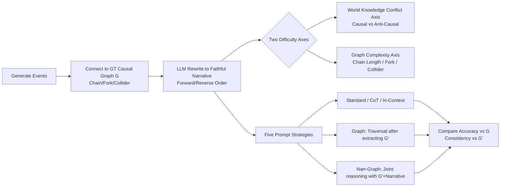

# LLMs Struggle to Balance Reasoning and World Knowledge in Causal Narrative Understanding

**Conference**: ICLR 2026  
**OpenReview**: [https://openreview.net/forum?id=GfVKK5sKit](https://openreview.net/forum?id=GfVKK5sKit)  
**Code**: Included with paper (narratives and prompt templates in appendix and linked code)  
**Area**: Causal Reasoning / LLM Evaluation  
**Keywords**: Causal reasoning, narrative understanding, world knowledge conflict, shortcut learning, graph extraction  

## TL;DR
By controllably generating causal narratives across two axes—"world knowledge conflict" and "graph reasoning complexity"—the authors find that SOTA LLMs rely on two shortcuts in causal narrative understanding (event appearance order = causal order, and applying parametric common sense). Neither CoT nor ICL can resolve this; only a "Graph" strategy—where the model first extracts the entire causal graph and then answers via graph traversal—bypasses these shortcuts.

## Background & Motivation
**Background**: The success of LLMs on causal tasks mostly stems from associative recall of world knowledge absorbed during pre-training rather than true reasoning over the causal structure in the context. Existing benchmarks either focus on pure logical/mathematical reasoning (requiring almost no world knowledge) or common-sense causality (answerable via direct memory retrieval), leaving these two capabilities studied in isolation.

**Limitations of Prior Work**: Causal reasoning requires the integration of both: performing deduction like applying do-calculus while using domain knowledge to instantiate variables into a graph. However, the interaction and conflict between "knowledge retrieval" and "contextual reasoning" have rarely been systematically studied. Existing work is generally limited to short questions involving single causal relations (e.g., Jin et al. 2023 also introduces probability calculations, conflating causal failure with arithmetic failure).

**Key Challenge**: When causal relationships in a narrative contradict common sense in the model's memory (atypical or counter-intuitive scenarios), should the model follow the narrative or its memory? This is a key metric for "true causal reasoning ability," yet it is avoided by existing datasets.

**Goal**: Construct causal narrative tasks where difficulty can be independently adjusted across "world knowledge conflict" and "graph reasoning complexity" to characterize LLM performance across the entire difficulty spectrum and identify systematic failure modes.

**Core Idea**: **[Evaluation Framework]** Generate narratives consistent with a ground truth causal graph $G$, provide only the narrative to the model, and ask it to (1) judge if $V_i$ (directly or indirectly) causes $V_j$; and (2) reconstruct a causal graph $G'$ faithful to the narrative. By systematically manipulating difficulty along two axes, performance gaps are attributed to specific shortcuts.

## Method

### Overall Architecture
The method is not a new model but a diagnostic pipeline comprising "controllable causal narrative generation + multi-prompt comparative evaluation." First, LLMs generate real-world events connected into a ground truth graph $G$ (chains, forks, or colliders). LLMs then rewrite $G$ into a faithful narrative (98% of narratives can be uniquely mapped back to the causal order by blind-annotated graduate students, ensuring quality). Variants are generated along two difficulty axes, and five prompt strategies are used to test the same set of causal questions. Model answers are compared for accuracy against the ground truth $G$ and for consistency against the model-extracted graph $G'$.

### Key Designs

**1. Dual-axis controllable difficulty generation: Separating "knowledge" and "reasoning"**—To diagnose the conflict between knowledge and reasoning, the difficulty of both must be adjusted independently. Along the **world knowledge conflict axis**, the authors explicitly make adjacent events either Causal (e.g., "disease $\to$ shorter lifespan," aligned with common sense) or Anti-Causal (e.g., "stressful job $\to$ more happiness," counter-intuitive) when generating event chains. $G$ is built accordingly, so the causal links in the narrative either align with or conflict with the model's parametric knowledge. Along the **graph complexity axis**, the number of nodes is scaled from 4 to 20, and structures are expanded from simple chains to complex graphs containing Forks (one cause, multiple effects) and Colliders (multiple causes, one effect). The axes are orthogonal, allowing "incorrect answers" to be precisely attributed to "narrative order," "common sense bias," or "structural complexity."

**2. Event appearance order probe (Forward vs Reverse): Capturing the "order is causality" shortcut**—The same ground truth chain graph can be rewritten into a narrative in topological order (cause before effect, Forward) or reverse topological order (effect before cause, Reverse). If a model is truly reasoning about causality, both narratives should yield the same judgment. If it simply assumes "earlier events cause later ones," it will systematically fail on Reverse narratives. Experiments confirmed this: accuracy for Standard/CoT/In-Context dropped significantly as chain length increased under the Reverse condition, proving heavy reliance on the "narrative order = causal order" prior.

**3. Parametric knowledge conflict probe: Capturing the "common sense" shortcut**—Ground truth graphs like $1 \to 3 \to 2$ are constructed where parametric knowledge suggests $1$ and $2$ are Anti-Causal. After generating a Forward narrative, the model is asked "Does $1$ cause $2$?". The correct answer is "Yes" (indirect causal chain in narrative), but the common sense shortcut leads to "No." Results show models primarily succeed only when causal relations align with their parametric knowledge; in cases of conflict, even CoT fails to prevent a significant drop in performance—models use memory as a shortcut, ignoring the specific content of the narrative.

**4. Explicit causal graph extraction (Graph) vs Joint reasoning (Narr-Graph): Pinpointing shortcut triggers**—A key diagnostic design requires the model to first extract the full causal graph $G'$ from the narrative. Subsequently, **the narrative is no longer provided**, and the model must answer solely via graph traversal. This "Graph" strategy restored accuracy to levels near Forward/Causal conditions in both Reverse and Anti-Causal settings (approx. +50% improvement for Reverse), as extracting the full graph forces the model to perform long-range reasoning over the entire narrative rather than taking shortcuts. However, if the narrative is provided alongside $G'$ (Narr-Graph), the gains vanish. This indicates that as long as the narrative is present, the model reverts to shortcuts. This comparison precisely locates the failure at the "answer per question while reading the narrative" step, rather than in the "understanding of the narrative" itself.

## Key Experimental Results

Models: GPT-4o (primary focus), Claude 3.5 Sonnet, LLaMA 3.1 8B. Data: ~2500 synthetic narratives + semi-synthetic/real narratives derived from CauseNet. Aggregated over 5 random seeds with 95% CI reported.

### Main Results (Qualitative trends from Fig.1/2/4)

| Condition | Standard / CoT / In-Context | Graph (Traversal after extracting $G'$) |
|---|---|---|
| Forward Chain | High Accuracy | High |
| Reverse Chain | Significant drop with length | Comparable to Forward (~+50%) |
| Causal (Aligned) | High | High |
| Anti-Causal (Conflict) | Massive drop, CoT ineffective | Near Causal levels |
| Complex Graph (Fork/Collider) | Slightly lower than chain | Minimal degradation |

### Parametric Knowledge Conflict (CauseNet, Table 1 Description)

| Conflict Presence | Standard / CoT | Graph |
|---|---|---|
| No Conflict (Aligned) | >90% | Very High |
| Conflict (Counter-intuitive) | Significantly lower, CoT fails | Very High (similar to No Conflict) |

> Approx. 5% of relations in CauseNet violate model pre-training knowledge. The authors sampled 100 conflict/aligned narratives (lengths 3–9, Forward order to avoid confounding factors).

### Key Findings
- **Two Shortcuts**: ① "Narrative order = Causal direction"; ② "Applying parametric common sense." Neither CoT nor In-Context can mitigate these.
- **Inconsistency between answers and extracted graphs**: Direct answers often contradict the model's own extracted $G'$ (low consistency), suggesting the model "can draw the graph but does not follow it."
- **Graph extraction is both a cure and a diagnostic tool**: Traversal of $G'$ alone bypasses both shortcuts; the gain disappears when the narrative is reintroduced (Narr-Graph).
- **Complex structures are not as difficult as expected**: Degradation from Forks/Colliders is much smaller than that from order/common-sense failures, consistent with Dettki et al. 2025; this paper extends that to long narratives with multiple forks/colliders.
- **Length amplifies shortcuts**: The longer the narrative, the more the model relies on shortcuts, whereas $G'$ traversal remains stable across lengths.

## Highlights & Insights
- The **orthogonal dual-axis diagnostic method** is elegant: it decouples "world knowledge" and "graph reasoning" into two independent knobs, allowing failure modes to be precisely attributed rather than vaguely labeled as "poor causal reasoning."
- The **Forward/Reverse and Causal/Anti-Causal probes** are simple yet powerful, effectively pinning down "order priors" and "common sense shortcuts."
- The **"consistency gap" between drawing a graph and following it** is an insightful observation: it suggests that LLM capabilities exist but are not correctly composed—pointing toward a "separate then combine" methodology.
- Results from real-world data (CauseNet) align with synthetic data, strengthening the argument and avoiding concerns that the tasks are too artificial.

## Limitations & Future Work
- **Diagnosis without a robust fix**: While the paper shows $G'$ traversal bypasses shortcuts, the failure of Narr-Graph suggests there is no robust "all-in-one" fix yet. How to make models automatically isolate reasoning from knowledge while reading narratives remains an open question.
- **Chain-centric tasks**: Experiments on complex structures are relatively lightweight; failure modes in more complex graphs (deeply nested forks/colliders, real-world inference with confounders) are not fully characterized.
- **Limited model coverage**: The main text focuses on GPT-4o; it is not systematically verified if strong reasoning models (like the o1 series) exhibit the same shortcuts.
- **Causal granularity**: Evaluation focuses on "existence/direction of directed edges" and does not touch upon stronger do-calculus queries like interventions or counterfactuals.
- **Future Work**: The authors advocate for future methods to "isolate the reasoning and knowledge strengths of LLMs then combine them" to avoid conflicts—graph extraction is early evidence for this direction.

## Related Work & Insights
- **Causal + LLM benchmarks**: Jin et al. (2023) test reasoning given a graph but mix in probability math; Joshi et al. (2024b) study failures in formalized (non-narrative) text. This paper is the first to analyze "anti-common sense" causal reasoning in realistic/synthetic narratives.
- **Common-sense causality**: Unlike Gordon et al. 2012 or Ho et al. 2023 where memory suffices, this paper constructs conflict samples to isolate true reasoning.
- **Causal story generation**: Ammanabrolu et al. 2020 and Li et al. 2022 use common sense to bridge plot points; this paper does the opposite—it uses explicit causal language while deliberately violating common sense.
- **Insight**: For those building RAG/tool-augmented causal systems, this paper suggests that "forcing explicit structural output (graphs) and using deterministic traversal" may be more robust than end-to-end reading. For evaluation designers, the "orthogonal dual-axis + order/common-sense probes" provides a reusable diagnostic paradigm.

## Rating
- **Novelty**: ⭐⭐⭐⭐ — Systematic characterization of "reasoning vs knowledge" conflicts in narrative causality using orthogonal dual-axis generation and specific probes.
- **Experimental Thoroughness**: ⭐⭐⭐⭐ — Three tiers of data (synthetic/semi-synthetic/real), multiple prompts/models/lengths, and 5 seeds with CI; however, complex graphs and o1-class models are less represented.
- **Writing Quality**: ⭐⭐⭐⭐ — Clear motivation, clean attribution of failure modes, and excellent correspondence between figures (Fig.1–4) and text.
- **Value**: ⭐⭐⭐⭐ — The identified shortcuts and the "it can draw but doesn't follow" phenomenon have direct implications for LLM application and evaluation, suggesting a "separate-and-combine" methodology.

<!-- RELATED:START -->

## Related Papers

- [\[ICLR 2026\] On the Eligibility of LLMs for Counterfactual Reasoning: A Decompositional Study](on_the_eligibility_of_llms_for_counterfactual_reasoning_a_decompositional_study.md)
- [\[ECCV 2024\] Understanding Physical Dynamics with Counterfactual World Modeling](../../ECCV2024/causal_inference/understanding_physical_dynamics_with_counterfactual_world_modeling.md)
- [\[ICLR 2026\] Query-Specific Causal Graph Pruning under Tiered Knowledge](query-specific_causal_graph_pruning_under_tiered_knowledge.md)
- [\[ICLR 2026\] SelfReflect: Can LLMs Communicate Their Internal Answer Distribution?](selfreflect_can_llms_communicate_their_internal_answer_distribution.md)
- [\[ICLR 2026\] Ice Cream Doesn't Cause Drowning: Benchmarking LLMs Against Statistical Pitfalls in Causal Inference](ice_cream_doesnt_cause_drowning_benchmarking_llms_against_statistical_pitfalls_i.md)

<!-- RELATED:END -->
