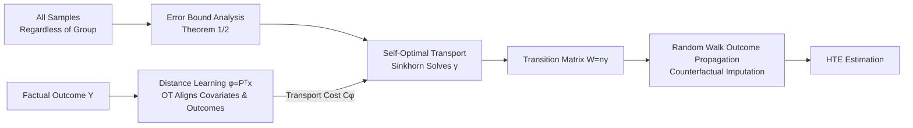

# Matching without Group Barrier for Heterogeneous Treatment Effect Estimation

**Conference**: ICLR 2026  
**OpenReview**: [https://openreview.net/forum?id=lGaZimFbss](https://openreview.net/forum?id=lGaZimFbss)  
**Code**: Not released  
**Area**: Causal Inference / Heterogeneous Treatment Effect Estimation / Optimal Transport  
**Keywords**: matching, heterogeneous treatment effect, optimal transport, counterfactual prediction, distance learning  

## TL;DR
MOGA breaks the matching barrier of "searching for neighbors only within the target treatment group" by including all samples in the candidate pool. It employs a self-optimal transport model to learn matching weights, utilizes random walks on manifolds to propagate factual outcomes for counterfactual prediction, and finds sufficiently close neighbors even under sample sparsity or distribution shifts, significantly improving the precision of heterogeneous treatment effect estimation.

## Background & Motivation
- **Background**: Estimating heterogeneous treatment effects (HTE) from observational data faces the fundamental challenge that only the factual outcome under the assigned treatment is observed; counterfactual outcomes under other treatments are never visible. Matching is widely used for its simplicity and interpretability—traditionally, nearest neighbors are sought within the "group receiving the target treatment $t$," and their factual outcomes are aggregated to predict counterfactuals. The theoretical foundation is that "samples with close covariate distances have similar potential outcomes."
- **Limitations of Prior Work**: Limited observational data combined with confounding bias leads to distribution shifts between groups. In certain regions, the target treatment group may have sparse or missing samples, making it impossible to find sufficiently close neighbors. Matched samples often exhibit large distances, whereas data usually resides on an intrinsic manifold where Euclidean distance is only locally meaningful. Large distances fail to characterize true potential outcome relationships, leading to distorted counterfactual predictions. In short—**matching is reliable only when samples are sufficiently close**.
- **Key Challenge**: To ensure un偏ness, matching is restricted to the same treatment group (ensuring comparability), yet this leads to distortion when same-group samples are not close enough. To find close neighbors, one must look across groups, but the potential outcomes for the target treatment of cross-group neighbors are unknown.
- **Goal**: While maintaining identifiability, allow matching to select neighbors from **all samples** (regardless of their actual treatment) to minimize matching distances, while solving the new challenge of unknown target treatment outcomes for cross-group neighbors.
- **Key Insight**: **Matching withOut Group bArrier (MOGA)**—Initially analyze the error bound of matching results and derive an upper bound dependent on sample distance. This bound can be interpreted via an optimal transport framework, thus modeling matching as a **self-optimal transport model**. Use the transport plan to construct a transition probability matrix for **outcome propagation via random walk** to impute unknown outcomes of cross-group neighbors. Finally, **learn a distance** supervised by factual outcomes as the transport cost to align "covariate proximity" with "outcome proximity."

## Method

### Overall Architecture
MOGA consists of three serial components: (1) Transforming the error bound of "barrier-free matching" into a self-optimal transport problem to solve for the global matching degree matrix $W$; (2) constructing transition probabilities from $W$ and performing random walk outcome propagation on the manifold to iteratively impute potential outcomes for all samples across all treatments; (3) supervised learning of a projection distance $\phi(\cdot)$ as the transport cost using factual outcomes to inject "outcome similarity" into "covariate distance." The three components are coupled through alternating optimization.

### Key Designs

**1. Error-Bound Driven Self-Optimal Transport Matching: Transforming "Finding Neighbors" into a Solvable Transport Problem.** Counterfactual outcomes are estimated via a weighted average of all samples $\hat Y_t(x_i)=\sum_{j=1}^{n}W_{ij}Y_t(x_j)$ (subject to $\sum_j W_{ij}=1, W_{ii}=0$). The authors prove (Theorem 1) that the potential outcome estimation error $\epsilon_{Y_t}$ is bounded by $\epsilon_{Y_t}\le 2L_t^2\sum_{i,j}W_{ij}\|\phi(x_i)-\phi(x_j)\|_2^2 + 2n\eta^2\sum_{i,j}W_{ij}^2$. The first term indicates that error grows with matching distance, and the second term is the Frobenius norm of weights (preventing over-concentration). Traditional matching restricts candidates to the target group, compressing the search space and increasing neighbor distance. MOGA tightens the bound by selecting from all samples. Viewing the first term as total transport cost and the second as the F-norm regularization of the transport matrix, and setting coupling $\gamma_{ij}=\frac1n W_{ij}$ with uniform mass $p_i=\frac1n$, yields a self-optimal transport problem: $\min_\gamma \langle C^\phi,\gamma\rangle+\lambda_f\Omega(\gamma), \text{ s.t. } \gamma\in\Gamma(\mu,\mu), \gamma_{ii}=0$. Theorem 2 proves the effect estimation error (mPEHE) is also controlled by this bound. For tractability, diagonal costs are rewritten with a large constant $L$ as $\tilde C^\phi=C^\phi+L I_n$ to force $\gamma_{ii}\to0$, and entropy regularization $-\lambda_h H(\gamma)$ is added for Sinkhorn optimization. Uniform mass also prevents large subgroups from suppressing smaller ones.

**2. Random Walk Outcome Propagation via Transport Plan: Imputing Unknown Outcomes of Cross-group Neighbors.** Removing group barriers introduces a new problem: matched neighbors outside the target group lack observed outcomes for treatment $t$. Since $\gamma\in\Gamma(\mu,\mu)$ is doubly stochastic ($\sum_j\gamma_{ij}=\frac1n$), setting $W=n\gamma$ yields a transition probability matrix where $W_{ij}$ is the probability of sample $i$ moving to $j$. Populate factual outcomes into $Y\in\mathbb R^{n\times(T+1)}$ ($Y_{it}=y_i$ if $t_i=t$, else 0) and use mask $M$ for factual entries. Using the affinity matrix $S=\rho W+(1-\rho)I$ ($\rho$ balances neighbor diffusion and self-memory), iterate $\hat Y_{\kappa+1}=S\hat Y_\kappa\odot(1-M)+Y\odot M$. Information propagates along the manifold to unknown items, simulating geodesic aggregation, while factual items $Y\odot M$ remain fixed.

**3. Outcome-Supervised Distance Learning: Equating "Covariate Proximity" with "Outcome Proximity."** The transport cost $c^\phi(x_i,x_j)=\|\phi(x_i)-\phi(x_j)\|_2^2$ depends entirely on $\phi(\cdot)$. Raw Euclidean distance $\phi(x)=x$ ignores outcome information. The authors define a cost based on factual outcomes $C^Y_{t,ij}=(y^t_i-y^t_j)^2$, solving a transport plan $\tilde\gamma_t$ within each treatment group based on outcome costs, then forcing covariate costs to approximate this: $\min_\phi\sum_t\langle C^\phi_t,\tilde\gamma_t\rangle$. Pairs with similar outcomes (large $\tilde\gamma_{t,ij}$) receive lower covariate costs. This is unified into $\min_{\{\gamma_t\},\phi}\sum_t\langle C^\phi_t,\gamma_t\rangle+\lambda_y\langle C^Y_t,\gamma_t\rangle-\lambda_h H(\gamma_t)$. For a fixed $\phi$, each group is a standard Sinkhorn subproblem. For fixed $\gamma_t$, $\phi$ is implemented as an orthogonal projection $\phi(x)=P^\top x$ ($P^\top P=I$), where the subproblem $\min_P\sum_t\langle C^P_t,\gamma_t\rangle$ has a closed-form solution (Proposition 3) corresponding to the eigenvectors of the $d'$ smallest eigenvalues of the matrix $\sum_t\Theta_t$ ($\Theta_t=2X_t^\top\mathrm{diag}(\gamma_t\mathbf1-\gamma_t)X_t$).

## Key Experimental Results

### Main Results Table
Semi-synthetic data (Lower is better; MOGA is the proposed method):

| Method | News-2 $\sqrt{\epsilon_{PEHE}}$ | News-4 $\sqrt{\hat\epsilon_{mPEHE}}$ | News-8 $\sqrt{\hat\epsilon_{mPEHE}}$ | TCGA $\sqrt{\hat\epsilon_{mPEHE}}$ |
|---|---|---|---|---|
| k-NN | 9.418 | 10.081 | 11.469 | 11.410 |
| PSM | 14.957 | 15.371 | 17.175 | 16.055 |
| CFR | 9.291 | 9.746 | 14.517 | 13.358 |
| GOM | 6.451 | 7.739 | 12.857 | 10.545 |
| MitNet | 7.382 | 8.003 | 9.282 | 10.715 |
| **MOGA** | **5.081** | **5.960** | **8.904** | 10.597 |

- MOGA is superior across News-2/4/8; ATE metrics are particularly prominent (e.g., News-2 $\epsilon_{ATE}$ 0.449 vs. next-best 1.507). On TCGA, $\sqrt{\hat\epsilon_{mPEHE}}$ is slightly behind GOM (10.597 vs 10.545) but remains competitive.

### Ablation Study Table
Increasing the mean difference $m$ between groups in simulated data (Increasing confounding bias intensity, $\sqrt{\hat\epsilon_{mPEHE}}$):

| Method | m=[.1,.2,.3,.4,.5] | m=[.1,.3,.5,.7,.9] | m=[.1,.4,.7,1.0,1.3] | m=[.1,.5,.9,1.3,1.7] |
|---|---|---|---|---|
| CFR | 1.398 | 1.431 | 1.460 | 1.476 |
| CP | 1.394 | 1.426 | 1.457 | 1.471 |
| MitNet | 1.329 | 1.356 | 1.378 | 1.388 |
| **MOGA** | **1.316** | **1.345** | **1.368** | **1.376** |

> Note: Module-wise ablation (removing RW vs. distance learning) is provided in Appendices J–L; the table above shows robustness under confounding.

### Key Findings
- **Cross-group expansion is effective**: MOGA significantly outperforms PSM and k-NN, proving that including all samples as candidates finds closer neighbors.
- **Outcome-supervised distance is superior**: Compared to CP (which also uses graph semi-supervision), MOGA is more accurate due to outcome-informed distance.
- **Robustness to confounding**: As $m$ increases, MOGA remains most competitive in $\sqrt{\epsilon_{PEHE}}$, $\epsilon_{ATE}$, and $\sqrt{AMSE}$.
- **Most visible Gain in ATE**: On News-2/4/8, MOGA's $\epsilon_{ATE}$/$\hat\epsilon_{mATE}$ is often 1/2 to 1/3 of the next-best method, indicating effective bias correction via outcome propagation.

## Highlights & Insights
- **Formalizing the "Group Barrier" problem**: Rather than heuristic cross-group matching, the work derives a "global matching" strategy from error bounds (Theorem 1→2).
- **Unifying three tools into Optimal Transport**: Weight learning, propagation, and distance metric learning all fall within the self-OT/Sinkhorn framework, which is elegant and efficient (including Proposition 3's closed-form solution).
- **Inverting outcome for distance learning**: Forcing covariate distance to fit outcome-based transport plans effectively compresses potential outcome relations into the representation space.
- **Uniform mass** prevents large groups from dominating small ones, preserving influence for minority samples.

## Limitations & Future Work
- **Reliance on standard identification assumptions**: SUTVA, Unconfoundedness, Overlap, and Lipschitz continuity are all required; unconfoundedness is especially difficult to verify in reality.
- **Scalability**: Self-OT constructs an $n\times n$ matrix. Computation and memory scale quadratically $O(n^2)$. Feasibility on large-scale data remains a challenge.
- **Evaluation limits**: Primarily uses semi-synthetic/simulated data due to the inherent lack of real-world ground-truth counterfactuals.
- **Heuristic guide for $\rho$ and $\kappa$**: The random walk iteration count and self-connection coefficient lack a clear selection criterion outside of empirical tuning.

## Related Work & Insights
- **Matching and HTE**: Traditional PSM, CEM, and k-NN match within groups. GOM/KOM use functional norms to unify matching and balancing. MOGA differs via "cross-group expansion + OT."
- **Representation Learning for HTE**: TARNet/CFR minimize distribution discrepancy via alignment, while MOGA follows a non-parametric "matching + manifold propagation" path, offering better interpretability.
- **Semi-supervised Propagation**: Inspired by label propagation, "unobserved counterfactuals" are treated as labels to be propagated, similar to CP but with outcome-supervised distances.

## Rating
- **Novelty**: ⭐⭐⭐⭐ Formalizing group barrier removal with theoretical error bounds within a self-OT framework is a novel combination.
- **Experimental Thoroughness**: ⭐⭐⭐ Robust results across binary/multiple treatments and varying confounding; however, real-world data is missing and scalability is limited.
- **Writing Quality**: ⭐⭐⭐⭐ Clear motivation-theory-methodology-experiment flow. Theorem progression is natural.
- **Value**: ⭐⭐⭐⭐ Provides a theoretically grounded, interpretable paradigm for matching-based HTE under sample sparsity.

<!-- RELATED:START -->

## Related Papers

- [\[ICLR 2026\] A Relative Error-Based Evaluation Framework of Heterogeneous Treatment Effect Estimators](a_relative_error-based_evaluation_framework_of_heterogeneous_treatment_effect_es.md)
- [\[ICLR 2026\] Modeling Interference for Treatment Effect Estimation in Network Dynamic Environment](modeling_interference_for_treatment_effect_estimation_in_network_dynamic_environ.md)
- [\[ICLR 2026\] Overlap-Adaptive Regularization for Conditional Average Treatment Effect Estimation](overlap-adaptive_regularization_for_conditional_average_treatment_effect_estimat.md)
- [\[ICLR 2026\] Overlap-Weighted Orthogonal Meta-Learner for Treatment Effect Estimation over Time](overlap-weighted_orthogonal_meta-learner_for_treatment_effect_estimation_over_ti.md)
- [\[ICLR 2026\] Direct Doubly Robust Estimation of Conditional Quantile Contrasts](direct_doubly_robust_estimation_of_conditional_quantile_contrasts.md)

<!-- RELATED:END -->
