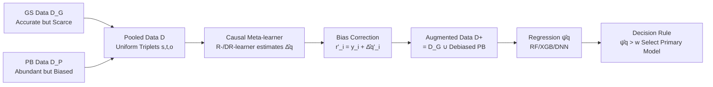

# Meta-Router: Bridging Gold-standard and Preference-based Evaluations in LLM Routing

**Conference**: ICLR 2026  
**OpenReview**: [https://openreview.net/forum?id=r0BFucF2dH](https://openreview.net/forum?id=r0BFucF2dH)  
**Code**: [https://github.com/yichistat/Meta-router](https://github.com/yichistat/Meta-router)  
**Area**: Causal Inference / LLM Routing / Semiparametric Estimation  
**Keywords**: LLM Routing, Causal Inference, CATE, Meta-Learner, Bias Correction, Data Integration  

## TL;DR
This paper reinterprets the differences between "gold-standard vs. preference-based" data sources as treatment assignment in causal inference. Consequently, the bias in preference data is proven to be exactly the Conditional Average Treatment Effect (CATE). By estimating and correcting this bias using R-/DR-learner meta-learners, a highly accurate and sample-efficient LLM router is trained.

## Background & Motivation
**Background**: The goal of LLM routing is to select between a "costly but powerful primary model $M_p$" and a "cheap but weaker alternative model $M_a$" for each query, reducing inference costs while maintaining quality. The core of a predictive router (e.g., RouteLLM / Ong et al. 2024) is learning a mapping from query embeddings to "quality gain," the quality of which depends entirely on the reliability of the quality gain labels in the training data.

**Limitations of Prior Work**: Labels for training routers come from two sources, both with significant drawbacks. **Gold-standard (GS) data**—expert ratings or rubric-based scoring—is accurate and trustworthy but extremely expensive and difficult to scale in specialized domains (e.g., medical, legal, scientific research, programming), where experts must review multi-criteria details for each item (e.g., the full HealthBench set only contains 5,000 items). **Preference-based (PB) data**—crowdsourced voting or LLM-as-a-judge—is cheap and scalable but suffers from **systematic bias** relative to expert judgment, failing to reliably reflect true quality.

**Key Challenge**: Directly pooling GS and PB data for regression (the current practice) introduces non-negligible estimation bias because an unknown, **query-dependent** offset function $\Delta(q)=\psi(q)-\eta(q)$ exists between the quality gain $\eta(q)$ learned from PB mechanisms and the ground truth $\psi(q)$ from GS. Simple global mean-shifting (linear debiasing) is insufficient because the bias is heterogeneous.

**Goal**: Design a principled statistical framework to efficiently fuse "scarce but accurate" GS data with "abundant but biased" PB data to train a debiased router.

**Core Idea**: **[Causal Reinterpretation]** View "which mechanism is used to evaluate a query" as a binary treatment $t\in\{0,1\}$ (GS=1 / PB=0), the query embedding as a covariate, and the evaluation result as a potential outcome. Thus, the bias $\Delta(q)$ in PB data is mathematically **exactly the CATE**—one of the most well-studied estimators in causal inference. Mature meta-learners from semiparametric causal literature can be directly applied to estimate it robustly and efficiently.

## Method

### Overall Architecture
The approach is a "two-step Meta-router": first, a causal meta-learner estimates the per-query offset $\hat\Delta(\cdot)$ between GS and PB; then, it "pseudo-gold-standardizes" the PB data to merge it with GS data; finally, the gold-standard quality gain $\hat\psi(\cdot)$ is regressed on this augmented dataset, and routing is performed according to a "quality gain vs. cost" decision rule.

### Key Designs
**1. Reinterpreting the evaluation mechanism as treatment assignment to prove bias is CATE.** This is the anchor of the paper. The authors pool GS and PB data into uniform triplets $(s_i,t_i,o_i)$, where $s_i$ is the query, $t_i\in\{0,1\}$ marks the data source, and $o_i$ is the observed quality gain. For the same query, two potential outcomes are defined: $o^{(1)}=\psi(s)+\epsilon$ (if evaluated by gold standard) and $o^{(0)}=\eta(s)+\epsilon'$ (if evaluated by preference). Thus, the offset function naturally fits the definition of CATE:

$$\Delta(s)=\psi(s)-\eta(s)=\mathbb{E}\!\left(o^{(1)}-o^{(0)}\mid s\right).$$

The authors further use Lemma 1 to prove that the generating process of pooled data is equivalent to a standard causal data generation process: queries follow a mixture distribution $\kappa Q+(1-\kappa)Q'$, treatment assignment follows a propensity score $p(s)=\Pr(t=1\mid s)$, and outcomes are generated by a potential outcome model. The value of this step is that consistency and unconfoundedness are naturally satisfied in the data collection setting of this paper—as long as no variables besides the query simultaneously affect "which mechanism evaluates" and the "evaluation result." This links an engineering problem of "data fusion and debiasing" to the theoretically guaranteed toolchain of semiparametric causal estimation.

**2. Robust Estimation of $\hat\Delta$ using R-/DR-learner meta-learners.** Since $\Delta$ is CATE, any off-the-shelf ML regressor (Random Forest, XGBoost, Deep Networks) can be used as a base learner within R-learner (Nie & Wager 2021) or DR-learner (Kennedy 2023) meta-learners, which possess **orthogonalization/double-robustness** properties. Their key benefit is the **oracle property**: the CATE estimation can be asymptotically equivalent to an ideal estimator that observes all individual treatment effects $\{o^{(1)}_i-o^{(0)}_i\}$—even though in reality only one of $o^{(1)}$ or $o^{(0)}$ is observed for each query—provided nuisance functions (propensity scores, conditional means) satisfy mild conditions. DR-learner's double robustness makes it less sensitive to nuisance model misspecification, explaining its advantage in small-sample scenarios.

**3. Two-step Meta-router with Bias Correction + Augmented Regression.** After obtaining $\hat\Delta(\cdot)$, each PB sample is "lifted" to a pseudo-gold standard: $r'_i=y_i+\hat\Delta(q'_i)$, making it conditionally unbiased towards $\psi$. These are merged into an augmented set $D^+=D_G\cup\{(q'_i,r'_i)\}$, and a (regularized) least squares problem is solved to estimate the gold-standard quality gain:

$$\hat\psi(\cdot\mid\hat\Delta)=\arg\min_{h\in\mathcal H}\frac{1}{n+m}\Big[\sum_{i=1}^n (r_i-h(q_i))^2+\sum_{i=1}^m (y_i+\hat\Delta(q'_i)-h(q'_i))^2\Big]+\Lambda(h).$$

This step performs joint training on "scarce GS" and "corrected abundant PB" on the same scale, mitigating the sample imbalance between the two sources while retaining the breadth of PB coverage. The decision rule follows classic utility comparison: $D(q\mid w)=\psi(q)-w\,(C_{M_p}-C_{M_a})$. Under binary costs, the Bayes optimal classifier is "select primary model when $\psi(q)>w$."

**4. Practical Detail: Emphasis on Scale Normalization.** The authors repeatedly emphasize in Remark 1 and ablation studies that gold-standard $\{r_i\}$ must be multiplied by a constant $c$ to normalize it to the same scale as PB $\{y_i\}$ (via amplitude, empirical variance, or minimizing 2-Wasserstein distance). Otherwise, CATE estimation will be contaminated by scale mismatch, and the Meta-router will show almost no gain over "GS-only" models. This is a critical engineering point easily overlooked when applying causal tools to LLM evaluation data.

## Key Experimental Results
Experiments use two professional domain rubric benchmarks: **HealthBench** (5,000 medical dialogues, standards built by 262 physicians across 26 specialties) and **PRBench** (high-stakes reasoning in law/finance, 676 single-turn tasks). Primary model $M_p$ = Gemini 2.5 Pro, alternative $M_a$ = Gemma 3 12B. GPT-5-mini is used to generate GS labels "with rubrics" and PB labels "based only on two responses." The metric is **Efficiency Gain (EG)**: the total efficiency improvement relative to random routing at various Primary Model Usage Rates (PMUR); 7 routers are compared over 200 Monte Carlo rounds.

### Main Results (HealthBench, Random Forest, d=50, n∈{100,500,1000})

| Router | Small Sample n=100 | Large Sample n=1000 | Note |
|---|---|---|---|
| Oracle benchmark (Full GS) | Highest (Upper Bound) | Highest | Theoretical upper bound |
| **Meta-router (DR-learner)** | **Close to Oracle** | **Close to Oracle** | Ours |
| **Meta-router (R-learner)** | **Close to Oracle** | **Close to Oracle** | Ours |
| Predictive router (GS+PB pooling, Ong 2024) | Weak Gain | Weak Gain | SOTA Baseline |
| Predictive router (PB only) | Weak/No Gain | No Gain | Uncorrected Bias |
| Predictive router (GS only) | Weak | Moderate | Sample limited |
| Random router | 0 (Baseline) | 0 | Reference |

Key phenomenon: Predictive routers using direct pooling or only PB data show almost no improvement even as the GS sample size increases, highlighting the harm of bias $\Delta(q)$; Meta-router shows the **greatest advantage in imbalanced scenarios where GS is extremely scarce**.

### Ablation Study

| Ablation Item | Change in Setting | Conclusion |
|---|---|---|
| (i) Regressor | RF → XGBoost | R-learner router remains #1, but overall EG is lower than RF, indicating the need to carefully select the base model. |
| (ii) Simple Debiasing | Pooling after subtracting PB-GS global mean diff | Performance nearly as poor as direct pooling; proves bias is **heterogeneous**, necessitating CATE rather than linear shift. |
| (iii) No Normalization | Removing Remark 1(2) variance alignment | Meta-router no longer significantly leads over "GS only"; normalization is a necessary prerequisite. |
| (iv) PCA Dimensions | d=50 → d=100 | Meta-router still leads, method is robust. |
| (v) Change Judge | PB switched to Grok 4 Fast | Still leads with small GS samples, showing adaptability to different preference mechanisms. |

### Key Findings
- On PRBench (n∈{50,100,150}), **DR-learner consistently leads**, while R-learner offers no significant advantage at extremely small sample sizes—confirming the higher sample efficiency brought by DR-learner's double robustness.
- The sample mean of the PB-GS difference is significantly lower than 0 (two-sided t-test p<2.2×10⁻¹⁶), quantitatively confirming that preference evaluations systematically deviate from gold standards, necessitating debiasing.

## Highlights & Insights
- **Elegance of Perspective Shift**: By viewing "evaluation mechanism as treatment assignment," an engineering problem of data fusion is seamlessly connected to the complete theoretical framework of semiparametric causal inference. The correspondence of bias = CATE is so natural it feels almost obvious, yet it was not explicitly identified in previous routing literature.
- **Interpretable Failure Diagnosis**: Ablation (ii) uses the failure of "simple linear debiasing" to prove the heterogeneity of bias, making a compelling case for why CATE meta-learners are necessary rather than just claiming complex methods are better.
- **Framework over Single Point**: Meta-router is not tied to any specific CATE estimator; R-/DR-learners are just examples. It is theoretically extensible to multi-model routing (Appendix).
- **Small-sample Friendly**: Addressing the real pain point of GS label scarcity in professional domains, the method yields the largest gains in the most imbalanced regimes, aligning perfectly with practical application scenarios.

## Limitations & Future Work
- **GS labels are still LLM-generated**: The experiments use GPT-5-mini with rubrics as the gold standard. The authors acknowledge that expert annotation is ideal, citing HealthBench reports (where GPT-4.1+rubric achieves a macro F1 of 0.709 against physician annotations) to justify the approximation.
- **Positivity assumption is a hard constraint**: It requires the query distributions of GS and PB to share a support set. If GS focuses on easy questions while PB focuses on subjective ones, propensity scores will approach 0/1, violating the assumption. The authors leave "truncated Meta-router" (using density ratio estimation for overlap areas) as future work (§5).
- **Two-model routing only**: The core setup is $M_p$ vs. $M_a$; multi-model extensions are only briefly discussed in the appendix.
- **Simplified cost functions**: Costs are treated as binary (Primary 1, Alternative 0). Although a general form for token-based pricing is provided, its performance under complex costs was not experimentally verified.
- The scale of evaluation (two benchmarks, two model pairs) is relatively small. OOD routing, semi-supervised/active learning, etc., remain as future work.

## Related Work & Insights
- **LLM Routing**: Cascading routers (Chen 2024) have latency due to trial-and-error; predictive routers (Ong 2024 RouteLLM, Stripelis, Tsiourvas) make one-shot predictions; confidence/reward-based routers (Frick, Wu & Lu). This paper identifies the bias in RouteLLM's "pooling/PB-only" training as a weakness.
- **Causal CATE Meta-learning**: The meta-learner family from Künzel 2019, Nie & Wager's (2021) R-learner, Kennedy's (2023) DR-learner, and Chernozhukov's (2018) Double/Orthogonal ML—this paper imports this entire semiparametric arsenal into LLM evaluation debiasing.
- **Evaluation Reliability**: The systematic bias of LLM-as-a-judge (Zheng 2023, Tam 2024) is the exact target for correction in this paper.
- **Insight**: Any training scenario with "few trusted labels + many cheap biased labels" (e.g., reward modeling, data annotation, semi-supervised learning) can adopt this causal reinterpretation of "cheap mechanism vs. gold-standard mechanism = treatment" for principled debiasing, rather than simple reweighting or mean shifting.

## Rating
- **Novelty**: ⭐⭐⭐⭐⭐ — The "evaluation mechanism as treatment assignment, PB bias as CATE" perspective is a clean and theoretically significant shift, precisely mapping mature causal tools to the new scenario of LLM routing.
- **Experimental Thoroughness**: ⭐⭐⭐ — Two real professional benchmarks, five ablations, and multiple sample sizes provide a solid foundation, but using only one pair of models, LLM-generated GS labels, and the lack of real-world cost/multi-model validation limits the scale and external validity.
- **Writing Quality**: ⭐⭐⭐⭐ — The derivation of causal reinterpretation is logically progressive, the Lemma clarifies assumptions, and ablations use counter-examples to support motivation; the heavy math might be slightly dense for purely application-oriented readers.
- **Value**: ⭐⭐⭐⭐ — Directly addresses the pain point of "scarce gold-standard and abundant but biased preference data" in professional domains. The method is plug-and-play, scalable, and offers lessons for broader biased-label fusion tasks beyond routing.

<!-- RELATED:START -->

## Related Papers

- [\[ICLR 2026\] NextQuill: Causal Preference Modeling for Enhancing LLM Personalization](nextquill_causal_preference_modeling_for_enhancing_llm_personalization.md)
- [\[ICLR 2026\] Overlap-Weighted Orthogonal Meta-Learner for Treatment Effect Estimation over Time](overlap-weighted_orthogonal_meta-learner_for_treatment_effect_estimation_over_ti.md)
- [\[ICLR 2026\] Flattery, Fluff, and Fog: Diagnosing and Mitigating Idiosyncratic Biases in Preference Models](flattery_fluff_and_fog_diagnosing_and_mitigating_idiosyncratic_biases_in_prefere.md)
- [\[ECCV 2024\] Distill Gold from Massive Ores: Bi-level Data Pruning towards Efficient Dataset Distillation](../../ECCV2024/causal_inference/distill_gold_from_massive_ores_bi-level_data_pruning_towards_efficient_dataset_d.md)
- [\[ICLR 2026\] Direct Doubly Robust Estimation of Conditional Quantile Contrasts](direct_doubly_robust_estimation_of_conditional_quantile_contrasts.md)

<!-- RELATED:END -->
