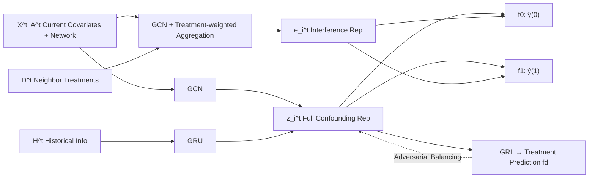

# Modeling Interference for Treatment Effect Estimation in Network Dynamic Environment

**Conference**: ICLR 2026  
**OpenReview**: [https://openreview.net/forum?id=EnVaI6s64d](https://openreview.net/forum?id=EnVaI6s64d)  
**Code**: To be confirmed  
**Area**: Causal Inference / Network Treatment Effect Estimation  
**Keywords**: Treatment Effect Estimation, Interference (Spillover), Dynamic Networks, Hidden Confounding, Causal Identifiability  

## TL;DR
Addressing the dual challenges of "dynamic networks + neighbor interference," this paper defines a new identifiable estimator, CATE-ID, and proposes the DSPNET framework. It utilizes GCN+RNN to capture time-varying hidden confounders, models spillover effects with data-driven interference representations, and balances confounding representations via a Gradient Reversal Layer (GRL) to achieve unbiased estimation of individual treatment effects from observational dynamic network data.

## Background & Motivation

**Background**: Estimating treatment effects in network environments (e.g., social networks, epidemic communities) has gained significant attention. Due to network interconnectedness violating the classical SUTVA assumption (independence and no interference), several network-based methods have been proposed. These typically leverage network structures to infer hidden confounders that are difficult to observe directly (e.g., inferring socioeconomic status from social connection attributes).

**Limitations of Prior Work**: Existing methods suffer from two overlooked gaps. First, the majority assume **static networks**—where network structure and node covariates do not change over time. However, real-world networks (e.g., community structure shifts due to migration, individual health status changes) are essentially dynamic, and confounders evolve over time. Second, these methods **neglect interference in dynamic settings**: an individual's treatment (e.g., compliance with travel restrictions) affects neighbors' outcomes (e.g., infection risk) through the network, known as the spillover effect.

**Key Challenge**: Dynamic evolution and network interference are intertwined, presenting a three-fold difficulty: (1) whether the treatment effect is **identifiable** under time-varying interference is a non-trivial problem; (2) the co-evolution of networks and covariates leads to **time-varying** confounding distributions, requiring the modeling and control of time-varying confounding bias; (3) the evolution of patterns and attributes changes the **mode and intensity** of interference between nodes, necessitating dynamic modeling of spillover effects as the structure changes.

**Goal**: To define a semantically clear and identifiable treatment effect estimator in dynamic network environments with interference, and to provide a practical framework for unbiased estimation from observational data.

**Core Idea**: **[New Estimator]** CATE-ID (Conditional Average Treatment Effect with Interference under Dynamic networks) is proposed. By introducing "environment exposure," neighbor influences are explicitly conditioned upon to measure the **intrinsic causal effect** of the intervention on the individual (excluding indirect effects propagated via the network); its **identifiability is formally proven** under a set of assumptions. **[Supporting Framework]** DSPNET is proposed, using neural networks to approximate the two distributions in the identifiability formula for end-to-end estimation.

## Method

### Overall Architecture
DSPNET (Dynamic SPillover modeling NETwork) consists of four sequential modules at each time step: first, a GCN aggregates neighbor covariates and a GRU encodes historical states, which are concatenated to form the "full confounding" representation $z_i^t$; simultaneously, another GCN with treatment-weighted neighbor aggregation computes the interference representation $e_i^t$ as a proxy for environment exposure; both are fed into two MLPs corresponding to $d=0/1$ to predict potential outcomes; finally, a Gradient Reversal Layer (GRL) is used to adversarially balance the distribution of confounding representations between treatment and control groups to suppress confounding bias.

### Key Designs

**1. CATE-ID: An identifiable estimator conditioning on "environment exposure" to define the pure effect of intervention.** Traditional CATE fails in networks because neighbor treatments contaminate outcomes. Prior works often pooled neighbor treatments into a scalar covariate, failing to capture high-dimensional heterogeneous impacts. This paper defines environment exposure $E_i^t = F_i^t(X_{G_i}^t, D_{G_i}^t)$ as a general function aggregating neighbor covariates and treatments. Assumption 2.2 ensures that once $E_i^t$ is fixed, the potential outcome under treatment $D_i^t$ is determined. The estimator is then defined as the expected difference in outcomes under two treatments given a fixed environment exposure:
$$\tau_i^t = E[Y_i^t(1, E_i^t=e_i^t)\mid x_i^t, H^t, X_{G_i}^t] - E[Y_i^t(0, E_i^t=e_i^t)\mid x_i^t, H^t, X_{G_i}^t]$$
where $H^t=\{X^{<t}, D^{<t}, A^{<t}\}$ represents historical information. This measures the causal effect of the "intervention itself" (e.g., the impact of travel restrictions on infection risk), excluding indirect effects from neighbor non-compliance.

**2. Identifiability Proof under Hidden Confounding.** To allow for hidden confounding, standard ignorability is extended to "extended ignorability" (Assumption 3.1): there exists an encoding function $z_i^t = \Phi_z(x_i^t, X_{G_i}^t, H^t)$ that compresses individual covariates, history, and neighbor covariates into a full confounding variable $Z_i^t$, such that $Y_i^t(1,E),Y_i^t(0,E) \perp D_i^t, E_i^t \mid Z_i^t$; this is coupled with an extended consistency assumption (Assumption 3.2). Theorem 3.3 proves that if the distributions $p(Y_i^t\mid Z_i^t, E_i^t, D_i^t)$ and $p(Z_i^t\mid X_i^t, H^t, X_{G_i}^t)$ can be recovered, CATE-ID is identifiable. The proof converts the unobservable potential outcome difference into a form computable from observational conditional expectations by taking the expectation over $Z$, applying extended ignorability, utilizing conditional independence in the causal graph, and applying consistency—targets fitted by DSPNET’s neural pathways.

**3. Full Confounding Representation: GCN for Space, RNN for Time.** Corresponding to $p(Z_i^t\mid\cdot)$ in the identifiability formula, a multi-layer GCN aggregates current covariates and network structure for spatial information, concatenated with the encoded historical state $\tilde H_i^t$ via an MLP to obtain $z_i^t = f_z^t([g_z^t(X^t,A^t)_i, \tilde H_i^t])$. The historical state is recursively updated using a GRU/LSTM: $\tilde H_i^t = \text{RNN}([z_i^{t-1}, d_i^{t-1}], \tilde H_i^{t-1})$, incorporating the previous confounding representation and treatment to capture time-varying evolution—ablation shows this is the most critical module.

**4. Interference Modeling: Treatment-Weighted Neighbor Embedding Aggregation.** Interference depends not only on whether neighbors are treated but also on how treatment interacts with behavioral patterns. Simple mean pooling cannot capture this heterogeneity. This paper uses a GCN to project covariates into a latent space $r_i^t = g_r(X^t, A^t)_i$, then aggregates them weighted by neighbor treatments:
$$e_i^t = \sum_{j\in G_i^t} d_j^t \cdot r_j^t$$
The resulting $e_i^t$ is a data-driven embedding of the "influence exerted by treated neighbors," serving as a proxy for environment exposure $E_i^t$ for the outcome prediction head.

**5. Gradient Reversal Layer for Balancing Confounding Representations.** Discrepancies in confounding distributions between treatment and control groups cause confounding bias. Theory suggests that minimizing this discrepancy reduces the estimation error upper bound. This paper employs an adversarial strategy: an MLP treatment prediction head $f_d(z_i^t)$ fits the treatment assignment with cross-entropy loss $L_d$. The total loss is $L = L_y + \alpha L_d + \omega\|\Theta\|^2$. During backpropagation, its gradient for parameters $\Theta_z$ is multiplied by a negative constant $-\beta$:
$$\Theta_z = \Theta_z - \eta\Big(\frac{\partial L_y}{\partial \Theta_z} - \beta\frac{\partial \alpha L_d}{\partial \Theta_z} + \omega\frac{\partial \|\Theta\|^2}{\partial \Theta_z}\Big)$$
The GRL prevents the confounding representation from carrying treatment-predictive information, thereby aligning distributions while retaining outcome-relevant information. Spatio-temporal complexity is linear with respect to edges $M$ and nodes $N$.

## Key Experimental Results

Datasets: Flickr and BlogCatalog social networks. Dynamic networks were constructed by randomly adding/deleting $p\%$ of edges per step and adding Gaussian noise to a proportional amount of covariates (25 time steps), with confounding, treatments, and potential outcomes simulated via autoregressive processes. Metrics: $\sqrt{\epsilon_{PEHE}}$ (individual level), $\epsilon_{ATE}$ (population level) — **lower is better**.

### Main Results Table (Selected at $p\%=0.1\%$)

| Method | Flickr $\sqrt{\epsilon_{PEHE}}$ | Flickr $\epsilon_{ATE}$ | BlogCatalog $\sqrt{\epsilon_{PEHE}}$ | BlogCatalog $\epsilon_{ATE}$ |
|------|------|------|------|------|
| CFR | 24.218 | 2.754 | 11.547 | 1.295 |
| NetEST | 6.822 | 1.405 | 8.539 | 1.586 |
| Deconfounder | 8.338 | 4.738 | 13.067 | 8.884 |
| SPNET | 8.693 | 1.204 | 9.569 | 2.298 |
| DNDC | 2.589 | 1.618 | 2.475 | 1.454 |
| **DSPNET (Ours)** | **1.497**† | **0.890**† | **1.464**† | **0.845**† |

† indicates statistically significant improvement over the strongest baseline (t-test p<0.05). DSPNET maintains optimality and stability at $p\%=0.5\%, 1.0\%$, demonstrating robustness to network dynamics.

### Ablation Study

| Variant | Flickr $\sqrt{\epsilon_{PEHE}}$ | Flickr $\epsilon_{ATE}$ | BC $\sqrt{\epsilon_{PEHE}}$ | BC $\epsilon_{ATE}$ |
|------|------|------|------|------|
| Full DSPNET | 1.497 | 0.890 | 1.464 | 0.845 |
| w/o GRL | 2.179 | 0.986 | 1.886 | 1.089 |
| w/o Interference Modeling | 1.938 | 1.245 | 1.822 | 1.118 |
| w/o GRU (Temporal) | 10.235 | 6.854 | 10.652 | 3.547 |

### Key Findings
- **All three modules are essential**: Performance collapses most severely without the GRU (error increases ~7x), proving that capturing historical information is critical in dynamic settings; removing interference modeling or GRL also leads to significant degradation.
- **Robustness to interference intensity**: Performance remains superior across interference intensities $C\in\{10,...,50\}$. The gap with DNDC (which lacks explicit interference modeling) widens as $C$ increases, highlighting the importance of modeling spillover effects.
- **Superior treatment prioritization**: Using RATE metrics ($R_{AUTOC}$, $R_{QINI}$ — higher is better), DSPNET achieves 2.98/1.13 on Flickr and 3.91/1.52 on BlogCatalog, outperforming all network baselines and better identifying individuals who benefit most from treatment.
- **Linear complexity**: Time and space complexity scale linearly with nodes $N$ and edges $M$. On Flickr, a single step takes 0.24s with 2.8GB VRAM.

## Highlights & Insights
- **Defining the problem before modeling**: The greatest value lies in clarifying what to estimate under "dynamic networks + interference." CATE-ID decouples indirect effects using environment exposure, providing a semantically clear and identifiable target with formal proof.
- **Interference as weighted aggregation**: Representing interference through treatment-weighted embeddings rather than mean pooling is a simple yet effective modification that allows for the expression of heterogeneous spillover patterns.
- **Theory-Architecture alignment**: The distributions required by Theorem 3.3 correspond directly to DSPNET’s confounding and outcome prediction branches, ensuring a tight link between theory and implementation.

## Limitations & Future Work
- **Reliance on semi-synthetic data**: Dynamic networks and potential outcomes are simulated on real social graph structures (Flickr/BlogCatalog). True dynamic networks with ground-truth counterfactuals are currently unavailable—a common challenge in this field.
- **Strong Assumptions**: "Extended ignorability" assumes all confounding can be encoded into latent variables; this may fail if external confounding sources exist.
- **Interference Symmetry**: Current modeling treats neighbors uniformly in aggregation, without explicitly modeling directed networks or asymmetric influence intensities.
- **Outcome Autocorrelation**: Past outcomes $Y^{<t}$ are assumed to be implicitly captured by historical covariates/treatments; explicit introduction might be needed for scenarios with strong outcome self-correlation.

## Related Work & Insights
- **Static Network Treatment Effects**: Methods like NetEST, Deconfounder, and SPNET infer hidden confounders but assume static structures. This paper demonstrates their significant degradation under dynamic conditions.
- **Dynamic Network Causality**: DNDC learns time-varying confounding representations but neglects interference. DSPNET fills this critical gap.
- **Representation Balancing**: Whereas CFR uses Wasserstein regularization, this paper adopts a more lightweight GRL to achieve the same adversarial balancing goal.
- **Insight**: The paradigm of "defining an identifiable estimator first, then designing neural components to approximate it" is a valuable template for causal estimation on graphs.

## Rating
- Novelty: ⭐⭐⭐⭐ Systematic handling of "dynamic networks + interference"; clearly defined CATE-ID with identifiability proofs.
- Experimental Thoroughness: ⭐⭐⭐ Comprehensive validation (ablation, intensity, RATE, complexity), but limited to semi-synthetic data.
- Writing Quality: ⭐⭐⭐⭐ Logical flow from motivation to theory to methodology; rigorous assumptions and clear illustrations.
- Value: ⭐⭐⭐⭐ Provides an identifiable target and practical framework for causal estimation in dynamic networks, relevant for social networks and epidemiology.

<!-- RELATED:START -->

## Related Papers

- [\[ICLR 2026\] Matching without Group Barrier for Heterogeneous Treatment Effect Estimation](matching_without_group_barrier_for_heterogeneous_treatment_effect_estimation.md)
- [\[ICLR 2026\] Overlap-Adaptive Regularization for Conditional Average Treatment Effect Estimation](overlap-adaptive_regularization_for_conditional_average_treatment_effect_estimat.md)
- [\[ICLR 2026\] Overlap-Weighted Orthogonal Meta-Learner for Treatment Effect Estimation over Time](overlap-weighted_orthogonal_meta-learner_for_treatment_effect_estimation_over_ti.md)
- [\[ICLR 2026\] Journey to the Centre of Cluster: Harnessing Interior Nodes for A/B Testing under Network Interference](journey_to_the_centre_of_cluster_harnessing_interior_nodes_for_ab_testing_under_.md)
- [\[ICLR 2026\] A Relative Error-Based Evaluation Framework of Heterogeneous Treatment Effect Estimators](a_relative_error-based_evaluation_framework_of_heterogeneous_treatment_effect_es.md)

<!-- RELATED:END -->
