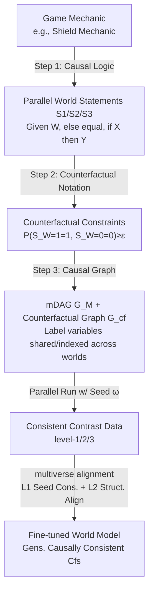

# Multiverse Mechanica: A Testbed for Learning Game Mechanics via Counterfactual Worlds

**Conference**: ICLR 2026  
**OpenReview**: [https://openreview.net/forum?id=5Q8r8ZubAH](https://openreview.net/forum?id=5Q8r8ZubAH)  
**Code**: [https://github.com/ricardocannizzaro/multiverse-mechanica](https://github.com/ricardocannizzaro/multiverse-mechanica)  
**Area**: Causal Inference / Generative World Models / Counterfactual Reasoning  
**Keywords**: Game Mechanics Learning, Counterfactual Reasoning, Causal Consistency, World Models, Parallel World Comparison, Pearl's Causal Ladder

## TL;DR
The study reformulates the ambiguous question of whether a "game world model has truly learned game rules (mechanics)"—previously judged only via *a posteriori* visual inspection—into a formal **causal counterfactual inference task**. It introduces Multiverse Mechanica, a playable game testbed capable of natively outputting "parallel world contrastive data + causal graphs for each mechanic," making "learning mechanics" (as opposed to "learning pixels") definable, supervised, and reproducible for evaluation for the first time.

## Background & Motivation
- **Background**: Interactive world models such as Genie, Oasis, GameGAN, and World Models generate visually realistic game frames. Researchers often claim these models have "learned" game mechanics like physics, collisions, and logic.
- **Limitations of Prior Work**: Such claims are almost entirely based on **a posteriori visual observation**—observing that a generated video "looks correct" regarding a mechanic. This fails to address a critical **a priori question**: before training, can it be determined if a mechanic is even learnable from the data? Without formal definitions, one can neither determine if a mechanic is "identifiable" nor decouple "mechanic representations" from "visual representations."
- **Key Challenge**: There is a gap between "generating high-quality frames" and "generating gameplay that adheres to game rules." Violations (e.g., failing to block when equipped with a shield) destroy the gameplay experience regardless of visual fidelity. Current evaluation systems focus on pixel similarity and lack operational measures or supervisory signals for "rule consistency."
- **Goal**: Provide a **mathematically precise and statistically verifiable** definition of "learning a game mechanic" and offer a testbed that provides the data and causal structures needed for verification.
- **Key Insight**: **[Mechanics = Counterfactual Constraints]** A game mechanic is essentially a set of constraints imposed on counterfactual distributions (e.g., "if switched to having a shield, blocking occurs, thus preventing damage"). Thus, "learning mechanics" means ensuring the generative model satisfies these counterfactual constraints. **[Causal Consistency as a Handle]** Use Pearl's causal consistency (downstream variables remain invariant across worlds if not affected by the intervention) to transform the intuitive "all-else-equal" concept into operational training constraints.

## Method

### Overall Architecture
The paper decomposes "mechanics learning" into a three-layer closed loop: First, a mechanic (e.g., "shield mechanic") is formalized into a set of counterfactual constraints $\mathcal{M}=\{S_1,\dots,S_k\}$ using **causal logic, counterfactual notation, and causal graphs**. Second, the Multiverse Mechanica engine runs multiple parallel instances using a **shared random seed $\omega$** to natively generate "consistent contrasts" (level-3 data) satisfying these constraints. Finally, a contrastive fine-tuning objective called **multiverse alignment** uses visual information that "should remain consistent across worlds" as supervision to fine-tune a pre-trained world model.

### Key Designs

**1. Three-step formalization of mechanics as counterfactual constraints (causal logic → counterfactual → graph)**: The authors advocate using **Layer 3 (counterfactual)** statements from Pearl’s causal ladder rather than the more common Layer 2 (intervention) statements. This is because Layer 3 statements inherently include the "all-else-equal" constraint—the essence of "mechanic consistency." For the shield mechanic, statements $S_1$ (under same conditions, light weapons allow shields, heavy weapons do not), $S_2$ (shield required to block), and $S_3$ (successful block avoids damage) are rewritten in counterfactual notation, e.g., $S_1: P(S_{W=1}=1,\,S_{W=0}=0)\ge\epsilon_1$, where $W$ is weapon type, $S$ is shield, $B$ is block, and $D$ is damage. The full causal DAG $G$ is marginalized to an mDAG $G_M$ containing only mechanic-related variables $Z=\{C,W,S,B,D,V\}$, which is combined with counterfactual expressions into a **counterfactual graph**. In this graph, variables consistent across worlds are single nodes, while variables affected by intervention are indexed by the world, explicitly mapping what must remain invariant during generation. A mechanic is thus defined as a tuple $\langle G_M, \mathcal{M}\rangle$.

**2. Generating "consistent contrasts" via shared-seed parallel worlds**: This is the core data mechanism of the testbed, leveraging a rare advantage of games over the real world: multiple instances can start from **identical initial conditions and random seeds $\omega$**, applying different interventions (e.g., shield vs. no shield) in each instance. This produces paired video clips that are pixel-consistent except for the target mechanic, termed "consistent contrasts." Causal graph analysis shows $W_{S=1}=W_{S=0}=W$ and $S_{B=1}=S_{B=0}=S$ hold automatically. Through repeated sampling of these contrasts, the empirical distribution $\hat P_i^{(N)}$ almost surely converges to the target distribution $P_i$ ($\hat P_i^{(N)}\xrightarrow{a.s.}P_i$), providing an operational definition: the model has learned the mechanic if it satisfies constraints $\{S_1,S_2,S_3\}$ or models $\{P_1,P_2,P_3\}$. The testbed supports level-1 (random), level-2 (intervention), and level-3 (shared $\omega$ intervention) data generation. Each clip is 512x512, ~4 seconds, 50 FPS, and includes controller inputs, state variables, and seeds.

**3. Multiverse alignment: Translating counterfactual graph consistency into diffusion fine-tuning objectives**: As a proof-of-concept, an impact-frame image $V_{X=x}$ is treated as a simulation snapshot. The initial noise latent $Z_T$ of a diffusion model is analogized to the exogenous seed $\omega$. To replicate the shared $\omega$ in consistent contrasts, $Z_T$ is constrained to be consistent across pairs. The total loss $L=\lambda_1 L_1+\lambda_2 L_2$ ($\lambda_1+\lambda_2=1$) includes: **$L_1$ seed consistency loss**, where deterministic diffusion inversion (Abduct) maps clean latents back to an estimated seed $\hat\omega_j$, penalizing paired seed differences $L_1=\lVert\text{Abduct}_\theta(Z_{0,X=x_0},c_0)-\text{Abduct}_\theta(Z_{0,X=x_1},c_1)\rVert_2^2$; and **$L_2$ structural alignment loss**, which aligns denoiser predictions over high-noise timesteps $S\subset\{1,\dots,T\}$ via $L_2=\sum_{t\in S}\lVert\epsilon_\theta(Z_{t,X=x_0},t,c_0)-\epsilon_\theta(Z_{t,X=x_1},t,c_1)\rVert_2^2$. The intuition is that high-noise alignment captures "global identity/non-mechanic content," while mechanic-specific differences emerge in later low-noise steps.

## Key Experimental Results

This is a **proof-of-concept** evaluation: a pre-trained conditional diffusion model (OpenJourney-v4) is fine-tuned on impact-frame pairs from Multiverse Mechanica.

### Ablation Study (Loss Components vs. Engine Ground Truth Counterfactuals)

| Configuration | Recon. PSNR↑ | Recon. SSIM↑ | Cf. PSNR↑ | Cf. SSIM↑ | Exo MSE↓ |
| :--- | :--- | :--- | :--- | :--- | :--- |
| Diffusion only (baseline) | 19.54 | 0.776 | 13.58 | 0.358 | 0.793 |
| w/o $L_1$ (only $L_2$) | 19.42 | 0.769 | 13.55 | 0.355 | 0.795 |
| w/o $L_2$ (only $L_1$) | 13.35 | 0.275 | 11.01 | 0.129 | **0.087** |
| Full ($L_1+L_2$) | 14.02 | 0.429 | 11.04 | 0.196 | 0.092 |

*Note: Exo MSE measures the distance between paired seeds $\lVert\hat\omega_0-\hat\omega_1\rVert^2$; lower values indicate better cross-world consistency.*

### Key Findings
- **$L_1$ is critical for causal consistency**: Without $L_1$, Exo MSE remains high (≈0.79), and $L_2$ alone shows no improvement over the baseline. Adding $L_1$ drops Exo MSE by nearly an order of magnitude (≈0.09).
- **$L_2$ complements $L_1$**: Adding $L_2$ to $L_1$ improves reconstruction SSIM (0.275 to 0.429) and counterfactual SSIM (0.129 to 0.196) without disrupting seed alignment.
- **Pixel fidelity trade-off**: Enforcing seed alignment causes a slight decrease in pixel-wise metrics like PSNR/SSIM, highlighting the tension between "visual resemblance" and "mechanic consistency."
- **Qualitative Evidence**: After inverting $\omega$ from a "factual" image and fixing it, the model generates counterfactual images that switch the mechanic state (e.g., blocking) while preserving non-mechanic content (scene, characters).

## Highlights & Insights
- **Problem Reformulation**: The primary contribution is translating the subjective question of "learning mechanics" into a statistically verifiable problem of satisfying counterfactual constraints.
- **Games as Ideal Counterfactual Sources**: While the real world cannot provide specimens of "the same condition with and without a shield," game engines can generate level-3 counterfactual data by fixing the seed. 
- **Specifications via Counterfactual Graphs**: The distinction between shared and world-indexed nodes transforms the abstract "all-else-equal" constraint into a structure for loss functions. 
- **Pragmatic Testbed Position**: Positioned as a "best-case benchmark"—visually simple but information-dense—to inform improvements for models in more complex, weakly supervised real-world domains.

## Limitations & Future Work
- **Preliminary Proof-of-Concept**: It models only single impact frames using image diffusion rather than a full video world model architecture.
- **Computational Cost of $L_1$**: Seed consistency requires tracking gradients through the DDIM inversion trajectory, which is significantly more expensive than standard training.
- **Lack of Roll-out Metrics**: Consistency is currently measured on paired frames; measuring causal consistency over full video sequences remains an open problem.
- **Domain Simplicity**: Currently limited to 2D turn-based mechanics. Extending the formalization to 3D continuous interaction and temporal dynamics is an area for future work.

## Related Work & Insights
- **World Models**: Critiques and provides a remedy for the "a posteriori visual judgment" found in Genie, Oasis, and GameGen-X.
- **Intuitive Physics Testbeds**: Unlike IntPhys or Physion which focus on Newtonian physics (permanence, stability), this testbed covers "non-physical" logic like magic or teleportation.
- **Causal Representation Learning**: Addresses the "impossibility of unsupervised disentanglement" (Locatello et al.) by using counterfactual graphs as a strong inductive bias.

## Rating
- **Novelty**: ⭐⭐⭐⭐⭐ First systematic formalization of mechanic learning as counterfactual inference.
- **Experimental Thoroughness**: ⭐⭐⭐ Proof-of-concept limited to single frames and basic ablations.
- **Writing Quality**: ⭐⭐⭐⭐ Balanced formalization with intuitive explanations.
- **Value**: ⭐⭐⭐⭐ Functional testbed and paradigm for grounding rule-learning in causal consistency.

<!-- RELATED:START -->

## Related Papers

- [\[ECCV 2024\] Learning Chain of Counterfactual Thought for Bias-Robust Vision-Language Reasoning](../../ECCV2024/causal_inference/learning_chain_of_counterfactual_thought_for_bias-robust_vision-language_reasoni.md)
- [\[ICLR 2026\] Counterfactual Explanations on Robust Perceptual Geodesics](counterfactual_explanations_on_robust_perceptual_geodesics.md)
- [\[ICLR 2026\] Counterfactual LLM-based Framework for Measuring Rhetorical Style](counterfactual_llm-based_framework_for_measuring_rhetorical_style.md)
- [\[ICLR 2026\] On the Eligibility of LLMs for Counterfactual Reasoning: A Decompositional Study](on_the_eligibility_of_llms_for_counterfactual_reasoning_a_decompositional_study.md)
- [\[ICLR 2026\] Counterfactual Structural Causal Bandits](counterfactual_structural_causal_bandits.md)

<!-- RELATED:END -->
