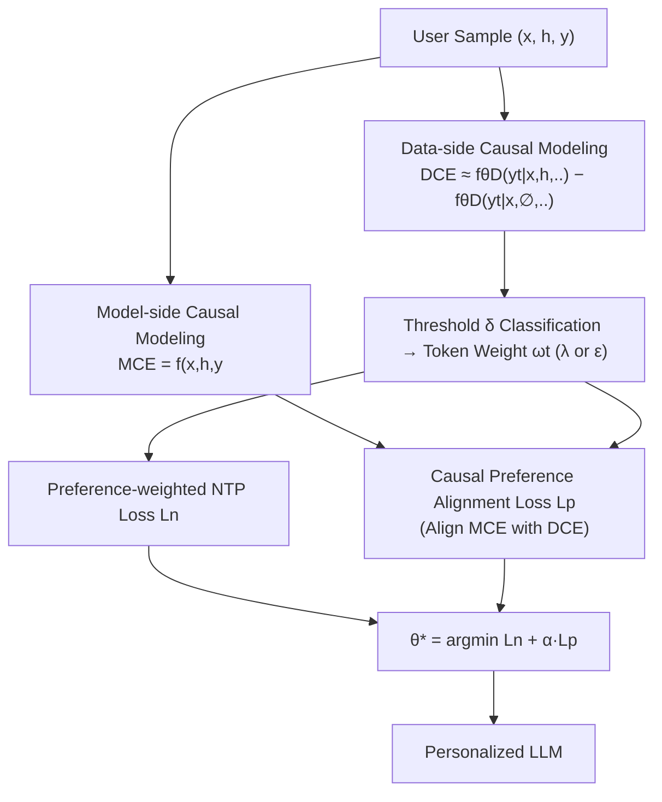

# NextQuill: Causal Preference Modeling for Enhancing LLM Personalization

**Conference**: ICLR 2026  
**OpenReview**: [https://openreview.net/forum?id=xYpVlKMFqv](https://openreview.net/forum?id=xYpVlKMFqv)  
**Code**: [https://github.com/juntaoyou/NextQuill](https://github.com/juntaoyou/NextQuill)  
**Area**: Causal Inference / LLM Personalization Alignment  
**Keywords**: LLM Personalization, Causal Preference Modeling, Causal Effects, do-calculus, Preference Alignment, Supervised Fine-Tuning  

## TL;DR
NextQuill reformulates LLM personalization as a causal problem—viewing both model predictions and ground-truth user responses as the joint result of "User History/Features $\times$ Context." By using causal effects (do-calculus), it isolates the core preference-driven components and employs two alignment losses to learn only these parts, achieving deeper personalization than undifferentiated alignment.

## Background & Motivation
**Background**: LLM personalization primarily follows two paradigms. First is the "Memory-Retrieval" paradigm, which stores user history in external memory and retrieves relevant snippets into the prompt during generation. Second is the "Fine-tuning" paradigm, which directly fine-tunes model parameters on user history data, teaching the model to predict subsequent behaviors from past ones, thereby embedding preferences into the weights. The latter generally offers more explicit alignment effects.

**Limitations of Prior Work**: The authors point out that the alignment in fine-tuning methods is actually "shallow," stemming from the "undifferentiated use of user data" in two areas. ① **Model side**: Existing methods treat "all predictions generated from the entire input" as the model's inferred preferences, aligning them indiscriminately with the ground-truth. However, what truly reflects the model's internal preference modeling are inferences **driven by historical behavior**, rather than those driven by general context (queries, task prompts). ② **Data side**: Existing methods learn **all tokens in ground-truth responses equally**, ignoring that different tokens contribute vastly differently to preference expression. For instance, a user's catchphrase tokens strongly reflect preference, whereas tokens like "The lead actor of this movie is XX" would appear regardless of who writes them.

**Key Challenge**: Both model predictions and user responses are products of "preference factors" and "non-preference factors (primarily context)," but only the portion driven by preference factors truly represents the user. Undifferentiated alignment = learning noise and signal together, which naturally leads to shallow alignment.

**Goal**: Identify "what truly matters in preference modeling" from a causal perspective, isolate preference-driven components on both the model and data sides, and explicitly emphasize learning these components during training.

**Core Idea**: **Causal Preference Modeling**—representing response generation as a causal graph, defining preference signals using the "causal effect of user history/features on the output," and performing alignment using two losses: one for model-side causal effects and another for data-side preference token weighting.

## Method

### Overall Architecture
NextQuill begins with **Causal Analysis**: drawing two causal graphs to characterize "how the model predicts responses" and "how users write real responses." A **Causal Preference Effect** (Model-side MCE and Data-side DCE) is defined for each side, representing the difference in output token probability intervention after removing reference values. Based on these effects, **Preference Alignment** is performed: on the data side, DCE calculates weights for each ground-truth token to distinguish preference-driven tokens; on the model side, MCE isolates preference components in predictions to align with ground-truth. Finally, both losses are combined into a single objective for fine-tuning, similar to SFT.

### Key Designs
**1. Model-side Causal Preference Effect (MCE): Isolating preference-driven predictions using "history removal" as a counterfactual.** In the model-side causal graph, prediction $\hat{Y}$ is influenced by user history $H$, context $X$, and their interaction $E_M$, but only the $H$ path carries preference signals. The authors define the causal effect of a token at time $t$ using do-calculus: $\text{MCE}(\hat{Y}_t|h,x) = P(\hat{Y}_t|H{=}do(h),x) - P(\hat{Y}_t|H{=}do(0),x)$. Because the causal graph structure equates intervention probability to observation probability, this translates to a **counterfactual difference**: $f_\theta(x,h,y_{<t}) - f_\theta(x,\emptyset,y_{<t})$, representing the "prediction with history" minus the "prediction with history erased." This difference measures exactly what was changed by user history, representing the true preference captured within the LLM.

**2. Data-side Causal Preference Effect (DCE): Calculating "how much a token was written due to preference" and binarizing it into weights.** The data-side causal graph describes how users generate real responses $Y$, influenced by user features $U$, context $X$, and interaction $E_D$. Similarly, $\text{DCE}(Y_t|u,x) = P(Y_t|U{=}do(u),x) - P(Y_t|U{=}do(0),x)$ quantifies the extent to which token $y_t$ is preference-driven. Since user features $u$ are not directly accessible, they are approximated using history $h$ and estimated by an **LLM $\theta_\mathbb{D}$ trained on dataset $\mathbb{D}$**: $\text{DCE}(Y_t{=}y_t|u,x) \approx f_{\theta_\mathbb{D}}(y_t|x,h,y_{<t}) - f_{\theta_\mathbb{D}}(y_t|x,\emptyset,y_{<t})$. Tokens are then categorized via threshold $\delta$ as preference-driven (weight $\lambda$) or non-preference-driven (weight $\epsilon$), resulting in token weight $\omega_t$.

**3. Preference-weighted NTP Loss: Shifting treatment focus to preference tokens.** The standard next-token prediction loss ensures textual coherence, but the authors re-weight it using $\omega_t$ to force the model to learn preference-driven tokens more intensely: 
$$L_n = \frac{1}{|\mathbb{D}|}\sum_{(x,h,y)}\sum_{t=1}^{|y|}\omega_t\cdot\ell(f_\theta(x,h,y_{<t}), y_t)$$
where $\ell$ is cross-entropy. Non-preference tokens (e.g., objective descriptions written by everyone) receive low weights, preventing dilution of the preference signal.

**4. Causal Preference Alignment Loss: Directly aligning model-side MCE with data-side preferences.** Beyond weighting, LLM internal causal effects (MCE) are forced to fit preference components in the ground-truth. The counterfactual difference $f_\theta(x,h,y_{<t}) - f_\theta(x,\emptyset,y_{<t})$ is treated as the "preference prediction isolated by the model" and aligned with the real tokens using $\omega_t$ weights: 
$$L_p = \frac{1}{|\mathbb{D}|}\sum_{(x,h,y)}\sum_{t=1}^{|y|}\omega_t\cdot\ell\big(f_\theta(x,h,y_{<t}) - f_\theta(x,\emptyset,y_{<t});\, y_t\big)$$
This term compels "the part predicted by the model specifically because of history" to align with user preferences. The final objective is $\theta^\star = \arg\min_\theta\, L_n + \alpha\cdot L_p$, using hyperparameter $\alpha$ for balance.

## Key Experimental Results

### Main Results
On Amazon Book/Movie/CD Review and Topic Writing (personalized long-form Reddit posts), comparing retrieval-based (Contriever / LatestK / CoS / LLM-TRSR) and PEFT-based (SFT / OPPU / ContextSFT) methods using Qwen as the backbone:

| Dataset | Metric | Base(Qwen) | ContextSFT (Prev. SOTA) | **Ours (NextQuill)** |
|---|---|---|---|---|
| Book Review | ROUGE-1 | 0.0519 | 0.1661 | **0.2318** |
| | ROUGE-L | 0.0267 | 0.0836 | **0.1270** |
| | BERTScore | 0.7385 | 0.8013 | **0.8182** |
| Movie Review | ROUGE-1 | 0.0470 | 0.1573 | **0.2015** |
| | BLEU | 0.0402 | 1.7151 | **2.3845** |
| CD Review | ROUGE-1 | 0.0438 | 0.1505 | **0.1976** |
| Topic Writing | ROUGE-1 | 0.0684 | 0.0934 | **0.1510** |

NextQuill achieved the best performance across almost all metrics on all four datasets, with significant Gains over the strongest baseline ContextSFT (e.g., Book Review ROUGE-1 increased from 0.166 → 0.232).

### Ablation Study
Using SFT as the Base, components were added progressively (RI% reports Relative Improvement over Base):

| Variant | Book R-1 (RI) | Movie R-1 (RI) | CD R-1 (RI) |
|---|---|---|---|
| Base Model (SFT) | 0.0752 (-) | 0.0620 (-) | 0.0668 (-) |
| + MCE Only | 0.1827 (+142.9%) | 0.1629 (+162.7%) | 0.1552 (+132.3%) |
| + MCE-DCE Alignment | 0.1876 (+149.5%) | 0.1671 (+169.5%) | 0.1672 (+150.3%) |
| + DCE Only | 0.1958 (+160.4%) | 0.1865 (+200.8%) | 0.1805 (+170.2%) |
| **+ Full (NextQuill)** | **0.2318 (+208.2%)** | **0.2015 (+225.0%)** | **0.1976 (+195.8%)** |

### Key Findings
- Using either model-side MCE alignment or data-side DCE weighting yields major improvements over SFT (+130%~+200%), proving the effectiveness of causal signals on both sides.
- DCE Only is slightly stronger than MCE Only, indicating that the data-side strategy of "distinguishing preference token weights" contributes more.
- The Full combination significantly exceeds any single component, suggesting that the two causal alignment strategies are **complementary** rather than redundant.

## Highlights & Insights
- **Reframing the Problem**: Attributes "shallow personalization" to the "undifferentiated use of user data" and uses causal language (preference vs. context factors) to turn intuition into computable causal effects.
- **Clever Implementation of Counterfactual Differences**: While MCE/DCE are rooted in do-calculus, their implementation involves simple forward-pass differences ("with history" vs. "without history"), isolating preference components with near-zero additional modeling cost.
- **Dual Side Approach**: One modifies token weights (what to learn), the other modifies the alignment objective (which part of prediction to align), targeting different dimensions of the loss.
- **Plug-and-Play**: Essentially a re-weighting and additive term for SFT losses, requiring no architectural changes or extra labeling, making it easily applicable to existing fine-tuning pipelines.

## Limitations & Future Work
- **DCE estimation relies on an "expert LLM"**: Estimating data-side causal effects via $\theta_\mathbb{D}$ introduces additional training/inference costs, and approximation quality affects token weight reliability.
- **Manual Thresholds and Weights**: Binarization via $\delta$ and $\lambda/\epsilon$ depends on manual hyperparameters which may vary significantly across datasets; an adaptive mechanism is missing.
- **Validity of "Erasing History"**: Using $H=\emptyset$ assumes observation equals intervention ($P(Y|do(h)) = P(Y|h)$), which is hard to strictly verify in complex LLMs where unobserved confounders might exist.
- **Evaluation Scopes**: Tasks are limited to review and long-post generation; generalizability to dialogue, code, or decision-making tasks remains untested. Metrics are primarily ROUGE/BLEU, with limited correlation to real human satisfaction.

## Related Work & Insights
- **Personalization Paths**: Paradigms include Memory-Retrieval (LaMP/RAG, Contriever) and Fine-tuning (OPPU's user adapters, ContextSFT). NextQuill follows the fine-tuning path but redesigns the loss using causal inference.
- **Causal Inference × LLM**: do-calculus and Pearl's causal graphs have previously been used for de-biasing and counterfactual data augmentation. This work applies causal effects as "preference signal extractors," a novel use for personalization.
- **Token-level Weighted Learning**: Shares the concept of weighting tokens by importance or influence, but derives weights from causal principles rather than heuristics, providing a more theoretically grounded source for weighting.

## Rating
- **Novelty**: ⭐⭐⭐⭐ Reformulates personalization as causal effect isolation with clear MCE/DCE definitions; small deduction as causal tools themselves are established, but the application is innovative.
- **Experimental Thoroughness**: ⭐⭐⭐⭐ Strong baselines across four datasets with clear ablation; deduction for narrow task domains and lack of human evaluation.
- **Writing Quality**: ⭐⭐⭐⭐ Logical flow from motivation to causal graphs, effect definitions, and loss derivation.
- **Value**: ⭐⭐⭐⭐ Plug-and-play for SFT pipelines with practical utility for personalized generation.

<!-- RELATED:START -->

- **ContextSFT**: The baseline for history-augmented fine-tuning.
- **LaMP (Language Model Personalization)**: Benchmark for personalized generation across diverse tasks.
- **OPPU**: Using Parameter-Efficient Fine-Tuning for personalized user adapters.

<!-- RELATED:END -->

## Related Papers

- [\[ICLR 2026\] Meta-Router: Bridging Gold-standard and Preference-based Evaluations in LLM Routing](meta-router_bridging_gold-standard_and_preference-based_evaluations_in_llm_routi.md)
- [\[ICLR 2026\] Flattery, Fluff, and Fog: Diagnosing and Mitigating Idiosyncratic Biases in Preference Models](flattery_fluff_and_fog_diagnosing_and_mitigating_idiosyncratic_biases_in_prefere.md)
- [\[ICML 2026\] Causal Modeling of Selection in Evolution](../../ICML2026/causal_inference/causal_modeling_of_selection_in_evolution.md)
- [\[ICLR 2026\] Modeling Interference for Treatment Effect Estimation in Network Dynamic Environment](modeling_interference_for_treatment_effect_estimation_in_network_dynamic_environ.md)
- [\[AAAI 2026\] Causal Inference Under Threshold Manipulation: Bayesian Mixture Modeling and Heterogeneous Treatment Effects](../../AAAI2026/causal_inference/causal_inference_under_threshold_manipulation_bayesian_mixtu.md)

<!-- RELATED:END -->
