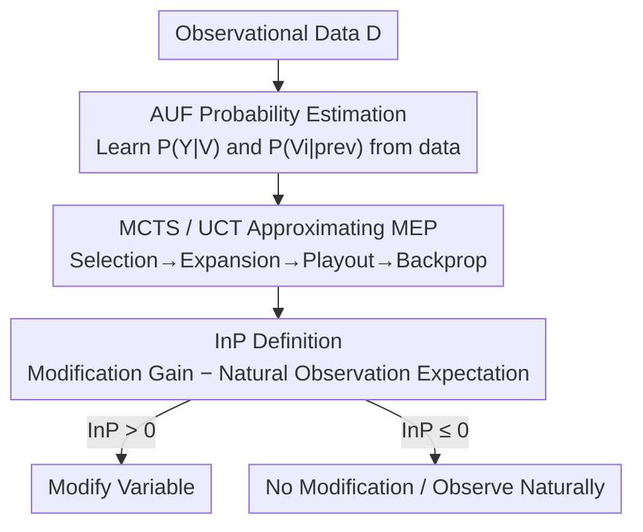

# On Measuring Influence in Avoiding Undesired Future

**Conference**: ICLR 2026  
**OpenReview**: [https://openreview.net/forum?id=VHdF91MvJq](https://openreview.net/forum?id=VHdF91MvJq)  
**Code**: TBD  
**Area**: Causal Inference / Decision Making  
**Keywords**: Influence measurement, Avoiding Undesired Future (AUF), Maximum Expected Utility, Causal Effect, Monte Carlo Tree Search

## TL;DR
This paper proposes a new influence measure, **influence power (InP)**, for the "Avoiding Undesired Future" (AUF) problem. It measures how much the probability of reaching a target is increased by "actively modifying an actionable variable" compared to "letting it occur naturally." The paper theoretically proves that influence is not equivalent to causal effect (weakly causal or even non-causal variables can be highly useful) and provides a practical algorithm to estimate this quantity from observational data using Monte Carlo Tree Search.

## Background & Motivation

**Background**: When a predictive model warns that a "bad event is about to happen," simple prediction is no longer enough. We want to know "what to do to avoid it"—this is the AUF (Avoiding Undesired Future) problem proposed by Zhi-Hua Zhou, which shifts machine learning from passive prediction to actively shaping the future. Existing rehearsal learning methods use the concept of "influence," which sits between statistical correlation and causality, to model relationships between variables and make decisions.

**Limitations of Prior Work**: Although rehearsal learning is effective in several AUF scenarios, a fundamental question remains unanswered: **How exactly should "influence" be quantified?** That is, given an actionable variable, how does one evaluate the actual utility of "modifying it" for the future goal? Existing AUF strategies either only consider "modifying a single variable in isolation" to see the increase in success probability (Eq. 1) or simply "modify all actionable variables together" (Eq. 2).

**Key Challenge**: Traditional causal strength measures (such as Average Causal Effect, ACE) evaluate the isolated effect of a single intervention in a static environment. In contrast, AUF faces a **dynamic world repeatedly reshaped by decisions**. Causal strength calculated from historical data does not represent the true influence on a "future goal." Meanwhile, the two naive strategies have blind spots: Eq. 1 ignores **synergy** between variable changes (e.g., when $Y:=Z_1\wedge Z_2$, modifying either alone is useless; they must be modified together), and Eq. 2 ignores the **naturalness** of variables (e.g., adding artificial light is meaningless when there is already sufficient sunlight), and certain modifications might even be counterproductive.

**Goal**: To provide a quantitative "influence" indicator that accounts for variable actionability, naturalness, and the interaction between subsequent observations and modifications, while clarifying its true relationship with causality.

**Core Idea**: Influence is defined as "the magnitude of increase in success probability achieved by modifying a variable under the principle of Maximum Expected Utility." A recursive Bellman-like equation is used to incorporate the dynamics of reaching future states where "subsequent modifications/observations are still possible."

## Method

### Overall Architecture
The paper investigates a sequence of variables $(V_1,\dots,V_d,Y)$ generated by an unknown Structural Equation Model (SEM), where the target is for the variable $Y$ to fall within set $S$. During decision-making, a subset of variables $X$ has already materialized; the task is to modify the remaining actionable variables $Z$ to maximize $P(Y\in S)$. The methodology consists of two layers: the **theoretical layer** defines the InP measure (based on a recursion called MEP) and proves it does not mutually entail causal effects or causal ancestors; the **estimation layer** provides a practical way to calculate this quantity from observational data using Monte Carlo Tree Search (MCTS) when the SEM is unknown.

The estimation side follows a serial pipeline: first, learn conditional probabilities from observational data; then, use an MCTS/UCT search tree to approximate the maximum expected probability of "continuous subsequent modifications and observations"; finally, subtract terms according to the definition to obtain InP and determine whether each variable "should or should not be modified."

### Key Designs

**1. Influence Power (InP): Quantifying the value of modification via "Maximum Expected Probability" difference**

The paper first defines the recursive **Maximum Expected Probability (MEP)**: after several modifications/observations have occurred, for the next variable $V_{k+1}$, one either takes the "maximum success probability achievable after optimal modification" or the "expectation over its natural distribution if observed"—whichever is larger:

$$P(Y\in S\mid V_k \overset{a}{=} v_k,\dots)=\max\Big\{\max_{v_{k+1}\in\Delta V_{k+1}} P(Y\in S\mid V_{k+1}\overset{a}{=}v_{k+1},\dots),\ \ \mathbb{E}_{v_{k+1}\sim P(V_{k+1}\mid \dots)}P(Y\in S\mid V_{k+1}=v_{k+1},\dots)\Big\}$$

Here $V_i\overset{a}{=}v_i$ denotes an "action" (replacing the structural function with a constant), which differs from $do(\cdot)$ as it distinguishes actionability. Based on this, the **influence** of $V_i$ on $Y$ is defined as:

$$\dot p(V_i,Y):=\max_{v_i\in\Delta v_i} P(Y\in S\mid V_i\overset{a}{=}v_i)-\mathbb{E}_{v_i\sim P(V_i)}P(Y\in S\mid V_i=v_i)$$

This represents the MEP gain of "actively modifying to the optimum" relative to "letting it occur naturally," ranging in $[-1,1]$. A positive value indicates modification is beneficial, while zero or negative indicates it is unnecessary or harmful. This definition directly addresses the previous limitations: because the MEP recursion accounts for "future opportunities to modify and observe," **synergy** and **naturalness** between variables are automatically incorporated, unlike Eq. 1 (one-step lookahead) or Eq. 2 (modify all). It depends only on probability terms and does not require a complete SEM, serving as a variant of the Bellman equation.

**2. Influence $\neq$ Causality: Four counter-intuitive cases decoupling InP from ACE/Ancestry**

This is the paper’s most counter-intuitive contribution. Theorem 1 systematically proves that: "being a causal ancestor $X\in\mathrm{Anc}(Y)$," "having a non-zero average causal effect $\tau(X,Y)\neq 0$," and "having non-zero influence $\dot p(X,Y)\neq 0$" **do not mutually entail each other**. Furthermore, being a strong causal factor or ancestor does not guarantee $\dot p\ge 0$. The authors use four binary SEM examples to demonstrate this:

- **Strong causal ancestor with zero influence**: In a chain $X\to Z\to Y$, $\tau(X,Y)=0.64$ is strong, but because the downstream $Z$ is also actionable and a rational agent will always set $Z$ to 1, the effect of $X$ is "masked," resulting in $\dot p(X,Y)=0.9-0.9=0$.
- **Non-ancestor with positive influence**: In a medical example, a skin test $W$ has no direct causal effect on recovery $Y$ ($\tau=0$), but modifying $W$ causes the skin reaction $X$ to reveal information about an allergy gene $U$, guiding wiser medication $Z$. Thus, $\dot p(W,Y)=0.68-0.518=0.162>0$.
- **Weak causal ancestor with positive influence**: A weak ancestor with $\tau(X,Y)=0$ (zero average causal effect) can have $\dot p(X,Y)=0.25>0$ due to synergy with $Z$.
- **Strong causal ancestor with negative influence**: $\tau(X,Y)=0.08$ is non-zero, but $\dot p(X,Y)=-0.15<0$. Observing $X$ naturally reveals information about $U$ to help subsequent $Z$ decisions, whereas "actively modifying $X$" destroys this information channel, leading to a worse outcome.

These examples quantify the Shakespearean dilemma "To do, or not to do": **In dynamic decision-making, whether to modify a variable depends on its implicit impact on the entire subsequent decision chain, not just its own causal strength.**

**3. MCTS/UCT Approximating MEP: Turning recursive evaluation into a single-player non-deterministic game**

Exact calculation of MEP requires exhausting all possible combinations of modifications/observations, which is infeasible with many actionable variables. The paper models MEP calculation as a **single-player non-deterministic game** and approximates it using Monte Carlo Tree Search with UCT (Upper Confidence Bound for Trees). Each node represents the "current sequence of modifications/observations + the next variable to be decided," and each edge represents the choice to "modify to a value" or "observe." Each iteration follows four steps: **Selection** (traverse to leaf via UCT), **Expansion** (add nodes for each choice), **Playout** (randomly reach terminal state and calculate AUF probability), and **Backpropagation** (update statistics along the path). The UCT selection criterion is:

$$c^*_N=\arg\max_{c\in\Delta^+_N}\Big\{\hat p_{N,c}+\alpha\sqrt{\tfrac{\ln t_N}{t_{N,c}}}\Big\}$$

where $\Delta^+_N=\Delta_N\cup\{\varnothing\}$ treats "observation" as a special choice $\varnothing$. After tree construction, the MEP is approximated by the average AUF probability of the root's choices, thus $\dot p(V_i,Y)\approx\max_{c\in\Delta_{N_0}}\hat p_{N_0,c}-\hat p_{N_0,\varnothing}$. A key practical observation: this is an **anytime algorithm**, and AUF decisions often do not require precise influence values—as long as the approximation correctly determines "to modify or not" or selects the optimal direction, **a small number of simulations can yield consistent decisions** (misjudgment rates often drop to zero before numerical values converge).

**4. Estimating AUF Probability from Observational Data: Consistency guarantees via Dirac delta**

MCTS playouts require AUF probabilities at terminal states. When the SEM is unknown, these must be estimated from data. The paper decomposes the joint distribution via topological order $P(\mathbf V,Y)=P(Y\mid\mathbf V)\prod_i P(V_i\mid V_1,\dots,V_{i-1})$, learning each conditional probability with standard ML models. For the set of modified variables $A$, conditional terms are replaced with the Dirac delta $\delta(\cdot)$, while unmodified variables retain natural conditional terms. Marginalizing over unobserved variables yields a general expression for AUF probability under modifications $A$ and observations $O$ (Eq. 12). **Proposition 1**, utilizing Spirtes et al.’s manipulation theorem, proves that under causal sufficiency (no unobserved confounding) and positivity, this estimate is **consistent** with the true AUF probability defined by the SEM. Notably, causal sufficiency is only required for the "estimation from data" step; the rest of the paper does not require it. Furthermore, **the learning phase can use richer observations while the decision phase allows partial observability**, which is more realistic.

## Key Experimental Results

### Main Results
Six modification strategies were compared across three synthetic tasks (TRADER, FARMER, DOCTOR) and one real-world task (BERMUDA): OBSERVE (only observe), MAX-ONE (Eq. 1, modify the single best), MAX-ALL (Eq. 2, modify all), CORR (select by correlation), ACE (select by causal effect), and OURS (select by positive influence). The metric is success rate (frequency of $Y \in S$), with 10,000 samples per task repeated 10 times.

| Task | OBSERVE | MAX-ONE | MAX-ALL | CORR | ACE | OURS |
|------|---------|---------|---------|------|-----|------|
| TRADER | 37.62 | 51.01 | 50.82 | 47.73 | 51.13 | **60.94** |
| FARMER | 10.05 | 62.90 | 63.18 | 63.88 | 62.66 | 63.86 |
| DOCTOR | 39.81 | 50.76 | 51.08 | 51.33 | 50.93 | **65.32** |
| BERMUDA | 2.29 | 61.99 | 72.71 | 19.09 | 69.61 | **75.16** |

OURS leads significantly in most tasks: it outperforms the second best by 10–14 percentage points in TRADER and DOCTOR. In the real non-binary task BERMUDA, it reaches 75.16, exceeding MAX-ALL (72.71) and ACE (69.61). In FARMER, all methods are close because the goal is dominated by a single key variable which all methods correctly identify.

### Ablation Study
Impact of sample size on OURS (Success rate %):

| Task | 10 | 50 | 100 | 500 | 1000 | 5000 |
|------|----|----|-----|-----|------|------|
| TRADER | 42.97 | 49.45 | 51.86 | 57.63 | 57.08 | 60.34 |
| FARMER | 19.23 | 31.80 | 60.49 | 62.16 | 63.22 | 63.62 |
| DOCTOR | 44.20 | 43.18 | 46.41 | 64.96 | 65.20 | 65.72 |

The success rate increases with sample size and tends to stabilize around **1000 samples**.

### Key Findings
- **Influence is more suitable for AUF than causal effect**: Selecting modifications based on positive influence (OURS) consistently outperforms ACE, CORR, or MAX-ALL, validating that the "Influence $\neq$ Causality" insight is practically useful.
- **Decision consistency precedes numerical convergence**: Figure 3 shows that as MCTS iterations increase, the deviation of approximate influence from exact values continues to drop; however, the **misjudgment rate (inconsistency in modify/observe decisions) hits zero long before the value fully converges**, showing that minimal simulations suffice for correct decisions.
- **FARMER Exception**: When the target is dominated by a single variable, all methods succeed, making the advantage of OURS less obvious—this suggests InP's value lies primarily in complex dynamic scenarios involving synergy and information revelation.

## Highlights & Insights
- **Quantifying "To Do or Not To Do" as a $[-1, 1]$ scalar**: InP uses a Bellman-like recursion to capture the full dynamics of potential future modifications and observations. The sign directly indicates "beneficial / neutral / harmful," providing far more information than isolated causal effects.
- **Textbook-level binary SEM counter-examples**: Using minimal variables to construct "strong causality, zero influence," "non-ancestry, positive influence," "weak causality, positive influence," and "strong causality, negative influence" makes the decoupling of influence and causality both rigorous and intuitive. The skin test medical narrative is particularly effective.
- **Transferable logic**: Treating "modification vs. observation" as two choices on the same variable and using MCTS for search provides a modeling approach that does not pre-define state/action splits. This is valuable for real-world sequential decisions (medicine, agriculture, risk control) where one cannot "rewind and try again."

## Limitations & Future Work
- **Reliance on causal sufficiency**: Proposition 1 requires "no unobserved confounding + positivity" for consistency. If hidden confounders exist, AUF probability estimates from observational data may be biased.
- **Discrete variable assumption**: Theoretical analysis and most examples assume discrete (often binary) variables. Although BERMUDA validates non-binary feasibility, the search cost and estimation accuracy of MCTS in high-dimensional continuous spaces remain open questions.
- **Comparison primarily limited to ACE**: The authors acknowledge comparing mainly against the most common Average Causal Effect. Systematic comparisons with other causal strength measures, counterfactuals, Dynamic Treatment Regimes (DTR), or causal bandits are left for future work.
- **MCTS budget vs. accuracy trade-off**: While "coarse approximation is sufficient" is a highlight, there is a lack of theoretical characterization of when it is safe to use few simulations or when the misjudgment rate might prematurely converge.

## Related Work & Insights
- **vs. rehearsal learning (Qin 2023 / Du 2024-2025)**: Part of the rehearsal/influence paradigm proposed by Zhou. Earlier works focused on learning structural models to optimize decisions; this paper is the first to provide a **quantitative measure and consistent estimation of influence itself**.
- **vs. Average Causal Effect (ACE)**: ACE evaluates isolated effects of single interventions in static settings. InP evaluates the overall value of an action in a dynamic world reshaped by decisions. This paper proves they are not equivalent and InP better fits AUF's prospective needs.
- **vs. Reinforcement Learning / DTR / Causal Bandits**: RL and DTR usually strictly separate "state" and "action" variables and allow environment revisits. AUF does not allow "rewinding," and this paper treats all variables uniformly (modifiable or observable). Causal bandits often require expert-provided causal structures, whereas this paper starts from observational data.
- **vs. Counterfactual Reasoning**: Counterfactuals ask "what if the past were different" (retrospective). AUF is prospective "planning for the future." The temporal focus is different.

## Rating
- Novelty: ⭐⭐⭐⭐⭐ First to propose a quantifiable, estimable influence measure for AUF and prove its counter-intuitive decoupling from causality.
- Experimental Thoroughness: ⭐⭐⭐⭐ Three synthetic and one real-world task, six baselines, with sample size and convergence analysis; however, task scales are relatively small with mostly binary variables.
- Writing Quality: ⭐⭐⭐⭐⭐ Uses minimal SEM examples to explain abstract measures clearly; excellent integration of theory and narrative.
- Value: ⭐⭐⭐⭐⭐ Provides a principled tool for "actively avoiding undesired futures," with practical implications for sequential decision-making in fields like medicine and agriculture.

<!-- RELATED:START -->

## Related Papers

- [\[ICLR 2026\] Influence without Confounding: Causal Discovery from Temporal Data with Long-term Carry-over Effects](influence_without_confounding_causal_discovery_from_temporal_data_with_long-term.md)
- [\[ICLR 2026\] NextQuill: Causal Preference Modeling for Enhancing LLM Personalization](nextquill_causal_preference_modeling_for_enhancing_llm_personalization.md)
- [\[ICLR 2026\] LLMs Struggle to Balance Reasoning and World Knowledge in Causal Narrative Understanding](llms_struggle_to_balance_reasoning_and_world_knowledge_in_causal_narrative_under.md)
- [\[ICLR 2026\] Learning Robust Intervention Representations with Delta Embeddings](learning_robust_intervention_representations_with_delta_embeddings.md)
- [\[ICLR 2026\] Action-Guided Attention for Video Action Anticipation](action-guided_attention_for_video_action_anticipation.md)

<!-- RELATED:END -->
