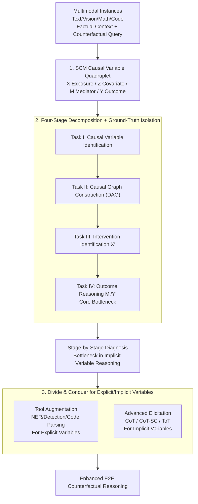

# On the Eligibility of LLMs for Counterfactual Reasoning: A Decompositional Study

**Conference**: ICLR2026  
**arXiv**: [2505.11839](https://arxiv.org/abs/2505.11839)  
**Code**: TBD  
**Area**: Causal Reasoning  
**Keywords**: counterfactual reasoning, structural causal model, LLM evaluation, decompositional analysis, tool-augmented learning

## TL;DR

This paper proposes a decompositional evaluation framework based on Structural Causal Models (SCM), splitting LLM counterfactual reasoning into four stages (causal variable identification → causal graph construction → intervention identification → outcome reasoning). It systematically diagnoses ability bottlenecks across 11 multimodal datasets and suggests tool augmentation and advanced elicitation strategies to improve performance.

## Background & Motivation

- Counterfactual reasoning is a critical capability for evaluating LLM adaptability and reliability: given a hypothetical change in premises, can the model adjust its reasoning conclusions?
- Prior research indicates that LLMs perform poorly in counterfactual tasks, yet there is a lack of a **standardized framework** to systematically analyze failure modes.
- Most existing evaluations are end-to-end "direct tests": they provide counterfactual interventions and expect an answer, ignoring the **causal modeling foundations** behind counterfactual reasoning—such as variable identification and causal dependency construction.
- There is a need for a decompositional method to break down counterfactual reasoning into independently evaluable stages to precisely locate LLM reasoning bottlenecks.

## Core Problem

1. How do LLMs perform in each decomposed stage of counterfactual reasoning (causal variable identification, causal graph construction, intervention identification, and outcome reasoning)?
2. Which auxiliary techniques effectively enhance the counterfactual reasoning capabilities of LLMs?

## Method

### Overall Architecture

Rather than training a new model, this work builds a "diagnostic bench" to answer a question often masked by end-to-end evaluations: exactly where does LLM counterfactual reasoning fail? Using Pearl’s Structural Causal Model (SCM) as a backbone, task information is formalized into four types of causal variables. The end-to-end process is then decomposed into four independently measurable stages—causal variable identification, causal graph construction, intervention identification, and outcome reasoning. During evaluation, each stage is fed with ground-truth data from the preceding stage to attribute errors to specific steps. The accompanying benchmark spans 11 datasets across text, vision-language, mathematical symbols, and code. After locating bottlenecks, a "divide and conquer" approach is applied: tool augmentation for explicit variables and advanced elicitation for implicit variables.

### Key Designs

**1. SCM Causal Variable Quadruplet: A Computational Foundation**

Previous evaluations treated counterfactual reasoning as a "black box," making it difficult to pinpoint failure causes. This work leverages Pearl’s SCM to reduce task information into four variables: Exposure $X$ (the treatment/intervention), Covariate $Z$ (pre-treatment confounders affecting $X$ and $Y$ alike), Mediator $M$ (variables on the path $X \to Y$, where $M = f_M(X, Z)$), and Outcome $Y$ (the result, where $Y = f_Y(X, M, Z)$). With this mechanism, counterfactual reasoning yields definitive answers: given observed facts $(x, z, m, y)$, if $X$ is intervened to $x'$, the correct results are recalculated along the causal chain:

$$M_{x'} = f_M(x', z), \qquad Y_{x'} = f_Y(x', M_{x'}, z).$$

This step transforms intuitive judgments of "correctness" into verifiable variable computations.

**2. Four-Stage Decomposition & Ground-Truth Isolation: Attributing Global Failure to Local Steps**

Evaluation is sliced into four stages following the SCM computational sequence: Task I (identifying $X, Z, M, Y$), Task II (constructing the correct DAG), Task III (identifying the intervened variable $X'$), and Task IV (inferring $M'$ and $Y'$). The key is "ground-truth isolation": when evaluating a stage, the previous stage's standard answer is provided as input. This ensures that a stage's score reflects its own capability without error propagation. This isolation reveals that the bottleneck lies in Task IV (reasoning about implicit variables $M', Y'$), rather than Task II (causal graph construction), which achieves F1 > 0.9.

**3. Divide and Conquer: Tailored Solutions for Explicit/Implicit Variables**

Diagnosis shows that explicit variables ($X, Z, Y$, mostly localized in the input) fail due to cross-modal recognition issues, addressed via tool augmentation (function-calling NER). Text/Math uses bert-base-NER, Vision uses grounding-dino-base to detect objects while masking backgrounds, and Code uses GraphCodeBERT to extract structures. Implicit variables ($M, M', Y'$) fail due to reasoning depth, addressed via advanced elicitation: CoT for step-by-step logic, CoT-SC for majority voting across $k=5$ paths, and ToT for exploring $k=5$ branches using BERTScore for consistency. However, experiments warn that complex strategies like ToT can trigger "overthinking," introducing unsupported causal chains.

## Key Experimental Results

The study evaluates 7 LLMs: GPT-5, GPT-o4-mini-high, Qwen3-VL-235B, Llama-4-Scout, Llama-4-Maverick, Gemini2.5-Pro, and DeepSeek-VL.

### Task I: Causal Variable Identification
- X F1 reaches 87–92% in text but drops significantly in vision/code (e.g., <72% on Open-Critic).
- **M identification is the most difficult**: Even in text, M's F1 is 5–10 points lower than X.
- Modality complexity and the reasoning nature of the variable (explicit vs. implicit) are independent difficulty factors.

### Task II: Causal Graph Construction
- Overall best performance, with F1 > 0.9 in most cases.
- LLMs effectively apply construction rules when variables are given.

### Task III: Counterfactual Intervention Identification
- LLMs accurately identify $X'$ values with stable cross-modal performance.
- This task is relatively simple as it does not involve effect propagation.

### Task IV: Outcome Reasoning (Core Bottleneck)
- **LLMs perform worst when reasoning about counterfactual $M'$ and $Y'$**.
- GPT-5 achieves $M'=92.1\%$, $Y'=88.0\%$ on CRASS, but drops to $M' \approx 75\%$, $Y' \approx 70\%$ on code datasets.
- Weaker models (e.g., DeepSeek-VL) see $Y'$ as low as ~54% on vision datasets.

### Improvement Effects
- Tool augmentation significantly boosts explicit variable identification: Llama-4-Scout improves X by +32.0% on CVQA-Count.
- Advanced elicitation helps implicit variables but has a ceiling: overthinking in CoT-SC/ToT can sometimes lead to worse results than simple CoT.

## Highlights & Insights

1. **Systematic Decomposition Framework**: First to use Pearl's SCM to split counterfactual reasoning into four independently evaluable stages for fine-grained diagnosis.
2. **Large-scale Multimodal Benchmark**: Covers 11 datasets and 4 modalities with annotated causal variables and DAGs.
3. **Diagnostic Findings**: Identifies that causal graph construction is not the bottleneck (>0.9 F1); the real difficulty lies in implicit variable reasoning ($M', Y'$).
4. **Actionable Strategies**: Tool augmentation and elicitation address specific weaknesses, though ToT's overthinking remains a constraint.

## Limitations & Future Work

- Causal variable annotation and DAG construction still rely on manual or semi-automatic methods, limiting scalability.
- Isolated evaluation (providing GT at each stage) does not reflect error accumulation in real end-to-end scenarios.
- No definitive solution is provided for the "overthinking" problem in advanced elicitation.
- Only a limited number of LLMs were evaluated, lacking analysis of smaller open-source models.

## Related Work & Insights

| Method | Evaluation | Causal Modeling | Multimodal | Decomposition |
|------|----------|----------|--------|----------|
| CRASS (Frohberg et al., 2021) | E2E QA | None | Text only | No |
| DICE (Shrivastava et al., 2025) | Diagnostic QA | Partial | Text only | No |
| CausalProbe (Chi et al., 2024) | Probing | Partial | Text only | No |
| MalAlgoQA (Sonkar et al., 2024) | MCQ QA | None | Text+Symbol | No |
| **Ours** | **4-Stage Decomposition** | **Full SCM** | **4 Modalities** | **Step-by-step Diagnosis** |

The core difference is that while prior work focused on end-to-end assessment, this study aligns evaluation with structural SCM steps to achieve modular failure attribution.

## Rating
- Novelty: 8/10
- Experimental Thoroughness: 8/10
- Writing Quality: 7/10
- Value: 8/10

<!-- RELATED:START -->

## Related Papers

- [\[ICLR 2026\] LLMs Struggle to Balance Reasoning and World Knowledge in Causal Narrative Understanding](llms_struggle_to_balance_reasoning_and_world_knowledge_in_causal_narrative_under.md)
- [\[ACL 2026\] Parallel Universes, Parallel Languages: A Comprehensive Study on LLM-based Multilingual Counterfactual Example Generation](../../ACL2026/causal_inference/parallel_universes_parallel_languages_a_comprehensive_study_on_llm-based_multili.md)
- [\[ACL 2025\] CoA-Reasoning: Explorations on Counterfactual Analysis in Physical Reasoning of LVLMs](../../ACL2025/causal_inference/coa-reasoning_explorations_on_counterfactual_analysis_in_physical_reasoning_of_l.md)
- [\[ACL 2026\] Evaluating Counterfactual Strategic Reasoning in Large Language Models](../../ACL2026/causal_inference/evaluating_counterfactual_strategic_reasoning_in_large_language_models.md)
- [\[ICLR 2026\] Function Induction and Task Generalization: An Interpretability Study with Off-by-One Addition](function_induction_and_task_generalization_an_interpretability_study_with_off-by.md)

<!-- RELATED:END -->
