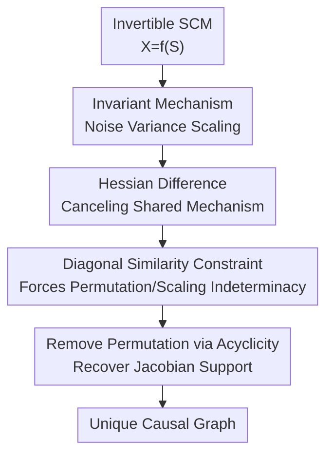

# On the Identifiability of Causal Graphs with the Invariance Principle

**Conference**: ICLR2026  
**OpenReview**: [https://openreview.net/forum?id=ta8BKRa1bl](https://openreview.net/forum?id=ta8BKRa1bl)  
**Code**: https://github.com/francescomontagna/gaussian-multienv-cd.git  
**Area**: Causal Inference  
**Keywords**: Causal Discovery, Multi-environment Data, Invariance Principle, Causal Graph Identifiability, Nonlinear ICA  

## TL;DR

This paper proves that under the conditions of invariant mechanisms and sufficient noise variance scaling across environments, the complete causal graph of any nonlinear invertible structural causal model (SCM) can be uniquely identified using one base environment and two auxiliary environments. This identifiability phenomenon is verified through synthetic experiments following the proof logic.

## Background & Motivation

**Background**: Causal discovery aims to recover the directed causal structure between variables from their joint distribution. Classical results establish that with only i.i.d. observational data, the problem is typically identifiable only up to a Markov equivalence class. Uniquely recovering the DAG usually requires additional assumptions, such as linear non-Gaussian noise, additive noise models, post-nonlinear models, or interventional/multi-environment information.

**Limitations of Prior Work**: Existing multi-environment causal discovery theories leverage the idea of "invariant mechanisms, changing distributions," but full graph identifiability typically depends on strong model restrictions or requires the number of environments to grow with the number of nodes. Particularly under arbitrary nonlinear mechanisms, nonlinear ICA identifiability results usually require many auxiliary variables or environments; directly applying these to causal discovery imposes requirements that are stronger and more expensive than necessary for causal graph recovery.

**Key Challenge**: ICA aims to recover the complete mixing function or independent sources, requiring the identification of specific Jacobian values across the entire domain in nonlinear scenarios. Causal discovery is primarily concerned with the zero/non-zero pattern of the inverse mixing function's Jacobian—specifically, whether each variable depends on a particular noise source. The information requirements for these two objectives are different, a distinction not fully exploited in previous theories.

**Goal**: The authors address a more pointed question: if the mechanisms of an SCM remain invariant across environments while only the statistics of independent noise terms change, can the entire causal graph be uniquely identified with a constant number of environments rather than a count that scales with the number of variables?

**Key Insight**: The paper approaches this through the duality between SCMs and ICA. An invertible SCM without latent confounders can be written as $X=f(S)$, where $S$ are mutually independent noise sources and $f$ is the mixing function induced by the structural equations. Recovering the causal graph does not require identifying all values of $f^{-1}$, but only the support of $J_{f^{-1}}$. If this support can be fixed at a faithful point, the graph structure is fixed.

**Core Idea**: By using the difference in log-likelihood Hessians between multi-environments to cancel out the invariant mechanism terms, the change in environment variance is transformed into constraints on the support of $J_{f^{-1}}$. This proves that two sufficiently distinct auxiliary environments are sufficient to identify the causal graph of any nonlinear SCM.

## Method

### Overall Architecture

The "method" presented is primarily a set of identifiability proofs rather than a performance-oriented practical algorithm. The logic is as follows: first, represent the SCM in ICA form $X=f(S)$; then, use invariant mechanisms to construct observational distributions under different source distributions for the same $f$; finally, compare the log-likelihood Hessians of the base and auxiliary environments near the source mean to prove that any alternative model explaining the same distributions must possess the same inverse Jacobian support.

The key object in the proof is the indeterminacy function between two models: if the true model is $f$ and another model explaining the data is $\hat f$, then $h=\hat f^{-1}\circ f$ describes the difference. The authors prove that at the point corresponding to the source mean, $J_h$ is restricted to scaling and permutation; combined with DAG acyclicity to remove permutation ambiguity, the true and alternative models must share the same $J_{f^{-1}}$ support.

### Key Designs

**1. Reducing Causal Discovery to Inverse Jacobian Support: Structure without Absolute ICA**

The paper clarifies the bridge between SCMs and ICA. Structural equations are written as $X_i=F_i(X_{PA_i},S_i)$. In the absence of latent confounders and with reversible mechanisms, all observed variables can be expressed as $X=f(S)$ where $S_1,\ldots,S_d$ are independent. For causal discovery, the priority is not the exact restoration of each independent source, but identifying whether the $i$-th component of $f^{-1}$ depends on $X_j$. Under faithfulness, $J_{f^{-1}}(x)_{ij}=0$ is equivalent to $X_j$ not being a parent of $X_i$.

This dimensionality reduction is critical: nonlinear ICA requires identifying Jacobian values at all points, while causal discovery only requires identifying the zero/non-zero pattern at a single faithful point. The authors select the observation point corresponding to the source mean $s=\mu_S$ as a "probe point" to analyze the Hessian, compressing a global nonlinear function identification problem into a local matrix support identification problem.

**2. Invariant Mechanism Environments: Extra Constraints via Noise Variance Changes**

The multi-environment setup follows the invariance principle: all environments share the same mixing function $f$, with only the distributions of independent sources changing. Specifically, auxiliary environments are generated by $S^e\overset{d}{=}L^eS$, where $L^e=\mathrm{diag}(\lambda_1^e,\ldots,\lambda_d^e)$, meaning each noise source scales across environments while the causal mechanism remains fixed. Intuitively, this involves changing exogenous noise intensity under different experimental conditions without altering the causal equations between variables.

This setting is weaker than hard interventions: it does not require knowledge of intervention targets nor does it change the graph structure; it only requires noise statistics across environments to be sufficiently distinct. This "sufficient difference" is captured by two conditions: each set of auxiliary environments must induce non-degenerate variance changes for each source, and the diagonal ratios $(\Omega_1^{-1}\Omega_2)_{ii}$ constructed from two sets of environments must be distinct. The authors show these conditions hold almost everywhere for randomly chosen scaling coefficients.

**3. Hessian Difference: Canceling Mechanisms at the Source Mean**

The core derivation stems from the second derivative of the log-density. For any environment $e$, change of variables gives $p^e_X(x)=p^e_S(s)|J_{f^{-1}}(x)|$. Directly computing the Hessian with respect to $x$ yields three types of terms: the Hessian of the source log-density sandwiched by $J_{f^{-1}}$, the second derivative of the log-determinant $\log |J_{f^{-1}}(x)|$, and a combination of the source score and the second derivative of $f^{-1}$.

The critical observation is that since mechanisms are identical across environments, the log-determinant terms cancel out when subtracting Hessians between base and auxiliary environments. If the source noise is Gaussian and evaluated at $s=\mu_S$, the source score is zero, and the final term also vanishes. Thus, for any environment group $E_l$:

$$
\sum_{e\in E_l}\left(D_x^2\log p(x)-D_x^2\log p^e(x)\right)
=J_{f^{-1}}(x)^T\Omega_lJ_{f^{-1}}(x),
$$

where $\Omega_l$ is a diagonal matrix resulting from the accumulated differences in source log-density Hessians. Since the source Hessians are diagonal, environmental information is condensed into two diagonal matrices $\Omega_1, \Omega_2$, while causal structure information remains in the sandwiches of $J_{f^{-1}}$.

**4. Unique Graph from Two Environments: Similarity Constraints Forced by Scale/Permutation**

Consider an alternative model $\hat f$ that also explains the observed distributions across all environments. Applying the Hessian difference equation to both the true and alternative models results in two decompositions for the same observed side matrix. Linking them via $h=\hat f^{-1}\circ f$ yields the relation $M^T\Omega_lM=\hat\Omega_l$, implying two diagonal matrices $A=\hat\Omega_1^{-1}\hat\Omega_2$ and $B=\Omega_1^{-1}\Omega_2$ are similar via $M$.

If the diagonal elements of $B$ are distinct, its eigenvectors must align with the standard basis. The similarity transform $M$ must therefore map one standard basis direction to another, meaning $M$ can only be a scaling and permutation matrix. Scaling does not alter the support, and the permutation can be resolved using the acyclicity of the causal graph: the correct variable ordering results in an inverse Jacobian corresponding to a DAG, while incorrect permutations violate this. Consequently, any alternative model shares the same $J_{f^{-1}}$ support as the true model, rendering the causal graph identifiable.

### Loss & Training

The primary contribution is a set of identifiability theorems rather than a production-ready algorithm. The experimental algorithm is a numerical implementation of the proof: inputs are $k$ environments with $n$ samples of $d$ dimensions. First, log-density scores and Hessians are estimated for each environment using a Stein gradient estimator. Then, observation points matching the source mean are located by minimizing score differences between environments. Finally, Hessian differences are accumulated, a linear system is solved, and the matrix $M$ is diagonalized to estimate the support of $J_{f^{-1}}$.

The authors explicitly state that this algorithm is not the main contribution, nor is it intended as the optimal implementation for high-dimensional discovery. Its purpose is to transform the steps of Theorem 1 into a runnable procedure to verify if theoretical constraints can recover causal directions under finite samples.

## Key Experimental Results

### Main Results

Main experiments were conducted on bivariate synthetic SCMs with 2000 samples per environment, $k\in\{3,6,9\}$ environments, and 50 random seeds. The metric used is Structural Hamming Distance (SHD). For bivariate graphs with an edge, SHD=0 indicates correct direction, while SHD=1 indicates an error.

| Setting | Noise / Mechanism | Metric | Main Result | Description |
|------|-------------|------|----------|------|
| Bivariate Nonlinear (i)-(iii) | Gaussian, non-ANM/PNL/LSNM | Mean SHD | Near 0 | Directions recovered in settings unidentifiable with pure observations |
| Linear Gaussian SCM | Gaussian, observational unidentifiable | Mean SHD | Near 0 | Shows variance scaling breaks linear Gaussian symmetry |
| ANM / PNL / LSNM | Gaussian, previously identifiable | Mean SHD | Near 0 | Sanity check: Algorithm handles known identifiable models |
| Env Count $k=3,6,9$ | As above | Mean SHD | No guaranteed improvement with more envs | Consistent with theory: 2 auxiliary environments are sufficient |

### Ablation Study

While there were no traditional module ablations, pressure tests were performed on theoretical assumptions.

| Configuration | Key Metric | Observation | Explanation |
|------|---------|------|------|
| Gamma Noise, $\alpha\in[0.5,1]$ | Bivariate Mean SHD | Failure in most settings | Distribution lacks finite critical points; source score doesn't vanish, violating proof mechanism |
| Gamma Noise, $\alpha\in[2,2.5]$ | Bivariate Mean SHD | ~80% accuracy with more environments | Distribution has internal extrema; supports conjecture that Gaussianity can be relaxed if score critical points exist |
| Linear Gaussian Multivariate (10/20/50 nodes) | Topological order divergence $D_{top}$ | 3 environments significantly outperform random; error reduced by 75% (10n), 45% (20n), 30% (50n) | In linear cases, Hessians are stably estimated via covariance; theory holds in higher dimensions |
| Nonlinear Multivariate (5 nodes) | $D_{top}$ | 3 environments better than random, but more envs didn't steadily reduce error | Identifiability doesn't imply algorithmic scalability; nonlinear Hessian estimation remains difficult |

### Key Findings

- In settings unidentifiable by pure observation (arbitrary nonlinear mechanisms or linear Gaussian), if invariant mechanisms and noise variance scaling are met, the algorithm reduces SHD to near 0 for bivariate cases.
- Increasing the number of environments from 3 to 6 or 9 did not consistently reduce error, supporting the theoretical claim that identifiability stems from the matrix similarity constraint of two distinct sets of environments.
- Non-Gaussian experiments revealed a boundary: identifiability depends on whether the log-likelihood score can vanish at some point. The failure of Gamma with $\alpha \in [0.5,1]$ versus the success with $\alpha \in [2,2.5]$ suggests that Gaussianity is not essential, but the existence of a suitable critical point is.
- High-dimensional experiments highlighted the gap between theory and algorithm: while linear models showed gains at 50 nodes, nonlinear models became difficult at 10 nodes, indicating Theorem 1 is a contribution to identifiability rather than an engineering solution for high-dimensional discovery.

## Highlights & Insights

- The paper converts the intuition "causal discovery is easier than ICA" into a provable difference: ICA must recover the mixing function at all points, while causal discovery only needs the Jacobian support at one faithful point, allowing the environment count to be constant rather than scaling with dimensions.
- The Hessian difference design is elegant. Invariant mechanisms cancel out the log-determinant term, and the Gaussian mean eliminates the score term, leaving exactly $J_{f^{-1}}^T\Omega J_{f^{-1}}$. This transforms the abstract invariance principle into a concrete matrix constraint.
- The assertion that "two auxiliary environments are sufficient" provides theoretical impact. Unlike many interventional theories requiring experiments to scale with node count, this proves that if environmental differences are "rich enough," the environment count can be independent of graph size.
- This work suggests that multi-environment causal discovery doesn't strictly require knowledge of intervention targets. If mechanisms are invariant and exogenous noise statistics vary, the differences between environments carry sufficient directional information.

## Limitations & Future Work

- The primary theoretical limitation is the dependency on Gaussian noise. While the authors discuss extensions to distributions where scores have critical points, the Hessian difference approach does not immediately apply to all continuous distributions.
- Model assumptions remain strong: a globally invertible, twice-differentiable mixing function is required, along with no latent common causes and faithfulness at the source mean. These are difficult to verify in real-world data.
- Experiments are largely synthetic. The field lacks reliable ground-truth multi-environment datasets, making the paper more of a theoretical verification than an applied proof.
- Algorithmic scalability is limited. Estimating scores/Hessians and locating source means in high-dimensional nonlinear scenarios is challenging, with performance dropping significantly at 10 nodes.
- In practice, environmental changes might alter both mechanisms and noise, or only affect specific sources. Tools to diagnose invariant mechanisms and sufficient variability are needed for practical deployment.

## Related Work & Insights

- **vs Invariant Causal Prediction (ICP)**: Works like Peters et al. use prediction invariance to identify parent nodes. This paper proves the complete DAG is identifiable for any nonlinear SCM, provided mechanisms are invariant and noise variance changes are sufficiently rich.
- **vs BACKSHIFT**: Like BACKSHIFT, this work relies on covariance/Hessian info from environmental changes but extends it beyond linear models to invertible nonlinear SCMs. However, it lacks the mature high-dimensional scalability of BACKSHIFT in the linear case.
- **vs LiNGAM**: LiNGAM uses non-Gaussian ICA for linear models; this work allows Gaussian noise but uses multi-environment variance changes to break symmetry and covers nonlinear mechanisms.
- **vs Nonlinear ICA**: Existing nonlinear ICA results typically require auxiliary information to scale with source counts to recover sources or functions. By focusing only on causal graph support, this work yields a weaker but sufficient identification conclusion with constant environments.

## Rating

- Novelty: ⭐⭐⭐⭐⭐ Establishes that constant environments identify full nonlinear SCM graphs by distinguishing between the goals of ICA and causal discovery.
- Experimental Thoroughness: ⭐⭐⭐⭐☆ Supports theory and hypothesis boundaries, but lacks real-world data and robust high-dimensional nonlinear algorithms.
- Writing Quality: ⭐⭐⭐⭐☆ Clear main line and derivation explanations, though requires background in matrix theory and ICA.
- Value: ⭐⭐⭐⭐⭐ Highly valuable for the identifiability theory of multi-environment causal discovery, especially in defining the information requirements for structure recovery.

<!-- RELATED:START -->

## Related Papers

- [\[ICLR 2026\] Self-Supervised Learning from Structural Invariance](self-supervised_learning_from_structural_invariance.md)
- [\[ICLR 2026\] Theoretical Guarantees for Causal Discovery on Large Random Graphs](theoretical_guarantees_for_causal_discovery_on_large_random_graphs.md)
- [\[ICML 2025\] Exogenous Isomorphism for Counterfactual Identifiability](../../ICML2025/causal_inference/exogenous_isomorphism_for_counterfactual_identifiability.md)
- [\[ICLR 2026\] Learning Dynamic Causal Graphs Under Parametric Uncertainty via Polynomial Chaos Expansions](learning_dynamic_causal_graphs_under_parametric_uncertainty_via_polynomial_chaos.md)
- [\[ICLR 2026\] Characterization and Learning of Causal Graphs with Latent Confounders and Post-treatment Selection from Interventional Data](characterization_and_learning_of_causal_graphs_with_latent_confounders_and_post-.md)

<!-- RELATED:END -->
