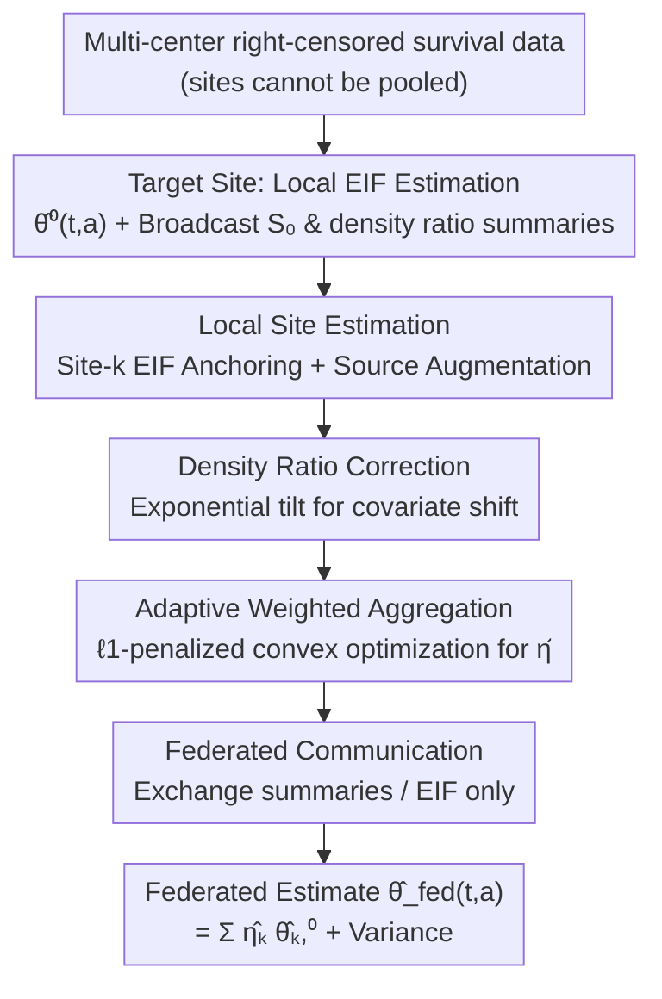

# Privacy-Protected Causal Survival Analysis Under Distribution Shift

**Conference**: ICLR 2026  
**OpenReview**: [https://openreview.net/forum?id=aTxnsFFO7t](https://openreview.net/forum?id=aTxnsFFO7t)  
**Code**: https://github.com/yiliu1998/FuseSurv  
**Area**: Causal Inference / Survival Analysis / Federated Learning  
**Keywords**: Causal Survival Analysis, Data Fusion, Federated Learning, Distribution Shift, Semiparametric Efficiency, Doubly Robust

## TL;DR
To address the challenge where "multi-center survival data cannot be pooled due to privacy constraints and distributions across sites are inconsistent," this paper utilizes influence function theory to construct a local estimator for each external source site anchored to the target site. It then adaptively weights source sites using convex optimization with an $\ell_1$ penalty (weighting aligned sources and zeroing out biased ones). Transferring only summary statistics throughout, the method achieves a doubly robust and strictly more efficient target population survival function estimation as long as at least one source is consistent.

## Background & Motivation

**Background**: In clinical research, it is often desirable to fuse "time-to-event" data (e.g., recurrence, death, HIV infection) from multiple institutions to improve statistical efficiency, especially for rare events. However, causal data fusion methods for survival data are far less mature than those for continuous/binary outcomes—existing federated causal inference works (Han et al. 2023/2024/2025) focus almost exclusively on continuous, ordinal, or binary outcomes, whereas survival data entails right censoring, which is inherently more difficult to handle.

**Limitations of Prior Work**: Existing routes for causal fusion of multi-site survival data have significant flaws. First is direct pooling: when covariates, outcomes, or censoring mechanisms shift across sites, naive pooling introduces bias and leads to distorted conclusions. Second is the reliance on strong assumptions: Cox proportional hazards models impose a log-linear risk structure, or require the "Common Conditional Outcome Distribution" (CCOD, i.e., the event time distribution given covariates is independent of the site) to hold across sites—homogeneous assumptions that are frequently violated in heterogeneous populations, leading to biased estimation and inference. Third is privacy: timestamped event histories are identifiable information under GDPR/HIPAA, and raw trajectories are not allowed to be shared; privacy-preserving survival methods are currently scarce.

**Key Challenge**: To improve efficiency by borrowing information from external source sites, one must assume they are "similar enough" to the target site (CCOD); however, if they are not similar enough, the borrowed information biases the target estimation—this creates a fundamental tension between "efficiency gain" and "fidelity." Compounded by the privacy wall preventing raw data from leaving sites, the problem becomes: how to use only summary statistics to automatically absorb credible sources and eliminate biased ones without knowing which sources are trustworthy a priori?

**Goal**: Estimate the potential survival function for a specific treatment at the target site ($R=0$), $\theta_0(t,a)=P(T(a)>t\mid R=0)$, requiring: (i) no pooling of raw data; (ii) tolerance to shifts in covariates, outcomes, and censoring; (iii) double robustness and semiparametric efficiency; (iv) being strictly more efficient than "target-only" estimation as long as at least one source is consistent.

**Key Insight**: Instead of assuming a global CCOD, the authors posit a local "Site $k$ CCOD" assumption for each source site individually to **derive** that source's influence function, obtaining a local estimator anchored to the target. Whether this assumption holds is left for subsequent adaptive weighting to test and correct. This transforms the question of "whether to trust a source" from a prior assumption into a data-driven weight that can be automatically zeroed.

**Core Idea**: Utilize the Efficient Influence Function (EIF) to create a "target-anchored + source-augmented" local estimator for each source, then use $\ell_1$ convex optimization to align sources to the target distribution and automatically sparsify biased sources, exchanging only summary statistics throughout.

## Method

### Overall Architecture

The method follows a federated learning pipeline (McMahan et al. 2017 paradigm): the target site first calculates a semiparametrically efficient "target-only" estimate and broadcasts the $S_0$ conditional survival model parameters and summary statistics required for density ratio estimation to all source sites. Each source site locally calculates a target-anchored local estimator $\hat\theta_n^{k,0}(t,a)$ and its corresponding influence function using the EIF. These EIFs are sent to a "Master Analysis Center," which solves a convex optimization problem with an $\ell_1$ penalty to obtain time- and treatment-specific weights $\hat\eta_{t,a}$. The final federated estimate is a weighted average of the local estimates. Only summary-level information is transmitted; raw participant data never leaves local sites.

### Key Designs

**1. EIF under Site-k CCOD: Target-Anchored + Source-Augmented Local Estimator**

To address the failure of global CCOD, the authors posit a "Site $k$ CCOD" assumption ($S_k(t\mid a,X)=S_0(t\mid a,X)$ almost surely) for each source $k$ individually, **only for the purpose of deriving** the source's semiparametric EIF (Theorem 2.5):

$$\varphi^{*k,0}_{t,a}(O;P)=\underbrace{\frac{I(R=0)}{P(R=0)}\{S_0(t\mid a,X)-\theta_0(t,a)\}}_{\text{Anchoring term using target data}}-\underbrace{\frac{I(R=k)}{P(R=k)}\,\omega_{k,0}(X)\,S_k(t\mid a,X)\frac{I(A=a)}{\pi_k(a\mid X)}H_{t,a}(O;S_k,G_k)}_{\text{Augmentation term using source data}}.$$

The anchoring term uses only target site data and the conditional survival model $S_0$ to fix the estimate to the target population. The augmentation term absorbs source $k$ information and uses the density ratio $\omega_{k,0}(X)=P(X\mid R=0)/P(X\mid R=k)$ to "shift" the source covariate distribution to the target distribution. $H_{t,a}$ is the inverse probability weighted zero-mean residual for censoring (Eq. 1). This design ensures double robustness (Theorem 2.8): at any time point, if either (i) the conditional survival model $S_k$ is correct, or (ii) other nuisance functions $G_k,\pi_k,\omega_{k,0}$ are correct, $\hat\theta_n^{k,0}$ remains consistent—errors in the density ratio only enter through a second-order product residual.

**2. Exponential Tilt Density Ratio: Correcting Covariate Shift under Privacy Constraints**

The density ratio $\omega_{k,0}(X)$ in the augmentation term is key to correcting covariate distribution shifts, but estimating it cannot involve sending raw covariates. The authors use an exponential tilt model (Remark 2.7) $\omega_{k,0}(X)=\exp(\gamma_k'\psi(X))$, where $\psi(\cdot)$ is a set of basis functions for the covariates. To estimate $\gamma_k$ via maximum likelihood, **only the sample mean $\mathbb{E}[\psi(X)]$ from the target site needs to be shared** with source sites. More flexible non-parametric density ratios can be used, but at the cost of sharing higher-dimensional summaries like covariance matrices—a clear trade-off between model flexibility and information leakage.

**3. $\ell_1$-Penalized Convex Optimization Aggregation: Automatic Selection of Effective Sources**

After obtaining local estimates, how should they be aggregated? The authors define site divergence $\hat\chi_{n,t,a}^{k,0}=\hat\theta^{k,0}(t,a)-\hat\theta^0(t,a)$ and solve a constrained convex optimization (Eq. 2):

$$Q(\eta_{t,a})=\mathbb{P}_n\Big[\big(\hat\varphi^{*0}_{t,a}-\textstyle\sum_{k\ge1}\eta_{t,a}^k\hat\varphi^{*k,0}_{t,a}\big)^2\Big]+\frac{1}{n\lambda}\sum_{k\ge1}|\eta_{t,a}^k|\,(\hat\chi_{n,t,a}^{k,0})^2,$$

subject to $\eta_{t,a}^k\ge0$ and $\sum_k\eta_{t,a}^k=1$. The quadratic term allows sources whose "EIF aligns with the target distribution" to contribute more; the $\ell_1$ penalty weight $(\hat\chi^{k,0}_{n,t,a})^2$ ensures that sources with larger divergence are penalized more heavily, **driving their weights directly to 0** (inducing sparsity) to asymptotically include only the "oracle" set of informative sources. The final federated estimator is $\hat\theta_n^{\text{fed}}(t,a)=\sum_{k=0}^{K-1}\hat\eta_{t,a}^k\hat\theta_n^{k,0}(t,a)$, which (Corollary 2.11) has an asymptotic variance no larger than the target-only estimator.

**4. Summary-Level Federated Communication Protocol**

To satisfy GDPR/HIPAA, all steps are restricted to transferring summaries (Remark 2.9, Algorithm 1): source sites receive $S_0$ parameters and density ratio statistics; the analysis center receives only EIFs. The hyperparameter $\lambda$ is selected via cross-validation at the center. This differs from decentralized "consensus" schemes or traditional meta-analyses using only population-level summaries, which lack sufficient information in this setting. The cost is communication volume increasing linearly with the evaluation time grid $n_\tau$ ($O(n\cdot n_\tau)$), with smoothing left for future work.

### Loss & Training

The core optimization objective is $Q(\eta_{t,a})$ in Eq. 2, solved for each $(t,a)$ on a fine time grid $\{0,\epsilon,\dots,\tau\}$. Nuisance functions ($S_k,G_k,\pi_k,\omega_{k,0}$) are estimated using $M$-fold cross-fitting and ensemble learning (e.g., Kaplan–Meier, Cox, Survival Random Forest via survSuperLearner; propensity scores via SuperLearner). The federated variance $\hat V_{t,a}^{\text{fed}}$ is provided by its influence function, supporting Wald-type confidence intervals.

## Key Experimental Results

### Main Results (Simulation Study)

Set $K=5$ sites, target $n_0=300$, source $n_k\in\{300,600,1000\}$, 500 iterations; compared FED (Ours), TGT (Target only), POOL (Naive pooling), IVW (Inverse Variance Weighting), and META-IVW (Meta-analysis with density ratio correction). Metrics: Bias and RRMSE (RMSE relative to TGT, <1 indicates efficiency gain). Table shows day-30 treatment arm ($A=1$) RRMSE:

| Scenario | FED | TGT | META-IVW | IVW | POOL |
|------|-----|-----|----------|-----|------|
| Homogeneous | 0.41 | 1 | 0.16 | 0.07 | 0.06 |
| Covariate Shift | 0.51 | 1 | 0.27 | 0.47 | 0.62 |
| Outcome Shift | 0.43 | 1 | 4.32 | 5.34 | 6.04 |
| Censoring Shift | 0.42 | 1 | 0.24 | 0.11 | 0.06 |
| All Shift | 0.54 | 1 | 0.40 | 12.81 | 14.64 |

FED shows negligible bias across all scenarios, with RRMSE reductions up to 59%; POOL/IVW/META-IVW explode (RRMSE >4 or >14) under outcome or all shifts, showing they are corrupted by biased sources.

### Coverage Probability (CP%, good overlap, day-30)

| Method | Homogeneous | Covariate | Outcome | Censoring | All Shift |
|------|-------------|-----------|---------|-----------|-----------|
| FED | 89.8 | 90.6 | 92.2 | 91.2 | 92.0 |
| TGT | 92.2 | 92.4 | 92.2 | 92.0 | 90.6 |
| META-IVW | 83.4 | 74.6 | 1.6 | 90.2 | 48.4 |
| POOL | 97.0 | 96.6 | 0.0 | 95.0 | 0.0 |

FED and TGT maintain CP% near 95%, validating the EIF-based variance estimation; POOL/META-IVW coverage collapses to near 0 under Outcome Shift.

### Key Findings
- **Adaptive Weights Function Properly**: Diagnosis shows $\hat\eta_{t,a}$ decreases systematically as site divergence $(\hat\chi_{n,t,a}^{k,0})^2$ increases—the target site assumes higher weight during covariate/outcome shifts, while biased sources are suppressed.
- **Greater Gain at Early Time Points**: Efficiency gain is maximized when source survival curves are closer to the target early on; under limited overlap, FED's gain is more pronounced as source data stabilizes estimates.
- **Censoring Shift is an Exception**: POOL/IVW perform reasonably well under Censoring Shift because censoring is a nuisance function estimated locally per site, making the global estimate less sensitive to censoring heterogeneity.
- **Real-world Application (AMP HIV-1 Trial)**: 4611 participants across 4 regions. Using SA as the target, OA (most similar) received the highest weight, while BP/US were downweighted due to differences in baseline risk and HIV prevalence. FED recovered narrower intervals where TGT failed due to insufficient early events.

## Highlights & Insights
- **Transforming Trust into a Zeroable Weight**: Positing Site-k CCOD only to derive EIF and using $\ell_1$ penalties to eliminate sources that violate the assumption avoids the "global homogeneity" trap—a paradigm shift from hard assumptions to data-driven selection.
- **Simultaneous Privacy and Rigor**: Double robustness and semiparametric efficiency provide strong statistical guarantees, while the exponential tilt density ratio only requires sharing sample means.
- **Clever Target-Anchoring**: By splitting the EIF into "target anchoring" and "source augmentation," source data only enters via the augmentation term, ensuring the target estimate's validity isn't destroyed by biased sources; at worst, weights go to zero.
- **Clear Reductive Relationships**: Without time/censoring, the method reduces to the FACE estimator (Han et al. 2025), representing a rigorous extension of data fusion to survival contexts.

## Limitations & Future Work
- **Spatiotemporal Smoothing of Weights**: Current time-specific weights may produce non-smooth trajectories, and communication scales linearly with the time grid $n_\tau$.
- **Pooling when CCOD Fails**: If data sharing is allowed but CCOD fails, it remains an open question if any pooling method can outperform the target-only semiparametric estimate.
- **Positivity Violations**: Systematic differences in treatment distribution or limited covariate overlap can make target estimates unidentifiable or density ratios difficult to estimate.
- **Time-Varying Covariates**: The framework does not currently handle time-varying covariates.

## Related Work & Insights
- **vs META-IVW / IVW**: Traditional meta-analyses require conditional homogeneity; this work uses $\ell_1$ sparsity to zero out biased sources and anchors them to the target population, remaining robust under outcome shifts where META-IVW fails.
- **vs POOL**: Pooling has minimal variance when homogeneous but introduces significant bias under shift; this work sacrifices minimal variance for robustness and valid intervals.
- **vs FACE (Han et al. 2025)**: FACE targets binary/continuous outcomes; this work extends it to right-censored survival outcomes using product-limit representations and proves the semiparametric efficiency bound under Site-k CCOD.
- **vs FedECA (Ogier du Terrail et al. 2025)**: FedECA focuses on federated external controls for single-arm trials via IPW-Cox; this work handles more general multi-source two-arm fusion using EIF and ensemble learning.

## Rating
- Novelty: ⭐⭐⭐⭐⭐ First work to integrate double robustness, semiparametric efficiency, adaptive source selection, and privacy in causal survival fusion.
- Experimental Thoroughness: ⭐⭐⭐⭐ Comprehensive simulation across five shift scenarios and two real datasets.
- Writing Quality: ⭐⭐⭐⭐ Theoretically rigorous with clear algorithms, though high notation density might challenge non-statisticians.
- Value: ⭐⭐⭐⭐⭐ Directly addresses the pain point of "wanting to fuse but unable to share" multi-center clinical data; highly practical with the R package FuseSurv.

<!-- RELATED:START -->

## Related Papers

- [\[NeurIPS 2025\] Cyclic Counterfactuals under Shift–Scale Interventions](../../NeurIPS2025/causal_inference/cyclic_counterfactuals_under_shift-scale_interventions.md)
- [\[ICLR 2026\] SelfReflect: Can LLMs Communicate Their Internal Answer Distribution?](selfreflect_can_llms_communicate_their_internal_answer_distribution.md)
- [\[ICLR 2026\] Efficient and Sharp Off-Policy Learning under Unobserved Confounding](efficient_and_sharp_off-policy_learning_under_unobserved_confounding.md)
- [\[ICLR 2026\] Conformalized Survival Counterfactuals Prediction for General Right-Censored Data](conformalized_survival_counterfactuals_prediction_for_general_right-censored_dat.md)
- [\[ICML 2025\] Doubly Protected Estimation for Survival Outcomes Utilizing External Controls for Randomized Clinical Trials](../../ICML2025/causal_inference/doubly_protected_estimation_for_survival_outcomes_utilizing_external_controls_fo.md)

<!-- RELATED:END -->
