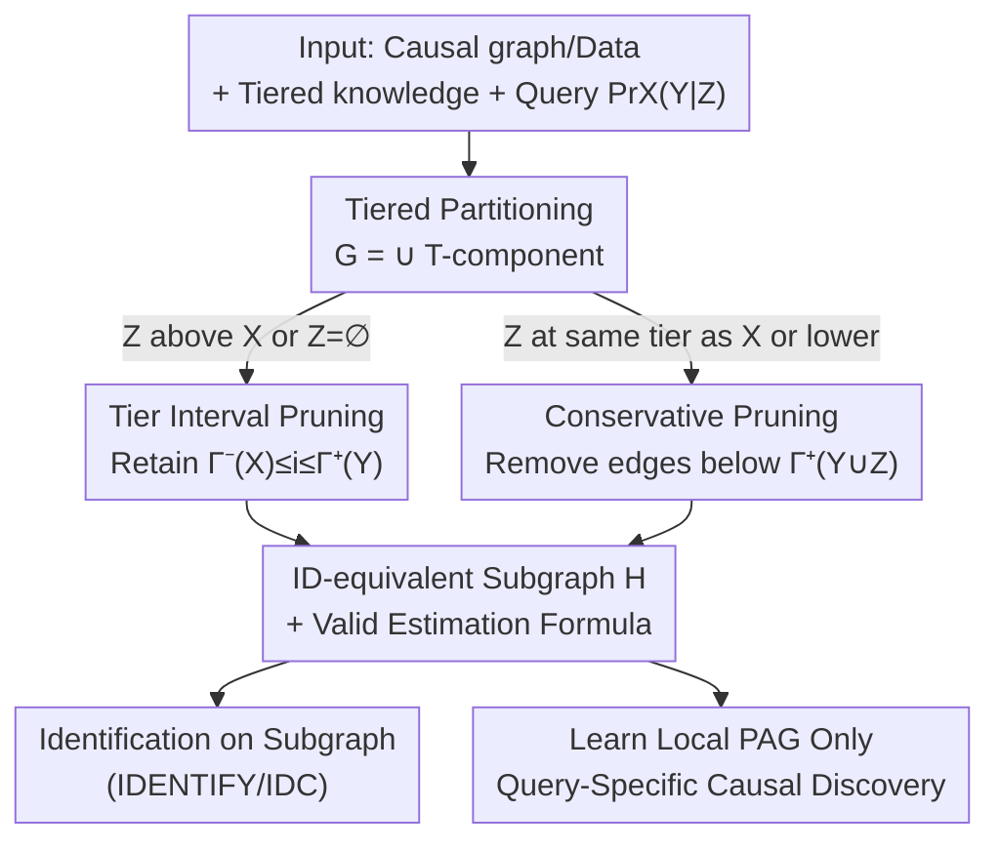

# Query-Specific Causal Graph Pruning under Tiered Knowledge

**Conference**: ICLR 2026  
**OpenReview**: [https://openreview.net/forum?id=bOfiLeoUJf](https://openreview.net/forum?id=bOfiLeoUJf)  
**Code**: None  
**Area**: Causal Inference  
**Keywords**: Causal Identification, Graph Pruning, Tiered Knowledge, Causal Discovery, Identifiability

## TL;DR
This paper proposes a method to **prune edges** from a causal graph using "tiered knowledge" while maintaining the identifiability of (conditional) causal effects. By reducing the identification problem to a smaller subgraph, it designs a query-specific causal discovery algorithm that achieves exponential speedup compared to existing methods.

## Background & Motivation
**Background**: Causal identification is the standard means to answer interventional queries (e.g., $\Pr_X(Y)$, $\Pr_X(Y\mid Z)$). Given a causal graph $G$ and an observational distribution $\Pr(V)$, one determines if a query is uniquely identified (identifiability problem) and provides an estimation formula. Algorithms like IDENTIFY, ID, do-calculus, and IDC are sound and complete for this task.

**Limitations of Prior Work**: The identifiability conclusions and estimation formulas of these algorithms **rely heavily on the entire causal graph**. In practice, obtaining the full graph requires either manual labeling of every edge direction (enormous workload for large graphs) or learning from data via causal discovery (computational cost for a full PAG explodes with the number of variables). Requiring the whole graph to answer a specific query is a significant bottleneck.

**Key Challenge**: Answering a **specific** causal query typically only involves a small portion of the graph. However, existing workflows do not distinguish between "query-relevant" and "query-irrelevant" edges, requiring the full specification or learning of the graph, leading to unnecessary labeling and computation.

**Goal**: ① Characterize the conditions under which edges can be pruned from a causal graph without breaking the identifiability of a given (conditional) causal effect; ② Reduce the identification problem to this pruned subgraph (and provide valid estimation formulas); ③ Utilize pruning as a preprocessing step to accelerate data-driven causal discovery.

**Key Insight**: Many practical scenarios naturally possess **tiered knowledge**, where variables are partitioned into several "tiers" with causal ordering. Directed edges are only allowed from higher tiers to lower tiers (e.g., time steps in time series, exogenous context variables). While this structural info was previously used to constrain search spaces in causal discovery, this paper uses it to **determine which edges are irrelevant to the current query and can be safely pruned**.

**Core Idea**: Decompose the causal graph into several T-components based on tiers. For a query $\Pr_X(Y\mid Z)$, only the edges falling within the tier interval $[\Gamma^-(X), \Gamma^+(Y)]$ are retained, and the rest are pruned. This results in a smaller graph that is "ID-equivalent" to the original, upon which identification and discovery are performed.

## Method

### Overall Architecture
The core problem is how to achieve identification **without specifying the entire causal graph** given a (conditional) causal effect query. The approach follows a three-step pipeline. First, tiered knowledge is used to decompose the graph into $t$ **T-components** $G_1, \dots, G_t$ (the $i$-th T-component collects all edges where the maximum tier of the endpoints equals $i$). The full graph is the union $G = \bigcup_i G_i$. Second, for a specific query, only "query-relevant" T-components are merged to form a pruned graph $H$. It is proven that $H$ is **ID-equivalent** to $G$ for that query, and an estimation formula correct for $G$ is derived using $H$. Third, this pruning is extended to "PAG / Causal Discovery" scenarios: since only a "local PAG" needs to be learned, many conditional independence tests can be skipped, accelerating the process.

The process is a serial pipeline of "Tiered Partitioning → Query-specific Pruning → Identification/Discovery on Subgraph," where branches depend on where the conditioning set $Z$ is located.

### Key Designs

**1. T-component Decomposition: Translating tiered knowledge into prunable structural units**

To prune edges by query, a method to organize edges by tier is needed. Following the definition by Andrews et al., the $i$-th T-component $G_i$ is a subgraph containing all variables but only edges $(l, r)$ satisfying $\max\{\Gamma(l), \Gamma(r)\} = i$, where $\Gamma(X)$ is the tier index of variable $X$. Essentially, an edge belongs to the tier of its "lower" (higher tier index) endpoint. Any causal graph with tiered knowledge can be losslessly decomposed into the union $G = \bigcup_{i=1}^t G_i$. This serves as the underlying structure for pruning by "dropping" certain T-components.

**2. Tier Interval Pruning for Causal Effects: Identification only needs $[\Gamma^-(X), \Gamma^+(Y)]$**

For the unconditional causal effect $\Pr_X(Y)$, the main result (Proposition 3.2) states: let $H$ be the union of all T-components $G_i$ satisfying $\Gamma^-(X) \le i \le \Gamma^+(Y)$. Then $\Pr_X(Y)$ is identifiable in $G$ **if and only if** it is identifiable in $H$, and can be calculated as:

$$\Pr_x(y) = \sum_{w \setminus y} \Pr(w) \cdot \mathrm{IDENTIFY}_H\big(x \cup w, y \setminus w\big)$$

where $W$ represents variables with tier indices strictly less than $\Gamma^-(X)$. Here $\Gamma^-(X) = \min_{X \in X} \Gamma(X)$ and $\Gamma^+(Y) = \max_{Y \in Y} \Gamma(Y)$. The implication is: **tiers higher than the treatment variables and tiers lower than the outcome variables are completely irrelevant for identification and can be removed.** Interestingly, the pruned graph must retain **cross-tier edges** (e.g., $A_1 \to C_1$) for two reasons: learning without them introduces false positives, and they simplify estimation formulas. Proposition 3.3 proves these boundaries are **tight**. Proposition 3.4 shows that for certain classes of graphs, the size of the pruned graph for a fixed query remains **constant** even as the original graph grows infinitely with tiers.

**3. Dual-mode Pruning for Conditional Causal Effects: Pruning based on the position of $Z$**

Pruning for $\Pr_X(Y \mid Z)$ is more subtle as it depends on where the conditioning variables $Z$ reside. Two complementary propositions are given. Proposition 3.5: When $\Gamma^+(Z) < \Gamma^-(X)$ ($Z$ is entirely above the treatment), the tier interval $[\Gamma^-(X), \Gamma^+(Y)]$ still suffices, and:

$$\Pr_x(y \mid z) = \frac{\Pr_x(y, z)}{\Pr(z)}$$

However, this only holds if $Z$ is above $X$. If $Z$ is at the same tier or lower, identification conclusions might flip after incorrect pruning. To address this, Proposition 3.6 provides a conservative but **always applicable** pruning: let $H$ be the union of all T-components $i \le \Gamma^+(Y \cup Z)$ (removing tiers below the lowest of $Y \cup Z$). This maintains identifiability conclusions and ensures formulas calculated on $H$ are correct for $G$.

**4. Query-Specific Causal Discovery: Exponential speedup by learning local PAGs**

When the graph is unknown, pruning serves as a **preprocessing** step for causal discovery (Algorithm 1). It adds a step before the FCITIERS algorithm: based on the query and tier of $Z$, it calculates which T-components to keep (via Prop 3.2–3.6). It then only calls `FCIEXOGENOUS` for these remaining T-components to build a **local PAG**. Proposition 4.1 proves this is sound and complete. The speedup comes from skipping the exponentially many conditional independence tests required to learn edges in the pruned tiers. Proposition 4.2 describes instances where FCITIERS requires $O(n^2 \cdot 2^n)$ while this algorithm needs only $O(n^4)$.

## Key Experimental Results

### Main Results
The experiment validates the efficiency of query-specific discovery (Algorithm 1) against FCITIERS (full PAG). Setup: random tiered graphs with $T \in \{5, \dots, 10\}$ layers, 10 variables per layer, and max neighborhood size of 4. 500,000 samples were used with random queries.

| Contrast Dimension | FCITIERS (Full PAG) | Algorithm 1 (Local PAG) | Conclusion |
|--------------------|---------------------|-------------------------|------------|
| Execution Time     | Baseline            | Shorter                 | Faster across all configs |
| Growth with $T$    | Rapid increase      | Slow increase           | Gap widens with depth |
| Complexity (Worst case) | $O(n^2 \cdot 2^n)$  | $O(n^4)$                | Exponential → Polynomial |

### Ablation Study

| Config (Conditioning set size) | Phenomenon | Explanation |
|-------------------------------|------------|-------------|
| $|Z| = 0$ (Causal Effect)     | Most significant speedup | Largest pruning space |
| Increasing $|Z|$ (1→3)       | Reduced speedup | Harder to satisfy $\Gamma^+(Z) < \Gamma^-(X)$, forcing conservative pruning |
| Precision & Recall            | Identical to FCITIERS | Acceleration does not sacrifice correctness |

### Key Findings
- **Speedup comes from "Pruning Higher Tiers"**: The more tiers and the closer the query is to lower tiers, the more higher-tier edges are pruned, leading to significant speedups.
- **Conditioning sets are double-edged**: Larger $Z$ are more likely to violate the tight pruning condition, forcing a retreat to conservative pruning and reducing gains.
- **Zero Loss in Correctness**: Local PAGs match full PAGs in precision and recall, confirming pruning saves computation without losing accuracy.

## Highlights & Insights
- **Upgrading Background Knowledge**: It proves tiered knowledge can do more than just constrain search; it can directly simplify the target graph for identification.
- **Edge vs. Node Pruning**: Unlike classical functional projection which removes **variables** and requires a known graph, this method removes **edges** and only requires tiered knowledge, allowing it to save both labeling and computation.
- **Decoupling Scale**: The "constant sized pruned graph" insight suggests that answering certain queries in massive graphs can be independent of the total graph size, which is highly valuable for industrial applications.
- **Reusable Trick**: Using query-specific pruning as a "plugin" for discovery is a transferable idea for other causal tasks with structural priors.

## Limitations & Future Work
- **Tier 2 Queries Only**: Currently handles interventional effects; does not yet support counterfactuals (higher-tier queries).
- **No Cross-tier Bi-directed Edges**: Tiered knowledge assumes bi-directed edges are within tiers; the framework does not yet handle cross-tier latent confounding.
- **Diminishing Returns with Large $Z$**: If a query naturally involves many low-tier conditioning variables, gains from pruning are limited.
- **Synthetic Data**: Evaluation is based on synthetic graphs; performance on real-world distributions where edge density might vary across tiers remains to be verified.

## Related Work & Insights
- **vs. (Latent) Projection (Verma 1993; Tian & Pearl 2002)**: Projection simplifies by removing latent variables but requires the **whole graph**. This method removes edges and requires only tiered knowledge.
- **vs. Functional Projection (Chen & Darwiche 2024)**: The latter uses functional dependencies to remove variables; this paper uses tiers and edges, which are orthogonal simplification dimensions.
- **vs. FCITIERS (Andrews et al. 2020)**: This paper builds a preprocessing layer on top of FCITIERS, achieving exponential speedup in worst-case scenarios while maintaining soundness.

## Rating
- **Novelty**: ⭐⭐⭐⭐⭐ Systematically characterizing edge pruning for identifiability via tiers is a fresh and theoretically sound perspective.
- **Experimental Thoroughness**: ⭐⭐⭐⭐ Validated speedup and correctness thoroughly, though lacks real-world data end-to-end experiments.
- **Writing Quality**: ⭐⭐⭐⭐⭐ Propositions flow logically, and the failure case for Prop 3.5 is well-explained.
- **Value**: ⭐⭐⭐⭐ Direct value for labeling and compute savings in large-scale tiered graphs (time series, exogenous contexts).

<!-- RELATED:START -->

## Related Papers

- [\[ICLR 2026\] LLMs Struggle to Balance Reasoning and World Knowledge in Causal Narrative Understanding](llms_struggle_to_balance_reasoning_and_world_knowledge_in_causal_narrative_under.md)
- [\[ICLR 2026\] Learning Dynamic Causal Graphs Under Parametric Uncertainty via Polynomial Chaos Expansions](learning_dynamic_causal_graphs_under_parametric_uncertainty_via_polynomial_chaos.md)
- [\[ICLR 2026\] Privacy-Protected Causal Survival Analysis Under Distribution Shift](privacy-protected_causal_survival_analysis_under_distribution_shift.md)
- [\[AAAI 2026\] Sparse Additive Model Pruning for Order-Based Causal Structure Learning](../../AAAI2026/causal_inference/sparse_additive_model_pruning_for_order-based_causal_structure_learning.md)
- [\[ICLR 2026\] Resisting Contextual Interference in RAG via Parametric-Knowledge Reinforcement](resisting_contextual_interference_in_rag_via_parametric-knowledge_reinforcement.md)

<!-- RELATED:END -->
