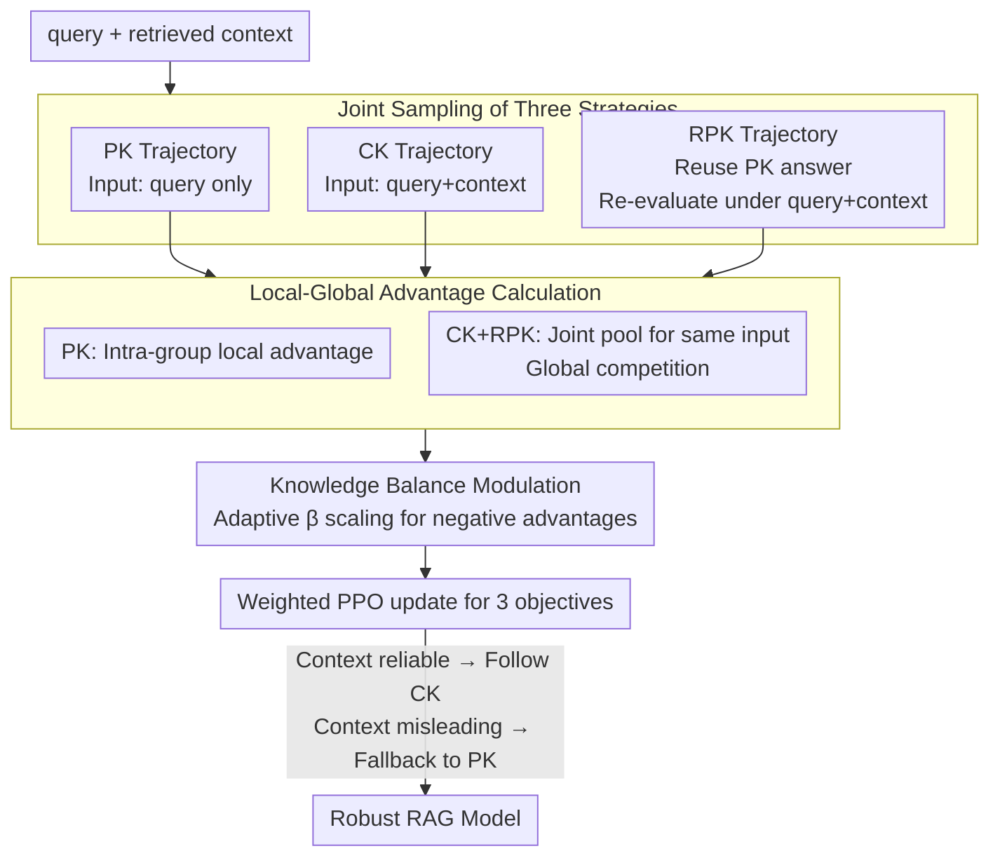

# Resisting Contextual Interference in RAG via Parametric-Knowledge Reinforcement

**Conference**: ICLR2026  
**arXiv**: [2506.05154](https://arxiv.org/abs/2506.05154)  
**Code**: [lcy80366872/knowledgeable-R1](https://github.com/lcy80366872/knowledgeable-R1)  
**Area**: Causal Inference  
**Keywords**: RAG, Parametric Knowledge, Reinforcement Learning, Knowledge Conflict, GRPO  

## TL;DR
This paper proposes Knowledgeable-R1, a reinforcement learning framework that enables LLMs to resist interference from misleading retrieval contexts in RAG scenarios while preserving the ability to utilize reliable context. This is achieved through joint sampling of parametric knowledge (PK) and contextual knowledge (CK) trajectories, combined with local/global advantage calculation and adaptive asymmetric advantage transformation.

## Background & Motivation
RAG reduces hallucinations and factual errors in LLMs by introducing external retrieved content. However, when the retrieved context contains noise, counterfactuals, or internal contradictions, LLMs often over-rely on this external information and suppress their own parametric knowledge, a phenomenon known as **context dominance**. Existing methods have significant limitations:

- **Prompting methods** (e.g., Astute-RAG): Guide models to verify/filter context but increase computational complexity and lack universal decision rules.
- **Decoding methods** (e.g., CK-PLUG): Adjust token distributions to alleviate conflict but lack generalization capability.
- **Fine-tuning methods** (e.g., Self-RAG, InFO-RAG): Require complex data annotation processes, limiting flexibility and scalability.
- **Standard GRPO**: The sampling space is restricted to query+context inputs, making it difficult for the model to explore the critical but rare decision of "ignoring context and falling back to parametric knowledge."

## Core Problem
How can LLMs in RAG systems make **dynamic decisions**: when to trust retrieved contextual knowledge (CK) and when to fall back to their own parametric knowledge (PK), significantly improving robustness against misleading context without compromising normal RAG performance?

## Method

### Overall Architecture
Knowledgeable-R1 aims to solve **context dominance** in RAG: when retrieved context is noisy or counterfactual, the model is misled and suppresses its own correct parametric knowledge. The approach treats the decision of "whether to trust this context" as an object for RL exploration, built on top of standard GRPO.

For each query, the framework **simultaneously samples three types of trajectories**: a parametric knowledge trajectory (PK) fed only the query, a contextual knowledge trajectory (CK) fed query+context, and a robust parametric knowledge trajectory (RPK) which attempts to replicate the parametric answer even with the query+context input. After receiving rewards based on exact match (EM), these trajectories enter a **hybrid local/global advantage calculation**: PK is normalized within its own group, while CK and RRPK compete in a joint "input $p'$ joint pool." Finally, an **adaptive asymmetric advantage transformation** adjusts the penalty intensity, and the three PPO-style objectives are weighted to update the model. After training, the model does not require explicit switches; the token distribution inherently encodes "following CK when context is reliable and falling back to PK when context is misleading."

### Key Designs

**1. Joint Sampling of Three Strategies: Making "Ignoring Context" a Samplable Trajectory**

Standard GRPO only samples under query+context input, meaning the model rarely samples the rare but crucial behavior of "ignoring context and falling back to parametric knowledge," thus being misled by incorrect context. Here, three decoding strategies are explicitly defined for each query: PK uses input $p$ (query only) to generate answer $o$; CK uses input $p'$ (query+context) to generate answer $o'$ utilizing context; RPK also uses input $p'$, but **does not independently generate a new answer**. Instead, it takes the sampled PK trajectory $o^{pk}$ as the target and re-evaluates its log-probability $\pi_\theta(o_t^{pk} \mid p', o_{<t}^{pk})$ token-by-token under $p'$. This adds "retaining PK tokens despite context presence" to the sampling space with almost no extra overhead, allowing direct optimization through rewards and penalties.

**2. Local-Global Advantage Calculation: CK and RPK Competition Under the Same Input**

Since the three trajectory types have different goals, their advantage normalization ranges are designed separately. PK uses only local advantages $A_i = A_i^{pk\text{-}local}$ obtained via Z-score normalization within its strategy group, focusing on the accuracy of query-only answers. CK takes the sum of local and global terms $A_j' = A_j^{ck\text{-}local} + A_j^{ck\text{-}global}$, where the global term is normalized in the "input $p'$ joint pool" $\mathcal{U}_{p'} = \{R_j^{ck}\} \cup \{R_i^{rpk}\}$. RPK takes only the global advantage $\hat{A}_i = \hat{A}_i^{global}$ competing in the same pool. Since CK and RPK share the input $p'$, CK gains an advantage when both are correct due to its timeliness/reliability. When context is misleading, RPK receives a positive advantage. This global normalization preserves cross-source preference signals that standard intra-group normalization would suppress.

**3. Knowledge Balance Modulation: Controlling PK Exploration via Adaptive $\beta$**

Indiscriminately encouraging RPK harms normal RAG (failing to trust valid context), while suppressing it reverts to context dominance. The penalty intensity requires a dynamic balance. The method introduces an asymmetric advantage transformation $T(\hat{A}_i; \beta)$: positive advantages are kept as is, while negative advantages are multiplied by a coefficient $\beta \in [0.01, 1]$. This "softens" the penalty for RPK exploration without weakening positive rewards. $\beta$ is not manually tuned but calculated in real-time based on the cumulative advantages of CK and RPK in the mini-batch: $\beta \leftarrow \text{clip}\big((S_{ck} - S_{rpk+})/S_{rpk-},\, 0.01,\, 1\big)$. When CK significantly outperforms RPK, $\beta$ decreases to release PK exploration; as the gap narrows, $\beta$ increases for more cautious training. This value converges within about 8 steps, eliminating the need for hyperparameter re-tuning per dataset.

### Loss & Training
The total objective is a weighted sum of PPO-style clipped updates for the three trajectory types:

$$\mathcal{J}(\theta) = \lambda_{pk} J_{PK} + \lambda_{ck} J_{CK} + \lambda_{rpk} J_{RPK}$$

In experiments, all weights are set to $\lambda_{pk} = \lambda_{ck} = \lambda_{rpk} = 1.0$, with clipping parameter $\epsilon = 0.2$. Because RRPK reuses PK trajectories without extra rollouts, the training cost is nearly identical to standard GRPO.

## Key Experimental Results
Evaluated across 5 context scenarios (Correct, Adversarial, Self-Contradictory, Irrelevant, Partially Relevant) using Qwen2.5-7B-Instruct:

| Scenario | RAG Prompting | GRPO w/ RAG | Knowledgeable-R1 | Gain |
|------|:---:|:---:|:---:|:---:|
| S1 Correct Context (PC-QA) | 74.35% | 80.03% | **80.90%** | +6.54% |
| S2 Adversarial Context (NC-MR) | 13.47% | 26.94% | **43.94%** | +30.47% |
| S2 Adversarial Context (NC-MC) | 8.06% | 19.74% | **37.34%** | +29.28% |
| S3 Self-Contradictory (SC) | 59.50% | 75.33% | **76.33%** | +15.92% |
| S4 Irrelevant Context (ExplainPE) | 62.21% | 66.50% | **67.57%** | +5.36% |
| S5 Partially Relevant (HotpotQA) | 20.36% | 27.93% | **31.45%** | +11.09% |

On the subset where parametric knowledge provides the correct answer, NC-MR/MC/QA shows an average improvement of **+22.89%** over GRPO w/ RAG. Consistent gains were also observed on Llama3.1-8B-Instruct.

**Ablation Study Key Findings**:
- Removing $J_{RPK}$ results in the largest performance drop in TIFE (PK Correct, Context Wrong) scenarios (MC dropped 33.12%).
- Removing adaptive $\beta$ dropped TIFE performance by 27.39% (MC).
- Removing global advantage $A^{ck\text{-}global}$ led to significant TIFE degradation.

## Highlights
- **Precise Problem Definition**: Knowledge conflict in RAG is explicitly decomposed into three sub-objectives (parametric accuracy, context utilization, robust fallback) with targeted joint sampling.
- **Clever RPK Design**: Reuses PK trajectories for re-evaluation under query+context instead of generating new ones, enabling exploration of "ignoring context" at low cost.
- **Adaptive $\beta$**: Maintains robustness across datasets without manual hyperparameter tuning and converges rapidly.
- **Strong Generalization**: Achieves significant improvements on 2WikiMultiHopQA and MuSiQue without fine-tuning.
- **Data Efficiency**: Training with only 1% erroneous context still outperforms GRPO, indicating learning of decision boundaries rather than data statistics.

## Limitations & Future Work
- Gains in S3 (Self-Contradictory) and S5 (Partially Relevant) scenarios are relatively limited; handling internal context contradictions remains challenging.
- Sensitivity to different conflict ratios (e.g., 1 wrong vs. 4 wrong results in top-5 retrieval) was not analyzed.
- Joint sampling allocates about half the rollout budget to query-only PK trajectories, leading to slightly lower performance than GRPO w/ RAG in S1 (Correct Context) scenarios (can be mitigated by adjusting $\lambda_{ck}$).
- Only validated on knowledge-intensive QA tasks; more complex multi-source retrieval environments were not explored.

## Related Work & Insights
- **vs. GRPO w/ RAG**: GRPO lacks PK exploration due to sampling only under query+context; Knowledgeable-R1 explicitly encourages PK fallback, improving S2 scenarios by 22.89% on average.
- **vs. Self-RAG / InFO-RAG**: These SFT methods rely on complex annotation; Knowledgeable-R1 automatically learns decision rules via RL without explicit "trust context" labels.
- **vs. CK-PLUG**: CK-PLUG adjusts token probabilities at decoding time with limited effect (even worse in S2); Knowledgeable-R1 optimizes knowledge utilization strategies during training.
- **vs. Astute-RAG**: Astute-RAG uses prompting for filtering but performs poorly in irrelevant retrieval scenarios; Knowledgeable-R1 outperforms it across the board.

## Related Work & Insights
- The approach can be generalized to any "multi-source information fusion" scenario, such as selecting knowledge during vision-language conflicts.
- The "evaluating shared trajectories under different conditions" idea from RPK can be applied to other RL frameworks to reduce sampling overhead.
- The reward shaping strategy using adaptive $\beta$ can address general under-exploration issues in RL training.

## Rating
- Novelty: 8/10 — Joint sampling of three strategies and RPK design are innovative, though PPO-style optimization is standard.
- Experimental Thoroughness: 8/10 — 5 scenarios, 4 base models, detailed ablation, but missing conflict ratio analysis.
- Writing Quality: 7/10 — Clear method description but heavy on notation; some symbols could be simplified.
- Value: 8/10 — Addresses critical knowledge conflict in RAG with a concise and practical method.

<!-- RELATED:START -->

## Related Papers

- [\[ICLR 2026\] Designing Time Series Experiments in A/B Testing with Transformer Reinforcement Learning](designing_time_series_experiments_in_ab_testing_with_transformer_reinforcement_l.md)
- [\[ICLR 2026\] Journey to the Centre of Cluster: Harnessing Interior Nodes for A/B Testing under Network Interference](journey_to_the_centre_of_cluster_harnessing_interior_nodes_for_ab_testing_under_.md)
- [\[ICLR 2026\] Modeling Interference for Treatment Effect Estimation in Network Dynamic Environment](modeling_interference_for_treatment_effect_estimation_in_network_dynamic_environ.md)
- [\[ICLR 2026\] Learning Dynamic Causal Graphs Under Parametric Uncertainty via Polynomial Chaos Expansions](learning_dynamic_causal_graphs_under_parametric_uncertainty_via_polynomial_chaos.md)
- [\[ICLR 2026\] Query-Specific Causal Graph Pruning under Tiered Knowledge](query-specific_causal_graph_pruning_under_tiered_knowledge.md)

<!-- RELATED:END -->
