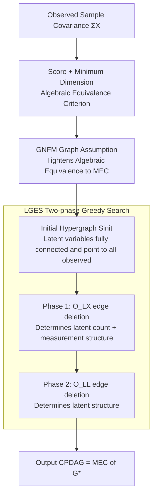

# Score-based Greedy Search for Structure Identification of Partially Observed Causal Models

**Conference**: ICLR 2026  
**OpenReview**: [https://openreview.net/forum?id=BNHplerBYE](https://openreview.net/forum?id=BNHplerBYE)  
**Code**: https://github.com/dongxinshuai/scm-identify (Available)  
**Area**: Causal Discovery / Causal Structure Learning with Latent Variables  
**Keywords**: Causal Discovery, Latent Variables, Score-based Greedy Search, Markov Equivalence Class, N Factor Model

## TL;DR
This paper proposes LGES, the first score-based greedy search method for causal models with latent variables that provides identifiability guarantees. It establishes an "algebraic equivalence" criterion using likelihood score and minimum dimensionality, then tightens this equivalence to the Markov Equivalence Class (MEC) using a weak structural assumption called the Generalized N Factor Model (GNFM). Finally, it employs a two-phase greedy search driven by two edge-deletion operators to efficiently recover the entire structure including latent variables, outperforming existing constraint-based methods on small samples and real-world psychological data.

## Background & Motivation

**Background**: Causal discovery aims to recover the causal structure between variables from observed data. Classical methods like PC, GES, and LiNGAM rely on the "causal sufficiency" assumption (i.e., no latent variables), but latent variables are ubiquitous in reality. Consequently, much research has shifted to structure identification with latent variables. The mainstream approach consists of constraint-based methods: FCI and its variants rely on conditional independence; others use rank/tetrad constraints, high-order moments, GIN, or RLCD based on various statistical tests to build the structure.

**Limitations of Prior Work**: While these constraint-based methods offer asymptotic correctness, they **depend heavily on a sequence of statistical tests** to iteratively construct the structure. Thus, they suffer from multiple-testing and error propagation issues—especially when sample sizes are small or the number of variables is large, where limited test power can cause early errors to amplify throughout the process.

**Key Challenge**: Score-based methods (such as GES) evaluate the likelihood of a graph as a whole rather than relying on individual tests, which theoretically avoids multiple-testing and error propagation and is favored in practice. However, the classic GES **cannot handle latent variables**. Existing score-based methods that allow latent variables either only characterize relationships between observed variables (ignoring latent structures) or can recover the full structure but only through **exhaustive exact search** (Ng et al. 2024), where complexity grows super-exponentially with the number of observed variables ($3\times10^8$ candidate graphs for 10 variables, increasing to $2\times10^{13}$ for 11 variables).

**Goal**: Whether a **score-based greedy search** method can be designed to efficiently recover the entire structure, including latent variables, while retaining asymptotic correctness guarantees? This requires answering three sub-questions: (i) What is the fundamental connection between structural identifiability and likelihood scores? (ii) What graph structure assumptions are needed to uniquely recover the structure via scores? (iii) How can an efficient algorithm be designed to search for the optimal structure in the graph space?

**Key Insight**: The authors noted that the structure imposes a set of **equality (algebraic) constraints** on the observed covariance matrix, which carry information about the true graph. Simultaneously, the **model dimension (degrees of freedom)** decreases monotonically with edge deletion. By combining "optimal likelihood + minimum dimension," it becomes possible to lock onto the graph that is algebraically equivalent to the ground truth directly from the score.

**Core Idea**: Using "optimal likelihood score + minimum dimension ⟺ algebraic equivalence" as the theoretical foundation, the method applies a sufficiently weak graph assumption (GNFM) to tighten algebraic equivalence to the MEC. It then uses two carefully designed edge-deletion operators for **monotonically dimension-reducing greedy search**, starting from an initial state guaranteed to be a supergraph of the ground truth.

## Method

### Overall Architecture
The method addresses the problem of recovering the full Directed Acyclic Graph (DAG) including latent variables from only the observed sample covariance $\hat\Sigma_X$, identifiable up to the Markov Equivalence Class (MEC). The pipeline consists of three layers: **establishing theoretical criteria for the score → applying the GNFM assumption to map the criteria to the MEC → implementing the LGES greedy search to turn the criteria into a computable algorithm**.

Specifically, LGES starts from an initial hypergraph $S_{\text{init}}$ where "latent variables are pairwise fully connected, and all latent variables point to all observed variables" (Definition 3, proven to be a supergraph of the truth that can equivalently generate observations in Lemma 1). It then performs two phases of greedy edge deletion: Phase 1 uses operator $O_{LX}$ to delete "latent → observed" edges to determine the **number of latent variables** and the **measurement structure**; Phase 2 uses operator $O_{LL}$ to delete edges "between latent groups" to determine the **internal structure of latent variables**. After each deletion, the algorithm checks if the new graph can still generate the observations $\hat\Sigma_X$ within a tolerance $\delta$. Since each deletion does not increase dimensionality, the process monotonically reduces dimension while maintaining the ability to generate observations, eventually reaching the MEC of the truth (represented as a CPDAG).

> Note: The tolerance $\delta$ is the same parameter used across Phase 1/2 deletion acceptance decisions, discussed separately below as the 4th key design.

### Key Designs

**1. Score + Minimum Dimension = Algebraic Equivalence: Linking Identifiability to Likelihood**

The first step for a score-based route is answering what the likelihood can actually distinguish. The authors prove (Theorem 1): Under generalized faithfulness (Assumption 1), given $\hat\Sigma_X$, let $\mathcal G^* = \arg\max_{G}\,\mathrm{score}_{ML}(G,\hat\Sigma_X)$ be the set of likelihood-optimal graphs. If $\hat G\in\mathcal G^*$ and $\hat G\in\arg\min_{G\in\mathcal G^*}\dim(G)$ (the one with minimum dimension among likelihood-optimal graphs), then in the large-sample limit, $\hat G$ is **algebraically equivalent** to the ground truth $G^*$ ($H(\hat G)=H(G^*)$). The likelihood score is defined as the maximum log-likelihood allowed by structural parameters $\mathrm{score}_{ML}(G,\hat\Sigma_X)=\max_{(F,\Omega)}\,-\tfrac{N}{2}\big(\mathrm{tr}(\Sigma_X^{-1}\hat\Sigma_X)+\log\det\Sigma_X\big)$. This theorem generalizes the score guarantees of GES (which lacks latent variables) to the latent variable scenario, providing a criterion to lock the algebraic equivalence class of the truth purely based on scores.

**2. Generalized N Factor Model: Tightening Algebraic Equivalence to MEC via Weak Assumptions**

Algebraic equivalence is insufficient because, without graph assumptions, the equivalence class is **infinite** (one can always add a latent variable without changing constraints). This paper proposes GNFM (Definition 2) as a tightening condition: observed variables are effects (leaves) of latent variables, and all latent variables can be partitioned into groups $L_p$ such that (i) each has at least $2|L_p|$ **pure observed children** (whose parent set is exactly $L_p$); (ii) if a variable $V$ is causally related to a latent variable in $L_p$, it has the same relationship with **all** latent variables in $L_p$; (iii) $L_p$ contains no internal edges. Under these conditions, the authors prove (Theorem 2 + Corollary 1) that two graphs in GNFM are algebraically equivalent if and only if they belong to the same MEC. GNFM is a weak assumption that allows latent variables to **share observed children** and flexibily relates groups, making it practical to satisfy.

**3. LGES Two-phase Greedy Search: Turning the Criterion into an Efficient Algorithm**

LGES avoids the super-exponential complexity of exhaustive search and the difficulty of calculating exact dimensions for latent variable models. Each state is represented by a CPDAG, and the algorithm **only performs edge deletions** starting from $S_{\text{init}}$. Since deletion does not increase dimension, the algorithm only needs to monitor "whether observations can still be generated after deletion." $O_{LX}(S,L,X)$ deletes all edges from latent $L$ to observed $X$; $O_{LL}(S,L_1,L_2,H)$ deletes edges between latent sets $L_1,L_2$ and orients corresponding undirected edges. Phase 1 (Alg. 1) recovers the number of latent variables and measurement structure; Phase 2 (Alg. 2) recovers the internal latent structure. Theorem 3 ensures LGES asymptotically converges to the MEC of $G^*$.

**4. $\delta$ Tolerance Threshold: A Sparsity Knob for Finite Samples**

The "can still generate observations" criterion is exact in the large-sample limit, but finite samples require a tolerance since likelihoods won't be perfectly equal. LGES uses $\delta$ as a deletion acceptance threshold: a deletion is accepted if the likelihood drop is within $\delta$. Larger $\delta$ leads to more deletions and sparser results, acting similar to the penalty $\lambda$ in GES. The paper sets $\delta = 0.25\times\frac{\log N}{N}$ following the spirit of BIC—as $N\to\infty$, $\delta\to 0$, allowing finite-sample sparsity control to smoothy transition to the asymptotic criterion.

### A Full Example
Taking Figure 3 as an example: $S_{\text{init}}$ (Fig 3a) has all latent variables fully connected and pointing to all observed variables, serving as a supergraph of the truth. Phase 1 repeatedly attempts to delete edges between latent and observed variables—cleaning up redundant "latent → observed" edges until $S_{\text{phase1}}$ (Fig 3b) is reached, where the measurement structure matches the truth. Phase 2 then deletes edges between latent groups, arriving at $S_{\text{final}}$ (Fig 3c), which is exactly the MEC of $G^*$.

## Key Experimental Results

### Main Results
On synthetic data with 20 ground truth random structures (avg. 20 variables, 5 latent), LGES was compared against FOFC, GIN, and RLCD using Skeleton F1 and MEC SHD.

| Sample Size | Metric | LGES | FOFC | GIN | RLCD |
|-------------|--------|------|------|------|------|
| 100 | F1 ↑ | **0.60** | 0.55 | 0.27 | 0.33 |
| 1000 | F1 ↑ | **0.82** | 0.61 | 0.47 | 0.76 |
| 100 | SHD ↓ | 20.87 | 20.8 | 26.76 | 35.84 |
| 1000 | SHD ↓ | **8.80** | 16.1 | 20.88 | 11.24 |

LGES achieved optimal F1/SHD across all sample sizes. Its **advantage in small samples** is particularly significant: with only 100 data points, LGES reached F1=0.60, while constraint-based GIN and RLCD fell to 0.27 and 0.33, validating that the score-balanced approach avoids power issues and error propagation of individual tests. Comparative results with exact search (Table 4) highlight efficiency: for 9 observed variables, exact search takes >1000 hours (estimated) while LGES takes just 19 seconds.

### Ablation Study
| Configuration / Scenario | Key Metric (Sample 1k) | Description |
|------|---------|------|
| Standard Gaussian | F1 0.82 | Full Method |
| Non-normality (Uniform noise) | F1 0.79 | Negligible drop, remains optimal |
| Nonlinearity (leaky ReLU, α=0.8) | F1 0.71 | Obvious drop but still exceeds second best (0.65) |
| $\delta$ perturbation (Table 5) | Stable | Insensitive to threshold |

### Key Findings
- **Score-based methods naturally resist small-sample issues**: While constraint methods collapse at $N=100$, LGES remains robust.
- **Identifiability relies on linearity, not Gaussianity**: Performance remains high even without normally distributed noise, as identifiability comes from structural equality constraints on the covariance matrix.
- **Real-world data semantic alignment**: On datasets like the Big Five Personality traits, LGES recovered structures with better goodness-of-fit (RMSEA/CFI/TLI) than established psychological models and discovered new phenomena (e.g., specific indicators driven by multiple latent dimensions).

## Highlights & Insights
- **"Likelihood optimal + minimum dimension = algebraic equivalence" is the pivot**: It translates identifiability into a pure score criterion, enabling a shift from "testing-based thinking" to "score-based thinking."
- **Greedy deletion cleverly avoids dimension calculations**: Calculating degrees of freedom for latent models is difficult, but monitoring the likelihood under monotonic deletion-reductions makes it efficient and feasible.
- **GNFM weakens strong assumptions**: Requiring $2|L_p|$ children allows for shared indicators and flexible latent relationships, making the assumption more practical.
- **BIC-style $\delta$ design is transferable**: Using a decaying threshold to bridge asymptotic theory and finite samples provides a robust template for other structural search methods.

## Limitations & Future Work
- **Linear Gaussian SEM limitation**: The theoretical guarantee is built for linear models; while robust to non-Gaussian noise, performance declines under high nonlinearity.
- **Reliance on GNFM**: Requires latent variables to have sufficient observed proxies ($2|L_p|$). It is not applicable if proxies are insufficient.
- **Greedy nature**: Slight accuracy loss compared to exact search and the necessity of tuning $\delta$ relative to sample size.
- **Future Work**: Extending theories to non-Gaussian/nonlinear scenarios and relaxing the $2|L_p|$ requirement.

## Related Work & Insights
- **vs. Constraint-based (FCI / FOFC / GIN / RLCD)**: These rely on CI/rank/moment tests and suffer from error propagation; LGES uses global scores and is more robust in small samples.
- **vs. Classic GES**: LGES inherits the search framework of GES but extends the score guarantees to latent variable scenarios via Theorem 1.
- **vs. Exact Search (Ng et al. 2024)**: Both offer guarantees, but exact search is super-exponentially slow; LGES reduces the complexity to seconds through greedy deletion with minimal accuracy loss.

## Rating
- Novelty: ⭐⭐⭐⭐⭐ First score-based greedy search with identifiability for latent models.
- Experimental Thoroughness: ⭐⭐⭐⭐ covers small samples, mis-specification, and real-world data, though scale is limited (avg. 20 variables).
- Writing Quality: ⭐⭐⭐⭐ Clear logic, though theorem density is high.
- Value: ⭐⭐⭐⭐⭐ Brings the robustness of score-based methods to latent variable discovery with high efficiency.

<!-- RELATED:START -->

## Related Papers

- [\[AAAI 2026\] CaDyT: Causal Structure Learning for Dynamical Systems with Theoretical Score Analysis](../../AAAI2026/causal_inference/causal_structure_learning_for_dynamical_systems_with_theoretical_score_analysis.md)
- [\[ICLR 2026\] Causal Score Conditioning for Multi-Resolution Latent Systems](causal_score_conditioning_for_multi-resolution_latent_systems.md)
- [\[ICLR 2026\] Conditional Independent Component Analysis for Estimating Causal Structure with Latent Variables](conditional_independent_component_analysis_for_estimating_causal_structure_with_.md)
- [\[ICLR 2026\] CARL: Preserving Causal Structure in Representation Learning](carl_preserving_causal_structure_in_representation_learning.md)
- [\[ICML 2026\] Towards a Holistic Understanding of Selection Bias for Causal Effect Identification](../../ICML2026/causal_inference/towards_a_holistic_understanding_of_selection_bias_for_causal_effect_identificat.md)

<!-- RELATED:END -->
