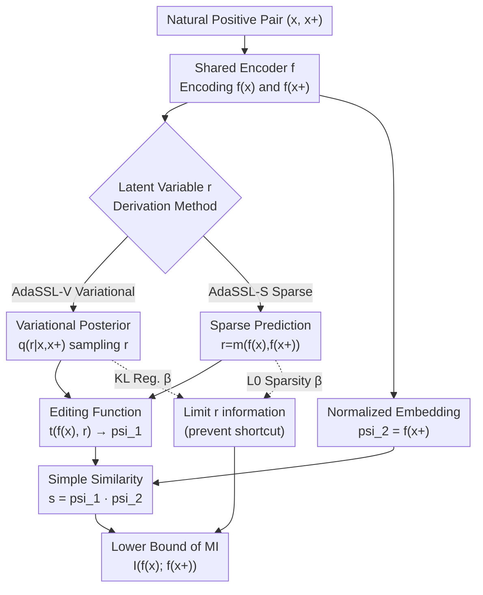

# Self-Supervised Learning from Structural Invariance

**Conference**: ICLR 2026  
**arXiv**: [2602.02381](https://arxiv.org/abs/2602.02381)  
**Code**: [https://github.com/SkrighYZ/AdaSSL](https://github.com/SkrighYZ/AdaSSL)  
**Area**: Self-Supervised Learning / Causal Representation Learning  
**Keywords**: Self-Supervised Learning, Latent Variable Models, Structural Invariance, Heteroscedasticity, Causal Representation

## TL;DR
AdaSSL is proposed to model conditional uncertainty between positive pairs by introducing latent variables and deriving a variational lower bound of mutual information. This enables SSL to handle complex (multimodal, heteroscedastic) conditional distributions in naturally paired data, outperforming baselines in causal representation learning, fine-grained image understanding, and video world models.

## Background & Motivation

**Background**: Joint-embedding SSL (e.g., SimCLR, BYOL) learns representations by encouraging similarity between positive pairs, typically relying on manual data augmentations to construct semantically related pairs.

**Limitations of Prior Work**: Manual augmentations (cropping, color jittering) fail to precisely simulate real-world variation factors and may discard fine-grained information. They often require modality-specific heuristics and differ from natural distribution shifts. While natural pairs (e.g., adjacent video frames, image-text pairs) better reflect real-world changes, they introduce complex conditional distributions $p(\mathbf{z}^+|\mathbf{z})$—specifically heteroscedasticity and multimodality—which existing SSL methods fail to model.

**Key Challenge**: The dot-product similarity in InfoNCE implicitly assumes a vMF distribution (isotropic noise), while AnInfoNCE extends this to anisotropic but constant noise. However, Proposition 2.1 theoretically proves that even if noise is isotropic in the latent space, mapping it to a normalized embedding space inevitably results in heteroscedasticity—a necessary consequence of geometric mismatch.

**Goal**: To enable SSL to flexibly model arbitrarily complex conditional distributions $p(\mathbf{z}^+|\mathbf{z})$ while maintaining a simple similarity function.

**Key Insight**: Inspired by JEPA, latent variables $\mathbf{r}$ are introduced to capture predictive uncertainty. The complex conditional distribution is decomposed into two steps: first sampling $\mathbf{r}$ (representing factors like camera motion or actions), and then predicting $\mathbf{z}^+$ using a simple model.

**Core Idea**: Utilizing the mutual information chain rule $I(f(\mathbf{x}); f(\mathbf{x}^+)) = I(f(\mathbf{x}), \mathbf{r}; f(\mathbf{x}^+)) - I(\mathbf{r}; f(\mathbf{x}^+)|f(\mathbf{x}))$. The first term is optimized using an extended InfoNCE (simple similarity + latent variables), while the second term uses KL regularization to prevent $\mathbf{r}$ from encoding shortcuts.

## Method

### Overall Architecture

AdaSSL adds a latent variable branch to the standard joint-embedding framework. A shared encoder $f$ maps the positive pair $(\mathbf{x}, \mathbf{x}^+)$ into embeddings. The latent variable $\mathbf{r}$ specifically captures the uncertainty of changes that cannot be inferred from $\mathbf{x}$ alone. An editing function $t(f(\mathbf{x}), \mathbf{r})$ then transitions $f(\mathbf{x})$ toward $f(\mathbf{x}^+)$, followed by alignment using a simple dot-product similarity $\psi_1^\top\psi_2$. The training objective comprises the "Main SSL Loss (InfoNCE or BYOL) + Information Regularization for $\mathbf{r}$." The former ensures embedding alignment, while the latter forces $\mathbf{r}$ to carry only necessary information, together forming a tractable lower bound for the mutual information $I(f(\mathbf{x}); f(\mathbf{x}^+))$. There are two implementations for the $\mathbf{r}$ branch: **AdaSSL-V** (variational posterior sampling + KL regularization) and **AdaSSL-S** (deterministic sparse prediction + L0 regularization).

### Key Designs

**1. AdaSSL-V (Variational Version): Decomposing Complex Conditional Distributions**

Conditional distributions $p(\mathbf{z}^+|\mathbf{z})$ in natural pairs are multimodal and heteroscedastic. AdaSSL-V uses the MI chain rule $I(f(\mathbf{x}); f(\mathbf{x}^+)) = I(f(\mathbf{x}), \mathbf{r}; f(\mathbf{x}^+)) - I(\mathbf{r}; f(\mathbf{x}^+)|f(\mathbf{x}))$ to split the objective. The first term lets "embedding + latent variable" predict $f(\mathbf{x}^+)$, while the second term penalizes $\mathbf{r}$ for "cheating" by observing $\mathbf{x}^+$. The optimizable bound is $\mathcal{L} = \mathcal{L}_{SSL}(\mathbb{E}_{q_\phi} \psi_1(\mathbf{x}, \mathbf{r}), \psi_2(\mathbf{x}^+)) + \beta D_{KL}(q_\phi(\mathbf{r}|\mathbf{x}, \mathbf{x}^+) \| p_\theta(\mathbf{r}|\mathbf{x}))$. The variational distribution $q_\phi(\mathbf{r}|\mathbf{x}, \mathbf{x}^+)$ infers the change between pairs, while the prior $p_\theta(\mathbf{r}|\mathbf{x})$ observes only $\mathbf{x}$. The KL term forces $\mathbf{r}$ to carry only necessary extra information, preserving a simple similarity function while delegating complex distribution modeling to latent variables.

**2. AdaSSL-S (Sparse Version): Aligning with Causal Latent Factors**

Variational sampling is less effective for distillation-based SSL, and causal representation learning favors interpretable factors. AdaSSL-S utilizes deterministic prediction $\mathbf{r} = m(f(\mathbf{x}), f(\mathbf{x}^+))$ with a sparsity constraint—implemented via a differentiable L0 penalty using Gumbel-Sigmoid. The editing function uses a modular low-rank design $t(f(\mathbf{x}), \mathbf{r}) = f(\mathbf{x}) + \sum_i r_i (\mathbf{B}_i \mathbf{A}_i f(\mathbf{x}) + b_i)$, where each $r_i$ acts as a switch for a LoRA-style module. This inductive bias assumes natural changes typically affect only a few latent factors, allowing $\mathbf{r}$ to align with true factors of variation.

**3. Heteroscedasticity Necessity (Proposition 2.1)**

This proposition provides the theoretical foundation for the design. Standard InfoNCE dot-product similarity assumes vMF (isotropic noise). Proposition 2.1 proves that when isotropic noise in a latent space $\mathbb{R}^{d_z}$ is mapped to a curved manifold (e.g., the unit sphere $\mathbb{S}^{d_f}$ of normalized embeddings), the local geometric distortion is position-dependent. Consequently, the conditional variance of pairs in the embedding space must vary across the manifold. Heteroscedasticity is a mathematical necessity of geometric mismatch rather than just an empirical noise phenomenon. This justifies incorporating latent variables $\mathbf{r}$ to absorb position-dependent uncertainty.

### Loss & Training

Both variants share the "Main SSL Loss + Information Regularization" structure. AdaSSL-V uses InfoNCE with KL regularization (controlled by $\beta$), while AdaSSL-S uses InfoNCE with an L0 sparsity penalty via Gumbel-Sigmoid. Both are compatible with non-contrastive distillation methods like BYOL.

## Key Experimental Results

### Main Results

| Task/Dataset | Metric | AdaSSL | InfoNCE | AnInfoNCE | H-InfoNCE |
| :--- | :--- | :--- | :--- | :--- | :--- |
| Numerical Heteroscedastic (OOD) | $R^2$ | 0.92+ | <0.27 | <0.40 | 0.76 |
| 3DIdent (CRL) | DCI | 0.85+ | 0.72 | 0.74 | 0.78 |
| CelebA Fine-grained | 40-attr Acc | Best | Low | Low | Medium |
| Moving-MNIST Accel. | $R^2$ | 0.55 (BYOL baseline 0.15) | - | - | - |

### Ablation Study

| Configuration | Numerical OOD $R^2$ | Description |
| :--- | :--- | :--- |
| AdaSSL-V | 0.92+ | Full variational version |
| AdaSSL-S | 0.90+ | Sparse version, slightly lower but more sparse |
| H-InfoNCE | 0.76 | Heteroscedastic but without latent variables |
| InfoNCE | <0.27 | Baseline fails completely |
| AnInfoNCE | <0.40 | Anisotropic weighting is insufficient |

### Key Findings
- Under complex conditional distributions (multimodal + heteroscedastic), InfoNCE and AnInfoNCE fail significantly ($OOD R^2 < 0.4$), whereas AdaSSL maintains $0.9+$.
- Natural pairs (vs. standard augmentations) significantly improve downstream performance when modeled correctly.
- The sparse $\mathbf{r}$ learned by AdaSSL-S aligns with ground-truth factors of variation.
- In video world models, AdaSSL captures stochastic acceleration that BYOL typically discards.

## Highlights & Insights
- The **Heteroscedasticity Theorem** reveals a fundamental limitation of standard SSL as a mathematical necessity rather than an empirical observation.
- **Generality of Latent Modeling**: The framework is compatible with both contrastive and distillation-based SSL and applicable across numerical, image, and video data.
- The **Sparse Modular Editing** design (where $\mathbf{r}$ controls low-rank modules) shares conceptual similarities with LoRA-style adaptation.

## Limitations & Future Work
- AdaSSL-S requires additional handling for distillation methods like BYOL.
- The latent variable dimension $d_r$ must be pre-defined; automatic determination would be preferable.
- Lack of large-scale validation (e.g., ImageNet-level experiments).
- Selection of variational priors for multimodal conditional distributions remains an open problem when the number of modes is unknown.

## Related Work & Insights
- **vs. AnInfoNCE**: Anisotropic weights $\Lambda$ are global and do not adapt to individual samples. AdaSSL achieves data-adaptive weighting via latent variables.
- **vs. JEPA/V-JEPA**: JEPA assumes $\mathbf{r}$ is known (e.g., actions), whereas AdaSSL infers $\mathbf{r}$ from data pairs.
- **vs. LieSSL**: LieSSL assumes reversible and highly structured group transformations; AdaSSL offers greater flexibility.

## Rating
- Novelty: ⭐⭐⭐⭐⭐ Heteroscedasticity theorem + MI lower bound + dual-variant design; deep theoretical and methodological contributions.
- Experimental Thoroughness: ⭐⭐⭐⭐ Validated across multiple tasks (Numerical/CRL/Image/Video), though lacks large-scale benchmarks.
- Writing Quality: ⭐⭐⭐⭐⭐ Clear theoretical motivation and seamless transition from theory to experiments.
- Value: ⭐⭐⭐⭐ Addresses a fundamental theoretical problem in SSL with high generality.

<!-- RELATED:START -->

## Related Papers

- [\[ICLR 2026\] On the Identifiability of Causal Graphs with the Invariance Principle](on_the_identifiability_of_causal_graphs_with_the_invariance_principle.md)
- [\[ICLR 2026\] Counterfactual Structural Causal Bandits](counterfactual_structural_causal_bandits.md)
- [\[NeurIPS 2025\] Root Cause Analysis of Outliers with Missing Structural Knowledge](../../NeurIPS2025/causal_inference/root_cause_analysis_of_outliers_with_missing_structural_knowledge.md)
- [\[ICLR 2026\] Learning Robust Intervention Representations with Delta Embeddings](learning_robust_intervention_representations_with_delta_embeddings.md)
- [\[ICLR 2026\] Efficient and Sharp Off-Policy Learning under Unobserved Confounding](efficient_and_sharp_off-policy_learning_under_unobserved_confounding.md)

<!-- RELATED:END -->
